# 如何创建 Android 应用程序第 1 部分

> 原文：<https://dev.to/edrome/how-to-create-an-android-app-part-1-7nb>

## 大家好！

我将开始一个教程，写在 Java 上，关于如何开发一个管理用户配置文件的应用程序，基本功能将是:

*   编辑用户名
*   选择性别
*   选择生日
*   更改个人资料照片用户
*   将配置文件存储在数据库中

根据所描述的功能，内容包含以下主题:

*   开始一个新的 Android 项目和第一步
*   日期选择
*   操作摄像机
*   圆形图像视图
*   播放幻灯片菜单
*   操作 Android 房间数据库

所有的内容将被分割成不同的部分，每周更新一次。代码将在处更新

首先，一旦 android studio 打开，我们创建一个新的导航抽屉活动。我推荐使用 navigation drawer 活动，因为它提供了一个现成的幻灯片菜单(它看起来非常适合个人资料编辑)

[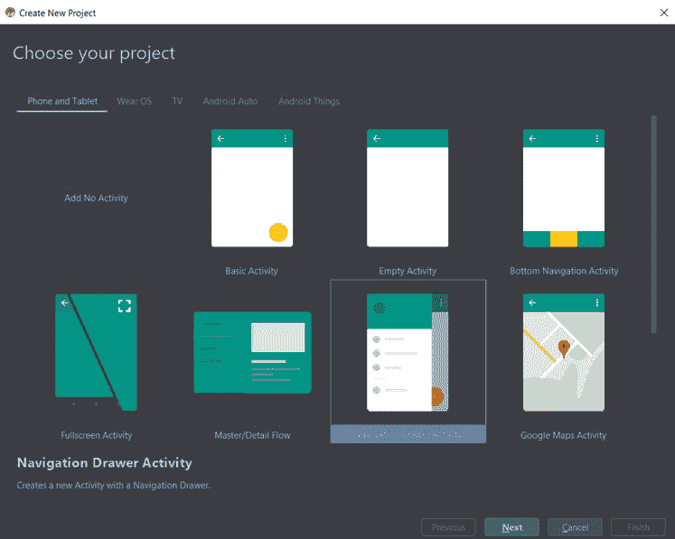](https://res.cloudinary.com/practicaldev/image/fetch/s--lzf9DmKJ--/c_limit%2Cf_auto%2Cfl_progressive%2Cq_auto%2Cw_880/https://thepracticaldev.s3.amazonaws.com/i/ck8mqc71swct5btlbzo4.png)

我们将选择应用程序的名称，在我的例子中是 ProfileApp。我建议将包名改为一个更合适的名称，如下所示。

不要忘记正确选择您的保存位置！

[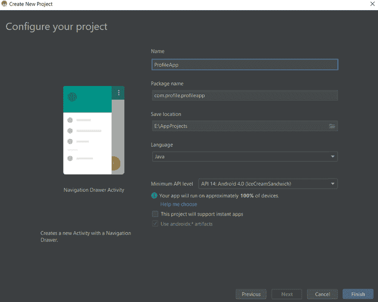](https://res.cloudinary.com/practicaldev/image/fetch/s--RSCGUOn3--/c_limit%2Cf_auto%2Cfl_progressive%2Cq_auto%2Cw_880/https://thepracticaldev.s3.amazonaws.com/i/dbr9yy5hk4nssqfmfngw.png)

应用程序从 content_main 开始，有一个 hello world 文本、一个浮动按钮和一个导航栏。

[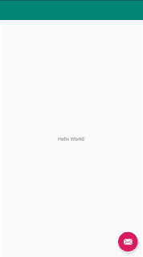](https://res.cloudinary.com/practicaldev/image/fetch/s--RB46cmW8--/c_limit%2Cf_auto%2Cfl_progressive%2Cq_auto%2Cw_880/https://thepracticaldev.s3.amazonaws.com/i/vhrxn71bob4ldvls6xl3.png)

正如它所言，应用程序可以运行一个显示滑动条的功能，但这与我们的主要目标相去甚远。这意味着我们需要做以下修改。

*   通过编辑 app_bar_main 布局上的 XML 代码来移除浮动按钮。您可以选择注释或删除它。我更喜欢对它进行评论，以防我们需要进一步使用它。

```
<?xml version="1.0" encoding="utf-8"?>
<androidx.coordinatorlayout.widget.CoordinatorLayout xmlns:android="http://schemas.android.com/apk/res/android"
    xmlns:app="http://schemas.android.com/apk/res-auto"
    xmlns:tools="http://schemas.android.com/tools"
    android:layout_width="match_parent"
    android:layout_height="match_parent"
    tools:context=".MainActivity">

    <com.google.android.material.appbar.AppBarLayout
        android:layout_width="match_parent"
        android:layout_height="wrap_content"
        android:theme="@style/AppTheme.AppBarOverlay">

        <androidx.appcompat.widget.Toolbar
            android:id="@+id/toolbar"
            android:layout_width="match_parent"
            android:layout_height="?attr/actionBarSize"
            android:background="?attr/colorPrimary"
            app:popupTheme="@style/AppTheme.PopupOverlay" />

    </com.google.android.material.appbar.AppBarLayout>

    <include layout="@layout/content_main" />

    <!--<com.google.android.material.floatingactionbutton.FloatingActionButton-->
        <!--android:id="@+id/fab"-->
        <!--android:layout_width="wrap_content"-->
        <!--android:layout_height="wrap_content"-->
        <!--android:layout_gravity="bottom|end"-->
        <!--android:layout_margin="@dimen/fab_margin"-->
        <!--app:srcCompat="@android:drawable/ic_dialog_email" />-->

</androidx.coordinatorlayout.widget.CoordinatorLayout> 
```

*   从主活动中删除代码，否则它会抛出一个错误。同样，你可以选择删除它而不是注释它。

```
 @Override
    protected void onCreate(Bundle savedInstanceState) {
        super.onCreate(savedInstanceState);
        setContentView(R.layout.activity_main);
        Toolbar toolbar = findViewById(R.id.toolbar);
        setSupportActionBar(toolbar);
//        FloatingActionButton fab = findViewById(R.id.fab);
//        fab.setOnClickListener(new View.OnClickListener() {
//            @Override
//            public void onClick(View view) {
//                Snackbar.make(view, "Replace with your own action", Snackbar.LENGTH_LONG)
//                        .setAction("Action", null).show();
//            }
//        });
        DrawerLayout drawer = findViewById(R.id.drawer_layout);
        NavigationView navigationView = findViewById(R.id.nav_view);
        ActionBarDrawerToggle toggle = new ActionBarDrawerToggle(
                this, drawer, toolbar, R.string.navigation_drawer_open, R.string.navigation_drawer_close);
        drawer.addDrawerListener(toggle);
        toggle.syncState();
        navigationView.setNavigationItemSelectedListener(this);
    } 
```

*   在 content_main.xml 中，我们添加了 TextView 和 EditText，让用户输入姓名、性别、生日、个人资料照片和一个保存信息的按钮。每个组件的 id 都必须调整到可以理解的程度，想象一下你看着一堆彼此相似的 id，太可怕了。

如果你像我一样，花几个小时试图找出变量或 id 名称，我建议预定义一个命名法，这样你的变量/id 约定名称就容易了。例如，我对组件 id 的命名约定是“组件用途”_“组件描述”_“组件类型”，给我的名称是 profile_photo_textview、profile_username_textview 等。可以看看 github 项目[链接](https://github.com/EdRome/AppProfile)。

[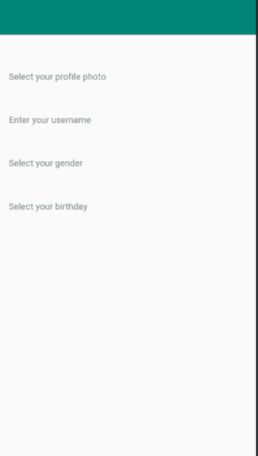](https://res.cloudinary.com/practicaldev/image/fetch/s--EP4fvEVS--/c_limit%2Cf_auto%2Cfl_progressive%2Cq_auto%2Cw_880/https://thepracticaldev.s3.amazonaws.com/i/jfav0q6s09m06abnoht4.png)

当所有的 textviews 被插入时(考虑到此时我们不是在看设计)，只为 name 添加一个编辑文本，其他的将使用一个不同类型的组件，我们将在后面回顾。

正如你已经注意到的，android 有各种各样的编辑文本，每个文本都有自己的用途。我们不会一一回顾，但我会简要介绍我们将要使用的方法。

[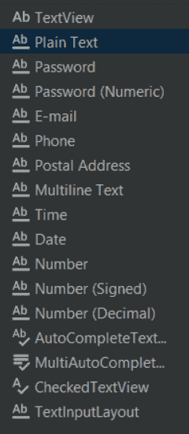](https://res.cloudinary.com/practicaldev/image/fetch/s--ttI7mNwp--/c_limit%2Cf_auto%2Cfl_progressive%2Cq_auto%2Cw_880/https://thepracticaldev.s3.amazonaws.com/i/3jkgvir2e10x5iuxa5wv.png)

对于用户名，我们将插入一个纯文本编辑文本，让用户能够写下他选择的用户名。它允许所有类型字符，没有限制。要选择性别，最常见的选择是单选按钮。单选按钮不同于其他按钮，因为你只允许选择一个或另一个选项，但默认情况下单选按钮本身没有这个属性；要创建这种行为，需要创建一个单选按钮组。Android 的调色板上有这个选项- >按钮- >单选按钮组。

[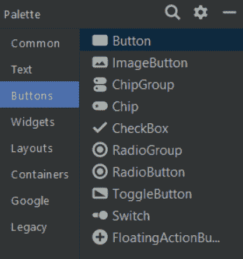](https://res.cloudinary.com/practicaldev/image/fetch/s--1C31e7dM--/c_limit%2Cf_auto%2Cfl_progressive%2Cq_auto%2Cw_880/https://thepracticaldev.s3.amazonaws.com/i/vdffz26ixreldufzazb4.png)

然后拖放对象，把它放在你选择性别选项的地方(我的在文本视图的前面),然后把它放大到你想要的大小。先别担心尺寸，我们可以以后再调整。

[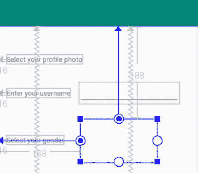](https://res.cloudinary.com/practicaldev/image/fetch/s--W55xdiYM--/c_limit%2Cf_auto%2Cfl_progressive%2Cq_auto%2Cw_880/https://thepracticaldev.s3.amazonaws.com/i/c7uclbyozdfbmshik8p9.png)

设置单选按钮组后，在其中拖放两个单选按钮。只选择您的单选按钮组，并在您的属性(右边的面板)上设置一个 id，因为这将是您的单选按钮组的名称。

[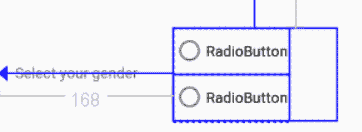](https://res.cloudinary.com/practicaldev/image/fetch/s--RIBA-RUQ--/c_limit%2Cf_auto%2Cfl_progressive%2Cq_auto%2Cw_880/https://thepracticaldev.s3.amazonaws.com/i/dpokf7j5b5ri956wvjh2.png)

[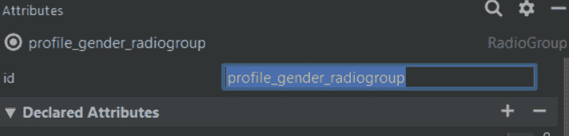](https://res.cloudinary.com/practicaldev/image/fetch/s--CIpu7CKg--/c_limit%2Cf_auto%2Cfl_progressive%2Cq_auto%2Cw_880/https://thepracticaldev.s3.amazonaws.com/i/1j78fnem9t8er79gds9i.png)

更改单选按钮的 id 和文本。

[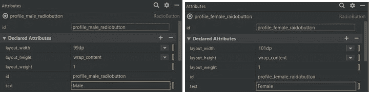](https://res.cloudinary.com/practicaldev/image/fetch/s--dnOK4Iv0--/c_limit%2Cf_auto%2Cfl_progressive%2Cq_auto%2Cw_880/https://thepracticaldev.s3.amazonaws.com/i/rh06xkddagx8c4iyg7cu.png)

现在只是缺少了生日选项，我真的很喜欢文本视图选项，因为它能够以一种简单的方式围绕它。我想在文本视图中使用日期选择器来写完整日期。

毕竟，结果会是这样的。一个额外的步骤是创建约束，尽管我们只是推断约束不会使这篇文章变得复杂。

[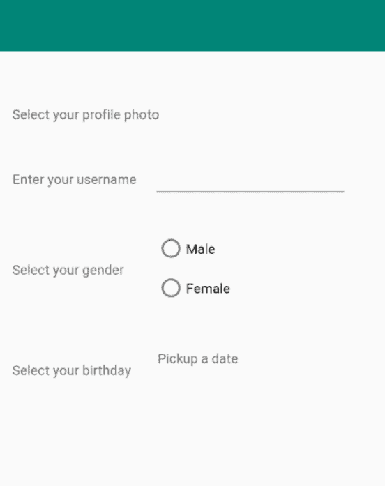](https://res.cloudinary.com/practicaldev/image/fetch/s--djjRAb9c--/c_limit%2Cf_auto%2Cfl_progressive%2Cq_auto%2Cw_880/https://thepracticaldev.s3.amazonaws.com/i/qfjdq7l1gb97zymuguvv.png)

正如你所看到的，还有很多需要改进的设计和功能，但我认为这已经足够了。