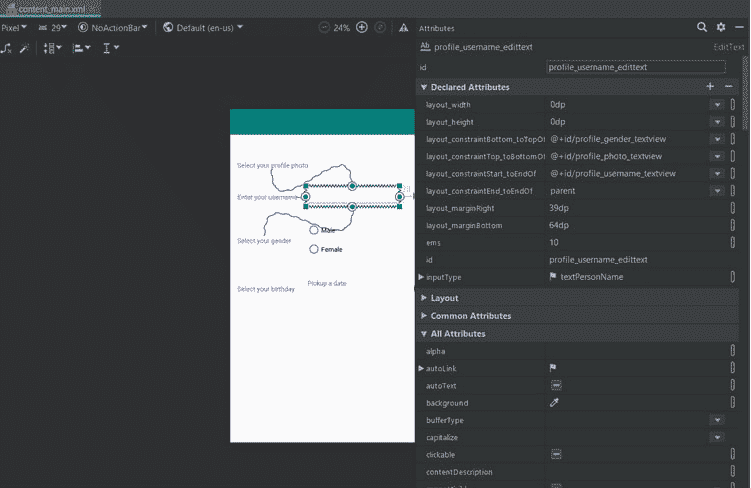
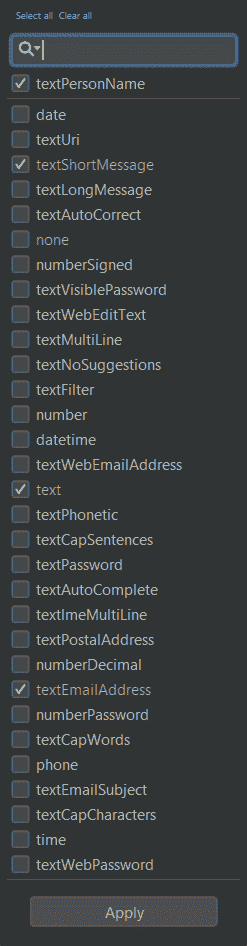
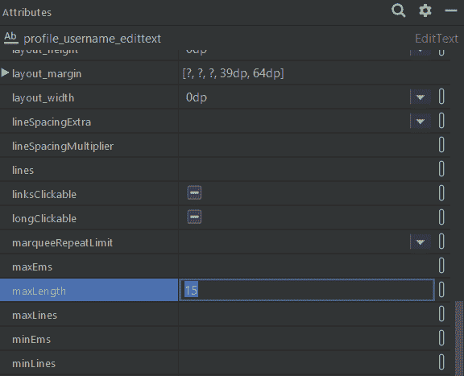
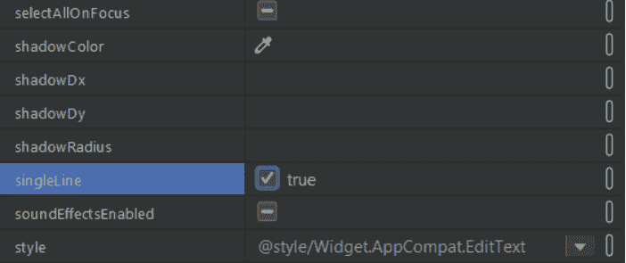
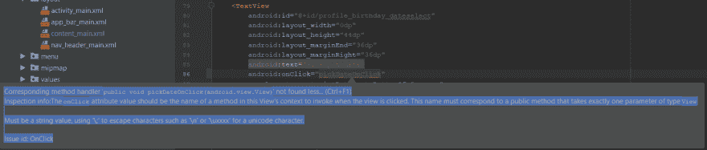
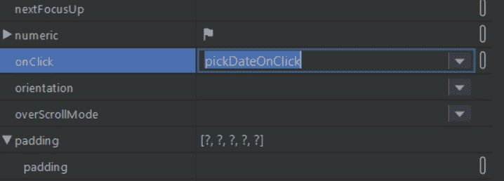

# 如何创建 Android 应用程序:Datepicker

> 原文：<https://dev.to/edrome/how-to-create-an-android-app-part-2-ojl>

## 大家好

# 首先非常感谢大家对上一篇帖子的所有支持，真不敢相信它有这么多反应:)

在前一篇文章中，我们回顾了项目的创建，一些设计的基础知识，并添加了一些基本组件。从上一个检查点继续，这篇文章的主题将是:

*   写功能，允许用户写他的用户名，考虑到一些限制。
*   编写一个当用户点击文本视图时弹出的日期选择器。

对于用户名功能，限制将是:

*   用户可以选择任何类型的字符，无论是数字，字母，或特殊字符；除了新台词。该字段的长度限制为 15 个字符。对于 datepicker 来说，背后的想法是:
*   当用户单击 textview 时，需要弹出 datepicker。
*   datepicker 必须读取用户选择。
*   一旦选择了日期，文本视图可以显示完整的日期。

如上所述，考虑到前面提到的限制，首先要检查的功能是用户名字段。我将展示关于配置所有属性的所有图像，当一切都设置好后，我将展示代码。

我们将看到我们的设计并打开属性

[](https://res.cloudinary.com/practicaldev/image/fetch/s--x6KNmfKT--/c_limit%2Cf_auto%2Cfl_progressive%2Cq_auto%2Cw_880/https://thepracticaldev.s3.amazonaws.com/i/r4vr7w8rcp8otpp4orzc.png)

如您所见，默认的 inputType 是 textPersonName，但是我们可以将其更改为我们想要的任何值(或者至少是任何可用的值)。

[](https://res.cloudinary.com/practicaldev/image/fetch/s--_NOyIoYX--/c_limit%2Cf_auto%2Cfl_progressive%2Cq_auto%2Cw_880/https://thepracticaldev.s3.amazonaws.com/i/hdyczoyca8ovnt7oww8h.png)

对我们来说，默认选择是功能性的。现在进入你的属性菜单，寻找`maxLength`属性。找到属性后，我们将设置 15 为最大长度。

[](https://res.cloudinary.com/practicaldev/image/fetch/s--FaHm1JDT--/c_limit%2Cf_auto%2Cfl_progressive%2Cq_auto%2Cw_880/https://thepracticaldev.s3.amazonaws.com/i/3nnbti6qflg4kc6128cy.png)

提到的其他限制是允许用户只写一行他的用户名。如前所述，在菜单中寻找`singleLine`属性，并将其更改为 true。

[](https://res.cloudinary.com/practicaldev/image/fetch/s--KgiMY-60--/c_limit%2Cf_auto%2Cfl_progressive%2Cq_auto%2Cw_880/https://thepracticaldev.s3.amazonaws.com/i/ous1clv9abiz1icnz93c.png)

我们的 XML 代码应该是这样的。正如我所说的，你可以选择编码，而不是在菜单上搜索属性。

```
 <EditText
        android:id="@+id/profile_username_edittext"
        android:layout_width="207dp"
        android:layout_height="45dp"
        android:layout_marginStart="20dp"
        android:layout_marginLeft="20dp"
        android:layout_marginTop="40dp"
        android:layout_marginEnd="8dp"
        android:layout_marginRight="8dp"
        android:ems="10"
        android:inputType="textPersonName"
        android:maxLength="15"
        android:singleLine="true"
        app:layout_constraintEnd_toEndOf="parent"
        app:layout_constraintHorizontal_bias="0.172"
        app:layout_constraintStart_toEndOf="@+id/profile_username_textview"
        app:layout_constraintTop_toBottomOf="@+id/profile_photo_textview" /> 
```

这样，所描述的功能就完成了(是的，这样又快又简单)。是时候提高难度了。Android 允许我们用 inputType date 选择 EditText，但它只显示键盘，让你写日期，作为开发人员，我们应该想象任何可能出错的事情，实际上都将与用户交互出错。这就是为什么我们要使用一个日期选择器，创建一个易于使用的机制。

转到你的主活动类，在类的顶部声明四个变量，在我们的第一个方法之前；请记住将它们全部设为私有。

```
public class MainActivity extends AppCompatActivity
        implements NavigationView.OnNavigationItemSelectedListener {

    private TextView birthday;
    private int mYear;
    private int mMonth;
    private int mDay;

    @Override
    protected void onCreate(Bundle savedInstanceState) {
        super.onCreate(savedInstanceState);
        setContentView(R.layout.activity_main);
        Toolbar toolbar = findViewById(R.id.toolbar);
        setSupportActionBar(toolbar);
//        FloatingActionButton fab = findViewById(R.id.fab);
//        fab.setOnClickListener(new View.OnClickListener() {
//            @Override
//            public void onClick(View view) {
//                Snackbar.make(view, "Replace with your own action", Snackbar.LENGTH_LONG)
//                        .setAction("Action", null).show();
//            }
//        });
        DrawerLayout drawer = findViewById(R.id.drawer_layout);
        NavigationView navigationView = findViewById(R.id.nav_view);
        ActionBarDrawerToggle toggle = new ActionBarDrawerToggle(
                this, drawer, toolbar, R.string.navigation_drawer_open,
                R.string.navigation_drawer_close);
        drawer.addDrawerListener(toggle);
        toggle.syncState();
        navigationView.setNavigationItemSelectedListener(this);

        birthday = findViewById(R.id.profile_birthday_textview);

    } 
```

在`onCreate`方法中，用一个`findViewById`初始化生日变量。如果你不初始化你的变量，IDE 将不会告诉你一个错误，直到运行它，你才会注意到它，因为一个空指针异常而使应用程序崩溃。

稍后，在这个类内部创建一个方法，我将其命名为`pickDateOnClick`。该方法需要一个 View 类型的参数，必须是公共的，并且不返回任何内容，即 void。

请注意，每次创建要在 click 事件上执行的方法时，它都有一个 view 类型的 View 参数，否则，IDE 将向您显示一个语法错误，说明您的方法不存在，即使您以正确的方式编写了它。

[](https://res.cloudinary.com/practicaldev/image/fetch/s--E4DuhV7M--/c_limit%2Cf_auto%2Cfl_progressive%2Cq_auto%2Cw_880/https://thepracticaldev.s3.amazonaws.com/i/o64r2x3z9pop9jtacbha.png)

在方法`pickDateOnClick`中，我们将创建:

*   日历实例(获取今天的日期)
*   使用 android 小工具的日期选择器对话框。它将要求你实现方法`onDateSet`，IDE 不会让你跳过这个警告，而且最重要的代码部分也将写在那里。

您的代码应该与此类似。

> 重要提示:Calendar 实例需要是最终的，换句话说，我们的`c`变量不能被修改。记住，最后一个关键字是让一个变量被赋值一次。

```
final Calendar c = Calendar.getInstance();
mYear = c.get(Calendar.YEAR);
mMonth = c.get(Calendar.MONTH);
mDay = c.get(Calendar.DAY_OF_MONTH);

DatePickerDialog datePickerDialog = 
    new DatePickerDialog(this, new DatePickerDialog.OnDateSetListener() {
               @Override
               public void onDateSet(DatePicker datePicker, int i, 
                                      int i1, int i2) {

               }
    }); 
```

您可能注意到，我们的日期选择器对话框实现有三个变量，`i`、`i1`和`i2`。这些变量分别表示年、月和日。在我个人看来…它们是不可理解的，为了理解它们的意思，你必须调试和评估它们的价值，太糟糕了。为了我们的心理健康，我们把它改成它们对应的变量名。

日历小部件也必须初始化；否则它会抛出一个错误。初始化对应于小部件将显示的初始日期。当我们的全局变量开始工作时，在第二个花括号之后，在括号和分号之前，我们添加年、月和日期，用逗号分隔。此时，您的代码类似于这样。

```
final Calendar c = Calendar.getInstance();
mYear = c.get(Calendar.YEAR);
mMonth = c.get(Calendar.MONTH);
mDay = c.get(Calendar.DAY_OF_MONTH);

DatePickerDialog datePickerDialog = 
    new DatePickerDialog(this, new DatePickerDialog.OnDateSetListener() {
               @Override
               public void onDateSet(DatePicker datePicker, int year, 
                                      int month, int day) {

               }
    }, mYear, mMonth, mDay); 
```

我们离实现目标不远了，继续努力吧。我们的 datepicker 实现内部的逻辑如下:

*   将输入变量转换成字符串
*   将月数转换为月名
*   将缺失的零添加到日期
*   显示最终文本

将输入变量转换为字符串的原因是将它们与日期连接成一个字符串。

我们将在名为`getMonth`的主类中再创建一个方法，这个方法的逻辑是使用`DateFormatSymbols`获取月份名称。

```
private String getMonth(int month){
    return new DateFormatSymbols().getMonths()[month];
} 
```

> 这一部分是可选的，您可以绕过它继续执行其余的代码，这意味着对结果没有影响。

此外，您需要将月份翻译或转换成其他形式，例如，我会说西班牙语，所以我想要西班牙语的月份。这个成就将通过创建一个`Map<Integer, String>`变量来完成。

```
private Map<Integer, String> monthTranslation = new HashMap<>(); 
```

我将在`onCreate`方法中填充这个变量，提醒从 0 开始。

```
monthTranslation.put(0, "Enero");
monthTranslation.put(1, "Febrero");
monthTranslation.put(2, "Marzo");
monthTranslation.put(3, "Abril");
monthTranslation.put(4, "Mayo");
monthTranslation.put(5, "Junio");
monthTranslation.put(6, "Julio");
monthTranslation.put(7, "Agosto");
monthTranslation.put(8, "Septiembre");
monthTranslation.put(9, "Octubre");
monthTranslation.put(10, "Noviembre");
monthTranslation.put(11, "Diciembre"); 
```

接下来，转到你的方法`getMonth`，从你的 map 变量(在我的例子中是`monthTranslation` )
中获取

```
private String getMonth(int month) {
    return monthTranslation.get(month); Translation
} 
```

给你，你有几个月的西班牙语。回到我们的主要目标。

* * *

第四点是在 day 变量的左边加一个零。我选择用零来补充变量，因为我的感觉说它看起来很棒。

将在我们的主类上创建另一个方法，带有一个字符串参数并返回一个字符串。逻辑是检查参数长度，如果它小于 2，也就是 1，那么我们在参数后面加一个零，否则保持不变。我使用三元运算符来避免添加不必要的行。

```
private String addLeftZero(String s) {
    String newString = (s.length() < 2) ? "0"+s : s;
    return newString;
} 
```

最后一部分是将 datepicker 实现中的所有内容连接在一起。我们将把日和年转换成字符串，月保持整数，但它是我们的方法`getMonth`的参数。
字符串 day 是`addLeftZero`方法的参数，最后将 textview 中的所有内容连接在一起。
所以你的代码应该是这样的

```
 public void pickDateOnClick(View view) {
        final Calendar c = Calendar.getInstance();
        mYear = c.get(Calendar.YEAR);
        mMonth = c.get(Calendar.MONTH);
        mDay = c.get(Calendar.DAY_OF_MONTH);

        DatePickerDialog datePickerDialog = new DatePickerDialog(this, 
                 new DatePickerDialog.OnDateSetListener() {
            @Override
            public void onDateSet(DatePicker datePicker, int year, int month, int day) {
                String sDay = String.valueOf(day);
                String sMonth = getMonth(month);
                String sYear = String.valueOf(year);

                sDay = addLeftZero(sDay);

                birthday.setText(sMonth + " " + sDay + ", " + sYear);
            }
        }, mYear, mMonth, mDay);
        datePickerDialog.show();
    } 
```

我差点忘了！，不要错过添加一个显示到您的日期选择器变量，相反，它不会显示在您的屏幕上。

* * *

为了完成所有的功能，我们返回到设计中，选择你的被指定为日期选择器的文本视图，在属性菜单中寻找`onClick`属性，用日期选择器方法名编辑它。

[](https://res.cloudinary.com/practicaldev/image/fetch/s--q8epYvjk--/c_limit%2Cf_auto%2Cfl_progressive%2Cq_auto%2Cw_880/https://thepracticaldev.s3.amazonaws.com/i/8opnmc2bt8y0x7a1fghn.png)

这里显示的所有代码都在 [github](https://github.com/EdRome/AppProfile) 上公开，请随意使用。