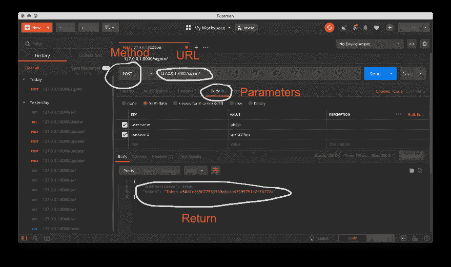
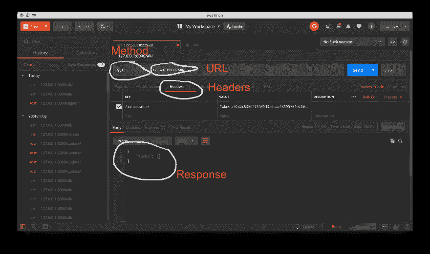

# 如何用 Django 创建 API

> 原文：<https://dev.to/mkdev/how-to-create-an-api-with-django-p64>

API 或应用程序编程接口是后端开发的一个广泛定义的领域。本质上，我们今天要研究的 API 是一个没有前端的网站:后端返回 JSON 格式的数据，供本地或 web 应用程序使用，而不是呈现 HTML 页面。就像创建一个网站一样，编写 API 时最需要考虑的是它将如何被使用。今天，我们将了解如何使用 Django 为一个基本的 ToDo 应用程序创建一个 API。

遵循本教程将需要一些工具。我鼓励你跟随这篇文章，从 GitHub 库的[中克隆示例项目。您应该已经安装了 Python 3、Django 2.2 和 djangorestframework 3.9(从存储库中，运行`pip install -r requirements.txt`来安装库)。关于安装 Django 的指导，请参考](https://github.com/philipkiely/django_taskmanager/)[官方文件](https://docs.djangoproject.com/en/2.2/intro/tutorial01/)。另外，你会想下载免费版的[邮差](https://www.getpostman.com/downloads/)。Postman 是一个开发和测试 API 的优秀工具，在本文中我们将只触及它的皮毛。

首先，导航到包含`manage.py`的`taskmanager`目录，运行命令`python manage.py migrate`将数据库迁移应用到 Django 的默认 sqlite 数据库。使用`python manage.py createsuperuser`创建一个超级用户，确保记录用户名和密码，因为我们稍后会用到它们。然后，运行`python manage.py runserver`与 API 进行交互。

有两种方式与 API 交互:浏览 Django REST 框架前端和发出 http 请求。打开您的 web 浏览器并导航到`127.0.0.1:8000`，或者端口 8000 的 localhost，Django 项目默认在这里运行。您应该会看到一个显示可用 API 端点列表的网页。这是 RESTful 开发方法中的一个重要原则:API 本身应该向用户展示什么是可用的以及如何使用它。

首先，在 views.py 中查看`api_index`函数。此功能提供您正在访问的端点列表。

```
 @define_usage(returns={'url_usage': 'Dict'})
    @api_view(['GET'])
    @permission_classes((AllowAny,))
    def api_index(request):
        details = {}
        for item in list(globals().items()):
            if item[0][0:4] == 'api_':
                if hasattr(item[1], 'usage'):
                    details[reverse(item[1].__name__)] = item[1].usage
        return Response(details) 
```

Enter fullscreen mode Exit fullscreen mode

每个 API 视图上有三个装饰器。我们一会儿再回到`@define_usage`上来。`@api_view`来自 Django REST 框架，提供两个东西:你正在查看的网页的模板和端点支持的 HTTP 方法。`@permission_classes`也来自 Django REST framwork，它使用`AllowAny`允许任何人访问这个 url 而无需任何身份验证。函数体查看应用程序内的全局范围，以收集每个已定义的函数。当我们在每个 api 视图函数名前加上`api_`时，我们可以过滤掉它们并返回它们的用法信息的字典。所述使用细节来自 decorators.py.
中定义的自定义装饰器

```
 def define_usage(params=None, returns=None):
        def decorator(function):
            cls = function.view_class
            header = None
            # Is authentication required to access this view?
            if IsAuthenticated in cls.permission_classes:
                header = {'Authorization': 'Token String'}
            # Build a list of the valid methods, but take out 'OPTIONS'
            methods = [method.upper() for method in cls.http_method_names if method != 'options']
            # Build response dictionary
            usage = {'Request Types': methods, 'Headers': header, 'Body': params, 'Returns': returns}

            # Prevent side effects
            @wraps(function)
            def _wrapper(*args, **kwargs):
                return function(*args, **kwargs)
            _wrapper.usage = usage
            return _wrapper
        return decorator 
```

Enter fullscreen mode Exit fullscreen mode

装饰器是一种语法，它允许我们轻松地定义高阶函数，从而像类一样赋予视图函数属性。在 Django 中，带有装饰器的基于函数的视图是介于普通函数和基于类的视图之间的一个很好的中间地带。这个装饰器提供了四条信息:每个函数的请求类型、头、参数和返回值。decorator 从附加到每个函数的其他 decorator 生成头和方法信息，并将调用每个视图函数时定义的参数和返回值作为输入。

除了索引之外，我们将使用 API 与用户数据进行交互，因此我们需要某种身份验证。如果这不仅仅是一个示例项目，我们将实现一个注册功能(如果您想检查您对本文中概念的理解，这是一个很好的练习)。相反，我们将简单地以我们之前创建的超级用户身份登录。

```
 @define_usage(params={'username': 'String', 'password': 'String'},
               returns={'authenticated': 'Bool', 'token': 'Token String'})
 @api_view(['POST'])
 @permission_classes((AllowAny,))
 def api_signin(request):
     try:
         username = request.data['username']
         password = request.data['password']
     except:
         return Response({'error': 'Please provide correct username and password'},
                         status=HTTP_400_BAD_REQUEST)
     user = authenticate(username=username, password=password)
     if user is not None:
         token, _ = Token.objects.get_or_create(user=user)
         return Response({'authenticated': True, 'token': "Token " + token.key})
     else:
         return Response({'authenticated': False, 'token': None}) 
```

Enter fullscreen mode Exit fullscreen mode

值得注意的是，您需要配置各种设置，以使基于令牌的身份验证工作。您可以在示例项目的`settings.py`文件中看到完整的配置。

`api_signin`方法获取用户名和密码，并使用 Django 内置的`authenticate`方法来验证用户。如果提供的凭证正确，它将返回一个令牌，允许客户端访问 API 的受限端点。请注意，令牌应该安全地存储在客户端应用程序中，因为它具有与密码相同的访问权限。现在是转行做邮递员的好时机。打开应用程序，用它向/signin/发送 post 请求，如下图所示。

[](https://res.cloudinary.com/practicaldev/image/fetch/s--3SypzRyv--/c_limit%2Cf_auto%2Cfl_progressive%2Cq_auto%2Cw_880/https://s3.eu-central-1.amazonaws.com/assets-mkdev/posts/misc/api-django-signin_request.png)

既然您已经为您的用户准备了一个令牌，那么您就可以探索 API 的其余部分了。让我们稍作休息，研究一下 API 背后的模型。

```
 class Task(models.Model):
        user = models.ForeignKey(User, on_delete=models.CASCADE) #Each task is owned by one user
        description = models.CharField(max_length=150) #Each task has a description of what needs to be done
        due = models.DateField() #Each task has a due date, which is a Python datetime.date 
```

Enter fullscreen mode Exit fullscreen mode

任务模型是一种相当简单的待办事项管理方法。每一项都有描述，比如“编写 Django API”和截止日期。任务与 Django 用户对象也有外键关系，也就是说，每个任务只与一个用户相关联，但是每个用户可以有任意数量的任务，甚至是零个。隐式地，每个 Django 对象也有一个 id，一个惟一的整数，我们可以用它来引用单个任务。

像这样的应用程序通常被称为 CRUD 应用程序，代表“创建、读取、更新、销毁”这是我们的应用程序在任务对象上支持的四种操作。

让我们从获取当前与用户相关联的任务的空列表开始。使用 Postman 向/all/ url 发出 GET 请求，如下图所示。请记住将您的令牌添加到此请求和所有未来请求的标头中。

[](https://res.cloudinary.com/practicaldev/image/fetch/s--4FZFTeUO--/c_limit%2Cf_auto%2Cfl_progressive%2Cq_auto%2Cw_880/https://s3.eu-central-1.amazonaws.com/assets-mkdev/posts/misc/api-django-all_request.png)T3】

```
 @define_usage(returns={'tasks': 'Dict'})
    @api_view(['GET'])
    @authentication_classes((SessionAuthentication, BasicAuthentication, TokenAuthentication))
    @permission_classes((IsAuthenticated,))
    def api_all_tasks(request):
        tasks = taskSerializer(request.user.task_set.all(), many=True)
        return Response({'tasks': tasks.data}) 
```

Enter fullscreen mode Exit fullscreen mode

`api_all_tasks`函数相当简单。需要注意的一点是身份验证要求和权限类发生了变化，要求进行令牌身份验证。我们有了一个新的装饰器`@authentication_classes`，它允许默认的 Django REST 框架认证方法以及`TokenAuthentication`。这允许我们将用户实例称为`request.user`，就像他们使用标准的 Django 会话登录一样。`@define_usage`装饰器向我们展示了`api_all_tasks`不接受任何参数(因为它是一个 GET 请求),并且只返回一样东西:一个序列化的任务列表。因为这个函数返回 JSON (JavaScript 对象表示法)格式的数据，所以我们使用一个序列化器来告诉 Django 如何解析要发送的数据。

```
 class taskSerializer(serializers.ModelSerializer):
        class Meta:
            model = Task
            fields = ('id', 'description', 'due') 
```

Enter fullscreen mode Exit fullscreen mode

这个简单的模型将任务的数据定义为 id、描述和截止日期。序列化程序可以从模型中添加和排除字段和数据，例如，这个不返回用户 id，因为它对我们的最终客户端没有用。

```
 @define_usage(params={'description': 'String', 'due_in': 'Int'},
                  returns={'done': 'Bool'})
    @api_view(['PUT'])
    @authentication_classes((SessionAuthentication, BasicAuthentication, TokenAuthentication))
    @permission_classes((IsAuthenticated,))
    def api_new_task(request):
        task = Task(user=request.user,
                    description=request.data['description'],
                    due=date.today() + timedelta(days=int(request.data['due_in'])))
        task.save()
        return Response({'done': True}) 
```

Enter fullscreen mode Exit fullscreen mode

现在，我们想要创建一个任务，所以我们使用`api_new_task`。通常，要在数据库中创建一个对象，我们使用一个 PUT 请求。请注意，这种方法和其他两种方法都不需要任何序列化。相反，这里我们将把参数传递到任务对象的初始化中，然后保存到数据库中。为了简单起见，我们发送任务到期的天数，而不是试图发送 Python `Date`对象，然后在 API 中保存未来许多天的日期。向/new/发出请求以创建任务，然后再次运行/all/请求以查看您创建的对象。

```
 @define_usage(params={'task_id': 'Int', 'description': 'String', 'due_in': 'Int'},
                  returns={'done': 'Bool'})
    @api_view(['POST'])
    @authentication_classes((SessionAuthentication, BasicAuthentication, TokenAuthentication))
    @permission_classes((IsAuthenticated,))
    def api_update_task(request):
        task = request.user.task_set.get(id=int(request.data['task_id']))
        try:
            task.description = request.data['description']
        except: #Description update is optional
            pass
        try:
            task.due = date.today() + timedelta(days=int(request.data['due_in']))
        except: #Due date update is optional
            pass
        task.save()
        return Response({'done': True}) 
```

Enter fullscreen mode Exit fullscreen mode

为了编辑我们刚刚创建的这个任务，我们向位于/update/的`api_update_task`发出一个 POST 请求。我们包含了`task_id`来引用来自用户的`task_set`的正确任务。这里的代码稍微复杂一些，因为我们要考虑到更新描述和/或截止日期的可能性。

```
 @define_usage(params={'task_id': 'Int'},
                  returns={'done': 'Bool'})
    @api_view(['DELETE'])
    @authentication_classes((SessionAuthentication, BasicAuthentication, TokenAuthentication))
    @permission_classes((IsAuthenticated,))
    def api_delete_task(request):
        task = request.user.task_set.get(id=int(request.data['task_id']))
        task.delete()
        return Response({'done': True}) 
```

Enter fullscreen mode Exit fullscreen mode

要删除一个任务，使用删除请求到`api_delete_task` at /delete/。这个方法与`api_update_task`函数的工作方式相同，只是它不是修改已识别的任务，而是删除它。

现在我们已经看到了如何为 Django API 实现索引、基于令牌的认证和四个主要的 HTTP 方法。您可以使用这些概念来支持各种 web 和本地移动应用程序，或者开发公共数据共享 API。随意克隆包含本文所有代码的示例项目，并尝试实现分页、速率限制和用户创建等扩展。

* * *

这是 Philip Kiely 写的一篇 mkdev 文章。你可以[雇佣我们的导师](https://mkdev.me/en/specialization/programming-python)来学习 Python & Django。