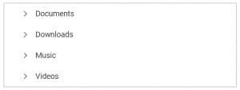
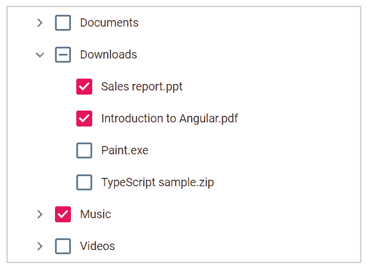
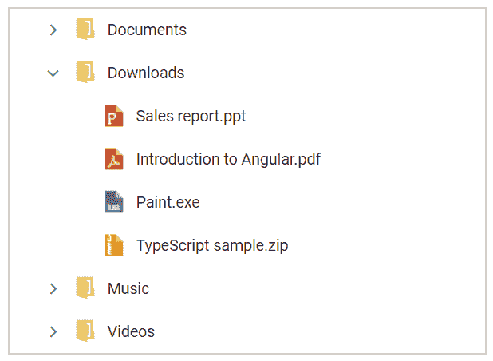
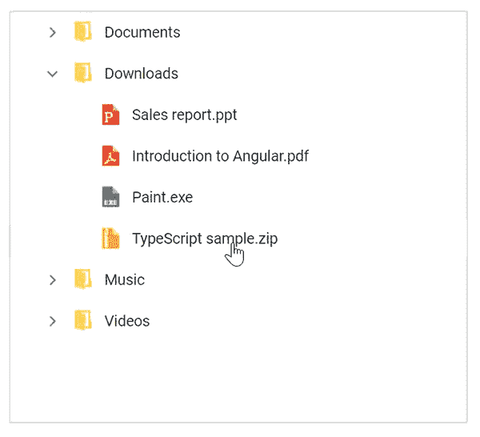
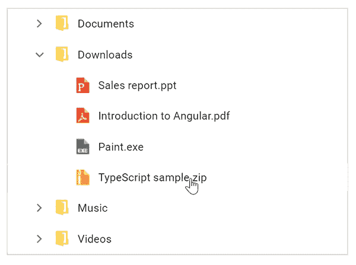
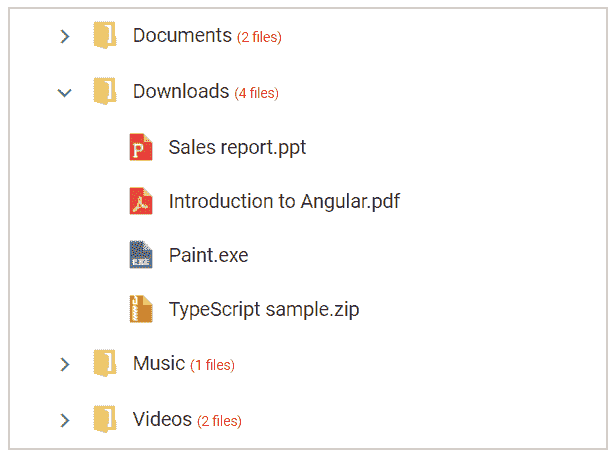

# 如何在 Angular 中创建树形视图控件

> 原文：<https://dev.to/syncfusion/how-to-create-tree-view-control-in-angular-5g3>

树状视图控件用于以树状结构表示分层数据，可以选择展开和折叠树节点。树视图有许多灵活的选项，包括数据绑定、节点图标支持、复选框、节点模板、拖放和节点编辑支持。

这篇博客提供了 Essential JS 2 中树视图控件的概述，并向您展示了树视图的基本用法和特性。

## 入门

我们可以通过以下简单的步骤来了解如何开始使用 Angular platform 中的树形视图组件:

1.首先，我们可以通过 [angular-cli](https://cli.angular.io/) 创建一个基本的 Angular 应用程序。如果您还没有 CLI 工具，那么您可以使用以下命令进行全局安装。

```
npm install -g @angular/cli 
```

*   使用以下命令创建角度应用程序

```
ng new treeview-app 
```

这将创建应用程序并下载其依赖项。

*   创建应用程序后，可以使用以下命令将树视图组件包安装到应用程序中。

```
cd treeview-app
npm install @syncfusion/ej2-ng-navigations --save 
```

在这里，–save 将把 navigations 包包含在 package.json 的依赖项列表中。

*   现在，与环境相关的配置已经完成。接下来，您可以创建一个组件来放置树视图。您可以使用以下命令在您的应用程序中创建一个组件。

```
ng generate component home 
```

之后，将创建以下文件。

创建 src/app/home/home . component . html(23 字节)
创建 src/app/home/home . component . spec . ts(614 字节)
创建 src/app/home/home . component . ts(261 字节)
创建 src/app/home/home . component . CSS(0 字节)
更新 src/app/app.module.ts (388 字节)

然后需要在 **app.module.ts** 中导入树形视图组件，并将其包含在声明中。

```
import { BrowserModule } from '@angular/platform-browser';
import { NgModule } from '@angular/core';

import { AppComponent } from './app.component';
import { HomeComponent } from './home/home.component';

import { TreeViewComponent } from '@syncfusion/ej2-ng-navigations';

@NgModule({
  declarations: [
    AppComponent,
    HomeComponent,
    TreeViewComponent
  ],
  imports: [
    BrowserModule
  ],
  providers: [],
  bootstrap: [AppComponent]
})
export class AppModule { } 
```

*   基本的 JS 2 组件支持一组[内置主题](https://ej2.syncfusion.com/angular/documentation/appearance/theme)，这里我们将为树形视图使用 Material 主题。要在应用程序中添加材质主题，需要在 **styles.css** 中导入 **material.css** 。

```
@import '../node_modules/@syncfusion/ej2-ng-navigations/styles/material.css'; 
```

*   我们已经成功完成了与树视图相关的配置。现在你需要在**home.component.html**中初始化你的第一个树形视图组件。

```
<ejs-treeview id="myTree"></ejs-treeview> 
```

然后在**app.component.html**中添加 home 组件(或者您想要放置树形视图的位置)。

```
<div style="text-align:center">
  <h1>
    Welcome to the Angular TreeView sample!
  </h1>
</div>

<app-home></app-home> 
```

*   最后，运行以下命令在浏览器中查看输出。

```
ng serve --open 
```

**注意:**现在树视图没有任何节点，因为数据绑定是必不可少的。

## 数据绑定

毫无疑问，树视图是一个数据绑定组件，需要与数据源绑定。数据源应该是任何有效的[层次结构](https://ej2.syncfusion.com/angular/documentation/treeview/data-binding.html#hierarchical-data)的形式，比如 XML、JSON 对象的嵌套数组或者[自引用结构](https://ej2.syncfusion.com/angular/documentation/treeview/data-binding.html#self-referential-data)。

树节点将基于[字段](https://ej2.syncfusion.com/angular/documentation/treeview/api-treeViewComponent.html#fields)属性从[数据源](https://ej2.syncfusion.com/angular/documentation/treeview/api-fieldsSettingsModel.html#datasource)呈现，其中以下各列是显示树视图所必需的:

*   文本–定义树节点的显示文本。
*   child–定义子数据源以呈现子节点(子节点)。

如果数据源有不同的列名，那么我们应该通过 fields 属性映射这些名称。

现在我们可以在 **home.component.ts** 中构造简单的分层数据，并将其映射到树形视图字段。

```
import { Component, OnInit } from '@angular/core';

@Component({
  selector: 'app-home',
  templateUrl: './home.component.html',
  styleUrls: ['./home.component.css']
})
export class HomeComponent implements OnInit {

  public treeData: Object[] = [
        {
            nodeId: '1', nodeText: 'Documents',
            nodeChild: [
                { nodeId: '11', nodeText: 'Team management.docx' },
                { nodeId: '12', nodeText: 'Entity Framework Core.pdf' },
            ]
        },
        {
            nodeId: '2', nodeText: 'Downloads',
            nodeChild: [
                { nodeId: '21', nodeText: 'Sales report.ppt' },
                { nodeId: '22', nodeText: 'Introduction to Angular.pdf' },
                { nodeId: '23', nodeText: 'Paint.exe' },
                { nodeId: '24', nodeText: 'TypeScript sample.zip' },
            ]
        },
        {
            nodeId: '3', nodeText: 'Music',
            nodeChild: [
                { nodeId: '31', nodeText: 'Crazy tone.mp3' }
            ]
        },
        {
            nodeId: '4', nodeText: 'Videos',
            nodeChild: [
                { nodeId: '41', nodeText: 'Angular tutorials.mp4' },
                { nodeId: '42', nodeText: 'Basics of Programming.mp4' },
            ]
        }
  ];

  public treeFields: Object = { 
    dataSource: this.treeData, 
    id: 'nodeId', 
    text: 'nodeText', 
    child: 'nodeChild'
  };

  constructor() { }

  ngOnInit() {

  }

} 
```

在 home.component.html 中初始化树视图，并将字段分配给它。

```
<ejs-treeview id="myTree" [fields]="treeFields"></ejs-treeview> 
```

数据绑定完成后，将根据数据呈现树形视图。
[T3】](https://res.cloudinary.com/practicaldev/image/fetch/s--Zy9M4yQQ--/c_limit%2Cf_auto%2Cfl_progressive%2Cq_auto%2Cw_880/https://blog.syncfusion.com/wp-content/uploads/2018/06/Tree-view-data-bingding-300x113.png)

## 按需加载

树状视图组件是为处理大量数据而开发的。默认情况下，树视图启用了按需加载选项，因此仅在展开父节点时加载子节点。

因此，即使有大量数据绑定到树视图，它也将只加载第一级节点，从而获得高性能。

## 复选框

树状视图有一个内置的复选框选项，允许用户选择多个项目。

复选框适用于所有父节点和子节点，其中父节点只允许三态。当子节点在那时被部分检查时，父节点变成三态。

我们可以通过设置 [showCheckBox](https://ej2.syncfusion.com/angular/documentation/treeview/api-treeViewComponent.html#showcheckbox) 属性来启用复选框。

```
<ejs-treeview id="myTree" [fields]="treeFields" [showCheckBox]="true">
</ejs-treeview> 
```

树形视图具有灵活的 API，可以随时设置或获取选中的节点集合，这在制作交互式应用程序时很有帮助。在这里，您可以通过 [checkedNodes](https://ej2.syncfusion.com/angular/documentation/treeview/api-treeViewComponent.html#checkednodes) 属性来检查节点。所以，我们可以像下面这样在初始时间检查几个节点。

```
<ejs-treeview id="myTree" [fields]="treeFields"
    [showCheckBox]="true" [checkedNodes]="['21','22','3']">
</ejs-treeview> 
```

树状视图变成了这样的图像。
[T3】](https://res.cloudinary.com/practicaldev/image/fetch/s--kqh8liJD--/c_limit%2Cf_auto%2Cfl_progressive%2Cq_auto%2Cw_880/https://blog.syncfusion.com/wp-content/uploads/2018/08/image-94.png)

## 节点图标

通过将 [iconCss](https://ej2.syncfusion.com/angular/documentation/treeview/api-fieldsSettingsModel.html#iconcss) 和 [imageUrl](https://ej2.syncfusion.com/angular/documentation/treeview/api-fieldsSettingsModel.html#imageurl) 字段映射到节点对象，树视图可以选择使用图标和图像呈现节点，而无需节点模板。iconCss 添加了一个 Css 类，通过它我们可以添加字体图标和自定义样式。imageUrl 字段使用提供的图像路径插入图像标记。

首先，我们可以在树形视图数据源中提供节点类型细节，然后基于此我们将定义相应的树节点的图标。因此，在我们的场景中，我们将通过文件夹类型或任何文件类型来区分节点，并将使用附加列 **nodeIcon** 来更新数据源中的详细信息。

```
import { Component, OnInit, ViewEncapsulation } from '@angular/core';

@Component({
  selector: 'app-home',
  templateUrl: './home.component.html',
  styleUrls: ['./home.component.css'],
  encapsulation: ViewEncapsulation.None,
})
export class HomeComponent implements OnInit {

  public treeData: Object[] = [
        {
            nodeId: '1', nodeText: 'Documents', nodeIcon: 'folder',
            nodeChild: [
                { nodeId: '11', nodeText: 'Team management.docx', nodeIcon: 'folder' },
                { nodeId: '12', nodeText: 'Entity Framework Core.pdf', nodeIcon: 'folder' }
            ]
        },
        {
            nodeId: '2', nodeText: 'Downloads', nodeIcon: 'folder', expanded: true,
            nodeChild: [
                { nodeId: '21', nodeText: 'Sales report.ppt', nodeIcon: 'ppt' },
                { nodeId: '22', nodeText: 'Introduction to Angular.pdf', nodeIcon: 'pdf' },
                { nodeId: '23', nodeText: 'Paint.exe', nodeIcon: 'exe' },
                { nodeId: '24', nodeText: 'TypeScript sample.zip', nodeIcon: 'zip' }
            ]
        },
        {
            nodeId: '3', nodeText: 'Music', nodeIcon: 'folder',
            nodeChild: [
                { nodeId: '31', nodeText: 'Crazy tone.mp3', nodeIcon: 'audio' }
            ]
        },
        {
            nodeId: '4', nodeText: 'Videos', nodeIcon: 'folder',
            nodeChild: [
                { nodeId: '41', nodeText: 'Angular tutorials.mp4', nodeIcon: 'video' },
                { nodeId: '42', nodeText: 'Basics of Programming.mp4', nodeIcon: 'video' }
            ]
        }
  ];

  public treeFields: Object = { 
    dataSource: this.treeData, 
    id: 'nodeId', 
    text: 'nodeText', 
    child: 'nodeChild',
    iconCss: 'nodeIcon'
  };

  constructor() { }

  ngOnInit() {

  }

} 
```

**注意:**这里的**视图封装**设置为**无**，因为封装不适用于动态创建的元素。否则，我们需要将我们的自定义样式放在 **styles.css** 文件下。

用提到的 **iconCss** 类为每个节点创建一个元素，所以我们可以在那里为那个节点应用我们的样式。您可以在 **home.component.css** 文件中应用以下样式。

```
.e-treeview {
    border: 1px solid #ccc;
    width: 400px;
}
.e-treeview .e-list-icon {
    background-repeat: no-repeat;
    background-image: url('https://ej2.syncfusion.com/angular/demos/simg/icons/file_icons.png');
    height: 20px;
}
.e-treeview .e-list-icon.folder { background-position: -10px -552px }
.e-treeview .e-list-icon.docx { background-position: -10px -20px }
.e-treeview .e-list-icon.ppt { background-position: -10px -48px }
.e-treeview .e-list-icon.pdf { background-position: -10px -104px }
.e-treeview .e-list-icon.zip { background-position: -10px -188px }
.e-treeview .e-list-icon.audio { background-position: -10px -244px }
.e-treeview .e-list-icon.video { background-position: -10px -272px }
.e-treeview .e-list-icon.exe { background-position: -10px -412px } 
```

现在树视图的外观将会改变。
[T3】](https://res.cloudinary.com/practicaldev/image/fetch/s--7NrM3We9--/c_limit%2Cf_auto%2Cfl_progressive%2Cq_auto%2Cw_880/https://blog.syncfusion.com/wp-content/uploads/2018/08/image-95.png)

## 拖拽

树视图的另一个重要选项是节点拖放。这允许用户通过 UI 交互对节点重新排序。

我们可以通过设置[allowdragandrop](https://ej2.syncfusion.com/angular/documentation/treeview/api-treeViewComponent.html#allowdraganddrop)属性来启用拖放选项。

```
<ejs-treeview id="myTree" [fields]="treeFields" [allowDragAndDrop]="true">
</ejs-treeview> 
```

可以对这种行为进行定制，以防止落入任何节点。这在类似于文件管理器的应用程序中被广泛使用，在这些应用程序中不允许拖放到文件类型的节点中。

这可以通过[节点拖动](https://ej2.syncfusion.com/angular/documentation/treeview/api-treeViewComponent.html#nodedragging)和[节点拖动停止](https://ej2.syncfusion.com/angular/documentation/treeview/api-treeViewComponent.html#nodedragstop)事件来实现。

```
<ejs-treeview id="myTree" [fields]="treeFields" [allowDragAndDrop]="true"
    (nodeDragging)="onNodeDragging($event)" (nodeDragStop)="onNodeDragStop($event)">
</ejs-treeview> 
```

应用相应事件处理程序中的条件。

```
public onNodeDragging (e) {
    if(e.droppedNode && e.droppedNode.querySelector('.folder') == null) {
        // to show the node drop not allowed icon
        var dragItemIcon = document.querySelector(".e-treeview.e-drag-item .e-icon-expandable");
        dragItemIcon.classList.add('e-no-drop');
    }
}

public onNodeDragStop (e) {
    if(e.droppedNode.querySelector('.folder') == null) {
        // to prevent the node drop action
        e.cancel = true;
    }
} 
```

现在您可以看到启用了拖放功能的树视图，其中不允许您将任何文件或文件夹拖放到文件节点下。
[T3】](https://res.cloudinary.com/practicaldev/image/fetch/s--r-nmM2Vl--/c_limit%2Cf_auto%2Cfl_progressive%2Cq_66%2Cw_880/https://blog.syncfusion.com/wp-content/uploads/2018/08/image-15.gif)

## 节点编辑

节点编辑也是一个经常使用的特性，它允许用户通过 UI 交互动态地重命名树节点。在类似于文件管理器的应用程序中，这也是一个常见且有用的选项。

我们可以通过设置[allowed editing](https://ej2.syncfusion.com/angular/documentation/treeview/api-treeViewComponent.html#allowediting)属性来启用节点编辑选项。

```
<ejs-treeview id="myTree" [fields]="treeFields" [allowEditing]="true">
</ejs-treeview> 
```

现在，您可以通过双击树节点或按键盘上的 F2 键来编辑它们。
[T3】](https://res.cloudinary.com/practicaldev/image/fetch/s--P45yAj5A--/c_limit%2Cf_auto%2Cfl_progressive%2Cq_66%2Cw_880/https://blog.syncfusion.com/wp-content/uploads/2018/08/image-16.gif)

## 模板

可以使用内置的模板支持将树节点模板化。这是给树视图一个很好的外观和感觉的一个很好的选择。

根据应用程序场景，我们可以用图像、多个元素等自定义树节点。在这里，我们可以为文件管理器场景创建一个模板来表示父元素中的子项计数。

首先，我们将更新根元素的数据，以显示子元素的数量。

```
public treeData: Object[] = [
    {
        nodeId: '03', nodeText: 'Documents', nodeIcon: 'folder', childCount: 2,
        ...
    },
    {
        nodeId: '05', nodeText: 'Downloads', nodeIcon: 'folder', expanded: true, childCount: 4,
        ...
    },
    {
        nodeId: '01', nodeText: 'Music', nodeIcon: 'folder', childCount: 1,
        ...
    },
    {
        nodeId: '02', nodeText: 'Videos', nodeIcon: 'folder', childCount: 2,
        ...
    }
]; 
```

然后我们可以基于 **childCount** 属性形成树节点元素结构。

```
<ejs-treeview id="myTree" [fields]="treeFields">
   <ng-template #nodeTemplate let-data>
        <div>
            {{data.nodeText}}
            <span *ngIf="data.childCount" class="files-count">
                ({{data.childCount}} files)
            </span>
        </div>
    </ng-template>
</ejs-treeview> 
```

现在，在 **home.component.css** 中为您的模板添加自定义样式。

```
.files-count {
    font-size: 9px;
    color: red;
} 
```

最后，树视图变成如下图所示。
[T3】](https://res.cloudinary.com/practicaldev/image/fetch/s--iyr0pF5Z--/c_limit%2Cf_auto%2Cfl_progressive%2Cq_auto%2Cw_880/https://blog.syncfusion.com/wp-content/uploads/2018/08/image-96.png)

## 总结

总的来说，树形视图组件被设计成完全可定制的，并且从应用程序的角度来看具有灵活的用法。

如果你想尝试树形视图组件，你可以下载我们的免费试用版。您可以访问 GitHub 中的树形视图[源代码，并且您可以查看我们的](https://github.com/syncfusion/ej2-angular-ui-components/tree/master/components/navigations)[样本浏览器](https://ej2.syncfusion.com/angular/demos/#/material/treeview/default)和[文档](https://ej2.syncfusion.com/angular/documentation/treeview/)以获得详细的解释和理解，从而继续下一步。

如果你有任何问题或需要澄清，请在下面的评论区告诉我们。您也可以通过我们的[支持论坛](https://www.syncfusion.com/forums)或 [Direct-Trac](https://www.syncfusion.com/support/directtrac/incidents/) 联系我们。我们随时乐意为您提供帮助！

如果你喜欢这篇博文，我们认为你也会喜欢下面的免费电子书:

[JavaScript 简洁地](https://www.syncfusion.com/ebooks/javascript)
[TypeScript 简洁地](https://www.syncfusion.com/ebooks/typescript)
[AngularJS 简洁地](https://www.syncfusion.com/ebooks/angularjs)
[Angular 2 简洁地](https://www.syncfusion.com/ebooks/angular2_succinctly)

帖子[如何在 Angular](https://www.syncfusion.com/blogs/post/introducing-new-angular-tree-view-component-in-essential-js-2.aspx) 中创建树形视图控件首先出现在[的 Syncfusion 博客](https://www.syncfusion.com/blogs)上。