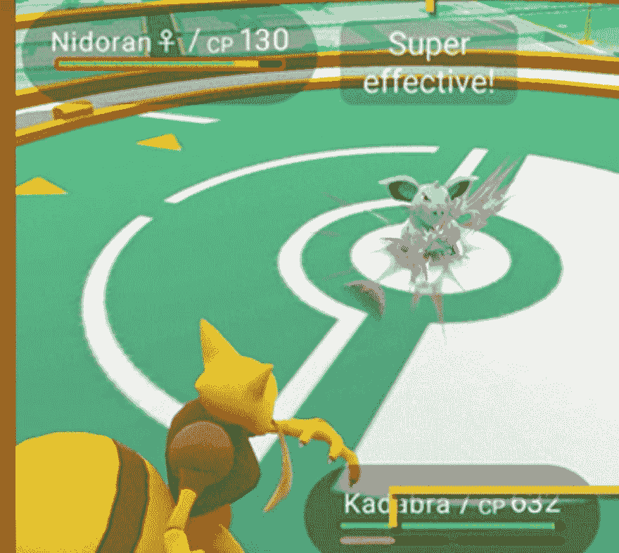
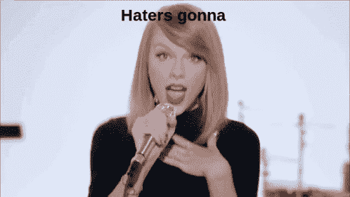

# 如何应对批评者？

> 原文：<https://dev.to/uriel_hedz/how-to-deal-with-bad-reviews-5453>

我已经创作内容 8 年了，主要是为 YouTube 的一个频道，有超过 50 万的订阅者，我也为一个拥有超过 30 万注册学生的在线学校工作。在这段时间里，我有过很棒的评论，好的评论，坏的评论，愤怒的评论，以及各种各样说好的和坏的事情的方式，所以我必须学会如何处理评论，特别是坏的评论，因为那些评论是最留在你脑海中的

在这篇文章中，我想给那些开始为互联网创作内容的人一些建议，以帮助他们通过那些会立刻毁掉你一天的评论。

## 一为审核人

这一点很重要，大声说出来。

你说话的方式，你给出建议、反馈的方式，或者你抱怨的方式对某人来说都很重要，所以重要的是要记住，你每天消费的内容背后都有人类，这样你才能以帮助他人成长的方式表达你想要的，而不是让他们感觉不好。

请记住，如果你对某人很粗鲁，任何时候都是收回自己说抱歉的好时机。

## 差评的痛苦

我知道，我知道...根据你度过的一天，收到一个不好的评论真的会毁了你的一天，就像我有几个不眠之夜只想着那一个抨击我工作的评论，或者那个粗鲁的人一直对我的工作留下不好的评论。我见过人们离开公共场所只是为了避免与粗鲁的人打交道。所以，有一个计划或一些建议来处理这种评论是非常重要的。

我提到这一点只是为了让你知道，不仅仅是你，每个人都会收到差评，甚至是那些已经这样做了很多年的人。当你感觉不好的时候，你并不孤单，你并不激动，你也没有对你甚至不认识的人的话反应过度。对此感到难过不仅是正确的，而且是每个创造者都必须面对的事情。

我理解对我们中的许多人来说，让我们的工作受到批评感觉就像是针对你个人，所以感觉不好是可以理解的。

## 如何应对差评

在验证了我们的感情之后，我们再来看如何处理这件事。

### 不是个人(通常情况下)

首先，你不是你的作品，你的才华和能力不能仅仅通过你做的一件事来衡量，所以，不要把它当成个人的。

当然，在某些情况下，仇恨和差评实际上是个人的，但在这些情况下，重要的是使用社交网络的屏蔽工具，让仇恨者远离你，屏蔽噪音，关注那些希望你成长和工作变得更好的人。

### 切换视角

一位我非常钦佩的同事总是记得我们，有人在我们创建的内容上投入时间是多么重要，在我们的案例中，我们教编程，所以他不断提醒我们有人投入时间学习的价值。

这对我来说很重要，因为它有助于我不断改进我制作的内容，同时也让我保持谦逊。

学会接受积极的反馈也是学会谦虚，因为有时即使离开他们评论的人试图以积极的方式这样做，当有人不喜欢你的内容时，感觉很糟糕。

与你投入制作内容的时间一样重要的是，你也可以考虑人们观看或消费你的东西的重要性，所以当有人说“音频很糟糕”时，不仅要考虑你作为内容创作者的感受，还要考虑糟糕的音频作为消费者的感受。

在阅读内容评论时，保持你作为消费者的视角。

### 以善意回应

这听起来很傻但是超级有效。我理解如果你没有足够的健康去善意回应差评，特别是那些没有表达出同样善意的差评，但是，是的，这很有效。

尝试一下，看看消费者说了什么，深呼吸，然后尽可能友好地回答，等待具体评论背后的人的回应，大多数情况下他们会改变语气，这可能会让他们也表达他们喜欢你的工作，而不仅仅是不好的方面。

对他们的反馈表示感谢，以友好的方式表达这让你感觉如何，表达你的工作对你的重要性，表达你想把工作做得更好的意图或者你在创作上付出了多少努力。

### 阻挡敌人

不要让讨厌的人设定谈话的基调，不要让他们在正面反馈周围制造噪音，只是毫不犹豫或内疚地阻止他们。

### 负面反馈总是更响亮

你最后一次接受优质服务并停下来表达服务有多好是什么时候？比如，你最后一次点美味的食物并决定向个人表达是什么时候？现在想想，如果不是那样，食物是糟糕的，你会有什么机会表达出来？

现在复制这句名言“负面反馈总是更响亮”粘贴到 Google Docs、Pages 或 Word 上，现在打印出来，贴在你面前，永远记住它。

比如，这可能是处理差评时最重要的建议，**它们不能表达对你作品的总体感觉**。没有一般的规则，但是对于每一个不好的评价，都有更多的人对你的所作所为感到满意，但没有花时间表达出来，这很正常，我们都喜欢这样，当我们感觉被欺骗或感觉不好时，我们会说一些东西，但当我们感觉良好时不会说。

这也是一个提醒，对制作你喜欢的作品的人说友好的话，留下好的评论，竖起大拇指看视频，订阅，喜欢，说“谢谢”，“真棒的作品”，“继续做这些”等等。

记住，差评并不意味着你的工作不好！。

### 不要指望所有人都喜欢你的作品。

在墨西哥，我们说“我不是一枚小金币”。谚语的意思是，没有人是每个人都会喜欢的金币，这同样适用于你的工作，它不是一个“monedita de oro”。

例如，你可以通过视频、书籍、教程、现场编码、在线课程、在线课程、有导师或没有导师、通过会议等学习编程。没有通用的编程教学方法，每个人都会喜欢一种方法多于其他方法，不要因为你的工作很差而有不好的评价，而是因为它对一些人有用，但对其他人没用。

## 最后的想法

总结一下，会有不好的评论，记住它们更响亮，没有什么是金币，除了好的...金币。

友善一点，如果你有这种感觉，不要把它当成个人恩怨，如果有人这样做了，请随时阻止他们，不要给仇恨者和他们制造的噪音留下空间。

学会谦逊地接受建设性的反馈，因为记住，这些人也在投资你唯一买不回来的东西，时间。

最重要的是，不要停下来，为你制作内容，你的创造力，你会做得更好，你会找到你的观众和你的社区，这只是需要时间。