# 如何在 Google App Engine 上部署 Laravel web 应用程序

> 原文：<https://dev.to/updivision/how-to-deploy-a-laravel-web-app-on-google-app-engine-2hpb>

我们的开发人员经历了很多。这些是他们的故事。这是由我们的高级应用程序设计师之一因陀罗讲述的。

因陀罗:我是一名经验丰富的软件工程师和团队领导。我对我的项目了如指掌——我必须这样做。我负责确保所有部件都组装在一起，服务器正常运行，最困难的任务得以完成。当我不做这个的时候，我在大学教书和做研究。我无时无刻不渴望提升自己的技能，把自己知道的东西传授给别人。

本周，我们有一个客户希望他的 Laravel web 应用程序部署在 Google App Engine 上。这有多种原因:

*   成本(据说比亚马逊便宜)
*   多区域
*   自动缩放

此外，我们已经在这个特定的应用程序中使用了很多 Google APIs，所以这看起来是一件非常容易的工作。

你看怪不怪这并不容易。但我最终成功了。

通过这次经历，我艰难地发现几乎没有任何关于这个话题的信息。我能找到的唯一一个教程发布在谷歌社区上，它缺少很多细节。

## 开机前:

我建议在开始使用 Google App Engine 部署 Laravel 应用程序之前，先阅读这篇文章。准备好一切。然后才进行部署。否则你可能会失去很多时间，给自己压力，就像我一样。

## 免责声明:

虽然我没有对 nginx 的设置做任何修改，但我会在以后的教程中谈到它。我正在考虑做一个关于添加自定义域和我遇到的问题的教程。但是 YouTube 上已经有一些关于这个话题的非常好的教程了。

此外，我在本教程中使用了标准的 MySQL，但是也可以使用大数据。

因为我不想让这篇文章难以阅读，我在一些部分添加了 YouTube 视频的链接，而不是图片。

Google 上缺少一些关于 PHP 部署的文档，所以我在一些地方用 Python 的文档替换了它。如果你打算按照 Google 文档来部署一个带有 Google App Engine 的 Laravel 应用程序，我强烈推荐你看一看这两者。

## 先决条件阅读(您可以跳到准备部署)

1.)[谷歌云壳](https://cloud.google.com/shell/docs/quickstart)
2。)[谷歌云平台上的 PHP](https://cloud.google.com/php/docs/)。我们将使用灵活的环境，请阅读相关内容。
3。)(可选)[Python 的文档](https://cloud.google.com/python/docs/)

## 准备部署

1.)创建谷歌云账号:[这里](https://cloud.google.com/)或者更直接[这里](https://console.cloud.google.com/getting-started?pli=1)。目前，你可以获得 365 天或 300 美元的信用免费试用(以先到者为准)。除非你是一个非常老的用户(测试版)，你也将被要求添加您的信用卡，但你不会被收费。

2.)创建一个新项目(快速视频[此处](https://www.youtube.com/watch?v=7n9DkOzjwlA&feature=youtu.be&t=35s)如果需要)

3.)创建一个应用引擎实例(如有需要，快速视频[此处](https://www.youtube.com/watch?v=GZfV2O0orVo)

4.)我们将使用 [Google Cloud Shell](https://cloud.google.com/shell/docs/quickstart) 进行部署。为了能够使用它，你需要[为你的操作系统下载云软件开发工具包](https://cloud.google.com/sdk/)。对于一些设置，你可以直接从你的浏览器使用云壳，正如这里看到的。我不使用它，但是你可以阅读文档来了解如何使用。但是你真的应该安装它以便于使用。如果您运行 Windows，您需要以管理员权限打开安装程序。遵循谷歌为其他操作系统提供的快速入门教程。

5.)在你继续使用 Google Cloud Shell 之前，我推荐[阅读这篇关于 PHP 环境的](https://cloud.google.com/php/docs/)。

6.)使用命令 **gcloud auth login** 登录控制台。您将通过浏览器登录。如果你想看到所有可用的命令，在命令行中写下 **gloud help** 并按下**回车**。

7.)在命令行写**g cloud config set project project _ id**，其中 **project_ id** 是你刚刚给你新创建的项目的项目 id。在项目信息小部件下选择项目后，可以在 Google 控制台的第一页找到它。

8.)要查看您所有项目的列表，请键入 **gcloud 项目列表**。
这是它获得的先决条件。我们将继续进行所需的数据库设置和下载。

这是它的先决条件。我们将继续进行所需的数据库设置和下载。

## 准备您的项目

对于这一部分，我使用了本教程作为灵感。您可以阅读它，也可以完全跳过它，因为我将介绍部署所需的所有步骤，除了文件存储部分。为此，我会给你一些信息，但不是一个完整的教程。

在本教程中，我将使用一个我正在构建的应用程序作为例子。一个简单的博客有作为管理面板的 Laravel 的[背包。既然我们在这里，我必须让你知道 Vue.js 与 Google App Engine 兼容。你只需要运行 **npm install** 和 **npm run prod** 就可以了。在本教程中，我们将不会使用 Vue.js。](https://backpackforlaravel.com?ref=updivision)

1.)将目录更改为您的应用程序文件夹。为了使用方便，你可以设置如下。您需要创建一个 **app.yaml** 文件。在 composer.json 的同一级别手动创建即可。

[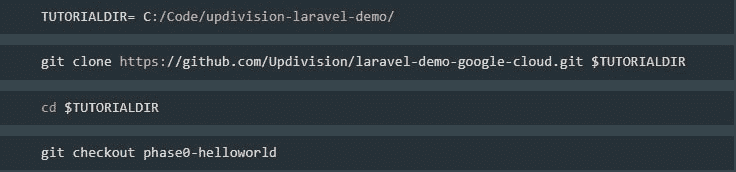](https://res.cloudinary.com/practicaldev/image/fetch/s--Hc9sTrI7--/c_limit%2Cf_auto%2Cfl_progressive%2Cq_auto%2Cw_880/https://thepracticaldev.s3.amazonaws.com/i/je1f2z2hmerk3k9teg07.jpg)

2.)现在我们有了需要设置数据库和项目细节的文件。

3.)来设置项目详细信息，我们将不会使用。请按照我的 app.yaml 示例中添加的注释来理解我是如何编写它的。它需要看起来像这样:

[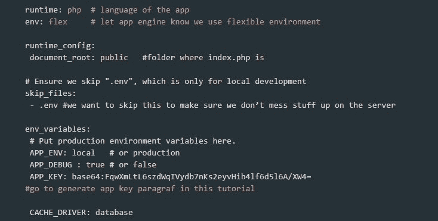](https://res.cloudinary.com/practicaldev/image/fetch/s--HU4fgZFY--/c_limit%2Cf_auto%2Cfl_progressive%2Cq_auto%2Cw_880/https://thepracticaldev.s3.amazonaws.com/i/w3m8zw9sz7ageq5zg6u5.jpg)
[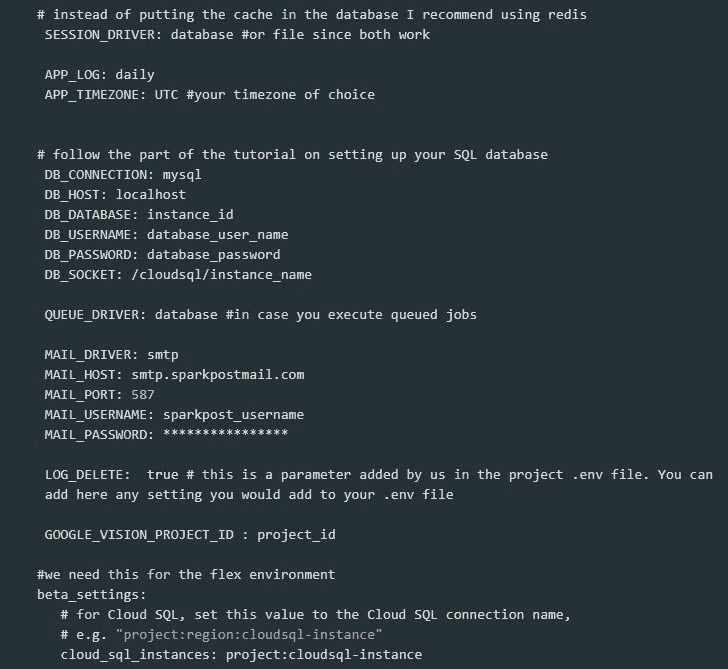T6】](https://res.cloudinary.com/practicaldev/image/fetch/s--dWmUo2xG--/c_limit%2Cf_auto%2Cfl_progressive%2Cq_auto%2Cw_880/https://thepracticaldev.s3.amazonaws.com/i/02efq9dr8kyarghf9l3j.jpg)

4.)生成 app 密钥。为了生成 Laravel 安装的 app key，我们需要运行:**PHP artisan key:generate-show**。然后将其复制并粘贴到 app.yaml 中。

5.)更新 composer.json 以匹配 Google App Engine 要求。在脚本中，添加如下脚本。在 **post-install-cmd** 脚本中有一个添加 **php artisan cache:clear** 的建议，然而，从我使用 Google deploy 的经验来看，这不起作用。这就是为什么我建议不要写它。在这个 composer.json 示例中，我只添加了最少的 Laravel 包。

[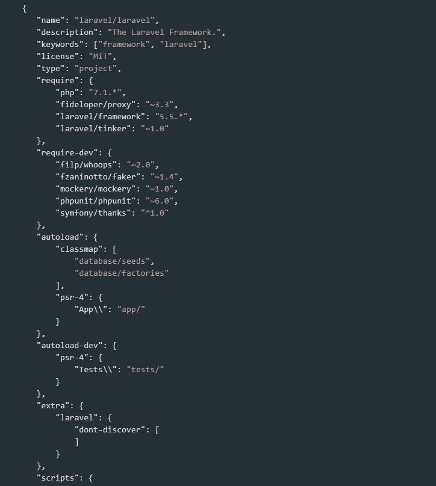](https://res.cloudinary.com/practicaldev/image/fetch/s--I7AK7NOA--/c_limit%2Cf_auto%2Cfl_progressive%2Cq_auto%2Cw_880/https://thepracticaldev.s3.amazonaws.com/i/0fiahtjeq0j3p4puz1mv.jpg)
[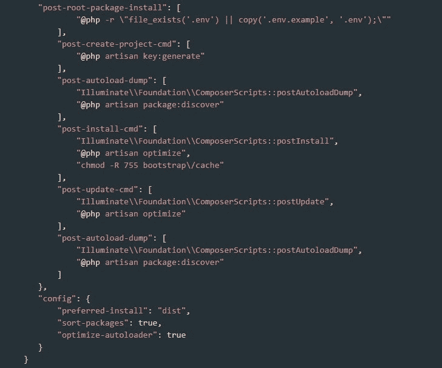T6】](https://res.cloudinary.com/practicaldev/image/fetch/s--rhcnVTDn--/c_limit%2Cf_auto%2Cfl_progressive%2Cq_auto%2Cw_880/https://thepracticaldev.s3.amazonaws.com/i/ox1nz8kgrmyicmssypgh.jpg)

6.)在 google sdk 命令行中运行 **gcloud app deploy** (你必须在应用文件夹中)并在提示时回答 **Y** 。

[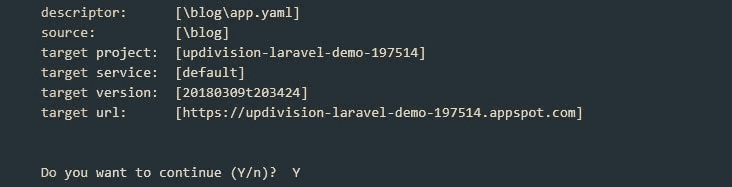](https://res.cloudinary.com/practicaldev/image/fetch/s--wzScUGg0--/c_limit%2Cf_auto%2Cfl_progressive%2Cq_auto%2Cw_880/https://thepracticaldev.s3.amazonaws.com/i/fhzwgktimd689sg7gv53.jpg)

7.)运行 **gcloud app 浏览**查看你的 app。

[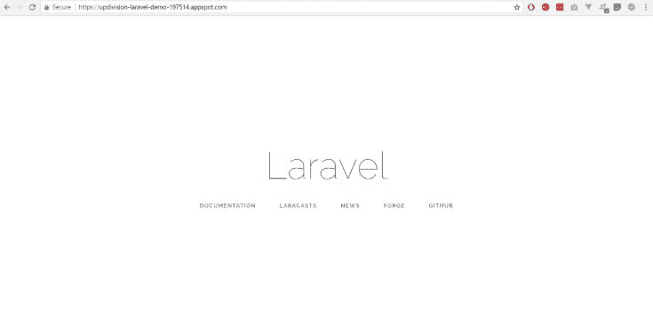](https://res.cloudinary.com/practicaldev/image/fetch/s--pZAI70vM--/c_limit%2Cf_auto%2Cfl_progressive%2Cq_auto%2Cw_880/https://thepracticaldev.s3.amazonaws.com/i/l9hpfkd0fu5182lw52bo.jpg)

## 设置 cron 作业

下面是设置 cron 作业的[谷歌教程](https://cloud.google.com/appengine/docs/standard/php/config/cron)。我还看了一下[的 Python 版本](https://cloud.google.com/appengine/docs/standard/python/config/cron)。当有一个 Laravel 应用程序时，知道如何用 Google App Engine 设置 cron 作业是最基本的。

我们的应用程序有很多运行中的时间表，我很难让它们工作或在网上找到答案。幸运的是，我们在亚马逊遇到了同样的问题，并且已经知道了解决方法。我用谷歌应用引擎和哈利路亚试过了！

1.)创建一个 cron.yaml 文件并添加以下代码:

[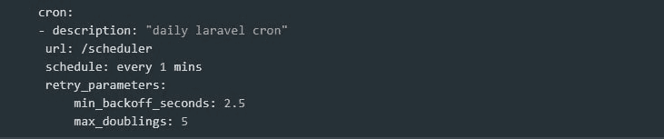](https://res.cloudinary.com/practicaldev/image/fetch/s--8E3j72A3--/c_limit%2Cf_auto%2Cfl_progressive%2Cq_auto%2Cw_880/https://thepracticaldev.s3.amazonaws.com/i/lc049qtd1cuwx5gnuekl.jpg)

2.)在您的路由中，您需要像这样添加调度程序路由(在任何中间件之外):

[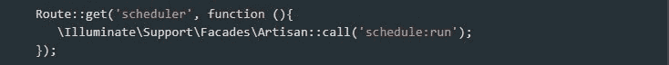](https://res.cloudinary.com/practicaldev/image/fetch/s--xaR2ET2F--/c_limit%2Cf_auto%2Cfl_progressive%2Cq_auto%2Cw_880/https://thepracticaldev.s3.amazonaws.com/i/04qrci5sv0tc53cdurh0.jpg)

3.)运行 **gcloud app deploy cron.yaml** 。

4.)您可以在 App Engine 任务队列中看到您的 crons 或手动运行它们。

## 设置 SQL 数据库

这似乎让一些人晕头转向，所以我会尽量让它简单直观。我还在这里加了一个快速视频[。](https://www.youtube.com/watch?v=jwtHsT4EmzA&feature=youtu.be)

1.)转到你的谷歌云控制台。

2.)在菜单中查找 SQL 并单击它。

3.)点击创建实例，选择 MySQL。

4.)选择二代，选择一个 id 和一个密码。

5.)您的实例正在加速运行。

[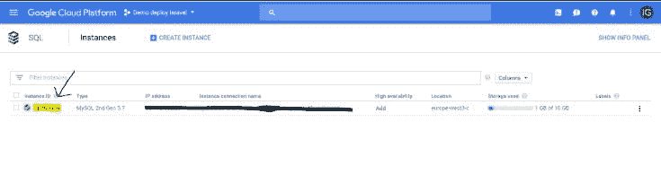](https://res.cloudinary.com/practicaldev/image/fetch/s--jhKJem_J--/c_limit%2Cf_auto%2Cfl_progressive%2Cq_auto%2Cw_880/https://thepracticaldev.s3.amazonaws.com/i/yql4pqel63iylsc999yn.jpg)

6.)现在复制实例连接名，粘贴到你的 app.yaml 中**beta _ setting cloud _ SQL _ instances:instance _ connection _ name**。

[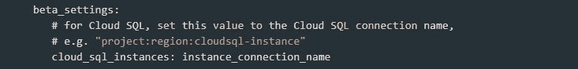](https://res.cloudinary.com/practicaldev/image/fetch/s--ay9eofyO--/c_limit%2Cf_auto%2Cfl_progressive%2Cq_auto%2Cw_880/https://thepracticaldev.s3.amazonaws.com/i/9ux843nu6jun5gp6ehax.jpg)

7.)还要完成 app.yaml 中的数据库连接数据，复制实例 id，粘贴为 DB_DATABASE。然后复制实例连接名，并将其添加到/cloudsql/ for DB_SOCKET 之后。

[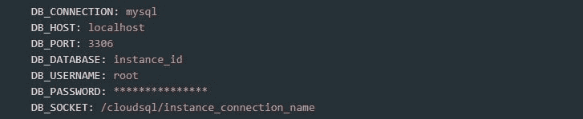](https://res.cloudinary.com/practicaldev/image/fetch/s--lfnS_OYF--/c_limit%2Cf_auto%2Cfl_progressive%2Cq_auto%2Cw_880/https://thepracticaldev.s3.amazonaws.com/i/u5qmgn097kx48id5g3ts.jpg)

8.)再次部署 app。

9.)数据库现在是空的，我得到了这个错误:

[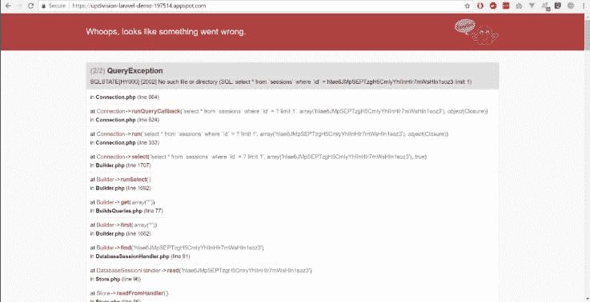](https://res.cloudinary.com/practicaldev/image/fetch/s--Qmecckjx--/c_limit%2Cf_auto%2Cfl_progressive%2Cq_auto%2Cw_880/https://thepracticaldev.s3.amazonaws.com/i/460vzh604d2jbjbtrozv.jpg)

10.)连接到数据库:

*   使用证书(请参阅本文的查看数据部分)。
*   使用命令行(请参阅本文的运行迁移部分)。

## 导入包含数据的完全迁移的数据库

要在新创建的数据库中导入完整的数据库，您需要使用 Google Bucket。

1.)转储你当前的数据库:**MySQL Dump-user-p your _ database>your _ database _ Dump . SQL**

2.)转到您的仪表板，在左侧菜单中单击“Storage”。选择一个存储桶并上传您的数据库转储。

3.)转到您的 google 控制台仪表板，单击您的实例 id:

[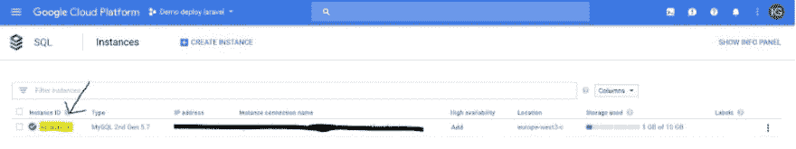](https://res.cloudinary.com/practicaldev/image/fetch/s--xXs-QJ-s--/c_limit%2Cf_auto%2Cfl_progressive%2Cq_auto%2Cw_880/https://thepracticaldev.s3.amazonaws.com/i/nn5sxetmvywq0ibgy93p.jpg)

4.)点击导入。

[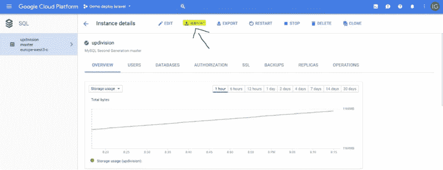](https://res.cloudinary.com/practicaldev/image/fetch/s--YeKbHapS--/c_limit%2Cf_auto%2Cfl_progressive%2Cq_auto%2Cw_880/https://thepracticaldev.s3.amazonaws.com/i/3axlwa3z549zqv5jm27w.jpg)

5.)选择您在步骤 2 上传的文件。

6.)单击高级选项，并在数据库下选择数据库的名称。

7.)点击导入。

## 查看数据

查看数据的推荐方式，至少在我的经验中，是使用 Workbench 和 Google 提供的证书。对于这一部分，我使用了[这个文档](https://cloud.google.com/sql/docs/mysql/external-connection-methods)作为灵感。

1.)转到您的 Google 控制台仪表板，单击您的实例 id。

2.)在屏幕顶部(图表的正上方)，选择 SSL。

3.)向下滚动并点击创建客户端证书并将它们存储在您的计算机上。我建议每台电脑一个，但这取决于你。

4.)打开 MySQL Workbench，在 Connection 选项卡中填写 Overview 选项卡中的详细信息=> Connect to this instance a square(主要用于 IP)。使用与 app.yaml 相同的用户和密码。

[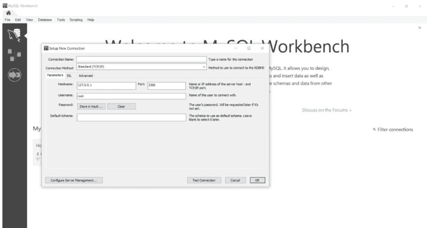](https://res.cloudinary.com/practicaldev/image/fetch/s--HP-6TrO1--/c_limit%2Cf_auto%2Cfl_progressive%2Cq_auto%2Cw_880/https://thepracticaldev.s3.amazonaws.com/i/t6oq2dueu9fg28enyeoo.jpg)

并在 SSL 选项卡中添加您刚刚下载的证书。在使用 SSL 下拉列表中选择需要。现在您可以访问您的数据库了。

本教程的下一步也是最后一步是运行迁移和种子程序，但是如果您已经得到了您需要的所有东西，可以跳过它。

[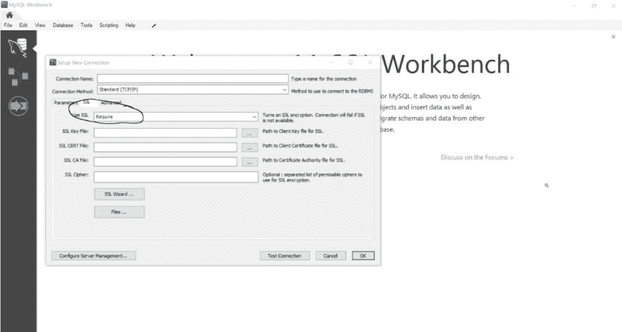](https://res.cloudinary.com/practicaldev/image/fetch/s--mvC4W9_2--/c_limit%2Cf_auto%2Cfl_progressive%2Cq_auto%2Cw_880/https://thepracticaldev.s3.amazonaws.com/i/94e9g0dl43jf5joyfjkw.jpg)

## 运行迁移和播种程序

要运行迁移和种子程序，你需要做一个黑客，但是如果你找到了另一种方法，请在下面的评论中告诉我，因为我一直在寻找一个更优雅的方法。

1.)去下载[代理文件](https://cloud.google.com/sql/docs/mysql/sql-proxy)。

2.)在 Google Cloud 控制台中，将目录更改为您下载文件的目录。

3.)创建一个[服务账户文件](https://cloud.google.com/sql/docs/mysql/sql-proxy#create-service-account)。

4.)运行以下命令:

[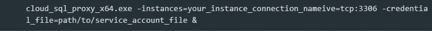](https://res.cloudinary.com/practicaldev/image/fetch/s--iH1x_2kJ--/c_limit%2Cf_auto%2Cfl_progressive%2Cq_auto%2Cw_880/https://thepracticaldev.s3.amazonaws.com/i/pyo26tfqcl90rohvhsqj.jpg)

5.)在你的。env 文件把你的数据库和密码从谷歌和使用本地主机作为主机。

6.)在命令行中像平常一样运行任何迁移或播种命令: **php artisan migrate - seed**

或者你可以运行一个单独的播种器:**PHP artisan migrate db:seed-class = seeder class**

## 设置存储

要设置存储，请在 **config/filesystem.php** 中这样做，并为 Google 添加一个磁盘:

[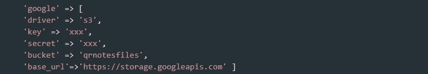](https://res.cloudinary.com/practicaldev/image/fetch/s--CNV2NXrD--/c_limit%2Cf_auto%2Cfl_progressive%2Cq_auto%2Cw_880/https://thepracticaldev.s3.amazonaws.com/i/88mqh9u5motn0k2a8tc9.jpg)

## 关于在 Google App Engine 上部署 Laravel 应用的其他有用资料:

*   [预览和部署应用引擎应用](https://cloud.google.com/shell/docs/quickstart?authuser=1#preview_and_deploy_an_app_engine_application)
*   用于 Laravel 的 Google 云存储文件系统

我希望你喜欢这篇文章，并发现它很有帮助。你自己有什么提示或建议吗？或者一些问题？随时联系。编码快乐！