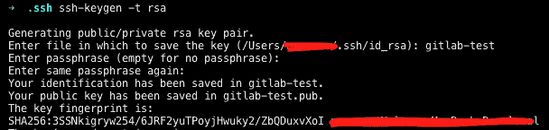
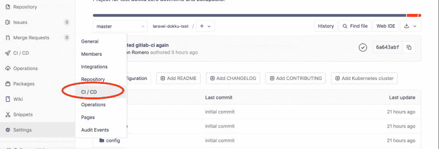
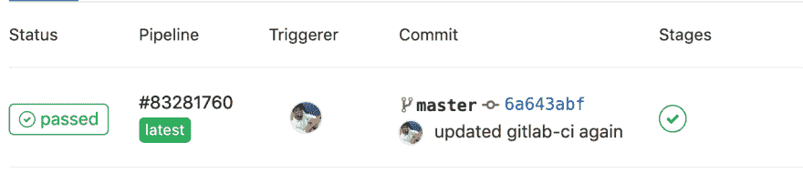
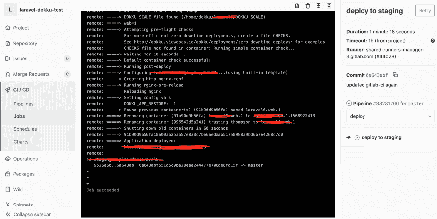

# 如何使用 Gitlab CI 部署到 dokku

> 原文：<https://dev.to/nromero125/how-to-deploy-to-dokku-with-gitlab-ci-89f>

最近，在我工作的公司，我们需要从 gitlab 自动部署到试运行或生产，但我们不知道如何去做。于是我开始在网上搜索，但是找不到准确的信息。经过一段时间的搜索和尝试，我可以做到这一点，所以我决定做一个关于它的教程。

在本教程中，我们将使用一个 Laravel(6.0)应用程序。

**开始使用**

假设您已经安装并配置了 dokku。我们需要在 gitlab 中创建我们的项目，并推送一些代码。

**为 Gitlab 生成 SSH 密钥对**

我们需要一个 SSH keypair 来让 gitlab 将我们的项目推送到 dokku，所以我们将创建一个新的。随着下一个命令。

```
ssh-keygen -t rsa 
```

[](https://res.cloudinary.com/practicaldev/image/fetch/s--Ri-JZK0k--/c_limit%2Cf_auto%2Cfl_progressive%2Cq_auto%2Cw_880/https://thepracticaldev.s3.amazonaws.com/i/f77f5py9o82gq80iru4f.png)

在这种情况下，我会将密码留空。该命令将生成文件 **gitlab-test** 和 **gitlab-test.pub** 。

**向 dokku 添加密钥**

我们将把新密钥添加到 dokku 实例中，以便 gitlab 可以为我们部署。

```
cat ~/.ssh/gitlab-test.pub | ssh -i "KeyPair.pem"  user@<yourdomainorip> "sudo sshcommand acl-add dokku gitlab-test" 
```

我使用参数-i "KeyPair.pem ",因为在我的例子中，dokku 托管在 EC2 中，如果您的 dokku 实例托管在另一个提供者中，您不需要该参数。

```
cat ~/.ssh/gitlab-test.pub | ssh user@<yourdomainorip> "sudo sshcommand acl-add dokku gitlab-test" 
```

**将密钥添加到 Gitlab**
打印出你的私钥内容并复制全部内容:
-开始 RSA 私钥-
......
......
......
-结束 RSA 私钥-

然后打开 gitlab，转到您想要部署的项目，并转到设置，然后 CI/CD。
[T3】](https://res.cloudinary.com/practicaldev/image/fetch/s--eOzSgLic--/c_limit%2Cf_auto%2Cfl_progressive%2Cq_auto%2Cw_880/https://thepracticaldev.s3.amazonaws.com/i/4bl1f45bcewyr72rb4v0.png)

展开 Variables 选项卡，添加一个名为 SSH_PRIVATE_KEY 的新变量，该值将是您复制的私有密钥的内容(让该状态不受保护)。然后保存变量。

**的。gitlab-ci.yml 文件**

创建一个名为。gitlab-ci.yml 并添加以下内容:

[这里有关于这个文件的更多信息](https://docs.gitlab.com/ee/ci/yaml/)

```
image: ilyasemenov/gitlab-ci-git-push

before_script:
  ##
  ## Install ssh-agent if not already installed, it is required by Docker.
  ## (change apt-get to yum if you use an RPM-based image)
  ##
  - 'which ssh-agent || ( apt-get update -y && apt-get install openssh-client -y )'

  ##
  ## Run ssh-agent (inside the build environment)
  ##
  - eval $(ssh-agent -s)

  ##
  ## Add the SSH key stored in SSH_PRIVATE_KEY variable to the agent store
  ## We're using tr to fix line endings which makes ed25519 keys work
  ## without extra base64 encoding.
  ## https://gitlab.com/gitlab-examples/ssh-private-key/issues/1#note_48526556
  ##
  - echo "$SSH_PRIVATE_KEY"
  - echo "$SSH_PRIVATE_KEY" | tr -d '\r' | ssh-add -

  ##
  ## Create the SSH directory and give it the right permissions
  ##
  - mkdir -p ~/.ssh
  - chmod 700 ~/.ssh

stages:
  - deploy

deploy to staging:
  stage: deploy
  environment: staging
  only:
    - master
  script: git-push dokku@<yourdomain>:<dokkuappname> 
```

替换为 dokku 实例的域或 ip，替换为 dokku 中应用程序的名称。[关于 before_script 操作的更多信息，请点击这里](https://docs.gitlab.com/ce/ci/ssh_keys/README.html)。

我们在文件中使用的映像是 CI runner 映像，它允许将 Gitlab 项目部署到 git repo(对 Dokku、Heroku、Deis 等有用)。).[此处 github 回购](https://github.com/IlyaSemenov/gitlab-ci-git-push)。

添加完这个文件后，将你的代码推送到 gitlab 并在 gitlab 中打开你的项目，进入 CI/CD 选项并进入 Pipelines。你会看到一个管道在进行中。

[](https://res.cloudinary.com/practicaldev/image/fetch/s--0XBQAkFp--/c_limit%2Cf_auto%2Cfl_progressive%2Cq_auto%2Cw_880/https://thepracticaldev.s3.amazonaws.com/i/yvhg9dxarcfql91dunsp.png)

[](https://res.cloudinary.com/practicaldev/image/fetch/s--AJJCXOpF--/c_limit%2Cf_auto%2Cfl_progressive%2Cq_auto%2Cw_880/https://thepracticaldev.s3.amazonaws.com/i/6l4lnvyv3muhtecnia3f.png)

这个管道会自动将您的项目部署到 dokku。这就是全部，感谢阅读。