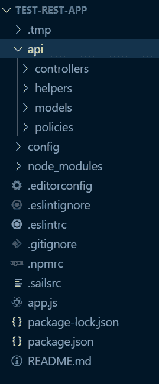
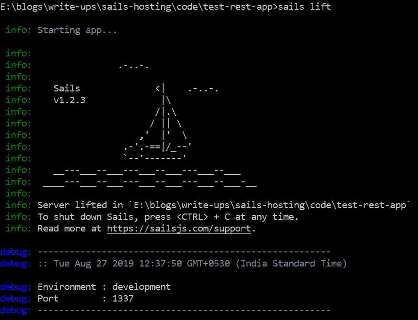
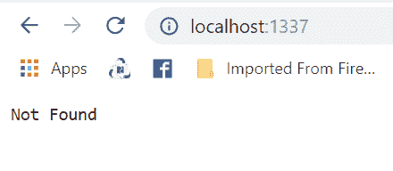
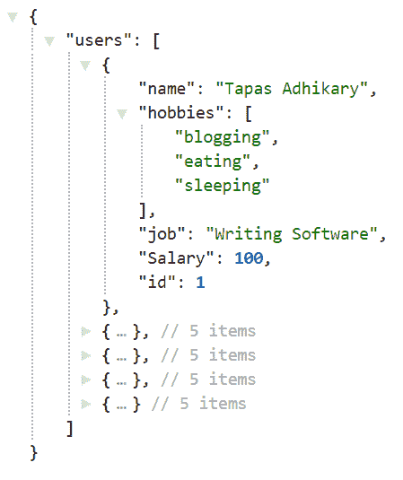
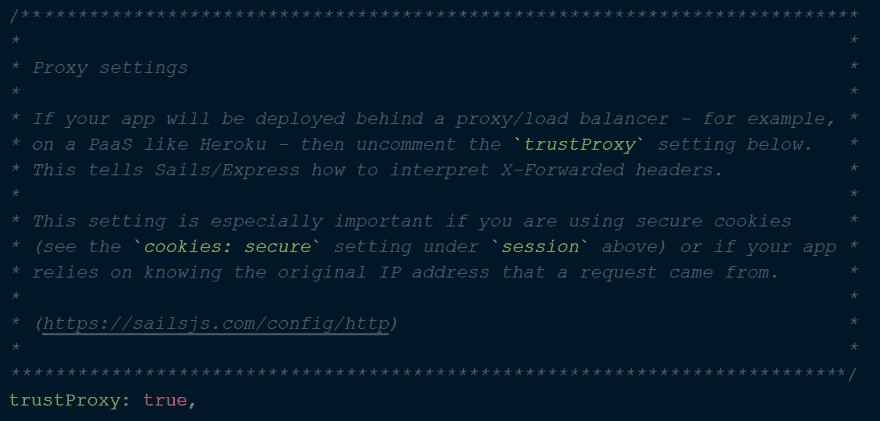
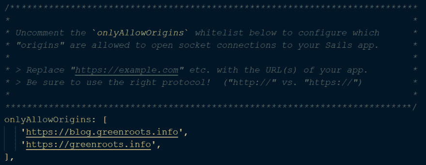
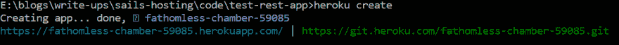
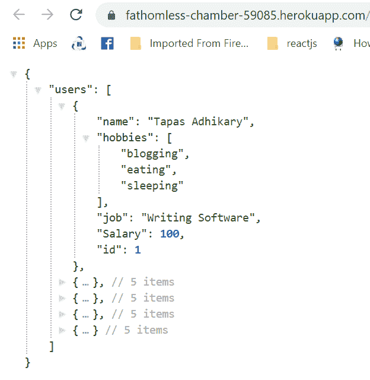
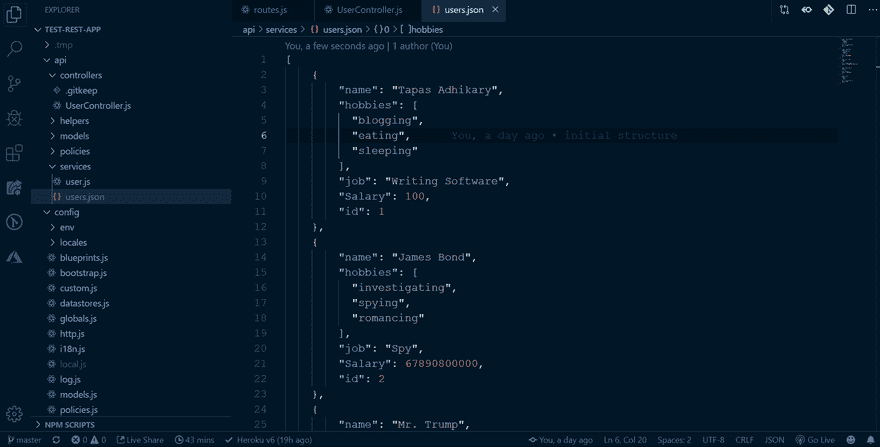

# 如何在 Heroku 上部署你的 Sails.js app，活得更久

> 原文：<https://dev.to/atapas/how-to-deploy-your-sails-js-app-on-heroku-and-live-longer-1hbd>

# 简介

持续集成(CI)和持续交付/部署(CD)是重要的现代开发实践。作为开发人员，仅仅把自己限制在实现的边界是不公平的。简洁的构建流程、工具集成、部署、测试和交付——所有这些都与我们息息相关。

在这篇文章中，我们将了解如何开始使用一个著名的框架，名为 [Sails.js](https://sailsjs.com/) (又名 sailsJS)，以及如何集成和持续部署对名为 [Heroku](https://dashboard.heroku.com/login) 的托管服务的更改。

这将是一次有趣的学习，继续读下去👇👇👇。

# [T1】sails . js](#sailsjs)

[](https://res.cloudinary.com/practicaldev/image/fetch/s--dQr9D_MB--/c_limit%2Cf_auto%2Cfl_progressive%2Cq_auto%2Cw_880/https://cdn.hashnode.com/res/hashnode/image/upload/v1566910736434/sikt9PHeN.png)

[Sails.js](http://sailsjs.com/) 是一个面向数据的、现代的、前端不可知的、基于 MVC 的框架，用于构建定制的企业级 Node.js 应用。MVC 模式是基于[套接字的。IO](https://socket.io/) 和[快车](https://expressjs.com/)。

使用 Sails.js 框架，您应该能够:

*   从模型中自动生成 REST APIs。
*   连接到开箱即用支持的多个数据库。
*   编写策略以提供安全性。
*   支持 WebSockets 进行实时应用程序开发。
*   构建基于 MVC 的架构。
*   构建 Web 应用程序。

我强烈建议你查看一下 [Sails.js 文档和架构](https://sailsjs.com/documentation/anatomy)来更好地理解它。

### 让我们用创纪录的时间打造一款 Sails.js app

好了，理论到此为止。让我们看看实际情况。

我们将基于 Sails.js 构建一个小应用程序。我们的应用程序将公开一个 REST 端点(比如用户)，使用一个 API(比如/api/users)从一个商店(比如我们示例中的 JSON 商店)获取用户数据。让我们在接下来的几分钟内完成吧！

#### 安装风帆. js

```
npm install sails -g 
```

Enter fullscreen mode Exit fullscreen mode

#### 创建一个风帆项目

创建 sails 项目有几种方法。您可以选择使用 sails 创建一个完整的 web 应用程序，也可以创建一个没有任何 web 应用程序相关文件的项目。由于我们的应用程序处理 REST API，我们将采用后一种情况:

```
sails new test-rest-app --no-frontend 
```

Enter fullscreen mode Exit fullscreen mode

这将为您创建一个项目结构。项目结构将如下所示:

[](https://res.cloudinary.com/practicaldev/image/fetch/s--YQ0ZjnpC--/c_limit%2Cf_auto%2Cfl_progressive%2Cq_auto%2Cw_880/https://cdn.hashnode.com/res/hashnode/image/upload/v1566964197475/u2mZSHaxT.png)

#### 首次运行

转到项目目录

```
cd test-rest-app 
```

Enter fullscreen mode Exit fullscreen mode

并运行该命令

```
sails lift 
```

Enter fullscreen mode Exit fullscreen mode

您应该会看到如下输出:

[](https://res.cloudinary.com/practicaldev/image/fetch/s--_IsRhjmu--/c_limit%2Cf_auto%2Cfl_progressive%2Cq_auto%2Cw_880/https://cdn.hashnode.com/res/hashnode/image/upload/v1566964733418/ANpGqAfTV.png)

现在让我们试着访问应用程序:`http://localhost:1337`。良好的..你看到的不是很好，对吗？这是因为，我们还没有做任何事情！

[](https://res.cloudinary.com/practicaldev/image/fetch/s--fFBrhgY0--/c_limit%2Cf_auto%2Cfl_progressive%2Cq_auto%2Cw_880/https://cdn.hashnode.com/res/hashnode/image/upload/v1566965067454/7Ae6Q7FBh.png)

#### 我们第一个 REST API 的时间到了:用户服务

*   **创建路由**:到达我们端点的 URI 是`users`。让我们创造一条通往第一个目标的道路。转到`config/routes.js`并添加以下代码行:

```
 module.exports.routes = {
    'get /': '/api/users',
    'get /api/users': 'UserController.getUsers'
 }; 
```

Enter fullscreen mode Exit fullscreen mode

*   **创建 UserController** :正如您在上一节中看到的，我们的路径指向一个名为`UserController`的控制器，确切地说，是它的一个名为`getUsers`的方法。还要注意，我们已经创建了一个名为`/`的路由，它只是为了重定向到`/api/users`。

转到`/api/controllers`并创建一个名为`UserController.js`的文件。复制粘贴下面的代码来设置控制器。

```
 const users = require('../services/user');

 module.exports = {
    getUsers: function(req, res) {
        return res.json({ users: users.getAll() });
    }
 }; 
```

Enter fullscreen mode Exit fullscreen mode

*   **创建用户服务**:正如您在上面的代码中注意到的，我们需要一个名为`user`的服务，并从该服务中调用一个名为`getAll()`的方法。还要注意，我们正在返回一个 JSON 响应。因此，是时候创建`user`服务了。

在`api`文件夹下创建一个名为`services`的文件夹，并创建一个名为`user.js`的文件。复制粘贴该代码:

```
 const users = require('./users.json');

 module.exports.getAll = function() {
   return users;
 } 
```

Enter fullscreen mode Exit fullscreen mode

*   **创建一个数据存储**:在我们的例子中，我们将使用 JSON 数据存储，并从一个名为`users.json`的简单 JSON 文件中提取数据。您可以轻松地使用任何其他数据存储，如 mySQL、mongo DB、MS Sql Server 等。[这里是所有支持的数据库和商店的综合列表](https://hashnode.com/util/redirect?url=https://sailsjs.com/documentation/concepts/extending-sails/adapters/available-adapters)。

`users.json`是一个简单用户对象的数组，比如:

```
 [
    {
        "name": "Tapas Adhikary",
        "hobbies": [
          "blogging",
          "eating",
          "sleeping"
        ],
        "job": "Writing Software",
        "Salary": 100,
        "id": 1
    },
    {
        "name": "James Bond",
        "hobbies": [
          "investigating",
          "spying",
          "romancing"
        ],
        "job": "Spy",
        "Salary": 67890800000,
        "id": 2
    },
    {
        "name": "Mr. Trump",
        "hobbies": [
          "NA"
        ],
        "job": "I know it best",
        "Salary": 5673099094800238094932083,
        "id": 3
    },
    {
        "name": "Harry Gibson",
        "hobbies": [
          "Soccer"
        ],
        "job": "Dentist",
        "Salary": 10084038403,
        "id": 4
    },
    {
        "name": "Alex",
        "hobbies": [
          "Music",
          "dance"
        ],
        "job": "Technical Writer",
        "Salary": 500,
        "id": 5
    }
 ] 
```

Enter fullscreen mode Exit fullscreen mode

我们都准备好了。运行应用程序的时间到了。如果`sails lift`正在运行，请终止并再次运行。通过`http://localhost:1337`访问应用程序。你会注意到两件事:

*   根据指定的路由，URL 被重定向到`http://localhost:1337/api/users`。
*   您应该会看到这样的响应:

[](https://res.cloudinary.com/practicaldev/image/fetch/s--bb4FlY2P--/c_limit%2Cf_auto%2Cfl_progressive%2Cq_auto%2Cw_880/https://cdn.hashnode.com/res/hashnode/image/upload/v1566966592218/R9Hq-LN0D.png)

*TADA！*我们在创纪录的时间内开发了 REST API😊😊😊。

### 生产中的风帆

由于我们有一个以开发模式本地运行的 Sails.js 应用程序，下一个合乎逻辑的步骤是将其部署在一个名为 *Heroku* 的托管服务上。Heroku 希望我们的应用程序能够成功运行。我们现在将进行这些配置。

*   **设置`trustProxy`为真**:打开`config/env/production.js`文件，搜索`trustProxy`字样。你会看到一行`trustProxy: true`被默认注释。取消注释。

[](https://res.cloudinary.com/practicaldev/image/fetch/s--Y4xaQnhd--/c_limit%2Cf_auto%2Cfl_progressive%2Cq_auto%2Cw_880/https://cdn.hashnode.com/res/hashnode/image/upload/v1566967061696/aCY_RI4Ri.png)

*   **`onlyAllowOrigins`**设定值:在同一个文件`config/env/production.js`中，搜索文本`onlyAllowOrigins`。你会发现它默认是注释的。请取消注释，并提供“起源”被允许打开套接字连接到您的帆应用程序。例如 app，您可以保持默认值不变。

[](https://res.cloudinary.com/practicaldev/image/fetch/s--hhPhZZzV--/c_limit%2Cf_auto%2Cfl_progressive%2Cq_auto%2Cw_880/https://cdn.hashnode.com/res/hashnode/image/upload/v1566967253931/xhSy9GRtm.png)

我们已经完成了在 *Heroku* 上部署和运行我们的应用程序所需的所有配置。请注意，对于生产就绪型应用程序，您需要执行许多其他设置，如安全性、https 等。但是为了我们的榜样，我们已经做了足够的要求。

***重要步骤*** :在这个阶段，将你的 app 代码推送到 git，这样我们就能在最后看到一个合适的 CI/CD 的工作流程。我的项目[在这里](https://github.com/atapas/test-rest-app)。

# Heroku

[](https://res.cloudinary.com/practicaldev/image/fetch/s--YBr4S1Qu--/c_limit%2Cf_auto%2Cfl_progressive%2Cq_auto%2Cw_880/https://cdn.hashnode.com/res/hashnode/image/upload/v1566911209491/I_1M9pE_e.png)

Heroku 是一个基于容器的云平台即服务(PaaS)。我们可以使用 Heroku 来部署、管理和扩展现代应用。这个平台优雅、灵活且易于使用，为开发者提供了将应用推向市场的最简单途径。

### 让我们部署吧

*   首先，注册并登录 Heroku 。
*   从[这里](https://devcenter.heroku.com/articles/heroku-cli#download-and-install)下载并安装`heroku-cli`。该工具将为您现有的 CLI 设置所有必需的路径。
*   打开命令提示符，浏览到您的项目目录。执行`heroku login`。

[](https://res.cloudinary.com/practicaldev/image/fetch/s--pNsrzkBE--/c_limit%2Cf_auto%2Cfl_progressive%2Cq_auto%2Cw_880/https://cdn.hashnode.com/res/hashnode/image/upload/v1566968095611/rAYeoRFGQ.png)

这将要求您提供 Heroku 凭证。请进入。或者，它可能会引导您进入一个网页进行登录，然后返回到终端。

*   为您的应用程序创建一个 Heroku 项目。使用命令`heroku create`。

[](https://res.cloudinary.com/practicaldev/image/fetch/s--cfSU-n2p--/c_limit%2Cf_auto%2Cfl_progressive%2Cq_auto%2Cw_880/https://cdn.hashnode.com/res/hashnode/image/upload/v1566968278410/-foFSrot3.png)

Heroku 将创建一个随机命名的项目(您可以在以后更改)，并向您提供如上确认。您也可以登录 Heroku dashboard 查看列出的项目:

[](https://res.cloudinary.com/practicaldev/image/fetch/s--Fj1np4ML--/c_limit%2Cf_auto%2Cfl_progressive%2Cq_auto%2Cw_880/https://cdn.hashnode.com/res/hashnode/image/upload/v1566968364627/ZHCHCa1fj.png)

一旦下一步完成，您的应用程序将托管在 Heroku 创建的项目 url 上。我的情况是:`https://fathomless-chamber-59085.herokuapp.com`

*   Heroku 推:最后就是推它 Heroku 去部署。

```
 git push heroku master 
```

Enter fullscreen mode Exit fullscreen mode

*   [在浏览器](https://fathomless-chamber-59085.herokuapp.com)上打开网址，查看你的应用程序在那里运行。

[](https://res.cloudinary.com/practicaldev/image/fetch/s--gtI-tmBS--/c_limit%2Cf_auto%2Cfl_progressive%2Cq_auto%2Cw_880/https://cdn.hashnode.com/res/hashnode/image/upload/v1566970884500/fBeC1RmmR.png) 
恭喜恭喜！！！您已经在 Heroku 上成功部署了您的 Sails.js 应用程序！

### CI/CD 循环

根据我们到目前为止所学的知识，让我们来看一个工作流，在这个工作流中，我们将能够:

*   修改代码
*   提交到 Git
*   发布到 Heroku
*   看到变化。

查看它的运行情况(加载此 gif 可能需要一段时间):

[](https://res.cloudinary.com/practicaldev/image/fetch/s--nWRPLL-o--/c_limit%2Cf_auto%2Cfl_progressive%2Cq_66%2Cw_880/https://cdn.hashnode.com/res/hashnode/image/upload/v1566984137856/_EyfXVGLK.gif)

# 结论

你甚至可以编写钩子来减少发布到 Heroku 的工作量。git 挂钩应该负责提交给 Git 和自动部署。这里是关于如何做的详细文档。

如果帖子有用，请点赞/分享。顺便说一下，帖子的标题说的是关于*活得更久*。这只是夸大了这样一个事实，如果你将事情自动化，你将没有烦恼，没有紧张，因此，活得更长😄😄😄！

这篇文章最初发表在我的绿色根博客上。