# 如何对 Step 函数进行蓝绿部署

> 原文：<https://dev.to/theburningmonk/how-to-do-blue-green-deployment-for-step-functions-1nof>

有一天，一个客户问我:“当我更新一个状态机时，正在运行的执行会发生什么？”

可悲的是，答案很可能是，如果您更改了它们调用的 Lambda 函数的输入/输出，现有的执行将会中断。解决方案是使用函数的特定版本或别名。

但是首先，让我们看看当你更新一个状态机时会发生什么。

### 问题

第一天，我的状态机是这样的。

```
StartAt: Wait
States:
  Wait:
    Type: Wait
    Seconds: 300
    Next: Hello
  Hello:
    Type: Task
    Resource: arn:aws:lambda:us-east-1:123456789012:function:hello
    Next: Decide
  Decide:
    Type: Choice
    Choices:
      - Variable: $
        StringEquals: Approved
        Next: Success
    Default: Failed
  Success:
    Type: Succeed
  Failed:
    Type: Fail 
```

[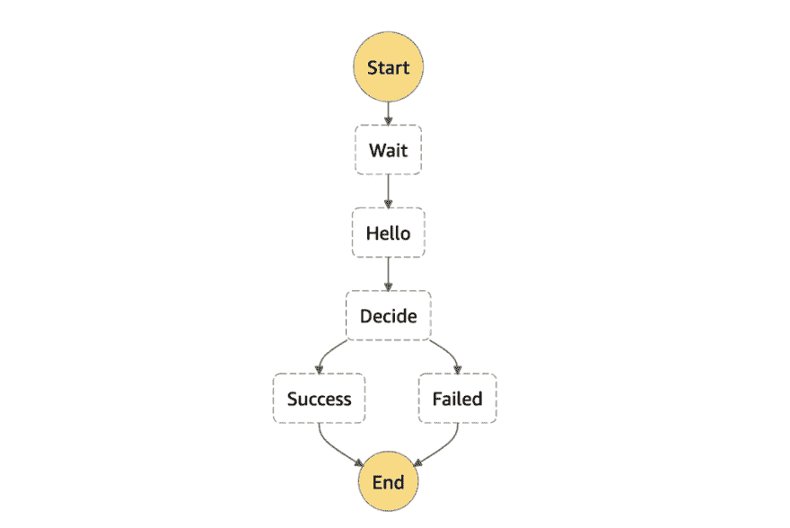](https://res.cloudinary.com/practicaldev/image/fetch/s--YujhWIvV--/c_limit%2Cf_auto%2Cfl_progressive%2Cq_auto%2Cw_880/https://theburningmonk.com/wp-content/uploads/2019/08/img_5d4cc2eb55c5b.png)

`hello`函数每次只返回“批准”。

```
module.exports.hello = async () => { 
  return "Approved"
} 
```

第 2 天，我们需要将“批准”更改为“拇指支持”，我们不再需要等待 5 分钟才能给出评级。

所以我们更新 hello 函数返回“ThumbsUp”。

```
module.exports.hello = async () => { 
  return "ThumbsUp"
} 
```

并且我们相应地更新状态机定义:

```
StartAt: Hello
States:  
  Hello:
    Type: Task
    Resource: arn:aws:lambda:us-east-1:123456789012:function:hello
    Next: Decide
  Decide:
    Type: Choice
    Choices:
      - Variable: $
        StringEquals: ThumbsUp
        Next: Success
    Default: Failed
  Success:
    Type: Succeed
  Failed:
    Type: Fail 
```

现在是时候部署更新了。

哦，等等！已经有一个正在运行的执行。如果我们部署更新，这个执行会发生什么？

[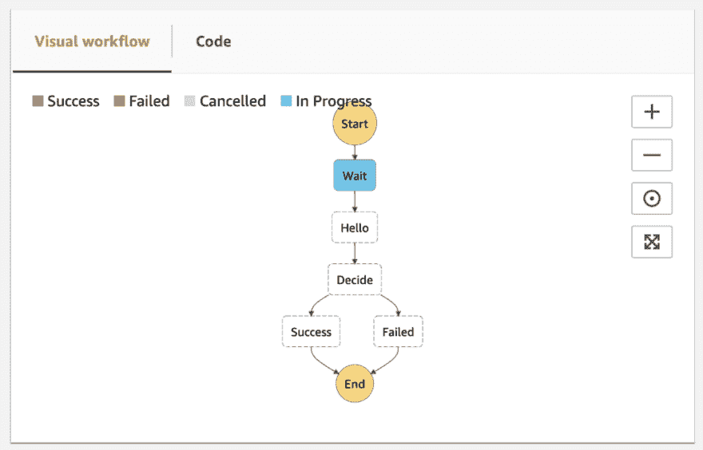](https://res.cloudinary.com/practicaldev/image/fetch/s--2gbAirCR--/c_limit%2Cf_auto%2Cfl_progressive%2Cq_auto%2Cw_880/https://theburningmonk.com/wp-content/uploads/2019/08/img_5d4cc30a33a95.png)

好消息是，对状态机定义的更改不会影响正在运行的执行的状态机定义。现有的执行将继续与他们的原始设计。

坏消息是，它所依赖的其他一切都可能发生变化。其中包括它需要调用的 Lambda 函数及其 IAM 角色。在我们的例子中，当现有的执行最终调用`hello`函数时，它不会收到“批准”消息。因此，由于对`hello`函数的改变，它将转换到`Failed`状态。

[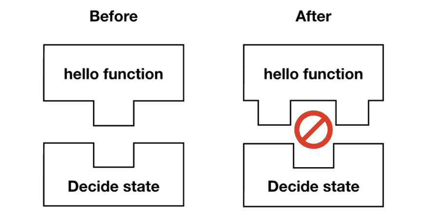](https://res.cloudinary.com/practicaldev/image/fetch/s--iw4a7_Jh--/c_limit%2Cf_auto%2Cfl_progressive%2Cq_auto%2Cw_880/https://theburningmonk.com/wp-content/uploads/2019/08/img_5d4cc322e484e.png)

相反，我们可以将现有的执行绑定到创建它们时使用的`hello`函数的版本上吗？

### 解

通过将版本号或别名附加到函数的 ARN，可以调用函数的特定版本或别名。例如，`hello`函数的版本 2 在`arn:aws:lambda:us-east-1:123456789012:function:hello:2`。

由于版本是不可变的，我们可以确保现有的执行将总是针对我们代码的正确版本运行。

我们还需要确保状态机的 IAM 角色拥有必要的权限。因为所有当前和未来的执行将共享相同的角色(这是另一个问题……)，所以最好对所有版本授予`lambda:InvokeFunction`权限。比如:

```
Effect: Allow
Action: lambda:InvokeFunction
Resource:
  - arn:aws:lambda:us-east-1:123456789012:function:hello
  - arn:aws:lambda:us-east-1:123456789012:function:hello:* 
```

好了，让我们来看看实际情况。我发布了一个演示项目，你可以在 GitHub 上查看源代码[这里](https://github.com/theburningmonk/step-functions-bluegreen-deploy-demo)。

### 试玩

使用无服务器框架，不容易找到功能版本。因为`AWS::Lambda::Version`资源有随机的逻辑 id。

[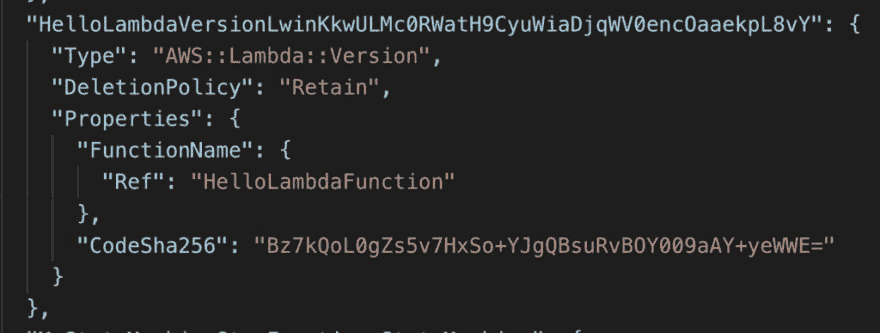](https://res.cloudinary.com/practicaldev/image/fetch/s--DwvHahiM--/c_limit%2Cf_auto%2Cfl_progressive%2Cq_auto%2Cw_880/https://theburningmonk.com/wp-content/uploads/2019/08/img_5d4cc3730399f.png)

因此，我**选择在 [**无服务器 aws 别名**](https://www.npmjs.com/package/serverless-aws-alias) 插件的帮助下使用别名**。

我们代码的第一个版本是用别名`v1`发布的，使用`sls deploy --alias v1`(无服务器 aws-alias 插件给你的)。

我可以使用`${opt:alias}`捕获 CLI 选项`alias`。

[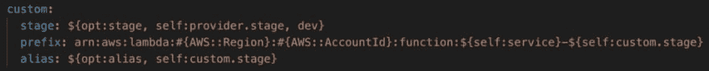](https://res.cloudinary.com/practicaldev/image/fetch/s--LNQ8C3lN--/c_limit%2Cf_auto%2Cfl_progressive%2Cq_auto%2Cw_880/https://theburningmonk.com/wp-content/uploads/2019/08/img_5d4cc387e59d5.png)

这让我像这样为别名构造 ARN。

[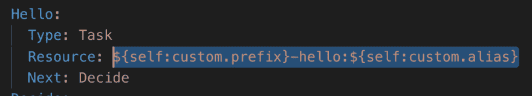](https://res.cloudinary.com/practicaldev/image/fetch/s--N8TDbYQF--/c_limit%2Cf_auto%2Cfl_progressive%2Cq_auto%2Cw_880/https://theburningmonk.com/wp-content/uploads/2019/08/img_5d4cc39a0a3ff.png)

如前所述，我还必须定义一个定制的 IAM 角色，以确保状态机有权调用`hello`函数的所有别名。

[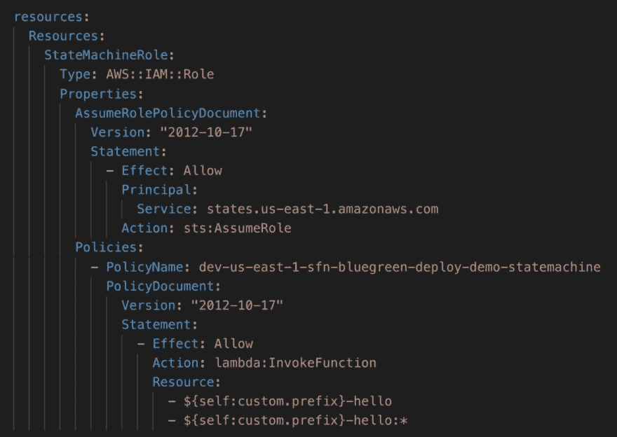](https://res.cloudinary.com/practicaldev/image/fetch/s--zg9sDsa6--/c_limit%2Cf_auto%2Cfl_progressive%2Cq_auto%2Cw_880/https://theburningmonk.com/wp-content/uploads/2019/08/img_5d4cc3b31a7b2.png)

一旦部署，状态机定义将引用正确的资源 ARN。

[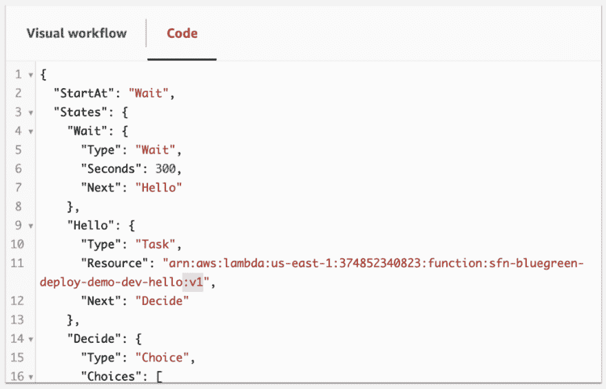](https://res.cloudinary.com/practicaldev/image/fetch/s--pZRZsjuB--/c_limit%2Cf_auto%2Cfl_progressive%2Cq_auto%2Cw_880/https://theburningmonk.com/wp-content/uploads/2019/08/img_5d4cc3d472827.png)

我会开始执行状态机。初始的`Wait`状态给我 5 分钟来更新状态机和`hello`功能！

[](https://res.cloudinary.com/practicaldev/image/fetch/s--zFT9_U6C--/c_limit%2Cf_auto%2Cfl_progressive%2Cq_auto%2Cw_880/https://theburningmonk.com/wp-content/uploads/2019/08/img_5d4cc3e8f4230.png)

现在快速切换到`v2`分支，运行`sls deploy --alias v2`来部署更新。现在，`hello`函数将返回`ThumbsUp`，状态机也被更新了。

部署完成后，请注意，`Hello`状态的`Resource` ARN 现在指向了`v2`别名。并且`Decide`状态现在正在寻找字符串值`ThumbsUp`而不是`Approved`。

[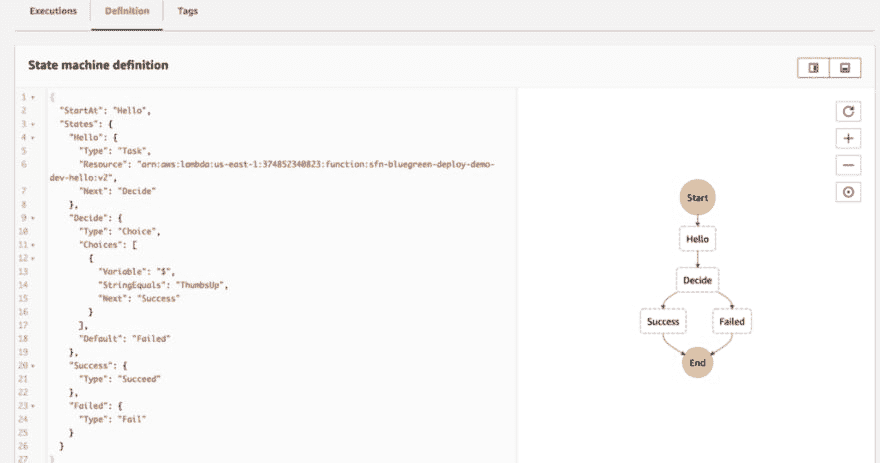](https://res.cloudinary.com/practicaldev/image/fetch/s--cd9HTeGk--/c_limit%2Cf_auto%2Cfl_progressive%2Cq_auto%2Cw_880/https://theburningmonk.com/wp-content/uploads/2019/08/img_5d4cc3fcddd46.png)

如果我们开始另一个执行，它将立即成功完成。

[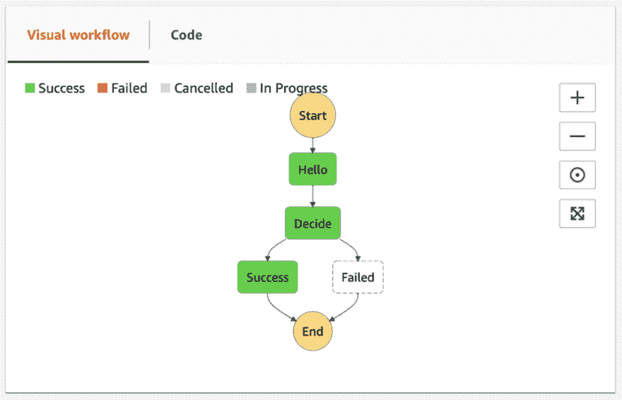](https://res.cloudinary.com/practicaldev/image/fetch/s--D-srfvBX--/c_limit%2Cf_auto%2Cfl_progressive%2Cq_auto%2Cw_880/https://theburningmonk.com/wp-content/uploads/2019/08/img_5d4cc4112ea5c.png)

但是如果我们回到步骤函数控制台，我们可以看到第一次执行仍然在运行，因为是原始的`Wait`状态。

[](https://res.cloudinary.com/practicaldev/image/fetch/s--5eXEnIkm--/c_limit%2Cf_auto%2Cfl_progressive%2Cq_auto%2Cw_880/https://theburningmonk.com/wp-content/uploads/2019/08/img_5d4cc4252117c.png)

一段时间后，执行从`Wait`状态出来，并转换到`Hello`状态，在那里它仍然在寻找`Approved`的字符串值。但是由于状态调用了`hello`函数的`v1`别名，所以一切仍按预期运行。

[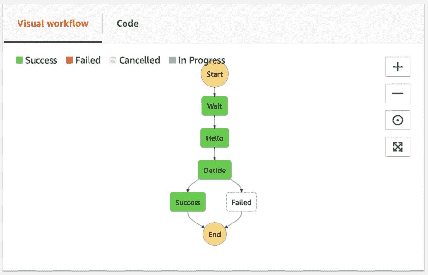](https://res.cloudinary.com/practicaldev/image/fetch/s--ZQ3ZnFky--/c_limit%2Cf_auto%2Cfl_progressive%2Cq_auto%2Cw_880/https://theburningmonk.com/wp-content/uploads/2019/08/img_5d4cc439a8318.png)

尽管我们更改了`hello`函数的返回值，但两次执行都成功完成。

[](https://res.cloudinary.com/practicaldev/image/fetch/s--xat9zYn6--/c_limit%2Cf_auto%2Cfl_progressive%2Cq_auto%2Cw_880/https://theburningmonk.com/wp-content/uploads/2019/08/img_5d4cc44ddc712.png)

### 未来作品

与版本不同，别名不是不可变的。在当前的设置下，你仍然需要记住每次你引入一个突破性的改变时增加别名。

这是我们可以在工具中解决的问题。我已经为[无服务器步进功能](https://github.com/horike37/serverless-step-functions)插件打开了一个[功能请求](https://github.com/horike37/serverless-step-functions/issues/240)。请让我知道你是否认为把这种行为加入插件是个好主意。我希望在未来几天/几周内找到时间实现这个特性，除非有强烈的反对意见。

[](https://res.cloudinary.com/practicaldev/image/fetch/s--Bk6FK0kn--/c_limit%2Cf_auto%2Cfl_progressive%2Cq_auto%2Cw_880/https://theburningmonk.com/wp-content/uploads/2019/03/img_5c8ca195210d5.png)

嗨，我的名字是**崔琰**。我是一个 **[AWS 无服务器英雄](https://aws.amazon.com/developer/community/heroes/yan-cui/)** 和 [**量产无服务器**](https://bit.ly/production-ready-serverless) 的作者。我已经在 AWS 中运行了近 10 年的大规模生产工作负载，我是一名架构师或首席工程师，涉足从银行、电子商务、体育流媒体到移动游戏等多个行业。我目前是一名专注于 AWS 和无服务器的独立顾问。

你可以通过[邮箱](//mailto:theburningmonk.com)、[推特](https://twitter.com/theburningmonk)和 [LinkedIn](https://www.linkedin.com/in/theburningmonk/) 联系我。

雇用我。

帖子[如何为步骤功能](https://theburningmonk.com/2019/08/how-to-do-blue-green-deployment-for-step-functions/)做蓝绿调配最早出现在 theburningmonk.com 的[上。](https://theburningmonk.com)

[](https://res.cloudinary.com/practicaldev/image/fetch/s--bPBfBfmS--/c_limit%2Cf_auto%2Cfl_progressive%2Cq_auto%2Cw_880/http://feeds.feedburner.com/%257Er/theburningmonk/%257E4/PGvPTHepwQ0)