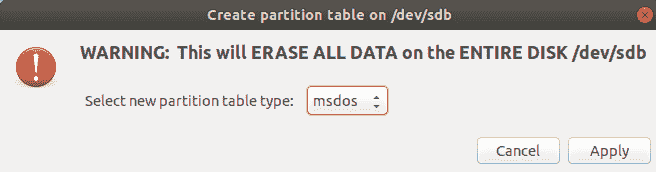
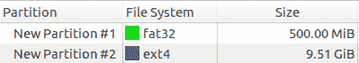

# 如何轻松地将 Linux 安装克隆到另一台机器上

> 原文：<https://dev.to/nikvdp/how-to-easily-clone-a-linux-installation-to-another-machine-2pbl>

将一个 Linux 安装从一台机器转移到另一台机器实际上相对容易，但是网上没有多少文章介绍整个过程。不像其他操作系统(我在看你的 Windows ), Linux 在默认情况下与其运行的硬件是相当不耦合的。也就是说，仍然有一些问题需要注意，尤其是在配置引导程序的时候。这篇文章将带您了解整个过程，并假设您只有很少的 Linux 经验:如果您熟悉基本的 shell 命令，您应该能够理解。

由于想要克隆一个系统有许多不同的原因，我们将着重于实际了解每个步骤在做什么，以便您可以将我所描述的内容应用到您的情况中。虽然我假设您在这里使用的是物理机，但是这个过程同样适用于虚拟机，无论是通过 VirtualBox 之类的东西在本地运行，还是由 Amazon AWS 之类的云提供商提供的虚拟机。如果您发现自己需要从一个云提供商转移到另一个，您可以调整本指南中的步骤来实现这一点，只是要记住，在云虚拟机上启动到 livecd 可能很困难，因此您可能需要将两个硬盘连接到虚拟机上——一个安装了全新的 Ubuntu，可以充当您的“livecd ”,一个空的硬盘将用作恢复目标。

我列出了克隆系统的命令，并做了最少的解释，作为参考。如果您熟悉 Linux，您也许能够运行这些命令，根据需要进行调整以适应您的情况。如果你想了解更多的细节，请继续阅读，我们将在下面详细讨论每个命令的作用(以及为什么需要它)。

1.  将源驱动器绑定到一个新位置，这样我们就不会在复制`/dev/zero`时陷入无限复制循环。：

    ```
    mount --bind / /mnt/src 
    ```

2.  `tar`打开源文件系统:

    ```
    tar -C /mnt/src -c . > source-fs.tar 
    ```

    并将结果`source-fs.tar`复制到一个 USB 驱动器或网络共享上，您可以从目标机器上访问它。

3.  在 dest 机器上从 live-cd 启动(我用的是 Ubuntu 安装盘)

4.  对目标机器上的驱动器进行分区。最简单的方法是使用`gparted`(包含在 Ubuntu live-cd 中)。根据您希望使用 MBR 还是 EFI 模式，您的分区方式会有所不同:

    **MBR 模式**:在你的目标驱动器上创建一个大的 ext4 分区，使用`gparted`的“管理标志”右键菜单添加`boot`标志

    **EFI 模式**:创建一个 200-500MB vfat/fat32 分区(使用`gparted`的‘管理标志’右键菜单添加`boot`和`esp`标志)，在剩余空间创建一个 ext4 分区。

5.  一旦引导到 live-cd，挂载您的目标文件系统。我在`~/dest`装上我的。

    ```
    mount /dev/<some-disk> ~/dest 
    ```

6.  使用`tar`将您的映像提取到目标文件系统中，(使用`pv`提供一个进度表，因为这可能需要一段时间):

    ```
    pv < [image-file] | tar -C ~/dest -x 
    ```

7.  `chroot`到新提取的文件系统中

    ```
    cd ~/dest
    for i in /dev /dev/pts /proc /sys /run; do sudo mount --bind $i .$i; done
    mkdir -p ./boot/efi  # skip if using MBR mode
    sudo mount /dev/<your-efi-partition> ./boot/efi  # skip if using MBR mode
    sudo chroot . 
    ```

8.  从 chroot 内部运行`grub-install`:

    ```
    apt install grub-efi-amd64-bin       # skip if using MBR mode
    grub-install /dev/<your-boot-drive>  # use the whole drive (e.g. sda, not sda1) 
    ```

# 步骤 1:绑定挂载根文件系统

我们运行的第一个命令是`mount --bind / /mnt/src`。在 Linux-land 中，通过将文件系统挂载到一个路径(通常在`/media`或`/mnt`下)来访问它们。这里我们使用一种叫做绑定挂载的东西，它允许您将一个挂载点“绑定”到另一个挂载点。换句话说，您可以在两个位置访问同一个文件夹。在这个例子中，我们告诉系统让`/`文件夹在`/mnt/src`也可用。如果你写一个文件到`/test-file`，你会看到它在`/mnt/src/test-file`也是可用的。

你会问为什么需要这样做？嗯，当 Linux 系统启动时，它会创建一些虚拟文件系统，许多 Linux 程序都依赖这些系统。其中一个比较常用的是`/dev`文件夹，这是 Linux 对安装在系统中的物理硬件进行寻址的方式。尽管`/dev`文件夹中的文件不是真正的文件，所以将它们复制到另一个系统是没有意义的——那个系统将有它自己的`/dev`,反映它自己的硬件。对于我们当前的目的来说，更重要的是，`/dev`还包含一些特殊的“文件”,比如`/dev/zero`,它返回无限多的零，这比我们任何人复制无限多的零都要花更多的时间。

将`/`绑定到`/mnt/src`允许我们回避这个问题:这个系统的`/dev`将仍然存在于`/dev`中，但是你不会找到相应的`/mnt/src/dev/zero`文件夹，所以从`/mnt/src`复制可以避免开始一个无限长的复制过程。

# 第二步:`tar`启动源文件系统

现在我们已经绑定安装了文件系统，可以开始准备我们的映像了。这里我们真正需要做的是将根文件系统的内容(不包括特殊的文件系统，如`/dev`)保存到一个 tar 归档文件:

```
tar -C /mnt/src -c . > source-fs.tar 
```

`-C`标志告诉`tar`将目录更改为`/mnt/src`，`-c`告诉 tar 使用“创建”模式(比如，创建一个 tar 存档，而不是提取一个)，`.`告诉它在当前目录中这样做(由于我们的`-C`标志，现在是`/mnt/src`)。然后，我们通过符号`>`使用 shell 重定向将输出写入文件`source-fs.tar`。**确保`source-fs.tar`不在您从**复制的同一个驱动器上，否则您可能会启动另一个无限循环！

> **注意:**在这个例子中，我只是将映像写到一个文件中，但是如果你愿意，你也可以通过网络将文件系统直接传输到另一台机器上。最常见的方法是使用`ssh`和一个壳管，如下所示:
> 
> ```
> tar -C /mnt/src -c . | \
>   ssh <some-other-machine> 'tar -C <some-folder-on-the-other-machine> -x' 
> ```
> 
> 它使用一个 shell 管道将`tar`的输出发送到 ssh 命令，ssh 命令负责建立到另一台机器的加密连接，然后在另一台机器上运行`tar -C <some-folder-on-the-other-machine> -x`，将远程机器上`tar`的 stdin 连接到发送机器上`tar`的 stdout。

# 步骤 3:在 dest 机器上从 live-cd 引导

在目标机器上(我们希望将我们的系统*克隆到*的机器)，我们需要启动一个不在系统主硬盘上运行的操作系统，这样我们就可以将克隆的映像写入新的硬盘。我通常只是从 [Ubuntu 网站](https://ubuntu.com/download/desktop)网站抓取最新的 Ubuntu live-cd，并通过 [Etcher](https://www.balena.io/etcher/) 或`dd`命令将其写入 USB。Ubuntu 在这里提供了如何准备 Ubuntu LiveUSB [的指导。](https://tutorials.ubuntu.com/tutorial/tutorial-create-a-usb-stick-on-ubuntu)

如果你不喜欢 Ubuntu，任何 Linux livecd 都可以，只要确保它有一个分区工具，如`gparted` (gui)或`fdisk` (cli)。

# 第四步:对目标机器上的驱动器进行分区

这就是事情开始变得有点棘手的地方。**有两种引导 Linux 系统的常见方法，MBR(一种较老的方法)或 EFI(一种较新的方法)，每种方法都有不同的分区要求。**如果可能的话，你会希望使用 EFI，但是如果你有一台不支持 EFI 模式的旧机器，你可能需要使用 MBR。检查一台机器是否支持 EFI 模式的最简单方法是启动 Ubuntu livecd 并检查一个名为`/sys/firmware/efi`的目录是否存在:

```
$ ls /sys/firmware
acpi  devicetree  dmi  efi  memmap 
```

如果`/sys/firmware`中没有`efi`文件夹，那么你是在 MBR 机器上。如果有一个`efi`文件夹，那么你在一台 EFI 机器上，我们需要创建一个 EFI 分区和一个根分区。

从 Ubuntu livecd 打开一个终端，启动我们要分区的驱动器上的 [gparted](http://TODO) :

```
sudo gparted 
```

使用左上角的选择器，选择要还原到的驱动器。在我的系统上，这是`/dev/nvme0n1`，但是根据你机器的硬件，你可能有不同的名称，比如`/dev/sda`。

一旦选择了驱动器，从设备菜单中选择`Device -> Create Partition Table`。你会看到一个可怕的屏幕，如下所示:

[](https://res.cloudinary.com/practicaldev/image/fetch/s--C9Fcwr7r--/c_limit%2Cf_auto%2Cfl_progressive%2Cq_auto%2Cw_880/https://thepracticaldev.s3.amazonaws.com/i/yovh4hv1ddxw9tbmyppg.png)

确保您在这里选择了正确的驱动器，因为正如上面的窗口所示，只要您点击【应用】T0，就会删除该驱动器上的所有内容。

因为 MBR 方法是 MS-DOS 历史上装载自己的方式，一些工具(包括 gparted)将 MBR 分区布局称为`msdos`。如果您的系统是 MBR 系统，那么保持不变，否则从列表中选择`gpt`,因为 GPT 是使用 EFI 的硬盘布局。对于本步骤的其余部分，我们将继续进行基于 EFI 的安装。如果您正在进行 MBR 安装，那么您可以跳过创建 EFI 分区部分。

在下一个屏幕中，我们将需要创建两个分区，一个大约 500MB 的 EFI 分区(如果您需要节省空间，这个分区可以更小，但如果它小于 200MB，可能会损坏)和第二个分区，以填充驱动器的剩余部分。第二个分区是我们将克隆恢复到的分区。

让我们从创建 EFI 分区开始。使用菜单选择`Partition -> New`，在随后的屏幕中将大小设置为 500MB，将文件系统设置为`fat32`，这是 EFI 需要的文件系统类型。对第二个分区重复这个过程，但是这次不要输入大小，选择 ext4 作为文件系统类型。

完成后，您的分区布局应该类似于下图:

[](https://res.cloudinary.com/practicaldev/image/fetch/s--qMMVuwRl--/c_limit%2Cf_auto%2Cfl_progressive%2Cq_auto%2Cw_880/https://thepracticaldev.s3.amazonaws.com/i/s487gwrc0gqgp0rj44cv.png)

继续使用`Edit -> Apply all Operations`菜单写入新的分区表。一旦完成，我们必须设置一些分区标志，使驱动器正确启动。为此，右键单击第一个 fat32 分区并选择“管理标志”。点击`boot`旁边的复选标记(也可以自动检查‘esp’标志)并点击关闭。

记录设备名称(它们将显示在分区列中，名称以`/dev/`开头),因为下一步需要它们。

# 步骤 5:挂载目标文件系统

此时，我们的目标系统已经准备好，我们准备将映像恢复到这台机器上。在我们对新的硬盘布局做任何事情之前，我们需要安装它。

如果你还没有进入 Ubuntu livecd，重新启动，打开一个终端窗口。我们将首先创建一个挂载点(一个空目录)，在这里我们将挂载两个驱动器。我用的是`~/efi`和`~/dest`

```
mkdir ~/efi
mkdir ~/dest 
```

然后将驱动器安装到它们上面。在我的系统上，我进行分区的驱动器是`/dev/sdb`，所以我的 EFI 和数据分区分别是`/dev/sdb1`和`/dev/sdb2`。您的系统可能会分配不同的标识符，请确保使用`Partition`栏中的`gparted`所示的名称:

```
mount /dev/sdb1 ~/efi
mount /dev/sdb2 ~/dest 
```

# 第 6 步:使用`tar`将您的映像解压到目标文件系统

现在我们已经设置好了所有的挂载点，我们可以执行与步骤 2 相反的映像创建过程，将源机器的文件系统复制到新机器上。由于这可能需要一段时间，我喜欢使用一个叫做`pv` (pv 代表管道查看器)的工具来提供一个进度表。做`sudo apt update && sudo apt install pv`就可以安装`pv`。

一旦安装了`pv`，我们就可以开始恢复过程了。首先，想办法让 Ubuntu livecd 访问我们在步骤 2 中创建的源图像。这很可能意味着将 USB 驱动器插入机器。一旦您可以访问映像文件，运行下面的命令，用您的源 tar 文件的路径替换`[image-file]`:

```
pv < [image-file] | tar -C ~/dest -x 
```

上面的命令是获取`[image-file]`的内容并通过 stdin 发送给`pv`。`pv`从文件中读取数据，打印出一个漂亮的进度表，然后通过一个 shell 管道(符号为`|`)将它读取的数据发送给`tar`。`-C`然后告诉`tar`首先将目录更改为`~/dest`(在上一步中我们在那里挂载了目标分区)，然后`-x`告诉`tar`以提取模式运行。

这可能需要一段时间，但当该过程完成时，您将已经将原来位于源计算机上的所有文件完全恢复到新计算机上。获得文件只是成功的一半，然而，我们仍然需要告诉 Linux 如何引导到这个文件系统，这将在下一步中完成。

# 第七步:`chroot`进入新解压的文件系统安装 bootloader

此时，我们已经在新系统上拥有了所有需要的文件，但是我们需要使新系统可引导。最简单的方法是借用 Ubuntu livecd 的内核，并使用`chroot`命令让我们当前的 Linux 安装(Ubuntu livecd)假装是我们刚刚复制到新机器上的安装。

为了做到这一点，我们必须再次使用我们的好朋友`mount --bind`来做与第一步相反的事情。这一次，我们并没有避免复制这些特殊的文件系统，而是想让这个`chroot`ed 的安装临时访问我们的 Ubuntu livecds 创建的特殊文件系统，这样它就可以作为一个功能性的 Linux 安装。

首先，将目录更改为新安装的挂载位置(如果您遵循了上面的示例，则为`~/dest`):

```
cd ~/dest 
```

然后我们将使用`mount ---bind`给予 chroot 访问 linux 特殊目录的权限:

```
for i in /dev /dev/pts /proc /sys /run; do sudo mount --bind $i .$i; done 
```

> **注意:**我们在这里使用了一个`for`循环来节省一些输入，但是上面的行只是告诉系统为在`in`和`;`之间列出的每个特殊目录运行命令`sudo mount --bind <input-dir> ./<input-dir>`。换句话说，上面的单行代码相当于运行下面的代码:
> 
> ```
> sudo mount --bind /dev ./dev
> sudo mount --bind /dev/pts ./dev/pts
> sudo mount --bind /proc ./proc
> sudo mount --bind /sys ./sys
> sudo mount --bind /run ./run 
> ```

如果在 EFI 模式下安装，我们还需要让 chroot 访问我们之前挂载的 EFI 分区。`mount --bind`这里又来了，我们简单地将 livecd 挂载点绑定到 chroot 内的`/boot/efi`目录中(`/boot/efi`是 grub 期望找到 EFI 分区的地方)。

```
cd ~/dest
mkdir -p boot/efi 
mount --bind ~/efi boot/efi 
```

现在我们已经可以访问 Linux 特殊文件夹(和 EFI 分区)，我们可以使用`chroot`命令来实际使用我们的源安装:

```
sudo chroot ~/dest 
```

此时，您应该在最初复制的同一个 Linux 环境中拥有一个 shell。尝试运行一些程序或查看一些来自旧机器的文件。GUI 程序可能无法正常工作，但除此之外，您应该拥有旧安装的完整功能副本。每次你想使用这台机器的时候，引导到 Ubuntu livecd 并运行上面的`chroot`命令是不太实际的，所以下一步我们将安装 grub 引导装载程序，使它成为一个完全可引导的 Linux 系统。

# 第 8 步:从 chroot 内部运行`grub-install`

Grub 是最常见的 Linux 引导装载程序，我们将在这里使用它。Grub 有 MBR 风味和 EFI 风味。如果您克隆的机器运行的是 Ubuntu，它很可能已经安装了 grub，但可能没有安装 grub 的 EFI 版本。运行以下命令来安装 EFI 版本(如果您正在进行 MBR 克隆，请随意跳过):

```
apt install grub-efi-amd64-bin  # skip if using MBR mode 
```

如果你的源发行版不是基于 Ubuntu 的，确保首先通过发行版的包管理器完全安装 grub。

一旦你完全安装了 grub，你只需要在你安装的驱动器上运行`grub-install`。在我的例子中是`/dev/sdb`，但是在你的机器上可能会有所不同。如果不确定，就像我们在第 4 步中做的那样启动`gparted`，检查分区栏中列出的名字。

接下来，我们将 grub 安装到我们的驱动器，从而使其可引导。小心将 grub 安装到一个**驱动器**而不是一个分区。分区通常在末尾有一个数字，而驱动器通常以字母结尾(例如`/dev/sdb`，而不是`/dev/sdb1`)。

```
grub-install /dev/sdb
update-grub 
```

如果一切顺利，您将会看到 grub 安装成功的消息。当你看到这个的时候，你可以重新启动并检查你新克隆的安装。

如果你得到错误信息，并且在 EFI 模式下安装，grub 可能试图使用 MBR 模式。以这种方式运行`grub-install`来强制 EFI 模式:
可能值得一试

```
grub-install --target=x86_64-efi 
```

# 包装完毕

就这样，此时您应该有了原始系统的完全可操作的克隆，并且希望对克隆过程中的每个步骤以及为什么需要它有一个坚实的理解。一旦您意识到 Linux 安装实际上只是一个文件系统和一个引导它的机制，像 docker 这样的工具就开始变得更有意义了:docker 映像基本上只是我们在这里创建的`tar`映像的花哨版本，做了一些更改来处理 Docker 层并使映像文件更容易分发。

事实上，正如我们能够在使系统可引导之前“运行”我们通过`chroot`安装的系统一样，您可以非常容易地将我们创建的 tar 映像转换成 docker 容器:

```
docker import [image-file] 
```

99%的情况下，您最好只使用一个`Dockerfile`和 docker 自己的工具来构建您的映像，但是如果您需要一种快速而肮脏的方式来“对接”一个现有的服务器，您甚至不必关闭现有的服务器就可以做到这一点！

类似地，`docker export`命令可以导出一个 tarball，就像我们为任何 docker 图像创建的 tarball 一样。一旦你提取了它，你就可以使用我们上面做的相同的`mount --bind`和`chroot`舞蹈来在“容器”里得到一个壳如果您想变得有点疯狂，您甚至可以使用本指南中的步骤将从 docker 映像导出的 tarball 恢复到物理机上，并在裸机上运行它。在现实生活中，这并不适用于许多/大多数 docker 映像，因为(出于节省空间的原因)许多 docker 映像去掉了一些支持物理引导所需的文件，所以如果你在现实生活中尝试这样做，你可能会自找麻烦。