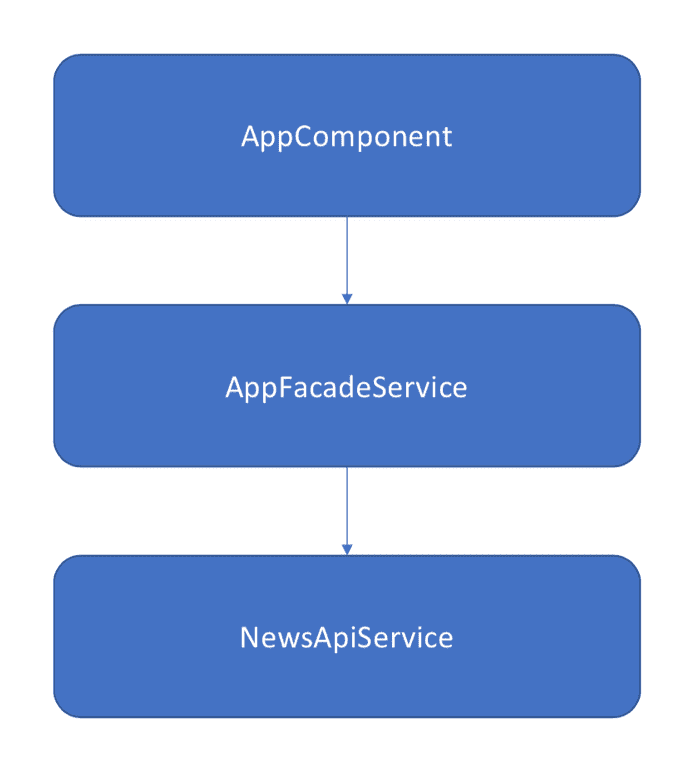
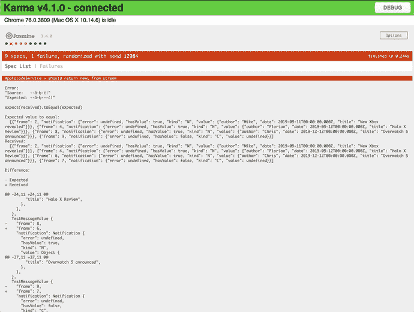

# 如何轻松编写和调试 RxJS Marble 测试

> 原文：<https://dev.to/mokkapps/how-to-easily-write-and-debug-rxjs-marble-tests-55jc>

2018 年底，我写了一篇文章，讲述我如何用 Angular 编写 RxJS 可观测量的大理石测试。那里的内容仍然有效，但我最近发现了一个我喜欢的新库，它使调试 marble 测试更加容易。

如果你还不知道 RxJS 大理石测试，那么我建议你先阅读一下我的文章，它涵盖了基础知识。

作为快速补充，以下示例显示了一个弹球图，可在测试中用于表示可观察值:

```
const obs = `-a-^-b--|`;
// 012345`, emits 'b' on frame 2, completes on 5 - hot observable ^ represents when the subscription started 
```

Enter fullscreen mode Exit fullscreen mode

在这篇文章中，我想谈谈 rx 沙箱，它是 RxJS 6 的基于大理石图 DSL 的测试套件。如果您的应用程序需要，它还支持 1.x 之前版本的 RxJS 5。

# 为什么是 rx-sandbox？

我在寻找调试 marble 测试的更好方法时发现了这个库，因为使用 [jasmine-marbles](https://github.com/synapse-wireless-labs/jasmine-marbles) 库:
不可能看到这样的测试输出

```
Error: + Source: "--x-x--|" - Expected: "---x-x--|" 
```

Enter fullscreen mode Exit fullscreen mode

在我看来，这是对测试中出现的问题的一种简单易懂的表述。

该库还有其他一些不错的特性:

*   不依赖于特定的测试框架
*   接近零的配置，开箱即用
*   支持扩展大理石图 DSL
*   向 TestScheduler 提供功能奇偶校验

## 你好世界举例

这是一个简单的例子，使用来自官方 GitHub 库 :
的 rx-sandbox 进行弹球测试

```
import { expect } from 'chai';
import { rxSandbox } from 'rx-sandbox';

it('testcase', () => {
  const { hot, cold, flush, getMessages, e, s } = rxSandbox.create();
  const e1 = hot(' --^--a--b--|');
  const e2 = cold(' ---x--y--|', {x: 1, y: 2});

  const expected = e(' ---q--r--|');
  const sub = s(' ^ !');

  const messages = getMessages(e1.merge(e2));

  flush();

  //assertion
  expect(messages).to.deep.equal(expected);
  expect(e1.subscriptions).to.deep.equal(sub);
}); 
```

Enter fullscreen mode Exit fullscreen mode

## 更现实的例子

由于事情通常比简单示例中的要复杂，我创建了一个项目[,其中包含一个更现实的场景](https://github.com/Mokkapps/angular-rx-sandbox-marble-diagram),采用了这个简单的架构:

[](///static/aeb5028c2ed16e9b4a0c5cdeefac2abf/0bd10/architecture.png)

演示应用程序包含这些服务:

*   `NewsApiService`:表示模拟 API 通信获取新闻的服务
*   `AppFacadeService`:在`AppComponent`和`NewsApiService`之间使用的 facade，用于处理通信和在 API 调用之上添加额外的功能

相关的大理石测试位于[app-facade . service . spec . ts](https://github.com/Mokkapps/angular-rx-sandbox-marble-diagram/blob/master/src/app/facade/app-facade.service.spec.ts)中。

### 创建测试实例

```
import { rxSandbox } from 'rx-sandbox';

import { AppFacadeService } from './app-facade.service';
import { NewsApiService, testData } from '../api/news-api.service';

describe('AppFacadeService', () => {
  let sut: AppFacadeService;
  let newsApiService: any;
  let rx: any;

  beforeEach(() => {
    // we need to create a sandbox for each test run 
    rx = rxSandbox.create();
    const { cold, hot } = rx;

    // we mock the API service and return mocked observables which are created by marble strings
    newsApiService = jasmine.createSpyObj('NewsApiService', [
      'fetchNews',
      'connectToNewsStream'
    ]);
    newsApiService.fetchNews.and.returnValue(
      cold('a', {
        a: testData
      })
    );
    newsApiService.connectToNewsStream.and.returnValue(
      hot('a-^-a-b-c|', {
        a: testData[0],
        b: testData[1],
        c: testData[2]
      })
    );

    // we create a new instance of the service and pass the mock service to its constructor
    sut = new AppFacadeService(newsApiService);
  });
}); 
```

Enter fullscreen mode Exit fullscreen mode

### 大理石试验

创建测试设置后，我们现在准备好进行第一个测试:

```
it('should return news from stream', () => {
    const { e, getMessages, flush } = rx;

    // create the expected observable by using marble string
    const expectedObservable = e('--a-b-c|', {
      a: testData[0],
      b: testData[1],
      c: testData[2]
    });

    // get metadata from observable to assert with expected metadata values
    const messages = getMessages(sut.connect());

    // execute observables
    flush();

    // When assertion fails, 'marbleAssert' will display visual / object diff with raw object values for easier debugging.
    marbleAssert(messages).to.equal(expectedObservable);
  }); 
```

Enter fullscreen mode Exit fullscreen mode

失败的测试将显示类似的输出:

[](///static/4c9e798c30eb7bac1593763eed0c2f5b/2fb56/rx-sandbox-karma-failure.png)

我们可以立即看到，接收到的可观测发射事件在不同的帧:

```
Error: 
"Source: --a-b-c|"
"Expected: --a-b---c|" 
```

Enter fullscreen mode Exit fullscreen mode

此外，框架可能是正确的，但从源和预期的可观测发射值不同。

每个事件的输出格式如下:

```
{
    "frame": 2, // at which frame the event occurred
    "notification": {
      "error": undefined, // any error information
      "hasValue": true, // true if there is a value
      "kind": "N", // type of the event, N: next, E: error, C: complete
      "value": { // content of the next event
        "author": "Mike", 
        "date": 2019-09-11T00:00:00.000Z, 
        "title": "New Xbox revealed"
      }
} 
```

Enter fullscreen mode Exit fullscreen mode

因此，您需要将这些值与收到的和预期的观察值进行比较。rx-sandbox 将为您打印一个 diff，以查看值的差异:

```
@@ -17,18 +17,18 @@
     "notification": Notification {
       "error": undefined,
       "hasValue": true,
       "kind": "N",
       "value": Object {
- "author": "Chris",
- "date": 2019-12-12T00:00:00.000Z,
- "title": "Overwatch 5 announced", + "author": "Florian",
+ "date": 2019-05-12T00:00:00.000Z,
+ "title": "Halo X Review",
       },
     },
   }, 
```

Enter fullscreen mode Exit fullscreen mode

## 结论

根据我的经验，大多数开发人员都很难解释 marble 测试的结果，因为像`jasmine-marbles`这样的库不能很好地可视化表示预期的和接收到的流。

`rx-sandbox`通过提供预期的&接收到的弹球串的可视化表示和更可读的值的差异来解决这个问题。此外，您可以在任何前端测试框架中使用该库。

请在评论中告诉我你对这个库的想法。