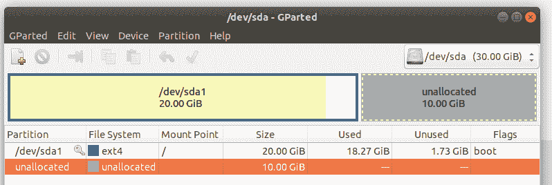
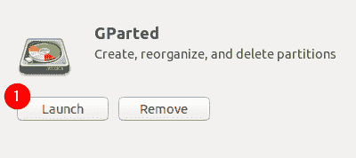
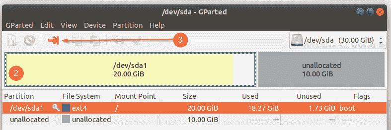
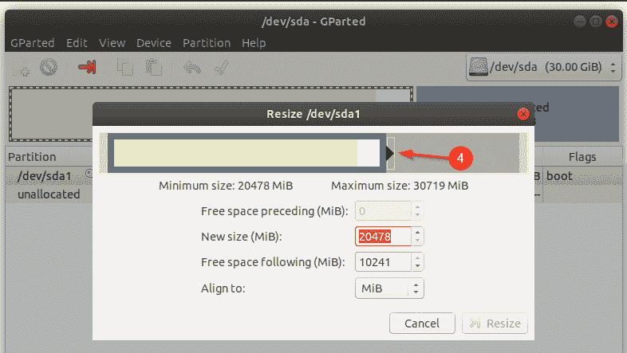
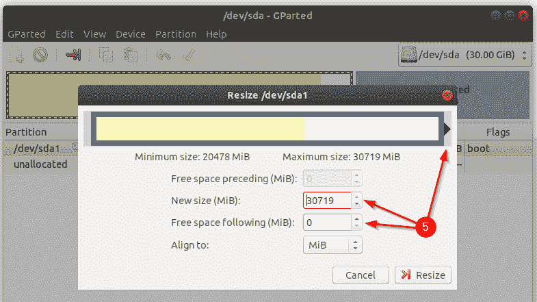
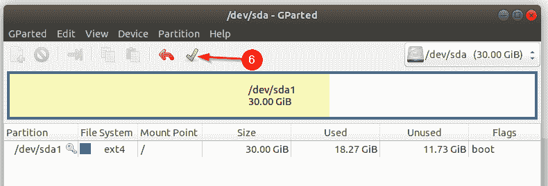
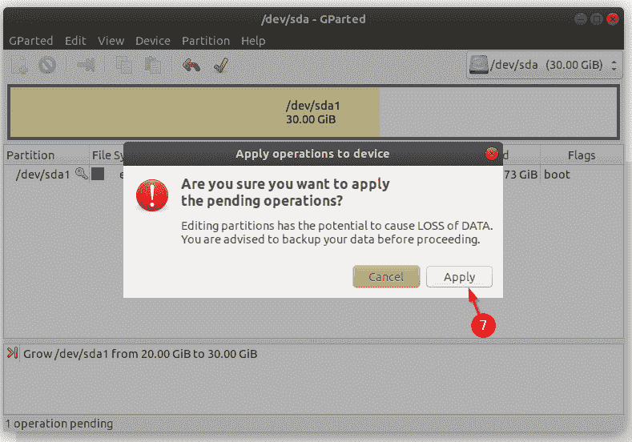
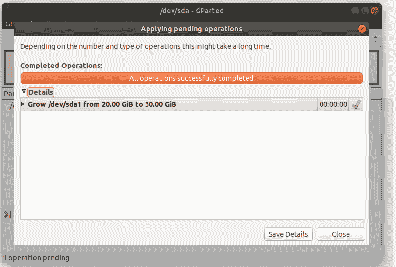

# 如何使用 GParted 扩展一个 Linux 分区？

> 原文：<https://dev.to/rishiabee/how-to-expand-a-linux-partition-using-gparted-31c3>

您的 Ubuntu 虚拟机存储空间不足，只需关闭它，并通过虚拟机管理程序设置分配更多的虚拟硬盘空间。

干得好！给虚拟机加电，看看你的成绩。

[](https://res.cloudinary.com/practicaldev/image/fetch/s--hyX1fKYO--/c_limit%2Cf_auto%2Cfl_progressive%2Cq_auto%2Cw_880/https://thepracticaldev.s3.amazonaws.com/i/e076smngq5z1nciv4z7i.png)

> 在这种情况下，虚拟机最初分配了 20GB，然后又增加了 10GB。

现在，您如何声称宝贵的 10GB？

1-打开`GParted`应用程序。
[](https://res.cloudinary.com/practicaldev/image/fetch/s--sCY2kZ5J--/c_limit%2Cf_auto%2Cfl_progressive%2Cq_auto%2Cw_880/https://thepracticaldev.s3.amazonaws.com/i/7pa1ddhb52t9jr9m1xaw.png)

> 或者，
> 通过 Ubuntu 软件管理器或命令行安装:

```
sudo apt-get install gparted 
```

2-选择您想要增长/增加的当前分区。
3-然后点击橙色箭头。
[](https://res.cloudinary.com/practicaldev/image/fetch/s--3J6tATRy--/c_limit%2Cf_auto%2Cfl_progressive%2Cq_auto%2Cw_880/https://thepracticaldev.s3.amazonaws.com/i/mmbdf1mqzz0w9ovbwtaf.png)

4-向右拖动滑块，选择所有未分配的空间。
[T3】](https://res.cloudinary.com/practicaldev/image/fetch/s--4pYd62ea--/c_limit%2Cf_auto%2Cfl_progressive%2Cq_auto%2Cw_880/https://thepracticaldev.s3.amazonaws.com/i/i0ivs9le8wyroyx4dudv.png)

5-确保你对字节数感到满意😄。
[T3】](https://res.cloudinary.com/practicaldev/image/fetch/s--W6YWAaQR--/c_limit%2Cf_auto%2Cfl_progressive%2Cq_auto%2Cw_880/https://thepracticaldev.s3.amazonaws.com/i/fj6dh2h5z7a5noneujso.png)

6-确认您的选择。
[T3】](https://res.cloudinary.com/practicaldev/image/fetch/s--bjjJNWPO--/c_limit%2Cf_auto%2Cfl_progressive%2Cq_auto%2Cw_880/https://thepracticaldev.s3.amazonaws.com/i/cis2dsyq7w9n5frdvv22.png)

7- ⚠️阅读警告信息，并在点击按钮前三思。
[T3】](https://res.cloudinary.com/practicaldev/image/fetch/s--AAHKRqls--/c_limit%2Cf_auto%2Cfl_progressive%2Cq_auto%2Cw_880/https://thepracticaldev.s3.amazonaws.com/i/04a4b4e92emycdo7tu3j.png)

8 工作完成！
[](https://res.cloudinary.com/practicaldev/image/fetch/s--orDbkLrS--/c_limit%2Cf_auto%2Cfl_progressive%2Cq_auto%2Cw_880/https://thepracticaldev.s3.amazonaws.com/i/9xrsgcpedyu8b81h1lqg.png)

## 哦，我忘记提了！在尝试这个微妙的过程之前，备份你所有的重要数据。已经通知你了。