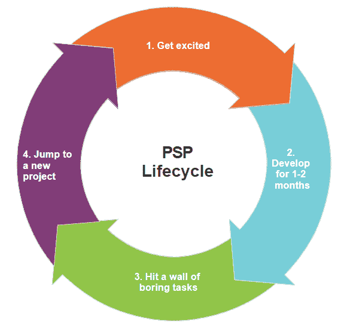
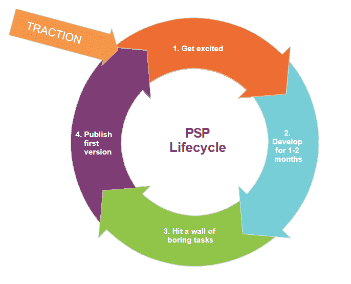
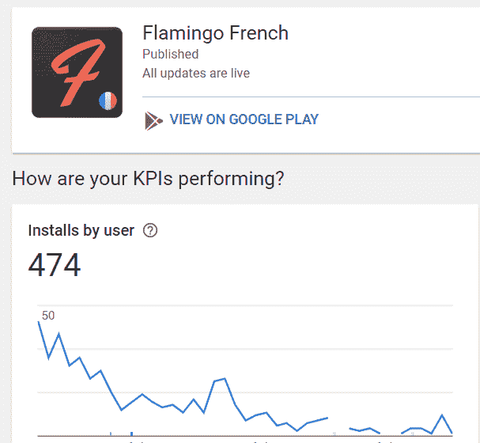
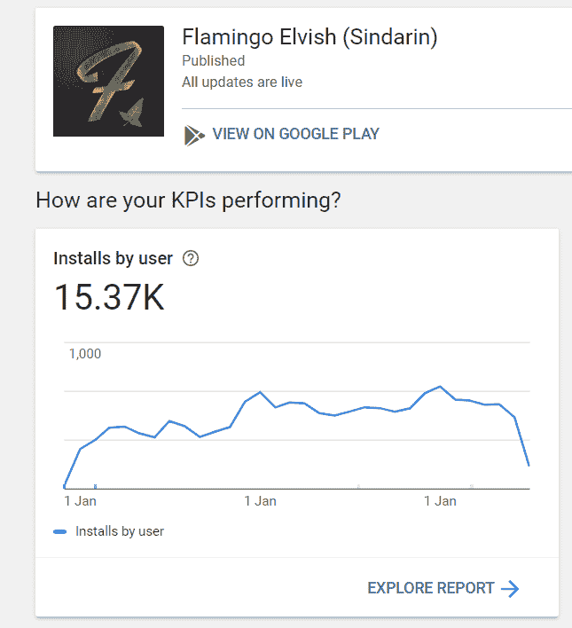
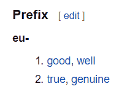

# 如何完成你的副业

> 原文：<https://dev.to/johnnymakestuff/how-to-finish-your-side-project-2ip6>

我读过一些关于兼职项目重要性的好帖子，我同意，它们很重要。也很有趣。
我想谈谈**完成**你的副业项目。我选择兼职的部分原因是我可以有更多的时间做我的副业。
我已经开始了许多项目。我实际上只完成了其中的一小部分。以下是我认为的不同之处。

## 定义

但首先，一些定义。

### PSP -个人端项目

*   个人——你是一个人做，还是和朋友一起做
*   兼职——你没有全职做这件事，如果是全职，也不是很长时间(如果你花了未来 5 年的时间来做这件事，那么这不是兼职，而是你的创业。)

### 【整理】

*   为了我们的目的，**完成**你的 PSP 是**发布一个工作版本**给人们使用。事实上，一个产品永远不会真正“完成”。应用程序不断变化和发展。你的产品可能会一炮而红，你会决定继续工作 10 年。或者你可能会释放它，然后意识到它一文不值。但对我们来说，整理是让人们开始使用它。

## 危险

突击测验:你的 PSP 面临的最大危险是什么？

*   a.成为一个糟糕的产品
*   b.设计糟糕
*   c.牵引力为 0
*   d.让你赚了这么多钱，你疯了

毫无疑问，所有真正的危险都存在，但我认为你的副业面临的真正危险是被 T2 抛弃。
为什么？因为你的时间、精力和*动力*有限。不管你现在有多热情，你的动力一定会减弱。完成的时间越长，你就越有可能放弃它。

> 你的副业面临的最大危险是**放弃**

## *为什么你应该完成你的项目*

但是我为什么要完成它呢？陶醉在创作的喜悦中还不够吗？当然，你会从你做的每一件事中学到很多，并且在这个过程中可能会有很多乐趣。但是我注意到，无论我在开发中获得了多少乐趣，一个未完成的项目都会冲击我的心灵。像一个未实现的梦。就像那个你以为喜欢你的女孩/男孩，而你从来没有采取行动，你永远不知道它是否会成功。但是完成一个项目的主要原因是它给了你更多继续工作的动力。循环论证？也许...让我们看看它是如何工作的。

### 动机和牵引力

我注意到在我做某事的动机中有一个重复出现的模式。

1.  我对某事非常兴奋，并开始着手去做。
2.  花大约一个月，或者两个月的时间。
3.  项目越来越复杂，我不能得到正确的设计，进展缓慢。我觉得无聊。
4.  我对别的事情非常兴奋，我已经准备好转换了。这是我通常放弃项目的阶段，告诉自己以后会回来，但这很少发生。

打破这种模式，给项目注入新鲜空气的是**牵引力**。
当你看到你的产品在那里，人们在使用它，你就会有动力。而且理由很充分。当人们在使用你的产品时，你知道它是可行的，你知道它值得你花时间继续使用。
如果没有，你知道你已经尽力了，可以全心全意地继续努力。此外，在这个阶段继续前进不会扼杀你的项目，因为它就在那里，随着时间的推移，当你在做其他事情时，它可以开始获得牵引力。

### 世事难料

你的项目可能会比你想象的更成功，甚至成为收入的来源。如果你不把它拿出来，你永远不会知道。在制作语言学习应用程序[火烈鸟法语](https://play.google.com/store/apps/details?id=com.cognitusapps.flamingo.french)的时候，我认为它会取得一定的成功。不是的。

但后来我们有了测试一些实际上并不存在的语言的想法，结果令人惊讶:

当我第一次开始这个项目时，我绝不会想到这一点。关键是，你永远不知道，直到你把它拿出来。

### 更好的估计——40%法则

在你完成项目之前，你可能会**严重低估**实际完成项目所需的工作量。
你对自己说“基本上完成了，只需要一些收尾工作”。这些收尾工作可能比构建它需要更多的时间！

在我“完成”构建我的晨间页面应用 [Blurrish](https://www.blurrish.com) (用 electron 和 vue 构建)之后，我决定把它上传到苹果的应用商店。它已经在 mac 上运行了，所以我想发布到 app store 可能需要几个小时。我花了*一周的时间！*(由于沙盒和应用程序签名问题，我不得不重写我的大部分代码)。我只能通过实际尝试将应用程序发布到商店来了解这一点。

我将在这里解释一下大卫·高金斯的话:

> 每当你认为项目完成了，它就完成了 40%。

你通过体验来学习。

## *如何*完成自己身边的项目

既然我们都同意要完成它，那就让我们看看如何完成它。完成你的项目最重要的部分是选择做什么而不是 T2 做什么。完成项目的最佳方式是通过*约束*它。

### Eu-约束

> 约束自己，这样你就不会过度劳累

制造产品是一种创造形式。无论什么时候你在创造，你都在创造一些以前不存在的东西。当你这么做的时候，你需要从*无限多的选项中选择*。这在写作界被称为空白页问题。这是创作的难点。

约束是至关重要的。拥有一套好的约束会限制无限的可能性，甚至[会让你更有创造力](https://www.fastcompany.com/3067925/how-constraints-force-your-brain-to-be-more-creative)。

因为我们通常认为约束是负面的，所以让我们加上希腊前缀“eu”(在 euphoria 中，不是欧盟)，以提醒我们自己它们是好的。

资料来源:[股东](https://en.wiktionary.org/wiki/eu-)

幸运的是，我们对 PSP 的定义有一些固有的限制，这正是迫使我们有创造力的原因。我喜欢给事物命名，以便记住它们的重要性。我也喜欢缩写。输入 SCRUF。

## 简单、便宜、可重复使用且快速

SCRUF 方法(不要错过发明一个新缩写词的机会)显示了你将要完成的一个附带项目**的最重要的约束:**

### 1。简单——成为“功能极简主义者”

做软件很难。越大越难。作为开发人员，我们倾向于低估构建一个东西所需的时间。对于开发者来说，不开发你认为你*可以开发的特性*是最困难的事情之一。
抓住自己的颈背，学会对特征说*不*！对于你添加的每一个特性，编码只是冰山一角。90%的时间都花在它给系统其余部分增加的复杂性、它将产生的错误、UI 问题等等。
实践**功能极简主义**无情地砍掉任何不必要的功能。

### 2。廉价燃烧率会扼杀你的项目

你发布的每个产品的消耗率越大，你就越有可能过早地*终止它*。
使用免费服务，或者只有当你的产品产生收入时才开始收费的服务。
我认为每年 10-20 美元的烧钱率是个不错的目标。基本上只为域名付费(如果你需要的话)，其余的用免费的东西。目标是有多个项目，可以运行足够长的时间，看看他们是否坚持。
也许你认为每月支付 20 美元不是很多，但如果你有 5-10 个兼职项目，它可以累加起来。
削减成本的一些建议:

*   没有专用的电子邮件服务器/ GSuite。你可以配置 GMail 发送和接收来自[you@yourdomain.com](mailto:you@yourdomain.com)的电子邮件。
*   使用 Netlify over Heroku 托管面向公众的网站- SSL 是免费的。
*   域名-获得最便宜的版本-不应该花费超过 10-20 美元。
*   只有在盈利时，才开始支付升级和保费。

### 3。重复使用——重新发明轮子是一种干违法行为

干——不要重复自己，编程最根本的法则。甚至可能是编程的*定义*。
不要重复自己的逻辑，也不要无谓地重复别人的工作。

一些建议:

*   让它跨平台。使用跨平台库，如 cordova、react native 或 electronic。为 Android 和 IOS，或者 Mac+Windows+Linux 构建和维护两个独立的代码库是对时间的巨大浪费(也是一个巨大的 DRY 违例)。
*   使用 UI 框架——使用 UI 框架，而不是为许多人以前使用的 UI 组件发明 css。除非一个新的令人惊叹的 UI 是你产品的核心特性，否则最好把时间花在 css 以外的其他领域。你的应用程序真的需要你花一周时间创建的自定义 CSS 吗？你的用户真的在乎吗？
*   启动项目-花时间寻找一个好的启动项目，如 Vue 项目运行在一个与 Quasar UI 框架的科尔多瓦应用程序。这将节省大量搭建和创建良好开发过程的时间。
    *   在选择之前，在您的目标操作系统上测试堆栈和 UI 框架的组件和性能。

### 4。快的

对我来说，时间约束是巨大的，这是一个你可以轻易摆脱的约束，因为你掌控着自己的时间。

我的目标是在大约一个月内(日历时间)推出一款产品。
这是针对第一个版本的，主要是为了规定项目的规模和你的第一个版本应该具备的功能。为了使项目的规模适应这个时间框架，稍微改变一下想法是可以的(也是有益的)。

为什么是日历时间？因为这是你保持积极性的决定性因素。如果你每天有 3 个小时的时间，你可以做得更多。如果你一周有 3 个小时，你可以做得更少。根据你必须工作的时间来选择项目的规模，并保持日历时间总量不变。我注意到一个月的时间框架效果很好，显然这将因人而异。自己动手做事情的部分好处是，你学会了了解自己的过程以及你的动力是如何发挥作用的。

关于截止日期的一点:我不相信给自己设定任意的截止日期。这对我来说从来都不奏效。你可以通过记住一个时间框架来养成排除的习惯，但是任意的日期似乎是多余的。这是一种约束形式，可能对你有用。试试看。

你需要冷酷无情才能快速。删除任何不是第一个可用版本 100%必需的内容。好的例子有:

*   削减服务器端。让你的应用程序无服务器化不仅可以节省大约 50%的开发时间来编写和调试服务器代码，还可以让你的*客户端*代码更加简单。我不知道是否有任何数据支持这一点，但我估计，如果你能让你的项目无服务器化(我不是指 serverless.com 的[，但实际上是无服务器化)，你会削减大约 70%的工作量。因为根本没有服务器)。这并不总是可能的，但是请记住，硬约束会让你更有创造力，最终可能会让你的产品在竞争中获得优势。](//serverless.com)
*   削减用户管理/登录系统——拥有用户档案是你的应用程序会失败的核心功能吗？如果没有，就剪了它。你可以随时添加它。
*   削减单元测试。是的，我刚刚说过了。开枪打我。单元测试不是福音，在我们的情况下，开销是不值得的。(除非你的副业是核反应堆的调温 app。那么请编写单元测试。)随着项目复杂性的增长，以及团队规模的增长，您可能想要添加单元测试或其他形式的自动测试，但是现在，跳过它。如果这样可以做[很少的单元测试](https://speakerdeck.com/sklivvz/the-architecture-of-stackoverflow-developer-conference-2013?slide=14)，那么你的小而简单的副业项目也可以。当然，如果你有一段超级关键的代码，你可以用单元测试来保护它不受回归或错误的影响。我在 [Blurrish](https://www.blurrish.com) 中为用户的日志加密逻辑这么做，因为破坏日志条目是不可原谅的。

## 总结-高层工作流程

1.  选择一个项目，使用 SCRUF 来确保它是“可完成的”。不要在这里多任务，在第一阶段一次一个项目。
2.  出版第一版。把它拿出来。
3.  营销、分析、反馈——这些可以在开始下一个项目时继续进行。
4.  保持、扩展还是放弃——这个项目值得继续努力吗？如果是这样，那太好了。如果没有，那就离开它，去做更有趣的事情。
5.  重复

你有没有从未完成的兼职项目？完成一个兼职项目通常需要多长时间？
希望听到反馈/想法:)