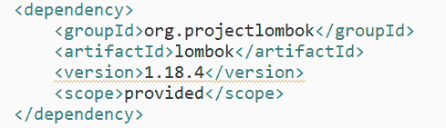
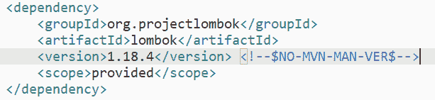

# 如何修复警告版本 pom.xml

> 原文：<https://dev.to/slumboy/how-to-fixed-warning-version-pom-xml-3pee>

[](https://res.cloudinary.com/practicaldev/image/fetch/s--jSXl9Ths--/c_limit%2Cf_auto%2Cfl_progressive%2Cq_auto%2Cw_880/https://thepracticaldev.s3.amazonaws.com/i/7bvjiojah15dbw8vy861.PNG)

```
<!--$NO-MVN-MAN-VER$--> 
```

[](https://res.cloudinary.com/practicaldev/image/fetch/s--gvLR7gDB--/c_limit%2Cf_auto%2Cfl_progressive%2Cq_auto%2Cw_880/https://thepracticaldev.s3.amazonaws.com/i/woqjvrk0nbe9mhks4211.PNG)