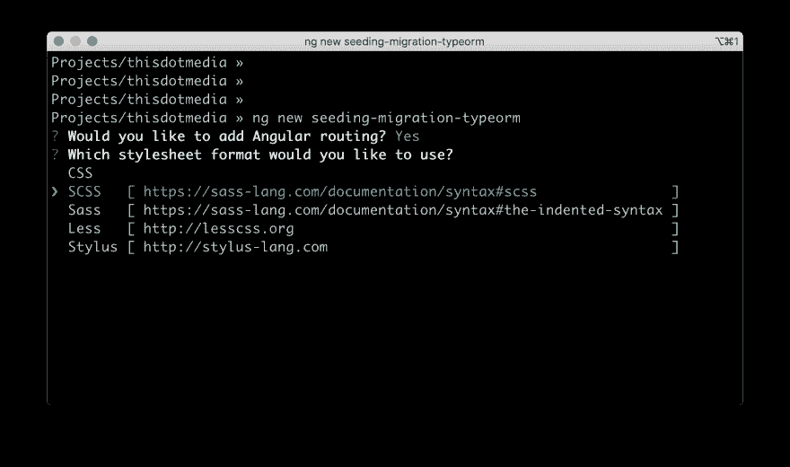
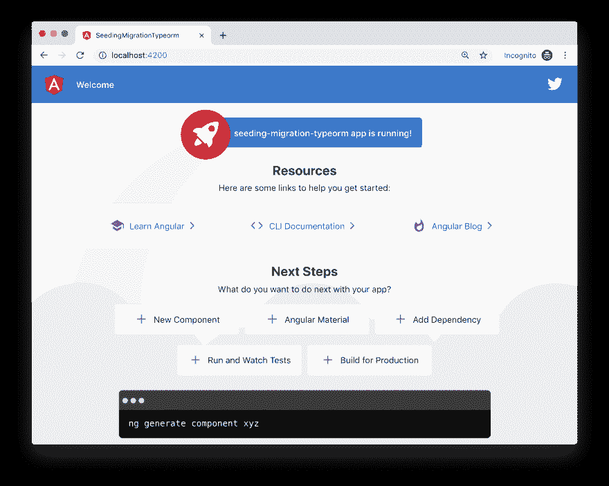
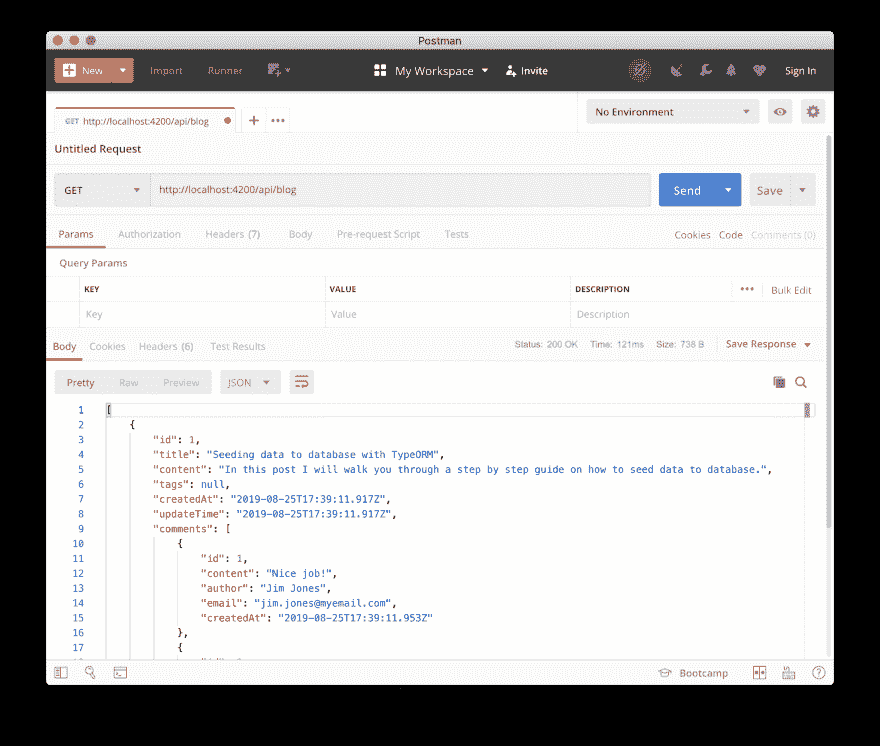

# 如何用 Nest.js 开发飞行

> 原文：<https://dev.to/thisdotmedia/how-to-fly-with-nest-js-development-ggi>

本文将向您展示如何将数据库迁移和数据播种添加到您的 Nest.js 应用程序中，并获得超快的开发启动阶段。

Nest.js 是一个进步的 Node.js Web 框架，它为您的前端应用程序提供了一个健壮的后端。就模块、提供者等概念而言，它与 Angular 非常相似。并且是 Angular 开发者的明确选择。

如果您感兴趣，请在以下网址阅读有关 Nest.js 的更多信息:

*   [Nest.js 官方文档](https://docs.nestjs.com)
*   [逐步指南 Nest.js](https://www.codemag.com/Article/1907081/Nest.js-Step-by-Step)

这篇文章的源代码可以在这个 GitHub [repo](https://github.com/bhaidar/seeding-migration-typeorm) 获得。

让我们从创建应用程序开始。

## 用 Angular CLI 创建全栈 app

在这一节中，我将使用 [Angular CLI](https://cli.angular.io) ，在 [Nest.js ng-universal](https://github.com/nestjs/ng-universal) 库的支持下，创建一个全栈应用程序。

### 基本先决条件

*   [Node.js](https://nodejs.org/en/) v10.16.2
*   [Docker v19.03](https://docs.docker.com/docker-for-mac/)
*   代码编辑器(Visual Studio 代码，Sublime 等。)

### 添加角度 app

通过运行以下命令，全局安装最新版本的 Angular CLI:

```
npm uninstall -g @angular/cli
npm cache clean --force
npm install -g @angular/cli@latest 
```

Enter fullscreen mode Exit fullscreen mode

现在您已经安装了 Angular CLI，让我们通过运行以下命令来创建我们的 Angular 应用程序:

`ng new seeding-migration-typeorm`

`ng new`命令询问您几个问题，如图 1 所示:

[](https://res.cloudinary.com/practicaldev/image/fetch/s--eKMHP1ct--/c_limit%2Cf_auto%2Cfl_progressive%2Cq_auto%2Cw_880/https://thepracticaldev.s3.amazonaws.com/i/857s6d1fauudmfyb4iok.png)

*   是否要使用角度路由？
*   您想使用哪种样式表格式？

做出选择后，Angular CLI 开始搭建您的应用程序。

完成后，在您喜欢的代码编辑器中打开它，导航到`package.json`文件，并更改`start` NPM 脚本，如下所示:

`"start": "ng serve -o"`

让我们挤一挤，运行应用程序，以确保它的工作。运行以下命令启动应用程序:

`npm start`

该命令完成应用程序的构建，打开一个新的浏览器实例，并运行应用程序，如下面的图 2 所示:

[](https://res.cloudinary.com/practicaldev/image/fetch/s--77CKbKfC--/c_limit%2Cf_auto%2Cfl_progressive%2Cq_auto%2Cw_880/https://thepracticaldev.s3.amazonaws.com/i/3bqk5vuisobo16t9os0e.png)

这是最新的 Angular CLI 生成的新主页。现在，让我们重点添加一个后端 Nest.js 应用程序。
添加 Nest.js 应用程序

创建后端 Nest.js 应用程序的正确位置是 Angular 根文件夹中。另一种选择是在 Angular 应用程序之外创建它，但是这样做将是一场噩梦！用两个独立的`package.json`文件管理这两者几乎是不可能的。不推荐。

Nest.js 为 Nest framework 提供了 [Angular Universal 模块，该模块管理创建新 Nest.js 应用程序的所有漂亮的小细节，并将其与 Angular CLI 系统集成。](https://github.com/nestjs/ng-universal)

运行以下示意图来创建 Nest.js 应用程序:

`ng add @nestjs/ng-universal`

该示意图从安装最新版本的`@nestjs/ng-universal` NPM 软件包开始。然后，它会提示您输入客户端的应用程序名称。在这种情况下，您键入`seeding-migration-typeorm`。

该命令在名为`server`的新文件夹中创建一个新的 Nest.js 应用程序，并放置在 Angular 应用程序的根文件夹中。

该命令在`package.json`文件中添加了一些 NPM 脚本，允许您编译和运行新的服务器应用程序。另外，对`angular.json`文件进行了修改，增加了一个新的`Architect Target`名称`server`。

现在，运行这个具有实时重载特性的全栈应用程序的最简单方法是执行以下命令:

`npm run serve`

Angular 和 Nestjs 应用程序都可以在**端口 4200** 上运行。然而，要访问任何 Nest.js 控制器端点，您必须在基本 URL 后面加上`/api`。Nest.js 后端 API 在`http://localhost:4200/api`可用。

## 用 Docker 设置一个 PostgreSQL 数据库

为了演示播种和迁移，我们需要将后端应用程序连接到数据库引擎。

对于本文，我选择使用 [PostgreSQL](https://www.postgresql.org) 数据库引擎或“Postgres”。我将使用一个 [PostgreSQL Docker](https://hub.docker.com/_/postgres) 容器运行一个 PostgreSQL 实例，我认为这是向您的应用程序添加 PostgreSQL 数据库实例的最干净、最简单的方法。

首先在 Angular 应用程序的根目录下创建一个新的`docker-compose.yml`，并将以下内容粘贴到其中:

```
version: '3'
services:
  db:
    container_name: typeormseed_db
    image: postgres:10.7
    volumes:
      - './db/initdb.d:/docker-entrypoint-initdb.d'
    ports:
      - '5432:5432' 
```

Enter fullscreen mode Exit fullscreen mode

这个 docker-compose 文件指示 docker 使用以下设置创建一个新的 Postgres Docker 容器:

*   容器名是**类型种子 _ 数据库**
*   Postgres Docker 图像 **postgres:10.7**
*   通过将名为 **db\initdb.d** 的物理文件夹映射到映像内部的一个内部文件夹来创建一个新卷。我将在这个文件夹中放置一个初始化脚本，以便 Docker 可以在第一次创建 Postgres 容器时运行。
*   最后，通过将其内部端口映射到主机上使用的端口，将 Postgres 实例公开给主机。

现在让我们在 Angular 应用程序的根级别创建一个名为`db`的新文件夹。然后，创建一个名为`initdb.d`的子文件夹。然后，在这个文件夹中，创建一个名为`initdb.sh`的新 bash 脚本文件。将以下内容放入这个新文件:

```
#!/usr/bin/env bash

set -e

psql -v ON_ERROR_STOP=1 --username "$POSTGRES_USER" --dbname "$POSTGRES_DB" <<-EOSQL CREATE USER typeormseed_user;
    CREATE DATABASE typeormseed ENCODING UTF8;
    GRANT ALL PRIVILEGES ON DATABASE typeormseed TO typeormseed_user;

    ALTER USER typeormseed_user WITH PASSWORD 'password123';
    ALTER USER typeormseed_user WITH SUPERUSER; EOSQL 
```

Enter fullscreen mode Exit fullscreen mode

Docker 第一次创建 Postgres 容器时，会运行这个脚本。然后，它将创建一个名为 **typeormseed** 的新 Postgres 数据库实例，一个名为 **typeormseed_user** 的新数据库用户，最后授予该用户运行和访问该数据库的适当权限。

此外，您需要向`package.json`文件添加一个新的 NPM 脚本，以便在运行 Docker 时更容易，并实例化一个 Postgres 容器。

在`package.json`文件中的`script`节点下添加以下脚本:

`"run:db": "docker-compose up -d && exit 0"`

最后，运行以下命令启动容器:

`npm run run:db`

该命令将在分离模式下创建 Postgres 容器。

现在 Postgres 数据库已经建立并运行了，让我们继续添加更多的特性。

### 添加类型表单模块

TypeORM 是一个用 JavaScript 编写的对象关系映射(ORM)库，能够连接到各种数据库引擎，包括 PostgreSQL、MySQL、Maria DB、MongoDB 等等。

Nest.js 完全支持这个库，并提供了 [@nestjs/typeorm](https://github.com/nestjs/typeorm) 包作为 typeorm 库的包装器，可以毫不费力地与 Nest.js 依赖注入系统集成。

> 关于在 Nest.js 中使用数据库的[，可以参考 Nest.js 官方文档。](https://docs.nestjs.com/techniques/database)
> 
> 你也可以通过查看我在[Nest . js Step by Step Guide-Databases](https://www.codemag.com/Article/1909081/Nest.js-Step-by-Step-Part-2)上的文章来阅读关于 TypeORM、Nest/js 如何与这个库集成以及如何一起使用它们的例子的更详细的解释。

要开始在 Nest.js 应用程序中使用 TypeORM，我们需要安装几个 NPM 包。运行命令:

`npm install @nestjs/typeorm typeorm pg`

*   `@nestjs/typeorm`包代表 TypeORM 上的 Nest.js 包装器。
*   `typeorm`包是官方的 TypeORM 库包。
*   `pg`包是 Postgres 的官方连接器库。

让我们将`server/app.module.ts`中的`TypeOrmModule`导入如下:

```
import { Module } from '@nestjs/common';
import { AngularUniversalModule } from '@nestjs/ng-universal';
import { join } from 'path';

import { TypeOrmModule } from '@nestjs/typeorm';

@Module({
  imports: [
    AngularUniversalModule.forRoot({
      viewsPath: join(process.cwd(), 'dist/browser'),
      bundle: require('../server/main'),
      liveReload: true
    }),
    TypeOrmModule.forRoot()
  ]
})
export class ApplicationModule {} 
```

Enter fullscreen mode Exit fullscreen mode

接下来，在 Angular app 的根目录下新建一个`ormconfig.json`文件，在里面粘贴以下内容:

```
{  "type":  "postgres",  "host":  "localhost",  "port":  5432,  "username":  "typeormseed_user",  "password":  "password123",  "database":  "typeormseed",  "entities":  ["dist/**/*.entity.js"],  "migrations":  ["dist/server-app/migration/**/*.js"],  "synchronize":  false,  "cli":  {  "entitiesDir":  "server",  "migrationsDir":  "server/migration"  }  } 
```

Enter fullscreen mode Exit fullscreen mode

在运行时，`TypeOrmModule`类从`ormconfig.json`文件加载配置设置，并创建到 Postgres 数据库实例的 TypeORM 数据库连接。

就是这样！

## 构建博客 API

既然全栈应用程序已经启动并运行，并与数据库建立了活动连接，那么是时候开始构建 Blog API 了。

下一节将逐步介绍如何:

*   在 Nest.js 中添加新模块
*   添加模型对象
*   生成和运行迁移
*   创建迁移和种子数据
*   添加 Nest.js 服务
*   添加一个 Nest.js 控制器来测试应用程序。

让我们开始吧。

### 添加博客模块

Nest.js 框架提供了 Nest.js CLI。该组件类似于 Angular CLI 或其他 CLI。CLI 的目标是通过增强软件开发过程来提高生产率，并使开发人员更容易向应用程序添加新的 Nest.js 构件。

通过运行以下命令，在您的计算机上全局安装 Nest.js CLI:

`npm install -g @nestjs/cli`

回到应用程序，将目录`cd`更改为`server`文件夹，并运行以下命令来搭建 Blog Nest.js 模块:

`nest g module blog --no-spec`

该命令在路径`/server/src/blog`下创建一个新的博客模块。此外，它还将这个模块导入到主`app.module.ts`文件中。
添加模型对象
我们将创建 Blog 和 BlogPost 实体对象。运行以下命令来一起创建两个类:

`touch src/blog/post.entity.ts src/blog/comment.entity.ts`

将这段代码粘贴到`blog/post.entity.ts`文件中:

```
import { Entity, PrimaryGeneratedColumn, Column, OneToMany } from 'typeorm';
import { Comment } from './comment.entity';

@Entity()
export class Post {
  @PrimaryGeneratedColumn()
  id: number;

  @Column('varchar')
  title: string;

  @Column('text')
  content: string;

  @Column({ type: 'varchar', nullable: true })
  tags: string;

  @Column({ name: 'created_at', default: () => `now()`, nullable: false })
  createdAt: Date;

  @Column({ name: 'updated_at', default: () => 'now()', nullable: false })
  updateTime: Date;

  @OneToMany(type => Comment, comment => comment.post, {
    primary: true,
    cascade: ['insert']
  })
  comments: Comment[];
} 
```

Enter fullscreen mode Exit fullscreen mode

该文件定义了用于在博客引擎中创建新文章的实体`post`。它定义了与`comment`实体的一对多关系。

将以下内容粘贴到`blog/comment.entity.ts`文件中:

```
import { Entity, PrimaryGeneratedColumn, Column, ManyToOne } from 'typeorm';
import { Post } from './post.entity';

@Entity()
export class Comment {
  @PrimaryGeneratedColumn()
  id: number;

  @Column('text')
  content: string;

  @Column({ type: 'varchar', nullable: false })
  author: string;

  @Column({ type: 'varchar', nullable: false })
  email: string;

  @Column({ name: 'created_at', default: () => `now()`, nullable: false })
  createdAt: Date;

  @ManyToOne(type => Post, post => post.comments, {
    primary: true,
    cascade: ['insert']
  })
  post: Post;
} 
```

Enter fullscreen mode Exit fullscreen mode

`comment`实体表示博客帖子上的单个评论。它定义了与`post`实体的多对一关系。

最后一步，让我们在`blog.module.ts`文件的层次上用这些实体配置`TypeOrmModule`，如下所示:

```
@Module({
  imports: [TypeOrmModule.forFeature([Post, Comment])]
})
export class BlogModule {} 
```

Enter fullscreen mode Exit fullscreen mode

`TypeOrmModule`将能够为这些实体生成定制的存储库类，并通过 Nest.js 依赖注入系统使它们可用，您很快就会看到。
生成并运行一个迁移
现在实体已经准备好了，让我们用 TypeORM 生成一个新的迁移。

TypeORM 单一迁移有两个函数，up()和 down()，用于保存迁移的代码。up()函数在对数据库运行迁移时运行，通常包含在数据库中创建或修改内容的代码。而 down()函数在撤消迁移时运行。

```
import { MigrationInterface, QueryRunner } from 'typeorm';

export class INITIALDB1566761690370 implements MigrationInterface {
  public async up(queryRunner: QueryRunner): Promise<any> {}
  public async down(queryRunner: QueryRunner): Promise<any> {}
} 
```

Enter fullscreen mode Exit fullscreen mode

通过运行以下命令来构建和编译应用程序:

```
npx tsc -p server/tsconfig.json
npm run serve 
```

Enter fullscreen mode Exit fullscreen mode

运行下一个命令来创建我们的第一个迁移。确保 Postgres 容器已经启动并正在运行。

`npx typeorm migration:generate --name=INITIAL_DB`

此命令使用 TypeORM CLI 来生成新的迁移。它将数据库的状态与它在应用程序中找到的实体进行比较，并相应地生成迁移。

运行完该命令后，导航到`server/migration`文件夹，并在那里找到新的迁移文件。它托管以下迁移内容:

```
// 1566761690370-INITIAL_DB.ts

import { MigrationInterface, QueryRunner } from 'typeorm';

export class INITIALDB1566761690370 implements MigrationInterface {
  public async up(queryRunner: QueryRunner): Promise<any> {
    await queryRunner.query(
      `CREATE TABLE "post" ("id" SERIAL NOT NULL, "title" character varying NOT NULL, "content" text NOT NULL, "tags" character varying, "created_at" TIMESTAMP NOT NULL DEFAULT now(), "updated_at" TIMESTAMP NOT NULL DEFAULT now(), CONSTRAINT "PK_be5fda3aac270b134ff9c21cdee" PRIMARY KEY ("id"))`
    );
    await queryRunner.query(
      `CREATE TABLE "comment" ("id" SERIAL NOT NULL, "content" text NOT NULL, "author" character varying NOT NULL, "email" character varying NOT NULL, "created_at" TIMESTAMP NOT NULL DEFAULT now(), "postId" integer NOT NULL, CONSTRAINT "PK_f685613ae59fda2ac1e490c9189" PRIMARY KEY ("id", "postId"))`
    );
    await queryRunner.query(
      `ALTER TABLE "comment" ADD CONSTRAINT "FK_94a85bb16d24033a2afdd5df060" FOREIGN KEY ("postId") REFERENCES "post"("id") ON DELETE NO ACTION ON UPDATE NO ACTION`
    );
  }

  public async down(queryRunner: QueryRunner): Promise<any> {
    await queryRunner.query(
      `ALTER TABLE "comment" DROP CONSTRAINT "FK_94a85bb16d24033a2afdd5df060"`
    );
    await queryRunner.query(`DROP TABLE "comment"`);
    await queryRunner.query(`DROP TABLE "post"`);
  }
} 
```

Enter fullscreen mode Exit fullscreen mode

up()函数显示了创建两个表`post`和`comment`的 SQL 代码。此外，它还显示了修改`comment`表以向`post`主键添加外键的代码。

再次运行以下命令来构建和编译应用程序:

`npm run serve`

让我们运行迁移并在数据库中创建相应的表。发出以下命令:

`npx typeorm migration:run`

该命令收集数据库中以前没有应用的所有迁移，并执行它们的 up()函数。在这种情况下，我们只需要运行一次迁移。

该命令创建两个表并配置它们之间的关系。

要验证迁移，请运行:

`npx typeorm query "SELECT * FROM post"`

结果如下:

```
Running query: SELECT
Query has been executed. Result: 
[] 
```

Enter fullscreen mode Exit fullscreen mode

找到了该表，但它包含 0 条记录。

### 使用迁移植入数据

到目前为止，您已经看到了如何使用 TypeORM 生成迁移。

现在的计划是使用 TypeORM 创建一个新的空迁移。然后，我们将用插入一些静态数据所需的代码填充这个新的迁移。当迁移准备就绪时，我们将使用 TypeORM CLI 对数据库运行迁移，并将数据植入表中。

这就是使用 TypeORM 将种子数据添加到数据库中的方法。

我们开始吧！

运行命令:
`npx typeorm migration:create --name SEED_DATA`

用以下内容替换该文件的内容:

```
import { MigrationInterface, QueryRunner, getRepository } from 'typeorm';
import { Post } from '../src/blog/post.entity';
import { Comment } from '../src/blog/comment.entity';

export class SEEDDATA1566763187470 implements MigrationInterface {
  public async up(queryRunner: QueryRunner): Promise<any> {
    // create a post
    const post = getRepository(Post).create({
      title: 'Seeding data to database with TypeORM',
      content:
        'In this post, I will walk you through a step by step guide on how to seed data to database.'
    });

    await getRepository(Post).save(post);

    // create a comment
    const comment1 = getRepository(Comment).create({
      content: 'Nice job!',
      author: 'Jim Jones',
      email: 'jim.jones@myemail.com',
      post
    });

    // create a comment
    const comment2 = getRepository(Comment).create({
      content: 'Informative blog post!',
      author: 'Bin Nadal',
      email: 'bin.nadal@myemail.com',
      post
    });

    await getRepository(Comment).save(comment1);
    await getRepository(Comment).save(comment2);
  }

  public async down(queryRunner: QueryRunner): Promise<any> {}
} 
```

Enter fullscreen mode Exit fullscreen mode

代码使用`getRepository(post)`函数来访问`post`实体的存储库实例。然后，它使用存储库`create()`函数来创建一个新的 post 对象以及这篇文章的评论。

然后，它使用存储库`save()`函数将更改保存到数据库中。

要验证结果，请运行以下命令:

```
npx typeorm migration:run
npx typeorm query "SELECT * FROM post" 
```

Enter fullscreen mode Exit fullscreen mode

查询结果如下:

```
Running query: SELECT * FROM post
Query has been executed. Result: 
[
  {
    "id": 1,
    "title": "Seeding data to database with TypeORM",
    "content": "In this post I will walk you through a step by step guide on how to seed data to database.",
    "tags": null,
    "created_at": "2019-08-25T17:39:11.917Z",
    "updated_at": "2019-08-25T17:39:11.917Z"
  }
] 
```

Enter fullscreen mode Exit fullscreen mode

数据库中有一个帖子，有一个`id = 1`。

让我们通过运行以下命令来查询注释:

`npx typeorm query "SELECT * FROM comment"`

查询结果如下:

```
Running query: SELECT * FROM comment
Query has been executed. Result: 
[
  {
    "id": 1,
    "content": "Nice job!",
    "author": "Jim Jones",
    "email": "jim.jones@myemail.com",
    "created_at": "2019-08-25T17:39:11.953Z",
    "postId": 1
  },
  {
    "id": 2,
    "content": "Informative blog post!",
    "author": "Bin Nadal",
    "email": "bin.nadal@myemail.com",
    "created_at": "2019-08-25T17:39:11.974Z",
    "postId": 1
  }
] 
```

Enter fullscreen mode Exit fullscreen mode

两个注释对象都是用`postId = 1`创建的。一切都很好！

这种使用迁移将数据植入 TypeORM 数据库的方法是目前在应用程序的开发生命周期中用数据填充数据库的最佳选择。

### 添加博客服务

让我们创建博客服务，并定义查询帖子和评论的函数。

将目录`cd server`更改为服务器目录，并运行以下命令:

`nest generate service blog --no-spec`

该命令在`blog`文件夹中创建`blog.service.ts`文件，并将该服务作为提供者添加到`blog.module.ts`中。这最后一步通过 Nest.js 依赖注入系统使`BlogService`可用。

将此服务的内容替换为以下代码:

```
import { Injectable } from '@nestjs/common';
import { InjectRepository } from '@nestjs/typeorm';
import { Post } from './post.entity';
import { Repository } from 'typeorm';

@Injectable()
export class BlogService {
  constructor(
    @InjectRepository(Post)
    private repo: Repository<Post>
  ) {}

  async findAll(): Promise<Post[]> {
    return await this.repo.find({ relations: ['comments'] });
  }
} 
```

Enter fullscreen mode Exit fullscreen mode

`BlogService`用`@Injectable()`装饰器装饰。这告诉框架这个服务期望通过它的构造函数接收依赖项。

服务构造器为`Post`实体注入一个定制的存储库类。`@nestjs/typeorm`包负责为我们已经通过导入`TypeOrmModule.forFeature([Post, Comment])`在`blog.module.ts`上定义的所有实体生成那些定制存储库。

该服务定义了一个单独的`findAll()`函数，该函数返回存储在数据库中的所有帖子，并急切地加载它们相关的评论对象。

### 添加控制器

现在让我们公开一个博客 API 控制器端点，以允许客户端应用程序请求这些数据。

将目录切换到服务器文件夹`cd server`，并运行以下命令:

`nest generate controller blog --no-spec`

该命令在`blog/blog.controller.ts`文件中创建`BlogController`类，并将控制器导入到`blog.module.ts`模块的`controllers`属性中。这最后一步通过 Nest.js 依赖注入系统使`BlogController`可用。

用以下代码替换该控制器的内容:

```
import { Controller, Get, Req } from '@nestjs/common';
import { BlogService } from './blog.service';
import { Post } from './post.entity';

@Controller('blog')
export class BlogController {
  constructor(private readonly blogService: BlogService) {}

  @Get()
  async findAll(@Req() req: any): Promise<Post[]> {
    return await this.blogService.findAll();
  }
} 
```

Enter fullscreen mode Exit fullscreen mode

用`@Controller()`装饰器来装饰`BlogController`类。

构造函数接受一个`BlogService`实例。Nest.js 依赖注入系统在运行时创建并提供这个控制器的一个`BlogService`实例。

这个控制器定义了一个由`@Get()` decorator 指定的动作，说明这个动作是通过 GET 请求访问的。这个动作将调用委托给`BlogService`来查询数据库中的所有 post 数据，并在对客户端请求的响应中返回它们。
让我们运行应用程序，并通过浏览器访问这个控制器端点。运行以下命令:

`npm run serve`

导航到浏览器并输入 URL `http://localhost:4200/api/blog`，您将看到类似下面图 3 的内容:

[](https://res.cloudinary.com/practicaldev/image/fetch/s--KFQBgXwX--/c_limit%2Cf_auto%2Cfl_progressive%2Cq_auto%2Cw_880/https://thepracticaldev.s3.amazonaws.com/i/gp1lk6vj10oc2he8ifgk.png)

## 测试用邮递员

这次让我们用 Postman 测试一下`BlogController`。

使用 Postman，您可以通过发送 HTTP 请求和接收 HTTP 响应来模拟浏览器。

如果你想了解更多关于 Postman 的知识，你可以查看我为忙碌的开发者编写的关于 Postman 的完整指南。

确保应用程序启动并运行，打开 Postman，向 URL `http://localhost:4200/api/blog`发送 GET 请求，如下图 4 所示:

[](https://res.cloudinary.com/practicaldev/image/fetch/s--jkMep3ch--/c_limit%2Cf_auto%2Cfl_progressive%2Cq_auto%2Cw_880/https://thepracticaldev.s3.amazonaws.com/i/8c7jan2vthgytjug10uc.png)

## 结论

在每一个新项目的开始，你会忙于构建应用程序的基础，构建虚拟界面来展示给客户，并获得一些反馈。您将没有足够的时间在后端构建完整的服务，从一开始就提供所有的 CRUD(创建、读取、更新和删除)操作，使您能够添加数据，并将其用于测试目的。

使用 TypeORM 迁移将数据植入数据库是一种简洁而快速的方法，可以让您快速入门。使用这些迁移的额外好处是，它们不会在应用程序的早期阶段将时间浪费在不必要的活动上。

这篇文章是由[的导师](https://thisdot.co/)[比拉尔·海达尔](https://www.bhaidar.dev/)写的。

你可以在推特上关注他，地址是 [@bhaidar](https://twitter.com/bhaidar) 。

需要 JavaScript 咨询、指导或培训帮助吗？在 [This Dot Labs](https://thisdot.co) 查看我们的服务列表。