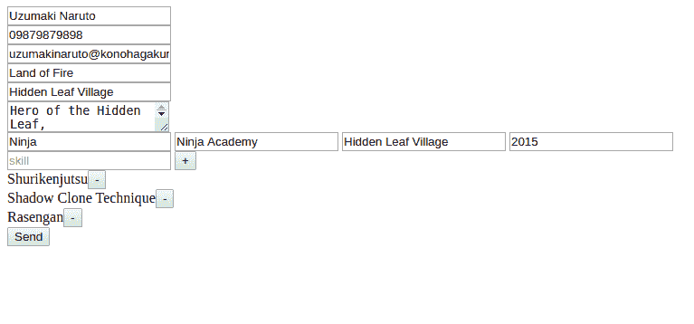
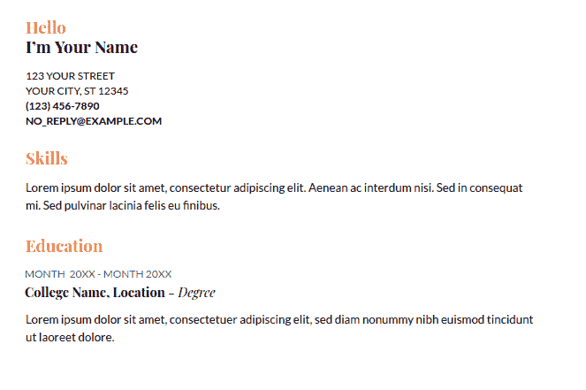
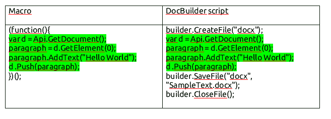

# 如何从您的应用程序生成文档

> 原文：<https://dev.to/noflamine/how-to-generate-documents-from-your-app-4pco>

[Document Builder](https://github.com/ONLYOFFICE/DocumentBuilder) 是一个用于生成文档的开源库。当您需要时，它可能会很有用:

*   创建大量几乎相似但有微小差异的文档。
*   根据大量数据伪造文件。
*   在您的 web 服务中生成基于用户数据的文档。

很简单:你使用这里记录的[方法](https://api.onlyoffice.com/docbuilder/basic)编写 js 代码，把它传递给生成器，它为你生成 docx、xlsx、pptx 或 PDF。或者不生成，如果你的脚本中有错误。

让我们看看它在一个真实的例子中是如何工作的。

你还记得用户填写表格，然后下载他们准备好的格式精美的简历的服务吗？让我们使用 Document Builder 来实现其中的一个。

换句话说，我的计划是创建一个能够基于现成的模板和一些用户数据生成文档的应用程序。我将使用 Node.js (Express)来实现它。

工作方案:

1.  用户在浏览器中完成表单。
2.  表单中的数据被发送到服务器。
3.  基于用户数据的脚本在 Node.js 服务器上创建。
4.  Node.js 将脚本发送给构建器。
5.  构建器使用脚本创建文档。
6.  Node.js 向用户发送一个指向文档的链接。

## 表单创建

我们的用户要填写的表格将有 8 个字段:“全名”，“电话号码”，“电子邮件”，“个人资料”，“学位”，“大学”，“地点”，“年份”，“技能”。技能字段可以被克隆。

让我们创建`index.html`文件，并将模板代码添加到其中:

```
<div class="fill-name">
    <input type="text" id="fill-name" placeholder="full name">
</div>
<div class="phone-number">
    <input type="number" id="phone-number" placeholder="phone number">
</div>
<div class="email">
    <input type="text" id="email" placeholder="email">
</div>
<div class="profile">
    <textarea id="profile" placeholder="Insert a brief description of yourself"></textarea>
</div>
<div class="education">
    <input type="text" id="degree" placeholder="degree">
    <input type="text" id="university" placeholder="university">
    <input type="text" id="location" placeholder="location">
    <input type="date" id="year" placeholder="year">
</div>
<div class="skills">
    <div class="skill">
        <input type="text" id="new-skill" placeholder="skill" onkeyup="add_skill_by_enter(event)">
        <button onclick="add_skill()">+</button>
    </div>
</div> 
```

这里，我们使用两个函数`add_skill_by_enter (event)`和`add_skill ()`在用户点击+按钮或 Enter 时创建新字段。我将在后面描述它们。

我们还需要按钮将完成的表单中的数据发送到服务器:

```
<button onclick="sendForm()">Send</button> 
```

现在是时候编写使用表单的函数了。

第一个函数是`add_skill ()`:T1

```
add_skill = () => {
    const newSkill = document.getElementById("new-skill");
    if (newSkill.value === '') {return; } //  we do nothing, if nothing was inserted into the field
    const div = document.createElement("div"); .// outer  div
    const span = document.createElement("span");  //  skill name
    const button = document.createElement("button"); //  skill deletion button
    span.innerText += newSkill.value; //  for adding the inserted text to the span
    newSkill.value = ''; // resets skill name field
    newSkill.focus(); // returning the focus to the skill name field
    button.innerText += "-";
    button.onclick = () => {  // adding an action for the delete button
    div.remove();
};
div.appendChild(span); // adding span to  div
div.appendChild(button); // adding the delete button
document.getElementsByClassName('skills')[0].appendChild(div); // adding object to he page
};
add_skill_by_enter()
  add_skill_by_enter = (event) => {
        if (event.code === "Enter") { // adding an element only when  enter was pressed
            add_skill();
        }
    }; 
```

现在，我们添加一个简单的函数来从字段中收集数据，并将它们发送到服务器。

```
 get_skill_values = () => {
        const skills = [];
        if (document.getElementById('new-skill').value !== '') {
            skills.push(document.getElementById('new-skill').value);
        }
        Array.from(document.getElementsByClassName('skillfield')).forEach(current_element => {
            skills.push(current_element.innerHTML);
        });
        return skills;
    };
sendForm()
    sendForm = () => {
        fetch('/', {
            method: 'POST',
            headers: {
                'Content-Type': 'application/json'
            },
            body: JSON.stringify({
                userData: {
                    fillName: document.getElementById('fill-name').value,
                    phoneNumber: document.getElementById('phone-number').value,
                    email: document.getElementById('email').value,
                    profile: document.getElementById('profile').value,
                    education: {
                        degree: document.getElementById('degree').value,
                        university: document.getElementById('university').value,
                        location: document.getElementById('location').value,
                        year: document.getElementById('year').value,
                    },
                    skills: get_skill_values()
                }
            })
        }).then(res => res.json())
            .then(response => {
                location.replace('/' + response.filename); // downloading the file which will be available at this link
            })
            .catch(error => console.error('Error:', error));
    }; 
```

# 服务器端

我使用`express`编写服务器部分。库连接、服务器配置以及 get 和 post 方法的描述如下:

```
const path = require('path');
const express = require('express');
const bodyParser = require('body-parser');
const app = express();

app.use(bodyParser.json());

app.get('/', (req, res) => {
    res.sendFile(path.join(__dirname + '/index.html'));
});

app.post('/', (req, res) => {
    //  later we will add file building function here
});

app.listen(3000, () => console.log(`Example app listening on port ${3000}!`)); 
```

现在我们运行 Node.js:

`node main.js`

并在浏览器中打开该地址:

`http://localhost:3000`

现在我们看到新创建的表单并完成它:

[](https://res.cloudinary.com/practicaldev/image/fetch/s--rIf2T1Et--/c_limit%2Cf_auto%2Cfl_progressive%2Cq_auto%2Cw_880/https://thepracticaldev.s3.amazonaws.com/i/fgo832uhn3k8tv4ctzd4.png)

我们得到下面的 json:

```
{"userData":{"fillName":"Uzumaki Naruto","phoneNumber":"09879879898","email":"uzumakinaruto@konohagaku","profile":"Hero of the Hidden Leaf\nSeventh Hokage","country":"Land of Fire","city":"Hidden Leaf Village","education":{"degree":"Ninja","university":"Ninja Academy","location":"Hidden Leaf Village","year":"2015"},"skills":["Shurikenjutsu","Shadow Clone Technique","Rasengan"]}}; 
```

## 构建器脚本

现在我们需要为构建器写一个脚本。我拿了这个简历模板:

[](https://res.cloudinary.com/practicaldev/image/fetch/s--UvlUCX6A--/c_limit%2Cf_auto%2Cfl_progressive%2Cq_auto%2Cw_880/https://thepracticaldev.s3.amazonaws.com/i/0nviqn49cj8xnrtsawdw.png)

有几种方法可以做到这一点，最简单的是下载 ONLYOFFICE editors 的[桌面版，并编写一个宏，可以使用这些数据生成一个文档。](https://www.onlyoffice.com/desktop.aspx)

之后，我们需要在宏代码中添加文件创建和文件保存。这就是为构建器获得脚本的方式。这将起作用，因为只有基于 OFFICE js 的宏和生成器共享相同的 API。看到了吗？

[](https://res.cloudinary.com/practicaldev/image/fetch/s--9wjKzWax--/c_limit%2Cf_auto%2Cfl_progressive%2Cq_auto%2Cw_880/https://thepracticaldev.s3.amazonaws.com/i/36if4t7pz9gxq7ss1ihp.png)

让我们从初始化页面对象和添加用户数据开始。

```
const Document = Api.GetDocument();
const data =  
{"userData":{"fillName":"Uzumaki Naruto","phoneNumber":"09879879898","email":"uzumakinaruto@konohagaku","profile":"Hero of the Hidden Leaf\nSeventh Hokage","country":"Land of Fire","city":"Hidden Leaf Village","education":{"degree":"Ninja","university":"Ninja Academy","location":"Hidden Leaf Village","year":"2015"},"skills":["Shurikenjutsu","Shadow Clone Technique","Rasengan"]}}; 
```

现在我们需要添加带有完整用户名的段落。是用粗体写的，这一段有 1.15 倍行距。

```
let paragraph = document.GetElement(0); //  docs always have the 1st paragraph
FullName_style = Document.CreateStyle("FullName"); // creating new style
FullName_style.GetTextPr().SetFontSize(28); // changing the font size
FullName_style.GetTextPr().SetBold(true); //  adding the bold parameter
paragraph.SetStyle(FullName_style); //  applying the newly created style to the paragraph
paragraph.SetSpacingLine(1.15 * 240, "auto"); // changing the line spacing
paragraph.AddText(data.userData.fillName);  // adding text to the paragraph 
```

其余段落:

```
// Country and cityconst CountryCity_style = Document.CreateStyle("CountryCity");
CountryCity_style.GetTextPr().SetFontSize(20);
CountryCity_style.GetTextPr().SetCaps(true);
CountryCity_style.GetTextPr().SetBold(true);
paragraph = Api.CreateParagraph();
paragraph.AddText(data.userData.country + ', ' + data.userData.city);
paragraph.SetStyle(CountryCity_style);
paragraph.SetSpacingAfter(0);
Document.Push(paragraph);

// phone numberconst PhoneNumber_style = Document.CreateStyle("PhoneNumber");
PhoneNumber_style.GetTextPr().SetFontSize(20);
PhoneNumber_style.GetParaPr().SetSpacingAfter(0);
PhoneNumber_style.GetTextPr().SetBold(true);
paragraph = Api.CreateParagraph();
paragraph.AddText(data.userData.phoneNumber);
paragraph.SetStyle(PhoneNumber_style);
Document.Push(paragraph);

// emailconst Email_style = Document.CreateStyle("Email");
Email_style.GetTextPr().SetFontSize(18);
Email_style.GetParaPr().SetSpacingAfter(0);
Email_style.GetTextPr().SetBold(true);
paragraph = Api.CreateParagraph();
paragraph.AddText(data.userData.email);
paragraph.SetStyle(Email_style);
Document.Push(paragraph);

// SectionHeader styleconst SectionHeader = Document.CreateStyle("SectionHeader");
SectionHeader.GetTextPr().SetBold(true);
SectionHeader.GetTextPr().SetColor(247, 93, 93, false);
SectionHeader.GetTextPr().SetFontSize(28);
SectionHeader.GetParaPr().SetSpacingBefore(1.33 * 240);
SectionHeader.GetParaPr().SetSpacingLine(1 * 240, "auto");

// add header Profile:
paragraph = Api.CreateParagraph();
paragraph.AddText("Profile:")
paragraph.SetStyle(SectionHeader);
Document.Push(paragraph);

// add profile text:
paragraph = Api.CreateParagraph();
paragraph.AddText(data.userData.profile)
Document.Push(paragraph);

// add header Education:
paragraph = Api.CreateParagraph();
paragraph.AddText("Education:")
paragraph.SetStyle(SectionHeader);
Document.Push(paragraph);

// add education year:const EducationYear_style = Document.CreateStyle("EducationYear");
EducationYear_style.GetTextPr().SetColor(102, 102, 102);
EducationYear_style.GetTextPr().SetFontSize(18);
EducationYear_style.GetParaPr().SetSpacingAfter(0);
paragraph = Api.CreateParagraph();
paragraph.SetStyle(EducationYear_style);
paragraph.AddText(data.userData.education.year)
Document.Push(paragraph);

// add education university:
paragraph = Api.CreateParagraph();

run = Api.CreateRun();
run.AddText(data.userData.education.university)
run.AddText(', ')
run.AddText(data.userData.education.location)
run.SetBold(true);
paragraph.AddElement(run);
run = Api.CreateRun();
run.AddText(' – ' + data.userData.education.degree)
paragraph.AddElement(run);
Document.Push(paragraph);

// add header Skills:
paragraph = Api.CreateParagraph();
paragraph.AddText("Skills:")
paragraph.SetStyle(SectionHeader);
Document.Push(paragraph);

// add skills text:
paragraph = Api.CreateParagraph();
const skills = data.userData.skills.map(x => ' ' + x).toString();
paragraph.AddText(skills)
Document.Push(paragraph); 
```

通过执行这个脚本，我们得到以下文档:

[](https://res.cloudinary.com/practicaldev/image/fetch/s--Td1GuFXN--/c_limit%2Cf_auto%2Cfl_progressive%2Cq_auto%2Cw_880/https://thepracticaldev.s3.amazonaws.com/i/z0areudgr9r0244f9vsi.png)

现在是时候添加将脚本代码写入文件并生成文档的函数了。

算法:

生成脚本->将脚本写入文件->将文件发送到 DocBuilder -> DocBuilder 将文件链接返回给用户。

我们添加了一个附加组件的连接，用于使用 Node.js 处理文件和运行命令，还创建了一个“public”文件夹并使其成为 public:

```
const {exec} = require('child_process');
const fs = require('fs');
app.use(express.static('public')); 
```

文本生成功能将非常简单——它将返回包含构建器+用户数据的所有代码的行。在每一行的末尾添加一个换行符是很重要的，否则什么都不会起作用。

```
generate_script = (data) => {
    let first_template = 'builder.CreateFile("docx");\n' +
        'const Document = Api.GetDocument();\n';
    first_template += 'const data = ' + JSON.stringify(data) + ';\n';
    first_template += 'let paragraph = Document.GetElement(0);\n' +
        'FullName_style = Document.CreateStyle("FullName");\n' +
 .... the rest of the code
    return first_template;
}; 
```

现在我们获取文件的脚本，并将其发送到 DocBuilder。我们只需要使用 Node.js 执行`documentbuilder path / script.js`命令。

让我们为此编写一个构建函数:

```
build = (data, res) => {
    const filename = Math.random().toString(36).substring(7) + '.docx'; // random file name 
    let script = generate_script(data);
    script += 'builder.SaveFile("docx", "' + __dirname + '/public/' + filename + '");\n' + 'builder.CloseFile();';
    fs.writeFile('public/' + filename + 'js', script, () => {
        exec('documentbuilder ' + 'public/' + filename + 'js', () => { res.send({'filename': filename }); });
    });
}; 
```

让我们也为 post 请求添加`build(req.body, res)`方法调用:

```
app.post('/', (req, res) => {
    build(req.body, res);
}); 
```

马上。以下是如何将 DocBuilder 集成到您的应用程序中。该示例的完整源代码可从[这里](https://github.com/no-flamine/documentbuilder-integration-example-nodejs)获得。

我有一些想法，关于如何通过实现这个工具来扩大可以解决的问题的范围，并且我也希望您能分享您的经验中需要生成文档的案例。

谢谢！