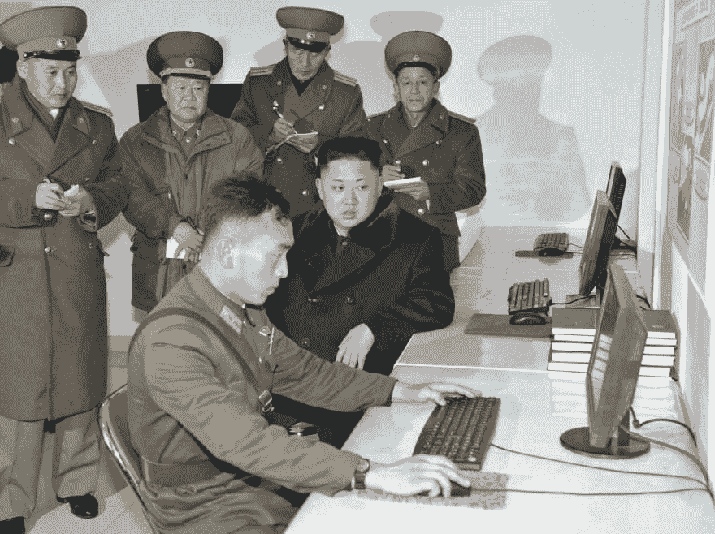

# 如何让设计师和开发者一起工作

> 原文：<https://dev.to/greghausheer/how-to-get-designers-and-developers-to-work-together-1c8l>

*原贴于[GregHausheer.com](https://www.greghausheer.com/articles/how-to-get-designers-and-developers-to-work-together)T3】*

如果你从事软件工作，你肯定经历过这种类型的冲突。无论你是设计师还是工程师，初级还是高级，在设计和开发团队之间传递工作时，你都会收到其他人的输出和想法:

什么他妈的？T2】‍
T4T6】

如果你是一名设计师，工程师的工作看起来一点也不像你在 Sketch 中创建的线框。当然可以。它有一个页眉、页脚和中间的内容。干得好，初级开发人员！其他的一切都是错的。字体系列。字体大小。填充和边距。全错了！它甚至不是设计师选的黄色...为什么工程师不直接从文件中抓取十六进制值？

它是双向的。

设计师为什么要打破格子？移动和平板视图在哪里？为什么他们为这么小的应用程序选择了 12 种不同的字体大小？他们选的黄色也不是 WCAG 能买到的。我应该只是猜测这个按钮的悬停状态吗？

如果这样的时刻没有发生在你身上，你在撒谎。无论你是自由职业者还是大型团队的一员，在这些通过或最终审核的时刻，房间里总会有紧张气氛。

无论你的团队多么专业或有经验，设计师和开发人员 **在一起工作时总会** 发生冲突，而且往往是“其他团队”的错。

设计师创造了一些漂亮但不实用的东西。开发人员问了太多问题，使工程过于复杂。这只是两种职业都面临的一些刻板印象，也是我最常被问到的问题:如何让设计和开发团队很好地合作。

这是你解决问题的方法。

### **1)有一个共享的、书面的、高度可见的工作范围，并在每次签到时亲自参考。**

如果你是一名自由职业者，你有多少次在没有书面工作范围或服务协议的情况下开始一个项目？在我的公司( [Lightmatter](https://www.lightmatter.com) )创业的第一年，我们就这样做了无数次。现在吗？从来没有。不管项目有多小，我们都不会在没有签署协议和收到项目保证金的情况下开工。

无论你是为客户工作的独立顾问，还是领导创意和工程团队的专注于产品的初创公司的项目经理，都没有关系:拥有一份共享的、书面的、高度可见的规范对于出色的工作来说是必不可少的。不要只是创建和分享一份谷歌文档，然后在会议中口头提及它。打印出来。在网上打开。在你参加 Sprint 会议的时候，如果其他人没有看，就把他们叫出来。

如果没有在每次会议上提出来，范围可能会漂移。我最喜欢与我们团队一起进行的事后检查是在与客户接洽后审查每份 SOW，并记录哪些项目发生了变化。对于我们第一年的一个客户，我们只需要创建线框，不知何故我们最终构建了一个完整的应用程序。我们是怎么被操纵到那种境地的？仔细观察范围，并在变更发生时记录变更请求。

那个客户对我们玩的心理游戏的道具。

‍

### **2)鼓励结对，早结常结。**

工程师们喜欢谈论结对编程的好处。在这种工作方式中，两个工程师一起用他们的代码构建一个特性或解决一个问题。一个是手指放在键盘上的“司机”，另一个是“导航员”，通常负责大声思考，并与对方讨论解决问题的最佳方法或途径。

编写干净代码最有效的方法是让别人来看。
‍
T2T4】

更进一步，尝试让你的设计师和开发人员在一起工作时“结对编程”。这意味着当设计师处理 UX、UI、色彩理论、动画、过渡、错误状态或任何其他设计决策时，工程师都在房间里。

一旦开发开始，让房间里的声音(礼貌地)将设计决策推向更有利的技术方向可以节省数周时间。当大部分工作是由工程师开发的时候，让一个设计师每天评论前端 UI 将会避免项目看起来一点也不像它们是如何被设计的。

结对很难。双方都会辩称，在各自的筒仓中工作将节省时间。有一种惰性需要满足，但是克服这种感觉可以防止更大的错误。
‍

### **3)妥协。**

当一个项目接近完成时，双方都会变得焦虑。布局可能不完全符合设计者的意图。但是工程师们抱怨并询问为什么他们不得不为 ie 浏览器设计某种功能，尽管他们请求不要支持那个浏览器。设计师沉迷于“像素完美”,而工程师则工作到他们对“完成”的定义看起来足够好。

当这个最后的推动发生时，最好的解决方案是要求一个妥协，每个团队收到有限数量的“必备品”。

由您决定数量，但这迫使团队优先考虑最重要的事情。对于设计师来说，一个例子可能是需要自定义字体，即使这意味着工程师需要在不同的浏览器上进行更多的样式设计和测试。对于开发人员来说，可以将媒体查询从 3 个减少到 2 个，从而简化维护布局所需的代码量。

让每个团队让步也能培养和建立同情心。设计师了解为什么工程师为旧浏览器的样式而苦恼。开发人员意识到在色彩理论和布局决策上要做多少工作。这个阶段的轻微冲突有利于团队体验。它建立友谊、信任，并迫使每个团队在最终选择时更具创造性和选择性。
‍

### **如果还是不行呢？‍**

不管你的规范有多详细，你结对编程的频率有多高，或者你做出了什么样的妥协，你所工作的团队仍然可能无法和睦相处。

再多的流程、清单或检查都无法解决这个问题，这归结为替换人员或重新关注不同的项目。但是有了这样的策略，你就可以在项目的早期发现冲突，而不是等到最后的阶段，那时可能已经太晚了。