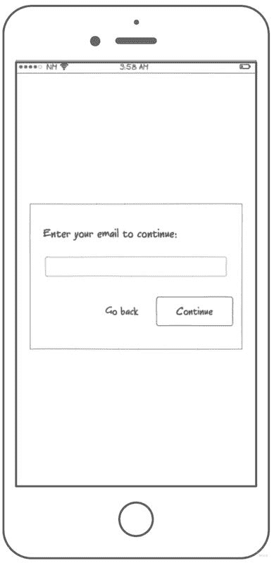
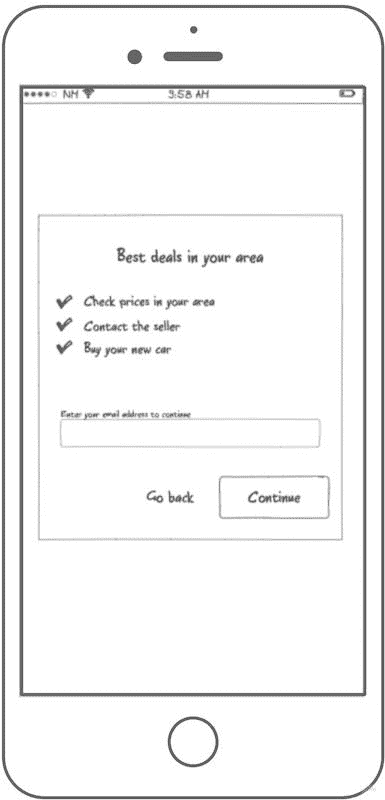
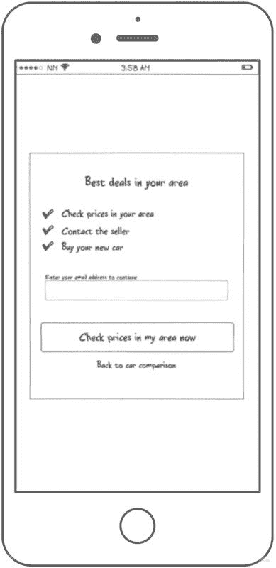

# 如何从用户那里获取信息，最大限度地降低丢失信息的风险

> 原文：<https://dev.to/mfco/how-to-get-information-from-your-user-minimizing-the-risk-of-losing-them-ocn>

## 你值得我的信息吗？

向我们的用户询问信息总是很难。这通常是那里每个 UX 设计师主要关心的问题之一。如果你要求电子邮件太早，用户可能会离开网站，因为它没有提供足够的信任给它他们的电子邮件。如果你要求的太晚，他们可能已经得到了他们想要的全部价值。

有时，这些信息对您的业务至关重要。如果你的公司通过电子邮件活动抓住了大部分客户，你应该优化从访问者那里获取电子邮件。每一个你没有收到邮件的访问者都是一个潜在的损失。如果你花钱买线索，这甚至可能是一个真正的损失。

这就是为什么你应该经常问自己，对于你所要求的信息，你向用户提出的价值是否公平。这是一个微妙的信任游戏，没有真正的答案，你应该适应你的需求和你的用户。

## 一些实际例子

找到添加这种新摩擦的正确位置非常重要，假设我们正在开发一个在线汽车销售应用程序。您的应用程序允许用户:

*   挑选汽车:根据型号、颜色、制造年代等选择汽车..阅读关于汽车的详细信息:关于汽车本身的具体信息。
*   检查他们所在地区的可用性:你所在地区的卖家提供他们想要的汽车。
*   购买汽车:通过填写个人信息并最终购买汽车来结束交易。

## 一切都关乎时机

首先，我们需要发现我们在哪里得到最大的下降，这可能是在他们的地区检查可用性和购买汽车之间，这是有意义的。在这一点上，我们让所有这些用户离开，没有询问他们的任何事情，没有可能通过营销活动重新吸引他们，什么都没有。

这就是为什么我们将在流程的某个点强制填写您的电子邮件。现在的问题是:我们应该在哪里增加这个摩擦力？正如我们之前讨论的，如果我们做得太早，我们可能会失去大部分的流量。

现在是时候考虑是什么让你的产品与众不同，增加最大的价值了，在这种情况下，很明显，查看你附近的可用性是一个很大的价值，也就是说，我们将要求提供电子邮件，以换取显示他们所在地区的可用性。

通过这种方式，我们还允许低意向用户通过阅读关于汽车的详细信息来与我们的页面建立信任，这样当他们准备好进行下一步时，他们就可以这样做了。每个用户都从你的应用中获得价值，重要的是不要排除低级意图。

## 重复你询问信息的方式

我们将在一个模态中请求信息，但是有不同的方法，让我们首先看一个在基本模态中请求电子邮件的非常简单的方法。

这第一次迭代缺少一些重要的东西，它没有阐明用户通过给你他们的电子邮件获得了什么。为什么有人会免费给你信息？向他们解释发送电子邮件的价值是很重要的。在这种情况下，他们将能够检查他们所在地区的卖家，并最终购买汽车。

作为最后一个小改动，我们可以改进一下`continue`的行动号召，它并不能真正吸引你的眼球，我们还可以给继续和后退按钮添加一些层次结构，让按下继续按钮更吸引人。这些小变化可能有助于在你希望的任何地方吸引用户的注意力。

现在，我们的模式正在为我们的用户增加价值，并让用户清楚该做什么。你还应该添加一些关于他们接受你的政策的法律材料，或者表明如果你在欧盟，你是 GDPR 合规的。

## 一些额外的提示

*   使输入字段对用户来说更容易，例如，如果是电子邮件，请确保将类型添加到输入中。这些改进对用户体验有很大影响。
*   聪明一点，大多数时候当用户看到这些对话时，他们只是试图避免它们，所以你需要聪明一点，一个简单的做法是，例如不要禁用主行动号召，但是一旦他们点击了它，如果他们没有添加他们的电子邮件，只需自动聚焦到输入中，并添加一些小消息/显示错误，以表明这是强制继续。

## 结论

询问信息并不容易，你会有一个很大的下降率，但有时最好将你的用户过滤到一定程度。但最重要的是，你永远不要忘记让最终用户明白，他们信任你会赢得什么。