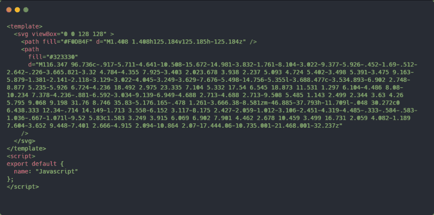
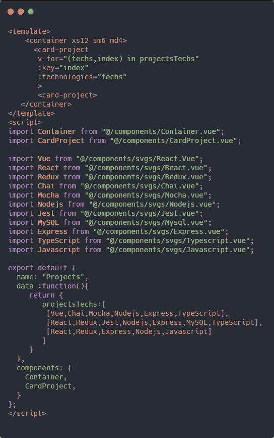
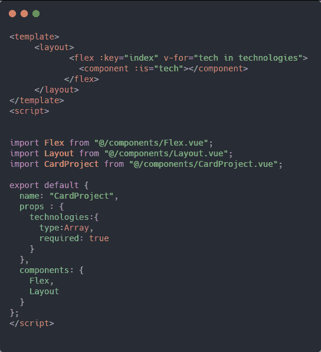
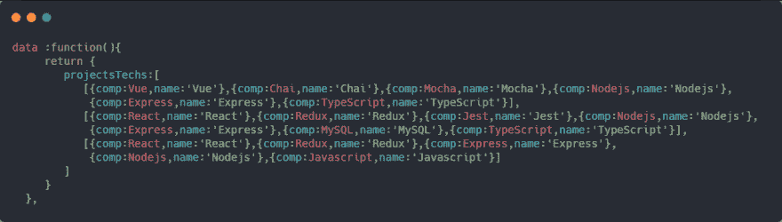
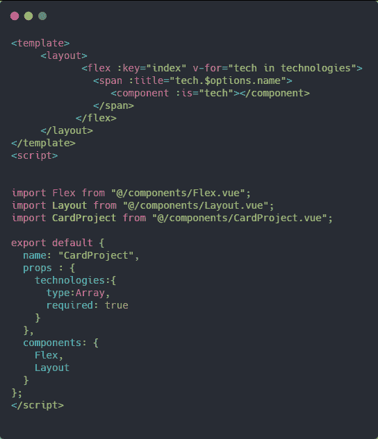
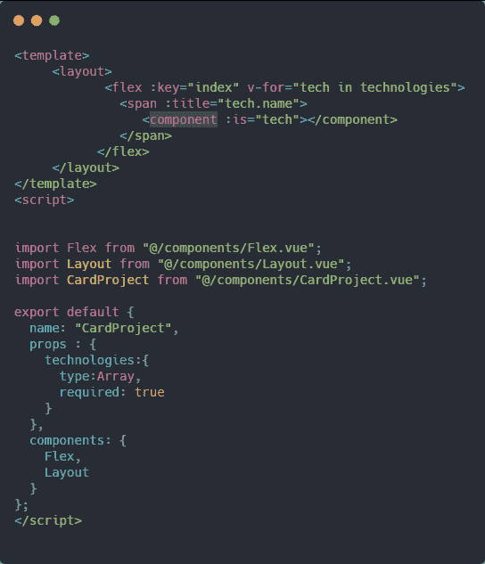

# 如何在遍历组件时获得组件的“名称”

> 原文：<https://dev.to/macmacky/how-to-get-the-name-of-a-component-when-looping-through-components-4341>

##### 大家下午好😄。

基本上，我今天在获取一个组件的**名**时遇到了一个问题，所以我可以在一个 **span** 标签中使用那个**名**作为动态属性**标题**。因此，当我悬停在该跨度上时，我可以看到该组件的名称**和**。

一个示例 SVG 组件。
[T3】](https://res.cloudinary.com/practicaldev/image/fetch/s--Elx7BJM_--/c_limit%2Cf_auto%2Cfl_progressive%2Cq_auto%2Cw_880/https://thepracticaldev.s3.amazonaws.com/i/j2kudskjkx10k1f0ldcm.png)

**Project.vue** 文件。
T3T5】

**CardProject.vue** 文件。
T3T5】

我想在带有**标题**属性的**组件**标签上方有一个**跨度**标签。

也许我们可以把我们的 **projectTechs** 数组改成这样。
T3T5】

使用这个会改变我们在 **v-for** 指令代码中的代码，它增加了很多代码，使我们的代码变得难看。我没有使用这种方法。所以我试着谷歌一下这个问题的解决方案，我发现得到组件的**名**，你必须使用这个**这个。$options.name** 。我试过用它。

[](https://res.cloudinary.com/practicaldev/image/fetch/s--mchJRmZO--/c_limit%2Cf_auto%2Cfl_progressive%2Cq_auto%2Cw_880/https://thepracticaldev.s3.amazonaws.com/i/34fxkn1gwa2rxdvzrjci.png)

它抛出了一个错误。

```
 vue.runtime.esm.js?2b0e:1888 TypeError: Cannot read property 'name' of undefined 
```

Enter fullscreen mode Exit fullscreen mode

这意味着在**技术**对象中没有**$选项**属性。

所以我尝试在控制台中记录**技术**阵列。
我发现数组中的每个组件都有一个**名为**的属性，您可以直接访问。

现在我的 **CardProject.vue** 文件是这样的。
T3T5】

#### 感谢阅读本帖。

### 祝大家愉快😃。