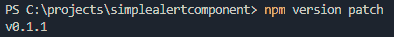
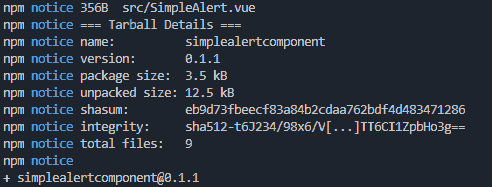
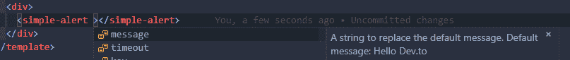
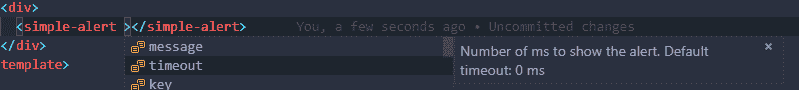

# 如何让您的共享 Vue 组件在 VScode 中显示智能感知

> 原文：<https://dev.to/amroessam/how-to-get-your-shared-vue-components-to-show-intellisense-in-vscode-42gk>

大家好👋🏽,

我最近创建了我的第一个 [vue 组件](https://www.npmjs.com/package/vgauge)，并把它推给了 npm。

我在这里写了它[，并在这里](https://dev.to/amroessam/vgauge---created-my-first-npm-package-first-post-446o)解释了如何创建类似的

我确保它有良好的文档记录并且易于使用，但是，我的同事指出，如果他在使用该组件时能够看到 intellisense，他会更喜欢，这可以解释他在使用该组件时的期望。

如果你用 vue 构建过任何东西，并且使用 vscode，我很确定你用过 [Vetur](https://marketplace.visualstudio.com/items?itemName=octref.vetur)

下面是 Vetur 提供的功能片段

> *   Syntax-highlighting
> *   part
> *   蚂蚁
> *   Lin Ting/error checking
> *   formatting
> *   Automatic completion
> *   shakedown test/debug

它也有大约 1600 万次安装，所以它非常受欢迎。

在最近的[迭代](https://vuejs.github.io/vetur/CHANGELOG.html#_0-14-0-2018-11-26-vsix)中，他们增加了框架支持。

因此，为了在您的 vue 组件上获得智能感知和自动完成，我们需要在您的项目文件夹中添加 2 个 json 文件，并在`package.json`中引用它们，以让 vetur 向您展示智能感知和自动完成。

所以让我们开始吧。在本教程中，我将使用我之前创建的[包](https://github.com/amroessam/simplealertcomponent)

### 1。创建标签

如果您的包有多个标签，您可以开始定义它们的属性和描述。现在，我们只有一个标签，所以在你的项目根目录下创建一个新的`tags.json`文件，紧挨着`package.json`

```
//  tags.json  {  "simple-alert":  {  "attributes":  [  "message",  "timeout"  ],  "description":  "A simple alert"  }  } 
```

### 2。创建属性. json

现在我们创建一个`attributes.json`文件，它定义了每个单独的属性，如下所示

```
//  attributes.json  {  "simple-alert/message":  {  "type":  "string",  "description":  "A string to replace the default message. Default message: Hello Dev.to"  },  "simple-alert/timeout":  {  "type":  "number",  "description":  "Number of ms to show the alert. Default timeout: 0 ms"  }  } 
```

如您所见，我们首先定义了组件标签，然后在`tags.json`中定义了它支持哪些属性。然后我们定义每个标签的每个属性，它的预期类型，以及它在`attributes.json`文件中的描述

### 3。告诉维图尔要找哪些文件

在`package.json`中，我们添加了以下内容

```
//  package.json  ...  "vetur":  {  "tags":  "tags.json",  "attributes":  "attributes.json"  },  ... 
```

PS。如果您正在构建包，请将 tags.json 和 attributes.json 添加到 json 文件的 files 键中，这样当您推送 npm 时，它们就会包含在内。像这样。

```
//  package.json  ...  "files":  [  ...,  "attributes.json",  "tags.json"  ],  ... 
```

### 4。更新 git 和 npm

现在我们已经添加了 vetur 支持，我们需要将这些更新推送到 npm，这样当用户安装我们的包时，他们可以获得智能感知和自动完成功能

```
npm version patch 
```

这将使您的版本补丁增加 1，并将更新提交给 git

[](https://res.cloudinary.com/practicaldev/image/fetch/s--vcYRgDOe--/c_limit%2Cf_auto%2Cfl_progressive%2Cq_auto%2Cw_880/https://thepracticaldev.s3.amazonaws.com/i/feai67w374yhnhueh3a1.PNG)

现在我们推送 github

```
git push origin 
```

最后，我们将包重新发布给 npm

```
npm publish 
```

如果一切顺利，我们应该得到下面的

[](https://res.cloudinary.com/practicaldev/image/fetch/s--UD-nbki9--/c_limit%2Cf_auto%2Cfl_progressive%2Cq_auto%2Cw_880/https://thepracticaldev.s3.amazonaws.com/i/7x5gi31ea99uf7qp22rb.PNG)

现在，当任何人下载我们的包并试图使用它时，他们将在 vscode 中获得智能感知和自动完成，如下所示

[](https://res.cloudinary.com/practicaldev/image/fetch/s--uZKTwGDW--/c_limit%2Cf_auto%2Cfl_progressive%2Cq_auto%2Cw_880/https://thepracticaldev.s3.amazonaws.com/i/f3fjjngukiq8qa4yqd0c.PNG)

[](https://res.cloudinary.com/practicaldev/image/fetch/s--0lqkN3f---/c_limit%2Cf_auto%2Cfl_progressive%2Cq_auto%2Cw_880/https://thepracticaldev.s3.amazonaws.com/i/ckohy86e8tj64hzb8eh5.PNG)

我希望你们喜欢它，并发现它很有用。

如果你有任何问题，请随时在下面提出来😁