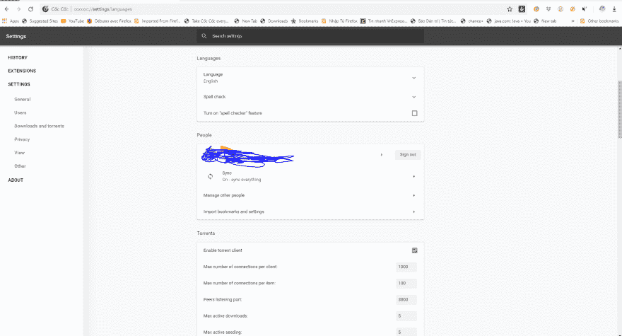
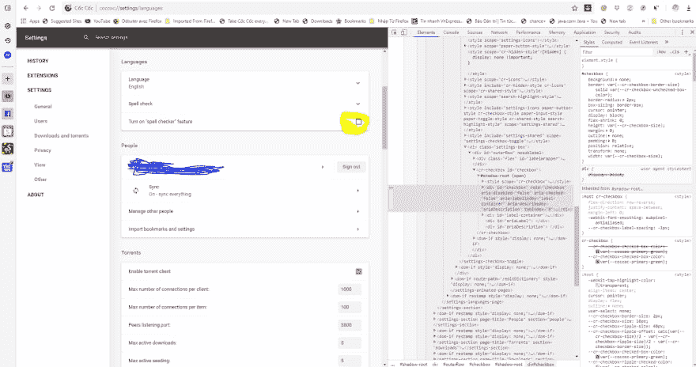
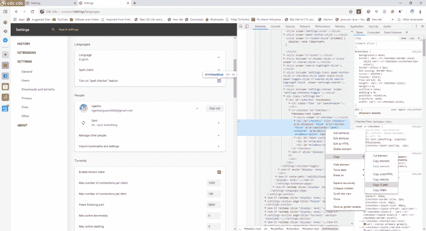
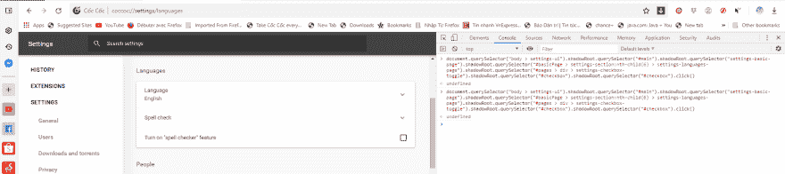
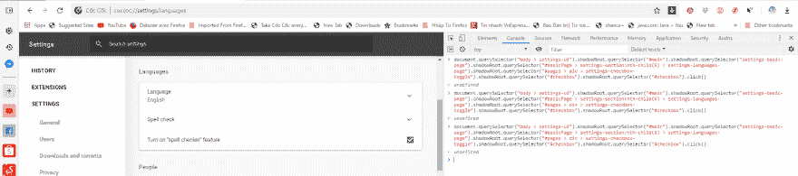

# 如何处理 Selenium 中的点击拦截错误

> 原文：<https://dev.to/cuongld2/how-to-handle-click-intercepted-error-in-selenium-3bj8>

亲爱的伙计们，作为一名 QA 自动化工程师，我必须使用 Selenium 处理大量 UI 测试。

有一件事让我很恼火，有时候，当我试图点击或者从元素中获取属性时，我通常会得到 selenium 异常错误。

在今天之前，我已经知道我可以在 Selenium 中使用 excute 脚本来执行 Javascript 查询。但这还不够。有时候还是点不到有针对性的按钮。

所以我今天得到的第一个建议是使用 Chrome 开发者工具。我会给你看下面的例子。这个页面有很多影子 DOM 元素，所以我们必须使用 javascript 与它们交互。

首先进入 coccoccoco://settings/languages 网站(如果你愿意，可以转到 chrome://settings)

[](https://res.cloudinary.com/practicaldev/image/fetch/s--wCsUn11a--/c_limit%2Cf_auto%2Cfl_progressive%2Cq_auto%2Cw_880/https://thepracticaldev.s3.amazonaws.com/i/r9vug1nuxuxvm81f3f3c.PNG)

我们将处理拼写检查按钮，尝试点击它。

[](https://res.cloudinary.com/practicaldev/image/fetch/s--x0hwlxeb--/c_limit%2Cf_auto%2Cfl_progressive%2Cq_auto%2Cw_880/https://thepracticaldev.s3.amazonaws.com/i/4pb3hqgad3827z2e8wud.PNG)

接下来右击元素选择 copy - JS 路径:

[](https://res.cloudinary.com/practicaldev/image/fetch/s--kap8ADqH--/c_limit%2Cf_auto%2Cfl_progressive%2Cq_auto%2Cw_880/https://thepracticaldev.s3.amazonaws.com/i/vf20noytw8xoyw4zco6e.png)

现在，您可以在 javascript 中使用 element.click 单击该复选框

[](https://res.cloudinary.com/practicaldev/image/fetch/s--eUb9qlYs--/c_limit%2Cf_auto%2Cfl_progressive%2Cq_auto%2Cw_880/https://thepracticaldev.s3.amazonaws.com/i/7tfcpj0m86n9hv4aaxt7.PNG)

结果将是:复选框被单击。

[](https://res.cloudinary.com/practicaldev/image/fetch/s--xM5Pq7cA--/c_limit%2Cf_auto%2Cfl_progressive%2Cq_auto%2Cw_880/https://thepracticaldev.s3.amazonaws.com/i/wpmo34n7ovvu86zp6qmz.PNG)

用 Python 来执行它，就像:

```
// BasePage Element for define how to deal with shadow root element

class BasePageElement(object):

    @staticmethod
    def select_shadow_element_by_css_selector(browser, selector):
        element = browser.execute_script('return arguments[0].shadowRoot', selector)
        return element

    def find_shadow_element(self, driver, *string_text):
        wait = WebDriverWait(driver, 20)
        i = 0
        root = wait.until(ec.presence_of_element_located((By.TAG_NAME, string_text[i])))
        # root = driver.find_element_by_tag_name(string_text[i])
        while len(string_text) > (i+1):
            i = i+1
            shadow_root = self.select_shadow_element_by_css_selector(driver, root)
            root = shadow_root.find_element_by_css_selector(string_text[i])
        return root

// Find element using shadow root

class CocCocSettingsElements(BasePageElement):

    def find_settings_toggle_button(self, driver):
        return self.find_shadow_element(driver, 'body > settings-ui', '#main', 'settings-basic-page',
                                 '#basicPage > settings-section:nth-child(6) > settings-languages-page',
                                        '#pages > div > settings-checkbox-toggle',
                                        '#checkbox')

// Click on the element in page object class

class SettingsPageObject:
    coccoc_settings_elements = CocCocSettingsElements()

    def choose_spell_checker(self, driver):
        element_outside = self.coccoc_settings_elements.find_settings_toggle_button(driver)
        driver.execute_script("arguments[0].click()", element_outside)

// Implement the test

class TestSettingsCocCoc:

    settings_page_object = SettingsPageObject()

    def test_login_testrail_success(self):
        driver = webdriver.Chrome()
        driver.maximize_window()
        try:
            driver.get(CocCocSettingsUrls.SETTINGS_LANGUAGES)
            time.sleep(2)
            self.settings_page_object.choose_spell_checker(driver)
        finally:
            driver.quit() 
```

哒哒！！！

对于任何问题或者你想得到示例代码，请在下面随意评论。