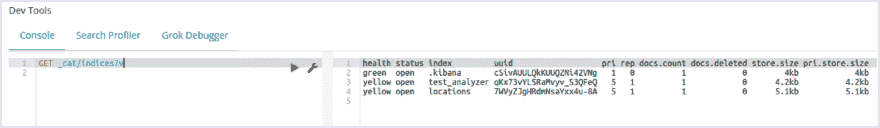
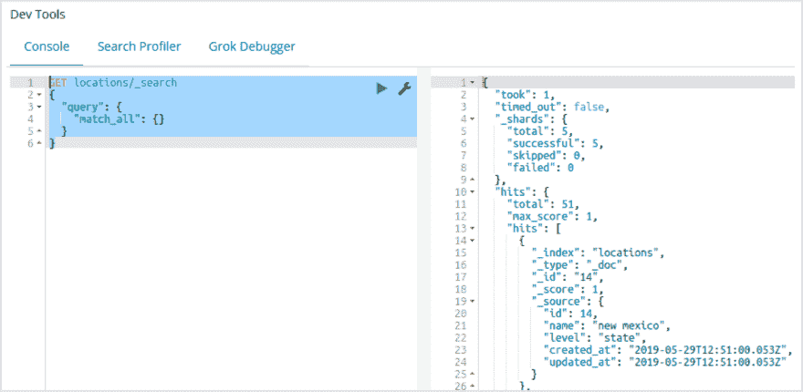
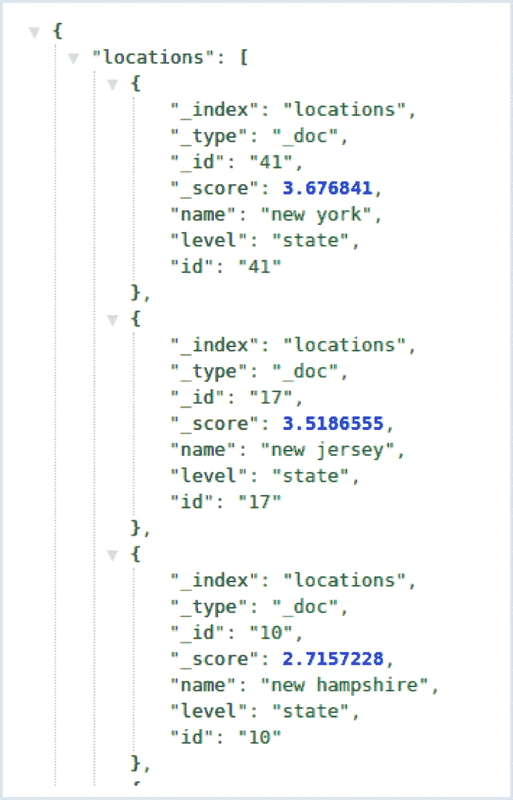

# 如何在 Rails Web 应用中实现 Elasticsearch？第二部分

> 原文：<https://dev.to/codicacom/how-to-implement-elasticsearch-in-a-rails-web-app-part-2-2c36>

*这篇文章最初发表在 [Codica 博客](https://www.codica.com/blog/developing-rails-web-app-with-elasticsearch/)上。*

今天，我们将为您提供文章的第二部分[如何在开发 Rails Web 应用程序时实现 Elasticsearch】。在这里，我们将讨论 Elasticsearch 实现的过程，添加功能，以及如何使用 API 进行研究。](https://www.codica.com/blog/developing-rails-web-app-with-elasticsearch/)

让我们开始吧。

## 第三步:使用 Rails 进行弹性搜索

要在 Rails 应用程序中实现 Elasticsearch，请将以下 gem 添加到 **Gemfile** :

```
gem 'elasticsearch-model'
gem 'elasticsearch-rails' 
```

Enter fullscreen mode Exit fullscreen mode

要安装这些 gem，请运行`bundle install`。

现在是时候给**地点**模型添加实际功能了。用所谓的`concerns`。

我们创建一个新的`app/models/concerns/searchable.rb`文件。

之后，我们添加以下代码片段:

```
module Searchable
  extend ActiveSupport::Concern

  included do
    include Elasticsearch::Model
    include Elasticsearch::Model::Callbacks
  end
end 
```

Enter fullscreen mode Exit fullscreen mode

将创建的模块包含到位置模型:

```
class Location < ApplicationRecord
  include Searchable
end 
```

Enter fullscreen mode Exit fullscreen mode

我们重现的步骤如下:

*   使用`Elasticsearch::Model`模块，将 Elasticsearch 集成添加到模型中。
*   用`Elasticsearch::Model::Callbacks`，添加回调。

现在，让我们索引我们的模型。

我们打开 Rails `rails c`控制台，启动`Location.import force: true`。

使用 force: true 选项，您可以构建一个不存在的索引。为了确保已经创建了索引，打开位于 [http://localhost:5601/](http://localhost:5601/) 的 Kibana dev tools 并插入`GET _cat/indices?v`。

因此，我们建立了名为**地点** :
[](https://res.cloudinary.com/practicaldev/image/fetch/s--gEfdoDB1--/c_limit%2Cf_auto%2Cfl_progressive%2Cq_auto%2Cw_880/https://thepracticaldev.s3.amazonaws.com/i/rtuu3yt5cunc3kvm6pcv.png) 的索引

索引是自动创建的。这意味着默认配置应用于所有字段。

现在我们将开发一个测试查询。在这里找到更多关于 Elasticsearch 查询 DSL [的信息。](https://www.elastic.co/guide/en/elasticsearch/reference/current/query-dsl.html)

打开 Kibana 开发工具，进入 [http://localhost:5601](http://localhost:5601) 。

插入片段:

```
GET locations/_search
{
  "query": {
    "match_all": {}

} 
```

Enter fullscreen mode Exit fullscreen mode

[](https://res.cloudinary.com/practicaldev/image/fetch/s--4wCfsqV4--/c_limit%2Cf_auto%2Cfl_progressive%2Cq_auto%2Cw_880/https://thepracticaldev.s3.amazonaws.com/i/kq79f1pcxapjin8knsp7.png)

不要忘记响应的 JSON 的 **hits** 属性，尤其是它的 **_source** 属性。考虑到**位置模型**中的所有字段都被序列化和索引。

要通过 Rails 应用程序进行测试查询，请打开`rails c`控制台并插入以下内容:

```
results = Location.search(‘san’)
results.map(&:name) # => ["san francisco", "american samoa"] 
```

Enter fullscreen mode Exit fullscreen mode

## 第 4 步:创建具有自动完成功能的定制索引

在这一步，我们必须删除以前的索引，然后创建一个新的。为此，只需打开`rails c Location.**elasticsearch**.delete_index!`。

现在是编辑`app/models/concerns/searchable.rb`文件的时候了。它看起来像这样:

```
module Searchable
 extend ActiveSupport::Concern

 included do
   include Elasticsearch::Model
   include Elasticsearch::Model::Callbacks

   def as_indexed_json(_options = {})
     as_json(only: %i[name level])
   end

   settings settings_attributes do
     mappings dynamic: false do
       indexes :name, type: :text, analyzer: :autocomplete
       indexes :level, type: :keyword
     end
   end

   def self.search(query, filters)
     set_filters = lambda do |context_type, filter|
       @search_definition[:query][:bool][context_type] |= [filter]
     end

     @search_definition = {
       size: 5,
       query: {
         bool: {
           must: [],
           should: [],
           filter: []

     if query.blank?
       set_filters.call(:must, match_all: {})
     else
       set_filters.call(
         :must,
         match: {
           name: {
             query: query,
             fuzziness: 1

     end

     if filters[:level].present?
       set_filters.call(:filter, term: { level: filters[:level] })
     end

     __elasticsearch__.search(@search_definition)
   end
 end

 class_methods do
   def settings_attributes

       index: {
         analysis: {
           analyzer: {
             autocomplete: {
               type: :custom,
               tokenizer: :standard,
               filter: %i[lowercase autocomplete]

           },
           filter: {
             autocomplete: {
               type: :edge_ngram,
               min_gram: 2,
               max_gram: 25

   end
 end
end 
```

Enter fullscreen mode Exit fullscreen mode

在这个代码片段中，我们使用 key `as_indexed_json`方法将模型属性序列化为 JSON。
事实上，我们将只处理两个字段，即`name`和`level` *:

```
 def as_indexed_json(_options = {})
     as_json(only: %i[name level])
   end 
```

Enter fullscreen mode Exit fullscreen mode

我们来定义一下指数配置:

```
 settings settings_attributes do
     mappings dynamic: false do
       # we use our autocomplete custom analyzer that we have defined above
       indexes :name,  type: :text, analyzer: :autocomplete
       indexes :level, type: :keyword
     end
   end

   def settings_attributes

       index: {
         analysis: {
           analyzer: {
             # we define custom analyzer with name autocomplete
             autocomplete: {
               # type should be custom for custom analyzers
               type: :custom,
               # we use standard tokenizer
               tokenizer: :standard,
               # we apply two token filters
               # autocomplete filter is a custom filter that we defined above
               filter: %i[lowercase autocomplete]

           },
           filter: {
             # we define custom token filter with name autocomplete
             autocomplete: {
               type: :edge_ngram,
               min_gram: 2,
               max_gram: 25

   end
 end 
```

Enter fullscreen mode Exit fullscreen mode

让我们用`standard tokenizer`和`lowercase`和`autocomplete`过滤器定义一个`autocomplete`定制分析器。

`Autocomplete`过滤器为`edge_ngram`型。`edge_ngram`分词器将文本拆分成更小的部分(克)。
比如，`“ruby”`这个词会被分成`[“ru”, “rub”, “ruby”]`。

当实现自动完成功能时，`edge_ngram`派上了用场。不过，还有一种方法可以整合所需的选项。它被称为[完井建议者](https://www.elastic.co/guide/en/elasticsearch/reference/current/search-suggesters-completion.html)方法。

我们使用带有**名称**和**级别**字段的映射。**关键字**数据类型应用于**级别**字段。**文本**数据类型用于**名称**字段和我们的自定义`autocomplete`分析器。

现在，我们将解释我们应用的**搜索**方法:

```
 def self.search(query, filters)
     # a lambda function adds conditions to a search definition
     set_filters = lambda do |context_type, filter|
       @search_definition[:query][:bool][context_type] |= [filter]
     end

     @search_definition = {
       # we indicate that there should be no more than 5 documents to return
       size: 5,
       # we define an empty query with the ability to
       # dynamically change the definition
       # Query DSL https://www.elastic.co/guide/en/elasticsearch/reference/current/query-dsl.html
       query: {
         bool: {
           must: [],
           should: [],
           filter: []

     # match all documents
     if query.blank?
       set_filters.call(:must, match_all: {})
     else
       set_filters.call(
         :must,
         match: {
           name: {
             query: query,
             # fuzziness means you can make one typo and still match your document
             fuzziness: 1

     end

     # the system will return only those documents that pass this filter
     if filters[:level].present?
       set_filters.call(:filter, term: { level: filters[:level] })
     end

     __elasticsearch__.search(@search_definition)
   end 
```

Enter fullscreen mode Exit fullscreen mode

打开 Rails 控制台并检查请求以确保项目正常工作:

```
rails c
results = Location.search('san francisco', {})
results.map(&:name) # => ["san francisco", "american samoa"] 
```

Enter fullscreen mode Exit fullscreen mode

此外，我们将验证产品性能是否正确，请求中是否有一些错误。目的是确保项目功能准确:

```
results = Location.search('Asan francus', {})
results.map(&:name) # => ["san francisco"] 
```

Enter fullscreen mode Exit fullscreen mode

我们定义了一个过滤器。由**电平**施加到**位置**滤波器。该数据库包含数据库中两个同名的对象，即 **New York** ，这两个对象的级别不同。第一层关系到国家，第二层关系到城市:

```
results = ation.import force: true=>"new york", :level=>"state"}

results = Location.search('new york', { level: city })
results.map { |result| { name: result.name, level: result.level } }
# [{:name=>"new york", :level=>"city"} 
```

Enter fullscreen mode Exit fullscreen mode

## 步骤#5:通过 API 使搜索请求可用

在最后阶段，我们将创建一个控制器，搜索查询将通过这个控制器:

```
rails generate controller Home search 
```

Enter fullscreen mode Exit fullscreen mode

为此，打开**app/controllers/home _ controller . Rb**并在其中插入以下代码片段:

```
class HomeController < ApplicationController
 def search
   results = Location.search(search_params[:q], search_params)

   locations = results.map do |r|
     r.merge(r.delete('_source')).merge('id': r.delete('_id'))
   end

   render json: { locations: locations }, status: :ok
 end

 private

 def search_params
   params.permit(:q, :level)
 end
end 
```

Enter fullscreen mode Exit fullscreen mode

要查看项目性能，通过键入`rails s`运行 Rails 服务器，然后导航到`[http://localhost:3000//home/search?q=new&level=state](http://localhost:3000//home/search?q=new&level=state)`。

在代码中，我们要求所有包含**名称“new”**并且其**级别**等于状态的文件。

响应看起来像:
[](https://res.cloudinary.com/practicaldev/image/fetch/s--Ef8eLoqE--/c_limit%2Cf_auto%2Cfl_progressive%2Cq_auto%2Cw_880/https://thepracticaldev.s3.amazonaws.com/i/aljkzl3bveue45but8qr.png)

我们的测试 Rails web 应用程序已经准备好了，搜索服务的基本功能已经实现。

## 结论

在这里，我们向您展示了关于 Elasticsearch 与 Rails web app 集成的文章的第二部分，希望我们的教程对您有所帮助。
敬请关注，点击此处阅读全文:[开发 Rails Web 应用时如何实现 Elasticsearch】。](https://www.codica.com/blog/developing-rails-web-app-with-elasticsearch/)