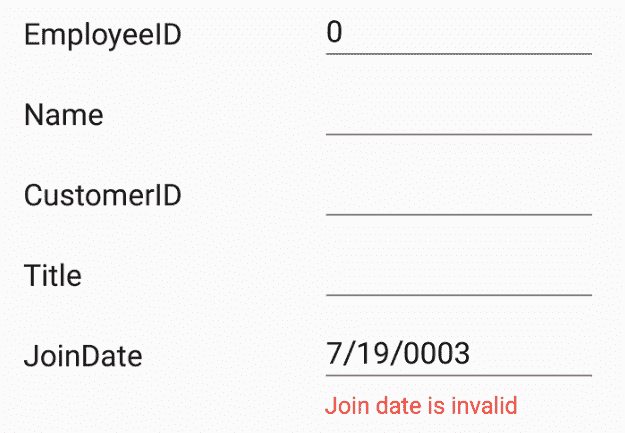
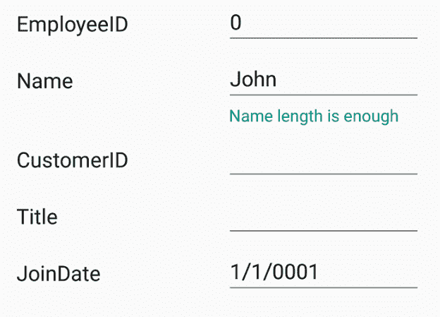
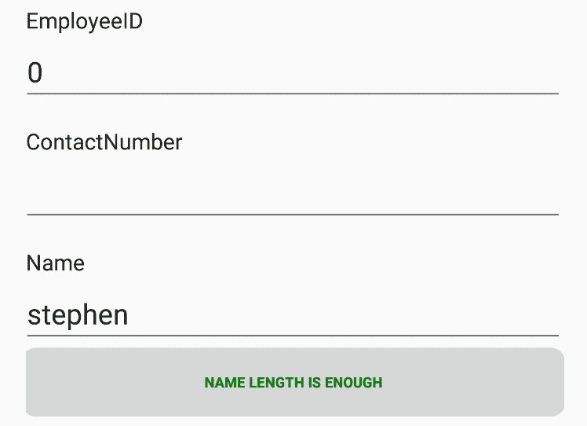
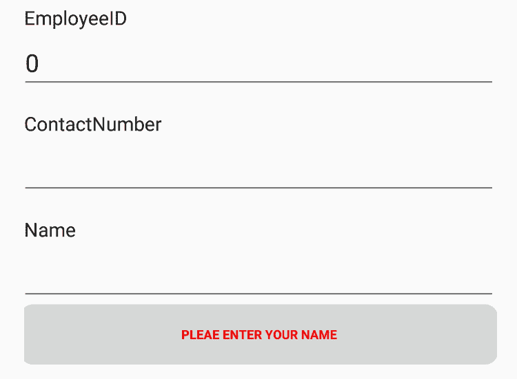

# 如何实现 Xamarin 表单验证

> 原文：<https://dev.to/syncfusion/how-to-implement-xamarin-forms-validation-5f8p>

当用户界面企业应用程序接收输入时，一个常见的需求是验证所提供的信息(如电子邮件地址、密码、电话号码)。这是为了确保它满足进一步处理所需的格式和范围。您可以在遵循 MVVM 模式的同时，通过使用内置验证(如 [INotifyDataErrorInfo](https://docs.microsoft.com/en-us/dotnet/api/system.componentmodel.inotifydataerrorinfo?view=netframework-4.7.2) 和数据注释)来验证用户界面控件中的数据。

在这篇博客中，我将介绍如何在 Syncfusion Xamarin 中的数据上实现 Xamarin 表单验证。表单[数据表单](https://www.syncfusion.com/xamarin-ui-controls/dataform)控件。如果你是数据表单控件的新手，请在继续写这篇博客之前阅读[数据表单入门](https://help.syncfusion.com/xamarin/sfdataform/getting-started)文档。

数据表单验证数据，并在失败时显示错误消息。该错误信息显示在编辑器的底部。

## 内置验证

我们可以使用以下方法在数据表单控件中验证 MVVM 中的字段:

*   INotifyDataErrorInfo
*   数据注释

### INotifyDataErrorInfo

您可以通过在数据对象类中实现 [INotifyDataErrorInfo](https://docs.microsoft.com/en-us/dotnet/api/system.componentmodel.inotifydataerrorinfo?view=netframework-4.7.2) 接口来验证数据。下面的代码示例说明了同样的情况。

```
public class EmployeeInfo: INotifyDataErrorInfo, INotifyPropertyChanged
{
    private int _EmployeeID;
    private string _Name;
    private string _Title;

    public event PropertyChangedEventHandler PropertyChanged;
    public event EventHandler ErrorsChanged;

    public EmployeeInfo()
    {

    }
    public int EmployeeID
    {
        get { return this._EmployeeID; }
        set
        {
            this._EmployeeID = value;
            this.RaisePropertyChanged("EmployeeID");
        }
    }
    public string Name
    {
        get { return this._Name; }
        set
        {
            this._Name = value;
            this.RaisePropertyChanged("Name");
        }
    }
    public string Title
    {
        get { return this._Title; }
        set
        {
            this._Title = value;
            this.RaisePropertyChanged("Title");
        }
    }

    [Display(AutoGenerateField = false)]
    public bool HasErrors
    {
        get
        {
            return false;
        }
    }
    private void RaisePropertyChanged(string propertyName)
    {
        if (PropertyChanged != null)
            PropertyChanged(this, new PropertyChangedEventArgs(propertyName));
    }
    public IEnumerable GetErrors(string propertyName)
    {
        var list = new List();
        if (!propertyName.Equals("Title"))
            return list;

        if (this.Title.Contains("Marketing"))
            list.Add("Marketing is not allowed");
        return list;
    }
} 
```

### 数据注释

使用数据注释属性验证数据字段将在以下主题中进行说明。

#### 数字验证

您可以在数字和数字加减编辑器中使用 [Range](https://help.syncfusion.com/cr/cref_files/xamarin/Syncfusion.SfDataForm.XForms~Syncfusion.XForms.DataForm.RangeAttribute.html) 属性来验证数字类型，如 int、double 和 decimal 属性。

```
private int employeeID;
[Range(1000, 1500, ErrorMessage = "EmployeeID should be between 1000 and 1500")]
public int EmployeeID
{
    get { return this.employeeID; }
    set
    {
        this.employeeID = value;
        this.RaisePropertyChanged("EmployeeID");
    }
} 
```

#### 电话号码验证

您可以使用 [StringLength](https://help.syncfusion.com/cr/cref_files/xamarin/Syncfusion.SfDataForm.XForms~Syncfusion.XForms.DataForm.StringLengthAttribute.html) 属性来验证电话号码的长度。

```
[StringLength(10, ErrorMessage = "Phone number should have 10 digits.")]
public string ContactNumber
{
    get { return this.contactNumber; }
    set
    {
        this.contactNumber = value;
        this.RaisePropertyChanged("ContactNumber");
        this.GetErrors("ContactNumber");
    }
} 
```

由于电话号码格式因国家而异，您也可以使用正则表达式和 [INotifyDataErrorInfo](https://docs.microsoft.com/en-us/dotnet/api/system.componentmodel.inotifydataerrorinfo?view=netframework-4.7.2) 来验证它。

#### 必填字段验证

如果应用程序中的任何字段是必填的，请使用[必填的](https://help.syncfusion.com/cr/cref_files/xamarin/Syncfusion.SfDataForm.XForms~Syncfusion.XForms.DataForm.RequiredAttribute.html)属性来验证数据。

```
private string name;

[Required(AllowEmptyStrings = false, ErrorMessage = "Name should not be empty")]
public string Name
{
    get { return this.name; }
    set
    {
        this.name = value;
        this.RaisePropertyChanged("Name");
    }
} 
```

#### 电子邮件验证

您可以使用 [EmailAddress](https://help.syncfusion.com/cr/xamarin/Syncfusion.SfDataForm.XForms~Syncfusion.XForms.DataForm.EmailAddressAttribute.html) 属性来验证电子邮件 ID。

```
private string email;

[EmailAddress(ErrorMessage = "Please enter a valid e-mail id.")]
public string Email
{
    get { return this.email; }
    set
    {
        this.email = value;
        this.RaisePropertyChanged("Email");
        this.GetErrors("Email");
    }
} 
```

#### 密码验证

要验证在表单中输入的新密码，可以使用正则表达式和 [INotifyDataErrorInfo](https://docs.microsoft.com/en-us/dotnet/api/system.componentmodel.inotifydataerrorinfo?view=netframework-4.7.2) 。

```
private Regex passwordRegExp = new Regex("((?=.*\\d)(?=.*[a-z])(?=.*[A-Z])(?=.*[@#$%]).{6,20})");

private string password;
[DataType(DataType.Password)]
public string Password
{
    get { return this.password; }
    set
    {
        this.password = value;
        this.RaisePropertyChanged("Password");
    }
}

public IEnumerable GetErrors(string propertyName)
{
    var list = new List();
    if (!propertyName.Equals("Password"))
        return list;

    if (!this.passwordRegExp.IsMatch(this.Password))
    {
        list.Add("Password must contain at least one digit, one uppercase character and one special symbol");
    }
    return list;
} 
```

#### 字符串长度验证

您可以在文本编辑器中使用 [StringLength](https://help.syncfusion.com/cr/cref_files/xamarin/Syncfusion.SfDataForm.XForms~Syncfusion.XForms.DataForm.StringLengthAttribute.html) 属性来验证任何属性值的长度。

```
private string name;

[Required(AllowEmptyStrings = false, ErrorMessage = "Name should not be empty")]
[StringLength(10, ErrorMessage = "Name should not exceed 10 characters")]
public string Name
{
    get { return this.name; }
    set
    {
        this.name = value;
        this.RaisePropertyChanged("Name");
    }
} 
```

您还可以指定字符串属性的最小和最大字符长度。

```
private string title;
[MinLength(5, ErrorMessage = "Title should be at least 5 characters.")]
[MaxLength(15, ErrorMessage = "Title should not exceed 15 characters.")]
public string Title
{
    get { return this.title; }
    set
    {
        this.title = value;
        this.RaisePropertyChanged("Title");
    }
} 
```

#### 日期范围验证

要在日期编辑器中检查日期范围，需要使用 [DateRange 属性](https://help.syncfusion.com/cr/cref_files/xamarin/Syncfusion.SfDataForm.XForms~Syncfusion.XForms.DataForm.RangeAttribute.html)指定最小和最大日期范围。

```
private DateTime joinedDate;
[DateRange(MinYear = 2010, MaxYear = 2017, ErrorMessage = "Joined date is invalid")]
public DateTime JoinedDate
{
    get
    {
        return joinedDate;
    }
    set
    {
        joinedDate = value;
    }
} 
```

[](https://res.cloudinary.com/practicaldev/image/fetch/s--vrD6L9sZ--/c_limit%2Cf_auto%2Cfl_progressive%2Cq_auto%2Cw_880/https://blog.syncfusion.com/wp-content/uploads/2019/05/Date-Range-Xamarin-Forms-Validation.png) 

<figure>

<figcaption>日期范围 Xamarin 表单验证</figcaption>

</figure>

数据表单中还提供了以下属性来验证字段。

[电子邮件地址属性](https://help.syncfusion.com/cr/cref_files/xamarin/Syncfusion.SfDataForm.XForms~Syncfusion.XForms.DataForm.EmailAddressAttribute.html)

[最大长度属性](https://help.syncfusion.com/cr/cref_files/xamarin/Syncfusion.SfDataForm.XForms~Syncfusion.XForms.DataForm.MaxLengthAttribute.html)

[最小长度属性](https://help.syncfusion.com/cr/cref_files/xamarin/Syncfusion.SfDataForm.XForms~Syncfusion.XForms.DataForm.MinLengthAttribute.html)

## 验证模式

[验证模式](http://help.syncfusion.com/cr/cref_files/xamarin-android/Syncfusion.SfDataForm.Android~Syncfusion.Android.DataForm.SfDataForm~ValidationMode.html)决定何时验证该值。支持的验证模式有:

*   **lost focus**—当编辑器失去焦点时，发生值验证。
*   **property changed**—每当值发生变化时，立即进行值验证。
*   **显式**—通过调用[验证](https://help.syncfusion.com/cr/cref_files/xamarin/Syncfusion.SfDataForm.XForms~Syncfusion.XForms.DataForm.SfDataForm~Validate().html)或 [SfDataForm 手动验证值。Validate (propertyName)](https://help.syncfusion.com/cr/cref_files/xamarin/Syncfusion.SfDataForm.XForms~Syncfusion.XForms.DataForm.SfDataForm~Validate(String).html) 方法。

**显式模式**

显式验证模式是指不管元素的状态如何都执行验证过程，即。，它可以根据需要随时执行。您可以使用以下代码验证数据对象中所有属性的值。

```
bool isValid = dataForm.Validate(); 
```

若要验证特定属性的值，请将属性名作为参数传递。

```
bool isPropertyValid = dataForm.Validate("PropertyName"); 
```

## 通过事件进行自定义验证

您还可以使用 DataForm 的[验证](https://help.syncfusion.com/cr/cref_files/xamarin/Syncfusion.SfDataForm.XForms~Syncfusion.XForms.DataForm.SfDataForm~Validating_EV.html)事件来验证表单中输入的数据。

```
dataForm.Validating += DataForm_Validating;
private void DataForm_Validating(object sender, ValidatingEventArgs e)
{
    if (e.PropertyName == "Name")
    {
        if (e.Value != null &amp;&amp; e.Value.ToString().Length &gt; 8)
        {
            e.IsValid = false;
            e.ErrorMessage = "Name should not exceed 8 characters";
        }
    }
} 
```

您可以使用此事件的[流畅验证](https://fluentvalidation.net/start)来验证数据。

使用数据表单的 [Validated](https://help.syncfusion.com/cr/cref_files/xamarin/Syncfusion.SfDataForm.XForms~Syncfusion.XForms.DataForm.SfDataForm~Validated_EV.html) 事件完成验证后，您可以收到通知。

```
dataForm.Validated += DataForm_Validated;
private void DataForm_Validated(object sender, ValidatedEventArgs e)
{
    var isValid = e.IsValid;
    var propertyName = e.PropertyName;
} 
```

## 有效或积极的信息

如果该值符合所需的标准，则可以显示有效或积极的消息。与错误消息一样，有效消息也将显示在编辑器的底部。

```
private string name;
[DisplayOptions(ValidMessage = "Name length is enough")]
[StringLength(10, ErrorMessage = "Name should not exceed 10 characters")]
public string Name
{
    get { return this.name; }
    set
    {
        this.name = value;
        this.RaisePropertyChanged("Name");
    }
} 
```

[](https://res.cloudinary.com/practicaldev/image/fetch/s--f9O-B-6R--/c_limit%2Cf_auto%2Cfl_progressive%2Cq_auto%2Cw_880/https://blog.syncfusion.com/wp-content/uploads/2019/05/Valid-message-Xamarin-Forms-Validation.png) 

<figure>

<figcaption>有效消息- Xamarin 表单验证</figcaption>

</figure>

您可以验证所有编辑器的值，例如条目、数字、复选框、选取器、日期或时间。

## 验证标签定制

您可以使用 DataForm 控件的 [ValidationTemplate](https://help.syncfusion.com/cr/cref_files/xamarin/Syncfusion.SfDataForm.XForms~Syncfusion.XForms.DataForm.SfDataForm~ValidationTemplate.html) 属性来自定义验证标签的默认视图。它允许您为每个验证消息选择不同的数据模板，根据特定条件定制验证消息的外观。

```
<ContentPage.Resources>
    <ResourceDictionary>
        <local:TemplateSelector x:Key="validationDataTemplateSelector" />
    </ResourceDictionary>
</ContentPage.Resources>

<dataForm:SfDataForm Grid.Row="1" x:Name="dataForm" ValidationTemplate="{StaticResource validationDataTemplateSelector}" /> 
```

#### 为验证消息创建不同的模板

下面的代码显示了每个字段的不同模板。

```
<Grid xmlns="http://xamarin.com/schemas/2014/forms"
             xmlns:x="http://schemas.microsoft.com/winfx/2009/xaml"
             x:Class="DataForm_Validation.ValidMessageTemplate" 
    VerticalOptions="FillAndExpand" HorizontalOptions="FillAndExpand">
    <Grid BackgroundColor="Transparent">
        <Button x:Name="maingrid"  CornerRadius="8"  Text="Name length is enough" FontSize="9" TextColor="Green" VerticalOptions="FillAndExpand" HorizontalOptions="FillAndExpand"/>
   </Grid>
</Grid> 
```

```
<Grid xmlns="http://xamarin.com/schemas/2014/forms"
             xmlns:x="http://schemas.microsoft.com/winfx/2009/xaml"
             x:Class="DataForm_Validation.InValidMessageTemplate"
    VerticalOptions="FillAndExpand" HorizontalOptions="FillAndExpand">
    <Grid BackgroundColor="Transparent">
        <Button x:Name="maingrid"  CornerRadius="8" Text="Please enter your first name" FontSize="9" TextColor="White" VerticalOptions="FillAndExpand" HorizontalOptions="FillAndExpand"/>
  </Grid>
</Grid> 
```

#### 根据条件选择不同的模板

在 DataTemplateSelector 中，可以根据 [DataFormItem](https://help.syncfusion.com/cr/cref_files/xamarin/Syncfusion.SfDataForm.XForms~Syncfusion.XForms.DataForm.DataFormItem.html) 有条件地返回所需的模板。

```
public class TemplateSelector : DataTemplateSelector
{
    public DataTemplate ValidMessageTemplate { get; set; }
    public DataTemplate InvalidMessageTemplate { get; set; }     
    public DataTemplate LastNameTemplate { get; set; }
    public DataTemplate EmailTemplate { get; set; }
    public DataTemplate ContactNumberTemplate { get; set; }

    public TemplateSelector()
    {
        ValidMessageTemplate = new DataTemplate(typeof(ValidMessageTemplate));
        InvalidMessageTemplate = new DataTemplate(typeof(InValidMessageTemplate));
        EmailTemplate = new DataTemplate(typeof(EmailTemplate));
        ContactNumberTemplate = new DataTemplate(typeof(ContactNumberTemplate));
    }

    protected override DataTemplate OnSelectTemplate(object item, BindableObject container)
    {
        var dataform = (container as SfDataForm);
        if (dataform == null) return null;
        if (dataform != null)
        {
            if ((item as DataFormItem).LabelText == "First Name")
            {
                if (!(item as DataFormItem).IsValid)
                {
                    return InvalidMessageTemplate;
                }
                else
                {
                    return ValidMessageTemplate;
                }
            }
            else if ((item as DataFormItem).LabelText == "Email")
            {
                if (!(item as DataFormItem).IsValid)
                {
                    return EmailTemplate;
                }
            }
            else if ((item as DataFormItem).LabelText == "Contact Number")
            {
                if (!(item as DataFormItem).IsValid)
                {
                    return ContactNumberTemplate;
                }
            }
            return null;
        }
        else
            return null;

    }    
} 
```

下面的屏幕截图显示了使用上述代码完成的验证消息定制。

[](https://res.cloudinary.com/practicaldev/image/fetch/s--qnUZ007s--/c_limit%2Cf_auto%2Cfl_progressive%2Cq_auto%2Cw_880/https://blog.syncfusion.com/wp-content/uploads/2019/05/Customized-valid-template.png) 

<figure>

<figcaption>定制有效模板</figcaption>

</figure>

[](https://res.cloudinary.com/practicaldev/image/fetch/s--ivUWLHhp--/c_limit%2Cf_auto%2Cfl_progressive%2Cq_auto%2Cw_880/https://blog.syncfusion.com/wp-content/uploads/2019/05/Customized-invalid-template.png) 

<figure>

<figcaption>定制无效模板</figcaption>

</figure>

## 结论

在这篇博文中，我们看到了如何在 Syncfusion [数据表单](https://www.syncfusion.com/products/xamarin/data-form)控件中验证数据。在这个 [GitHub 位置](https://github.com/SyncfusionExamples/dataform-validatation)可以找到这个例子。请随意试用此示例，并在评论部分提供您的反馈或问题。你可以在我们的[文档](https://help.syncfusion.com/xamarin/sfdataform/getting-started)中探索数据表单控件的其他特性。

如果您对这些功能有任何疑问或需要澄清，请在下面的评论中告诉我们。您也可以通过我们的[支持论坛](https://www.syncfusion.com/forums)、[直接跟踪](https://www.syncfusion.com/support/directtrac/)或[反馈门户](https://www.syncfusion.com/feedback/)联系我们。我们很乐意为您提供帮助！

帖子[如何实现 Xamarin 表单验证](https://www.syncfusion.com/blogs/post/how-to-implement-xamarin-forms-validation.aspx)最早出现在 [Syncfusion 博客](https://www.syncfusion.com/blogs)上。