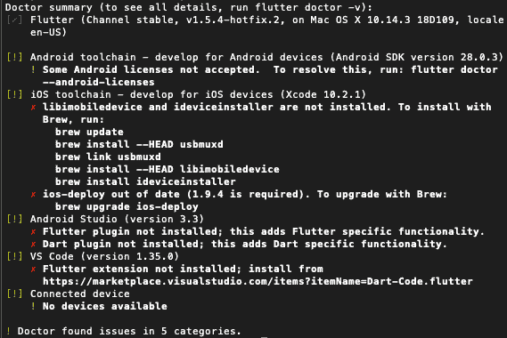
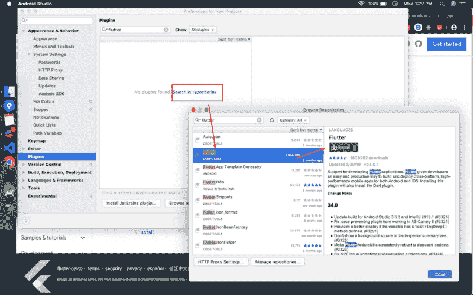
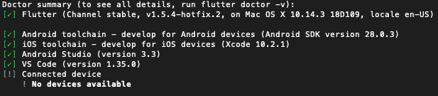
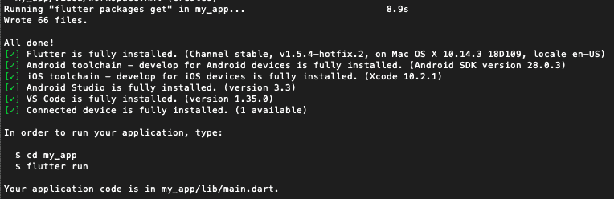
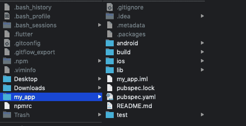
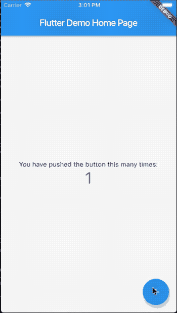

# 如何在 Mac 和 Windows 上安装 Flutter

> 原文：<https://dev.to/enappd/how-to-install-flutter-on-mac-windows-339>

* * *

在本帖中，我们将对应用开发市场的最新热点 Flutter 进行概述。Flutter 比其他任何框架都更受欢迎。有人说这是谷歌对脸书 React Native 的回应，但这一争论是以后的事了。让我们学习一下 Flutter 的基础知识，以及如何开始使用它。

### 什么是颤振？

lutter 是谷歌的便携式 UI 工具包，用于在创纪录的时间内为手机、网络和桌面创造高质量的本地体验。Flutter 与现有代码一起工作，被世界各地的开发人员和组织使用，并且是免费和开源的。

### Flutter 是做什么的？

对于用户来说，Flutter 让漂亮的 app UIs 变得栩栩如生。

对于开发者来说，Flutter 降低了构建移动应用的门槛。它加快了移动应用程序的开发，降低了 iOS 和 Android 上应用程序生产的成本和复杂性。

对于设计师来说，Flutter 有助于提供原始的设计愿景，而不会损失保真度或妥协。它也是一个高效的原型工具。

### Flutter 是用什么技术打造的？

Flutter 是用 C、C++、Dart 和 Skia(一个 2D 渲染引擎)构建的。请参见此[架构图](https://docs.google.com/presentation/d/1cw7A4HbvM_Abv320rVgPVGiUP2msVs7tfGbkgdrTy0I/edit#slide=id.gbb3c3233b_0_162)以更好地了解主要组件。

### 为什么要用 Flutter？

*   从单一代码库为 iOS 和 Android 开发
*   借助现代、富于表现力的语言和声明式方法，即使在单一操作系统上，也可以用更少的代码做更多的事情
*   在应用程序运行时，通过更改代码和重新加载来进行试验(使用热重新加载)
*   修复崩溃并从应用程序停止的地方继续调试
*   受益于使用 Flutter 自己的框架构建的丰富的材料设计和 Cupertino (iOS 风格)小部件
*   实现定制的、漂亮的、品牌驱动的设计，没有 OEM 部件集的限制

* * *

### 如何在 Windows 上安装 Flutter？

#### 最低系统要求

*   **操作系统:** Windows 7 或更高版本[64 位]
*   **磁盘空间:** 400 MB
*   [**Git for Windows**](https://git-scm.com/download/win)

#### 获取 Flutter SDK

1.  在这里下载最新的 Flutter SDK
2.  在`C:\flutter`中解压下载的 zip 文件。
3.  在`flutter`目录中找到`flutter_console.bat`，双击启动。

#### 更新您的路径

如果您希望在常规的 Windows 控制台中运行 Flutter 命令，采取以下步骤将 Flutter 添加到`PATH`环境变量中:

*   从开始搜索栏中，键入“env”并选择**编辑您帐户的环境变量**
*   在**用户变量**下，检查是否有一个名为**路径**的条目:
*   如果条目确实存在，使用`;`作为现有值的分隔符，将完整路径附加到`flutter\bin`。
*   如果条目不存在，创建一个名为`Path`的新用户变量，将`flutter\bin`的完整路径作为其值。

> 请注意，要使这些更改生效，您必须关闭并重新打开任何现有的控制台窗口。

#### 运行颤振医生

在路径中有 Flutter 目录的控制台窗口中(见上文)，运行以下命令，查看是否存在完成设置所需的任何平台依赖性:

```
C:\flutter>flutter doctor
```

这个命令检查您的环境，并显示您的颤振安装状态的报告。仔细检查您可能需要安装的其他软件或要执行的进一步任务的输出(显示在**粗体**文本中)。

**例如:**

```
[-] Android toolchain - develop for Android devices
    • Android SDK at C:\Android\sdk
    ✗ Android SDK is missing command line tools; download from [https://goo.gl/XxQghQ](https://goo.gl/XxQghQ)
    • Try re-installing or updating your Android SDK,
     visit https://flutter.dev/setup/#android-setup for detailed instructions.
```

### Android 设置

> Flutter 依赖于 Android Studio 的完整安装来提供其 Android 平台依赖性。然而，你可以在许多编辑器中编写你的 Flutter 应用程序。

#### 安装 Android Studio

1.  下载安装[安卓工作室](https://developer.android.com/studio)。
2.  启动 Android Studio，并通过“ **Android Studio 设置向导**”。这将安装最新的 Android SDK、Android SDK 平台工具和 Android SDK 构建工具，Flutter 在为 Android 开发时需要这些工具。

#### 设置您的 Android 设备

要准备在 Android 设备上运行和测试你的 Flutter 应用，你需要一台运行 Android 4.1 (API level 16)或更高版本的 Android 设备。

1.  在您的设备上启用**开发者选项**和 **USB 调试**。详细说明见[安卓文档](https://developer.android.com/studio/debug/dev-options)。
2.  仅限 Windows:安装[谷歌 USB 驱动](https://developer.android.com/studio/run/win-usb)
3.  使用 USB 电缆，将手机插入电脑。如果设备上出现提示，请授权您的计算机访问您的设备。
4.  在终端中，运行`flutter devices`命令来验证 Flutter 能够识别您连接的 Android 设备。

默认情况下，Flutter 使用你的`adb`工具所基于的 Android SDK 版本。如果您希望 Flutter 使用 Android SDK 的不同安装，您必须将环境变量`ANDROID_HOME`设置到该安装目录。

#### 安装颤振和飞镖插件

1.  启动 Android Studio。
2.  打开插件首选项(**文件>设置>插件**)。
3.  选择**浏览库**，选择 Flutter 插件，点击**安装**。
4.  当提示安装 Dart 插件时，单击**是**。
5.  出现提示时点击**重启**。

* * *

### 如何在 MacOS 上安装 Flutter？

#### 最低系统要求

*   **操作系统**:MAC OS【64 位】
*   **磁盘空间** : 700 MB
*   [**Git for macOS**](https://git-scm.com/download/mac)

#### 获取 Flutter SDK

*   在这里下载最新的 Flutter SDK
*   将文件提取到所需的位置，例如

```
**$** cd ~/development
**$** unzip ~/Downloads/flutter_macos_v1.5.4-hotfix.2-stable.zip
```

*   将`flutter`工具添加到您的路径中。为此，从终端打开 bash 概要文件(可能需要 sudo)

```
$ sudo vim ~/.bash_profile
```

将颤振路径添加到 bash_profile 中的`$PATH`变量中。

**例如**如果你在`Applications`文件夹中提取了 flutter，你的路径将会是`/Applications/flutter/bin`。通过在两个路径之间使用`:`，将其添加到现有的`$PATH`变量中。一旦添加完毕，保存并关闭`bash_profile`。再次运行终端，并通过运行检查`$PATH`

```
$ echo $PATH
```

你应该看到你的颤动路径被添加到`$PATH`

*   在终端中运行`flutter precache`。

#### 运行颤振医生

运行以下命令，查看是否需要安装任何依赖项来完成设置(对于详细输出，添加`-v`标志):

```
$ flutter doctor
```

该命令检查您的环境，并向终端窗口显示一份报告。Dart SDK 捆绑了 Flutter 没有必要单独安装 Dart。仔细检查您可能需要安装的其他软件或要执行的进一步任务的输出(显示在**粗体**文本中)。

**例如:**如果你以前没有使用过 Flutter，你可能会通过运行`flutter doctor`看到这样的输出



<figure>

<figcaption>Flutter doctor output on a fresh system</figcaption>

</figure>

你可以看到在这台 Mac 上开始使用 Flutter 需要做几件事情。要纠正这些问题，让我们运行以下命令

#### **修复 Android studio 中的许可问题**

```
$ flutter doctor --android-licenses
```

#### **修复 iOS 工具链问题**

(如果您使用的是 Mac OS Mojave，请安装 Xcode 命令行工具)

```
$ brew update
```

```
$ brew install --HEAD usbmuxd
```

```
$ brew link usbmuxd
```

```
$ brew install --HEAD libimobiledevice
```

```
$ brew install ideviceinstaller
```

#### **更新 iOS-部署**

```
$ npm install -g ios-deploy
```

`brew`不再保持它，正如`flutter doctor`所暗示的

#### **Android Studio —安装 Flutter 和 Dart 插件**

1.  启动 Android Studio。
2.  打开插件首选项(macOS 上**首选项>插件**，Windows 上**文件>设置>插件**)。
3.  选择**浏览库**，选择 Flutter 插件，点击**安装**。
4.  当提示安装 Dart 插件时，单击**是**。
5.  出现提示时点击**重启**。



<figure>

<figcaption>Install Flutter and Dart plugin in Android Studio</figcaption>

</figure>

#### **安装 VSCode 颤振扩展**


现在所有问题都应该解决了



<figure>

<figcaption>We are GO flight!</figcaption>

</figure>

### iOS 设置

#### 安装 Xcode

要为 iOS 开发 Flutter 应用程序，您需要一台装有 Xcode 9.0 或更高版本的 Mac:

*   安装 Xcode 9.0 或更新版本(通过[网络下载](https://developer.apple.com/xcode/)或 [Mac 应用商店](https://itunes.apple.com/us/app/xcode/id497799835))。
*   通过从命令行运行以下命令，配置 Xcode 命令行工具以使用新安装的 Xcode 版本:

```
**$** sudo xcode-select --switch /Applications/Xcode.app/Contents/Developer
```

*   当您想要使用最新版本的 Xcode 时，这是大多数情况下的正确路径。如果需要使用不同的版本，请指定该路径。
*   通过打开 Xcode 一次并确认或从命令行运行`sudo xcodebuild -license`来确保 Xcode 许可协议已签署。

通过 Xcode，你可以在 iOS 设备或模拟器上运行 Flutter 应用程序。

#### 设置 iOS 模拟器

要准备在 iOS 模拟器上运行和测试您的 Flutter 应用程序，请遵循以下步骤:

*   在 Mac 上，通过 Spotlight 或使用以下命令找到模拟器:

```
$ open -a Simulator
```

*   通过检查模拟器的**硬件>设备**菜单中的设置，确保您的模拟器使用的是 64 位设备(iPhone 5s 或更高版本)。
*   根据开发机器的屏幕大小，模拟的高屏幕密度 iOS 设备可能会溢出您的屏幕。在模拟器的**窗口>比例**菜单下设置器件比例。

#### 创建并运行一个简单的 Flutter 应用

要创建您的第一个 Flutter 应用程序并测试您的设置，请遵循以下步骤:

*   通过从命令行运行以下命令，创建一个新的 Flutter 应用程序:

```
**$** flutter create my_app
```



<figure>

<figcaption>A successful creation will show something like this</figcaption>

</figure>

一个`my_app`目录被创建，包含 Flutter 的 starter 应用。



<figure>

<figcaption>Flutter app directory</figcaption>

</figure>

CD 放入此目录:

```
**$** cd my_app
```

要在模拟器中启动应用程序，请确保模拟器正在运行，并输入:

```
$ flutter run
```



<figure>

<figcaption>Your first Flutter iOS app is running in Simulator !! 👻</figcaption>

</figure>

#### 部署到 iOS 设备

要将你的 Flutter 应用部署到物理 iOS 设备上，你需要一些额外的工具和一个苹果账户。您还需要在 Xcode 中设置物理设备部署。

*   安装[自制软件](https://brew.sh/)。
*   确保自制软件是最新的:

```
$ brew update
```

*   通过运行以下命令，安装将 Flutter 应用程序部署到 iOS 设备的工具:

```
**$** brew install --HEAD usbmuxd
**$** brew link usbmuxd
**$** brew install --HEAD libimobiledevice
**$** brew install ideviceinstaller ios-deploy cocoapods
**$** pod setup
```

### Android 设置

> Flutter 依赖于 Android Studio 的完整安装来提供其 Android 平台依赖性。然而，你可以在许多编辑器中编写你的 Flutter 应用程序；后面的步骤将讨论这一点。

#### 安装 Android Studio

1.  下载安装[安卓工作室](https://developer.android.com/studio)。
2.  启动 Android Studio，并通过“ **Android Studio 设置向导**”。这将安装最新的 Android SDK、Android SDK 平台工具和 Android SDK 构建工具，Flutter 在为 Android 开发时需要这些工具。

#### 设置您的 Android 设备

要准备在 Android 设备上运行和测试你的 Flutter 应用，你需要一台运行 Android 4.1 (API level 16)或更高版本的 Android 设备。

1.  在您的设备上启用**开发者选项**和 **USB 调试**。详细说明见[安卓文档](https://developer.android.com/studio/debug/dev-options)。
2.  仅限 Windows:安装[谷歌 USB 驱动](https://developer.android.com/studio/run/win-usb)
3.  使用 USB 电缆，将手机插入电脑。如果设备上出现提示，请授权您的计算机访问您的设备。
4.  在终端中，运行`flutter devices`命令来验证 Flutter 能够识别您连接的 Android 设备。
5.  准备就绪后，再次运行`flutter run`在 Android 设备上运行应用程序😎

默认情况下，Flutter 使用你的`adb`工具所基于的 Android SDK 版本。如果您希望 Flutter 使用 Android SDK 的不同安装，您必须将环境变量`ANDROID_HOME`设置到该安装目录。

### 设置 Android 模拟器

要准备在 Android 模拟器上运行和测试您的 Flutter 应用程序，请遵循以下步骤:

1.  在您的机器上启用[虚拟机加速](https://developer.android.com/studio/run/emulator-acceleration)。
2.  启动 **Android Studio >工具> Android > AVD 管理器**并选择**创建虚拟设备**。( **Android** 子菜单仅在 Android 项目中出现。)
3.  选择一个设备定义，然后选择下一个的**。**
4.  为您想要模拟的 Android 版本选择一个或多个系统映像，然后选择**下一个**。推荐使用 *x86* 或 *x86_64* 镜像。
5.  在仿真性能下，选择**硬件— GLES 2.0** 启用[硬件加速](https://developer.android.com/studio/run/emulator-acceleration)。
6.  验证 AVD 配置是否正确，并选择**完成**。以上步骤详见[管理 AVDs](https://developer.android.com/studio/run/managing-avds) 。
7.  在 Android 虚拟设备管理器中，点击工具栏中的**运行**。模拟器启动并显示所选操作系统版本和设备的默认画布。

* * *

### 更多颤振资源

*   [颤振文件](https://flutter.dev/docs)
*   用 Flutter 构建本地移动应用| [Udacity](https://www.udacity.com/course/build-native-mobile-apps-with-flutter--ud905)
*   [颤振社区](https://flutter.dev/community)
*   [颤振 YouTube 频道](https://www.youtube.com/flutterdev)
*   [扑扑食谱](https://flutter.dev/docs/cookbook)
*   我的 GitHub 个人资料 [@ShivamGoyal1899](https://github.com/ShivamGoyal1899)

* * *

这么..！！👻你差不多完成了。现在，你已经准备好用 Flutter 设计漂亮的 Android 和 iOS 应用了。