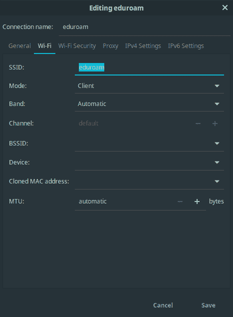
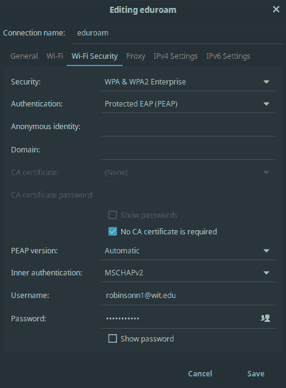
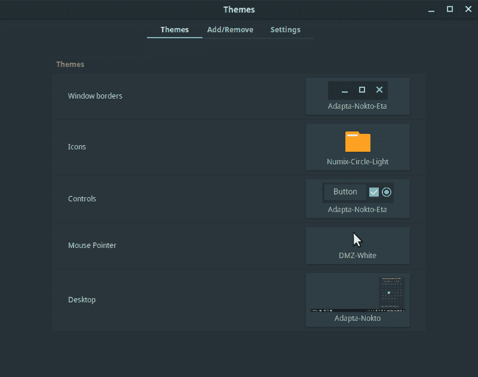
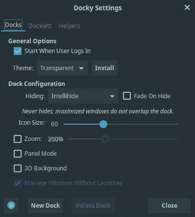
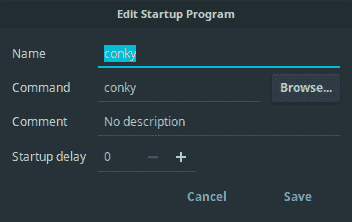
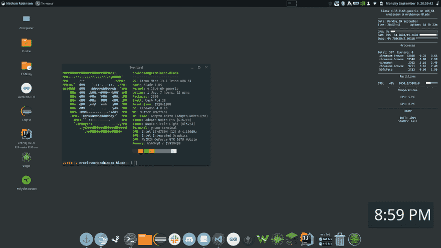

# 如何在 Razer Blade 15 (WIP)上安装 Linux Mint

> 原文：<https://dev.to/nrobinson2000/how-to-install-linux-mint-on-the-razer-blade-15-wip-22gb>

最初发表于:[https://github.com/nrobinson2000/linux-blade](https://github.com/nrobinson2000/linux-blade)

> Razer Blade 15 是 Razer 制造的最新笔记本电脑。这篇文章将概述我在 Razer Blade 15 上安装和配置 Linux Mint 的步骤。

## TL；速度三角形定位法(dead reckoning)

一旦你安装了 Linux Mint，克隆这个库并运行`auto-install.sh`脚本来下载和配置我喜欢的助手工具和设置。

```
sudo apt install git
git clone https://github.com/nrobinson2000/linux-blade
cd linux-blade
bash auto-install.sh 
```

## 简介

我们大学的每个学生都收到一台笔记本电脑作为学费的一部分。所有计算机科学专业的学生都收到了 [Razer Blade 15，](https://www.razer.com/comparisons/blade-15)这是一款性能出色的笔记本电脑，但电池寿命比其他笔记本电脑短。玩游戏时会变热，但不会不舒服。当您连接外部显示器、鼠标和键盘时，它可以很好地作为桌面使用。

自然，我想看看刀片式服务器在 Linux 上运行得有多好。我决定选择 [Linux Mint，](https://linuxmint.com/)这是我过去几年选择的发行版。

以下是在我的 Razer Blade 15 上重新创建我的 Linux Mint 安装的步骤。

本教程是一个正在进行中的工作。遵循本教程并运行脚本，风险自负。我对您的计算机或操作系统不承担任何责任。

## 步骤 0:设置环境

您将需要:

*   一台 Razer Blade 15 笔记本电脑
*   一个 Razer Blade 15 充电器
*   一个 u 盘
*   无线网络连接

## 第一步:准备 u 盘

#### 下载最新的 Linux Mint 发布 ISO。

*   使用 Cinnamon 64 位版本。

*   在编写 Linux Mint 19.2 时，“Tina”是最新版本。

*   你可以在这里下载:[https://linuxmint.com/download.php](https://linuxmint.com/download.php)

#### 写 u 盘的 ISO

*   如果你需要下载 ISO 刻录机，你可以使用[蚀刻机](https://www.balena.io/etcher/)。

## 第二步:安装 Razer BIOS 更新(可能没必要)

#### 您需要更新刀片式服务器上的 BIOS，这样触控板才能在 Linux 中工作。

*   按照此处的说明更新 BIOS。

*   BIOS 更新后，刀片式服务器将重新启动，因此您需要重新登录。

## 第三步:收缩 Windows 分区

#### 您需要缩小刀片上的 Windows 分区，为 Linux 安装腾出空间。

*   我建议你把 C:卷缩小一半。不要对未分配的空间做任何事情。
*   本指南解释了缩小 C:卷的过程。

## 第四步:从 u 盘启动

*   关闭刀锋。按下电源按钮将其重新打开。在启动菜单中选择从 USB 闪存驱动器启动(F12)。

*   刀片应该引导到 Linux Mint。

## 第五步:配置 Wi-Fi

#### 在安装 Linux Mint 之前，刀片应该连接到互联网。

*   我将我的刀片配置为连接到我大学的网络。完成此操作的步骤如下:

*   从开始菜单打开`Network Connections`。

*   点击左下方的`+`，选择创建一个`Wi-Fi`连接类型。

<center></center>

<center></center>

*   刀片应自动连接到`eduroam`。

## 第六步:安装 Linux Mint

*   从桌面运行 Linux Mint 安装程序。确保你选择安装第三方驱动，选择在 Windows 旁边安装 Linux Mint。安装的其余部分非常简单。

*   安装完成后，系统会提示您重新启动。出现提示时，移除安装 USB。

*   当刀片启动时，您会看到 Linux Mint 作为一个选项，以及 Windows 启动管理器。选择 Linux Mint。

*   使用您在安装过程中提供的凭证登录 Linux Mint。

## 第七步:启用右键，更新软件包，安装 NVIDIA 驱动

*   从菜单中打开鼠标和触摸板。在触摸板选项卡上，打开单击操作的下拉列表。选择“使用多个手指点按右键和中键”。

*   从菜单(Windows 键)或系统托盘中打开 Update Manager。

*   有时，您会被要求设置 Timeshift 来配置备份。出现提示时输入您的密码，然后单击“完成”以完成安装向导。

*   在更新管理器中，将询问您是否要切换到本地更新镜像。单击确定。软件资源将会开放。

*   单击主镜像的 URL。等待几秒钟，等待最快的镜像出现，然后选择它。对基础镜像做同样的操作。

*   单击确定更新您的 APT 缓存。关闭软件来源。

*   单击安装更新，并在出现提示时输入您的密码。

*   更新完成后，从菜单中打开驱动程序管理器。出现提示时，输入您的密码。

*   选择最新的 NVIDIA 驱动程序，然后单击应用更改。单击重新启动完成驱动程序更改。

*   您现在已经成功地安装并更新了 Linux Mint。以下步骤是我的个人定制选择。

*   我创建了一个脚本来自动完成下面的大部分步骤。我建议尝试一下。您可以使用以下命令下载并运行它:

```
sudo apt install git
git clone https://github.com/nrobinson2000/linux-blade
cd linux-blade
bash auto-install.sh 
```

## 第八步:安装铬

*   Chromium 是 Chrome 的开源版本。您可以通过在终端中输入以下内容来安装:

```
sudo apt install chromium-browser 
```

我推荐在 chromium 中打开这篇文章，这样您就可以复制其余的命令来更容易地安装附加软件。(粘贴到终端时，您必须使用 SHIFT-CONTROL-V，而不仅仅是 CONTROL-V。)

## 第九步:安装 openrazer 和多色

*   安装这些工具将允许您控制键盘 RGB 模式，就像 Windows 上的 Razer Synapse 一样。

*   在某些时候，您会被要求设置密码来启用安全引导。选择`12345678`，因为它容易记忆。当您选择“注册 MOK”来启用安全启动时，您需要在下次启动时输入此密码。

*   在终端中运行以下命令进行安装:

```
sudo add-apt-repository ppa:openrazer/stable
sudo add-apt-repository ppa:polychromatic/stable

sudo apt update

sudo apt install openrazer-meta polychromatic 
```

## 第十步:安装 Adapta 主题和 numix 图标主题

*   adaptea-NOK to-Eta 主题是我最喜欢的 UI 主题。Numix-Circle-Light 是我最喜欢的图标主题。

*   在终端中运行以下命令进行安装:

```
sudo add-apt-repository ppa:numix/ppa
sudo add-apt-repository ppa:tista/adapta

sudo apt update

sudo apt install numix-icon-theme-circle adapta-gtk-theme 
```

*   安装完主题后，从菜单中打开主题应用程序。选择以下主题:

<center></center>

## 第十一步:修改面板，安装 docky

*   我喜欢把面板放在屏幕的顶部，把 dock 放在底部，很像 macOS。

*   要将面板移动到屏幕顶部，请右键单击面板，单击“修改面板”，然后单击“移动面板”。高亮显示时，单击屏幕顶部。

*   Docky 是一个很棒的 dock 应用程序，它提供了一个类似于 macOS 的 dock。可以用
    安装

```
sudo apt install docky 
```

*   从菜单中启动 docky。右键单击 dock 最左侧的 docky 图标，然后单击设置。应用以下设置:

<center></center>

## 第十二步:安装舒适-刷卡

*   我喜欢用手势在工作空间之间切换。幸运的是，这可以通过舒适的滑动来实现，它提供了三指和四指手势来切换工作区和在工作区之间移动窗口。

```
sudo apt-get install git libinput-tools libxdo-dev g++
git clone https://github.com/Hikari9/comfortable-swipe.git --depth 1

cd comfortable-swipe
bash install

sudo gpasswd -a $USER $(ls -l /dev/input/event* | awk '{print $4}' | head --line=1) 
```

*   如果你想使用我的配置，你可以从这里复制:
    [https://raw . githubusercontent . com/nrobinson 2000/Linux-blade/master/config/comfortable-swipe . conf](https://raw.githubusercontent.com/nrobinson2000/linux-blade/master/config/comfortable-swipe.conf)

*   要打开配置文件，您可以运行:

```
xed $(comfortable-swipe config) 
```

*   只有在您重新启动或注销并重新登录后，推送手势才会启用。

## 第十三步:安装并配置 conky

*   Conky 是一个程序，提供了一个可配置的系统监视器，将出现在您的桌面上。

*   你可以安装 conky 与:

```
sudo apt install conky 
```

*   接下来，我建议使用我的 conky 配置。它将显示时间、日期、CPU 和 RAM 使用情况、热门进程、SSD 使用情况、温度和电池信息。可以从这里复制:[https://raw . githubusercontent . com/nrobinson 2000/Linux-blade/master/config/conkyrc](https://raw.githubusercontent.com/nrobinson2000/linux-blade/master/config/conkyrc)

*   用
    创建您的 conky 配置文件

```
xed ~/.conkyrc 
```

*   并粘贴到我的配置中。

*   您可以从终端运行`conky`来启动 conky。

*   我强烈建议在启动应用程序中加入 conky。单击加号，然后选择“自定义命令”。

<center></center>

*   如果还没有 Docky，我也建议添加它。(加上“选择应用”，Docky)。

## 第十四步:安装 Eclipse

*   在我的大学里，我们编写 Java 代码的大多数计算机科学课程都需要 Eclipse。

*   从[https://www.eclipse.org/downloads/](https://www.eclipse.org/downloads/)下载安装程序

*   提取 tar.gz 进行下载。

*   运行`eclipse-installer`目录下的`eclipse-inst`程序。

*   选择“面向 Java 开发人员的 Eclipse IDE”。

*   继续安装的其余部分。

## 步骤 15:安装 Wireshark

*   Wireshark 是我们大学网络编程课的必修课。

```
sudo apt install wireshark* 
```

当询问非超级用户是否可以捕获数据包时，用箭头键选择`<Yes>`并按 enter 键。

使用
将您自己添加到`wireshark`组

```
sudo adduser $USER wireshark 
```

*   您需要注销并重新登录，Wireshark 才能正常工作。

## 结论

我希望这篇教程已经帮助你成功地在你的 Razer Blade 上安装了 Linux Mint，可以说这比使用 Windows 更有效率和愉快。如果您认为有必要，请随意进一步定制。如果您有任何问题或顾虑，请随时给我发电子邮件:[nrobinson2000@me.com](mailto:nrobinson2000@me.com)

## 附加程序

以下是我经常使用的一些程序，排名不分先后:

*   [粒子工作台](https://www.particle.io/workbench/)
*   [邮件弹簧](https://getmailspring.com/)
*   [松弛](https://slack.com/)
*   [不和](https://discordapp.com/)
*   [吉塔拉克](https://www.gitkraken.com/)
*   [萨莱亚逻辑](https://www.saleae.com/downloads/)
*   [数字波形](https://store.digilentinc.com/waveforms-previously-waveforms-2015/)
*   [IntelliJ IDEA 终极版](https://www.jetbrains.com/idea/)
*   [Arduino IDE](https://www.arduino.cc/en/Main/Software)
*   [烧结](https://fritzing.org/download/)

## 截图

这是我的桌面截图，可以帮助你对我的设置有个大概的了解。

<center>

</center>