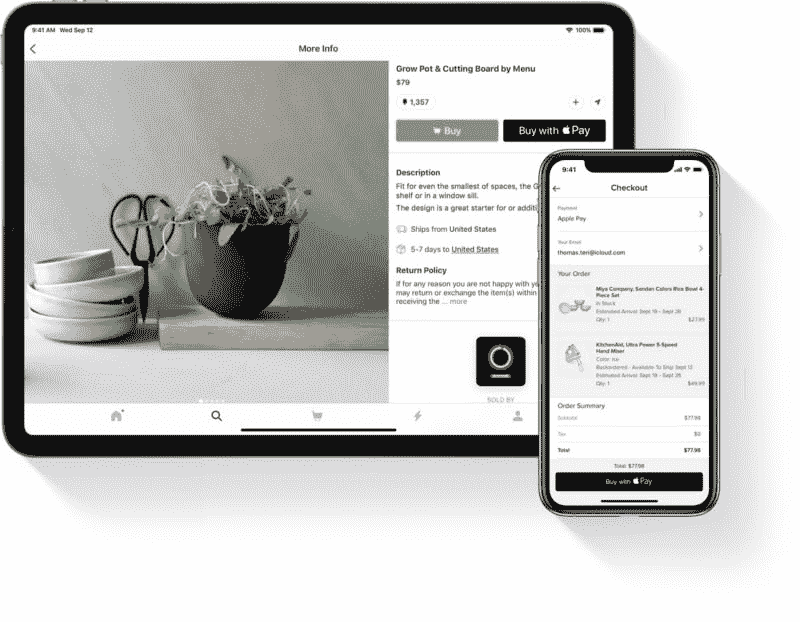
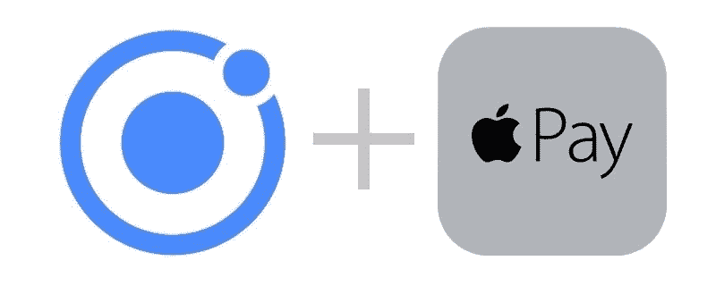
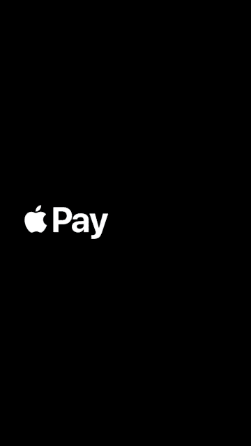
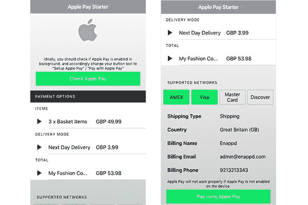
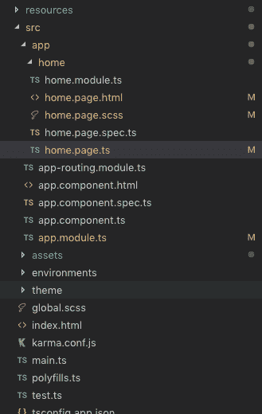
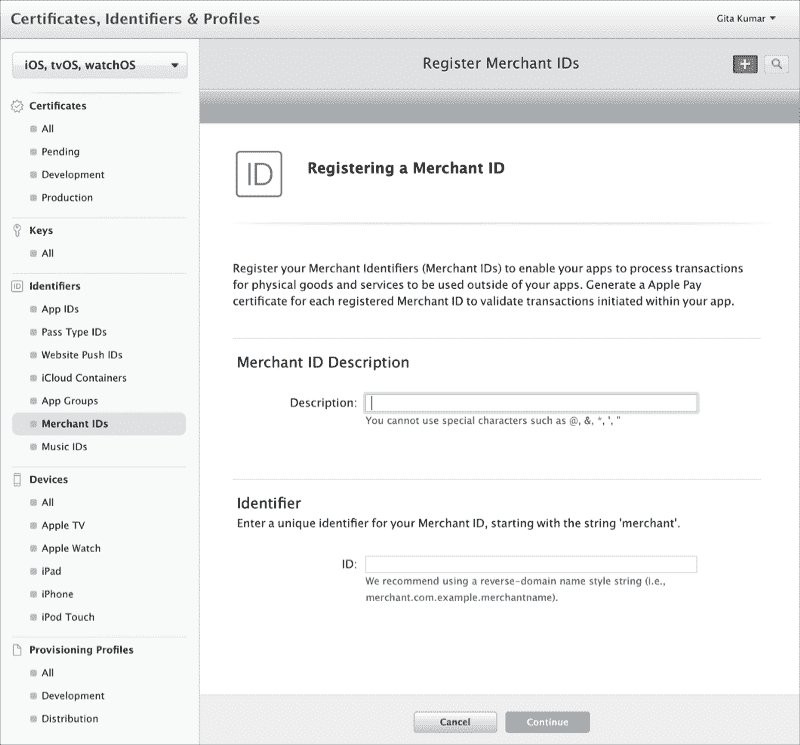
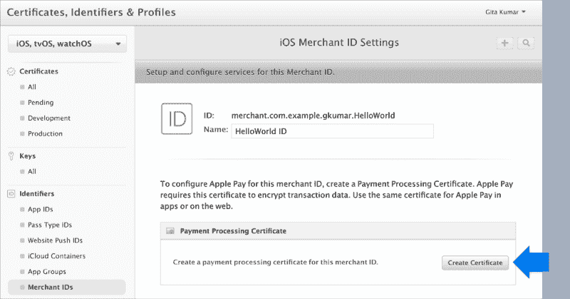
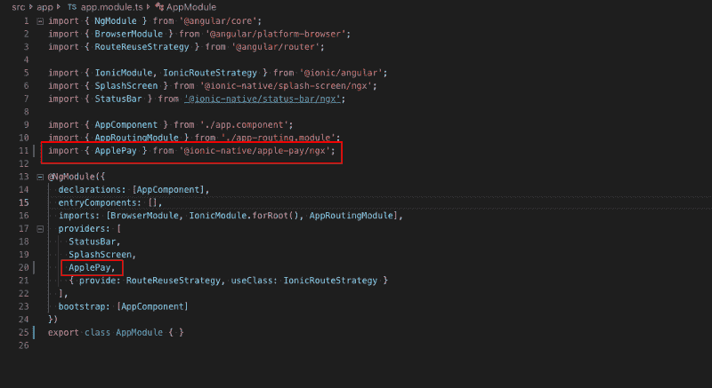

# 如何在 Ionic 4 应用中集成 Apple Pay

> 原文：<https://dev.to/enappd/how-to-integrate-apple-pay-in-ionic-4-apps-1cia>

* * *

Apple Pay 是苹果公司的一项移动支付和数字钱包服务，允许用户亲自在 iOS 应用程序和网络上进行支付。它在 iPhone、Apple Watch、iPad 和 Mac 上都受支持。它可以数字化并取代信用卡或借记卡芯片和 PIN 在非接触式销售终端上的交易。Apple Pay 不需要 Apple Pay 专用的非接触式支付终端；它适用于任何接受非接触式支付的商家。它支持通过密码、touchID 以及面部识别进行身份验证。



这篇文章与 Ionic 4 应用程序中的 Apple Pay 集成有关。就像我们在应用中集成 Stripe、PayPal 等支付网关一样，我们也可以在应用中集成 Apple Pay。Apple Pay 的好处是

*   只用电话就能快速付款
*   把你所有的卡都存在手机里，然后随心所欲地付款
*   由电话本身管理的认证
*   把卡放在苹果钱包里还可以让你在支付终端上进行无现金支付。

### 什么是离子 4？

你可能已经知道离子，但我把它放在这里只是为了初学者。 **Ionic** 是 Drifty Co .的 Max Lynch、Ben Sperry 和 Adam Bradley 于 2013 年创建的一款用于混合移动应用开发的完整开源 SDK。Ionic 提供使用 CSS、HTML5 和 Sass 等 Web 技术开发混合移动应用的工具和服务。可以使用这些 Web 技术构建应用程序，然后通过本地应用程序商店分发，并利用 Cordova 安装在设备上。

所以，换句话说——如果你用 Android 创建原生应用，你就用 Java 编码。如果你在 iOS 中创建原生应用，你用 Obj-C 或 Swift 编码。这两种语言都是强大但复杂的语言。有了 Cordova(和 Ionic ),你可以为你的应用程序编写一段代码，它可以在 iOS 和 Android(以及 windows！)，HTML、CSS 和 JS 的简单性也是如此。

### Ionic 4 和支付网关

Ionic 4 可以创建各种各样的应用程序，因此可以在 Ionic 4 应用程序中实现各种各样的支付网关。比较流行的有 PayPal，Stripe，Razorpay，Braintree，应用内购买等。关于支付网关的更多细节，你可以阅读我关于 Ionic 4 中[支付网关解决方案的概述博客，或者关于](https://medium.com/enappd/payment-solutions-in-ionic-8c4bb28ce5cc) [PayPal](https://enappd.com/blog/ionic-4-paypal-payment-integration-for-apps-and-pwa/16) 、 [Stripe](https://enappd.com/blog/ionic-4-stripe-payment-integration-with-firebase-for-apps-and-pwa/17) 和 [Razorpay](https://enappd.com/blog/how-to-integrate-razorpay-in-ionic-4-apps-and-pwa/20/) 的详细博客。

Apple Pay 可以集成在网站和移动应用程序中。在这篇博客中，我们将学习如何将 Apple Pay 集成到 Ionic 4 应用中。



<figure>

<figcaption class="imageCaption">Ionic 4 and Apple Pay make a great team</figcaption>

</figure>

### 在 Apple Pay 中添加卡片

在您的应用程序中使用 Apple Pay 之前，您需要在 Apple wallet 中添加一张卡。出于开发目的，为了测试演示流程，您不需要添加卡。但要测试应用的实时支付模式，你需要在你的应用中使用一张卡。这个过程不是程序化的，只是为了提供信息，你可以在这个视频后面添加一个卡片



<figure>

<figcaption class="imageCaption">How to add a card in Apple wallet</figcaption>

</figure>

在 Ionic 4 应用中集成 Apple Pay 非常简单明了。它使用了 [**Ionic 原生 Apple pay 插件**](https://ionicframework.com/docs/native/apple-pay) ，并且只能在 iOS 应用中使用。

让我们一步一步地开始

> 本教程的完整源代码可以在 [Ionic4-applepay Github 资源库中找到。](https://github.com/enappd/ionic4-applepay)

### 先决条件

*   为 Apple Payintegration 创建 Ionic 4 应用程序
*   Apple 商家 ID 和证书(发布应用程序时需要)

创建一个基本的 Ionic 4 应用程序非常容易。假设您的系统中已经安装了所有的基本要求，运行

```
$ ionic start MyApp blank
```

这将创建标题为`MyApp`和空白模板的应用程序。

> 关于如何创建一个基本的 Ionic 4 应用程序的更多细节，请参考我的博客[如何创建一个 Ionic 4 应用程序](https://medium.com/enappd/how-to-create-an-ionic-4-app-for-beginners-e181e116190a)

稍加修改，我的主页看起来是这样的。



<figure>

<figcaption class="imageCaption">Homepage for Apple Pay Ionic 4 demo app</figcaption>

</figure>

整个购物车视图对于 Apple Pay 集成来说并不是真正必要的，但我在这里展示它只是为了更好地理解这些东西。人们可能希望在他们的购物车页面上显示这些数据，以便用户清楚地理解(当然是在更好的 UI 中😜)

文件结构看起来像这样，只是一个想法



<figure>

<figcaption class="imageCaption">File structure</figcaption>

</figure>

完整的 HTML 代码可以在[库](https://github.com/enappd/ionic4-applepay)的`home.page.html`文件中找到。

#### Apple Pay 商家 ID 和证书

如果你做过一些 iOS 开发，你就意识到了苹果对证书的热爱。因此，对于 Apple Pay，你也需要从**苹果开发者账户**获得一个*商家 ID* 和一个*支付处理证书*(为此你需要有一个苹果开发者账户)

*   **商家 ID —** 您向 Apple 注册的标识符，它唯一地将您的企业标识为能够接受支付的商家。这个 ID 永不过期，可以在多个网站和 iOS 应用中使用。设置步骤参见[创建商户标识符](https://help.apple.com/developer-account/#/devb2e62b839?sub=dev103e030bb)。



<figure>

<figcaption class="imageCaption">Get a merchant ID from Apple developer account</figcaption>

</figure>

*   **支付处理证书—** 与您的商户 ID 相关联的证书，用于保护交易数据。Apple Pay 服务器使用证书的公钥来加密支付数据。您(或您的支付服务提供商)使用私钥解密数据来处理支付。设置步骤参见[创建支付处理证书](https://help.apple.com/developer-account/#/devb2e62b839?sub=devf31990e3f)。



<figure>

<figcaption class="imageCaption">Get a Payment processing certificate from Apple developer account</figcaption>

</figure>

### 在 Ionic 4 应用中集成 Apple Pay 插件

要在你的 Ionic 4 应用中包含 Apple Pay 功能，你需要安装 Apple Pay 插件。使用以下命令安装插件

```
$ ionic cordova plugin add cordova-plugin-applepay
```

```
$ npm install @ionic-native/apple-pay
```

安装完成后，将 Apple Pay 导入您的`app.module.ts`

```
import { ApplePay } from '@ionic-native/apple-pay/ngx';
```

并将其包含在`providers`列表中



<figure>

<figcaption class="imageCaption">Import ApplePay in app.module.ts</figcaption>

</figure>

类似地，在您的`home.page.ts`中导入 Apple Pay，并在构造函数中定义它

```
constructor(private applePay: ApplePay) { }
```

#### Apple Pay 插件中可用的方法

Apple Pay 插件并不是 Apple Pay 实际可以做的所有事情的完整包。该插件的能力有限，但可以轻松完成你在应用程序中的基本支付流程。可用的方法有

*   **canMakePayments —** 检查设备是否能够使用 Apple Pay 进行支付
*   **makePaymentRequest —** 使用适当的*订单创建付款请求*
*   **completeLastTransaction —** 一旦相应的支付银行/信用卡机构返回“成功”或“失败”,则将支付请求标记为完成。
*   **startlisteningfossingcontactselection—**这不会*也不会*返回承诺，但是它会在选择发货联系人时触发成功回调。
*   **updateItemsAndShippingMethods—**当用户更改送货方式/联系人时，更新商品和/或送货方式
*   **stopListeningForShippingContactSelection—**您可以选择不收听送货方式/联系人的更改

在文章末尾的最后一节提到了收听运输联系方式变更的详细信息。

#### 1.Applepay.canMakePayments

这种方法有助于检查设备是否支持 Apple Pay，或者 Apple Pay 是否在设备中正确设置。出于示例目的，我们将在点击按钮时调用此方法，但理想情况下，您应该在后台调用它，并适当地向用户显示在设备上设置 Apple Pay 的警告。