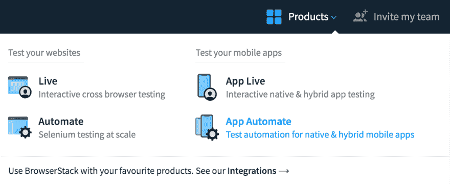
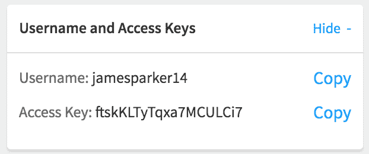
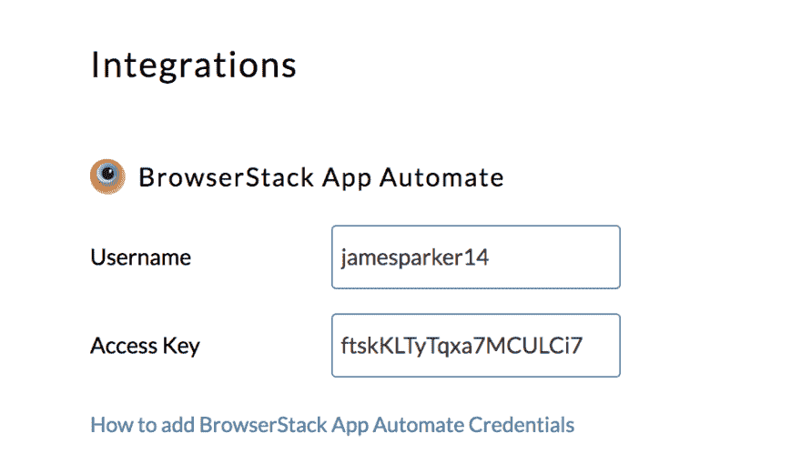
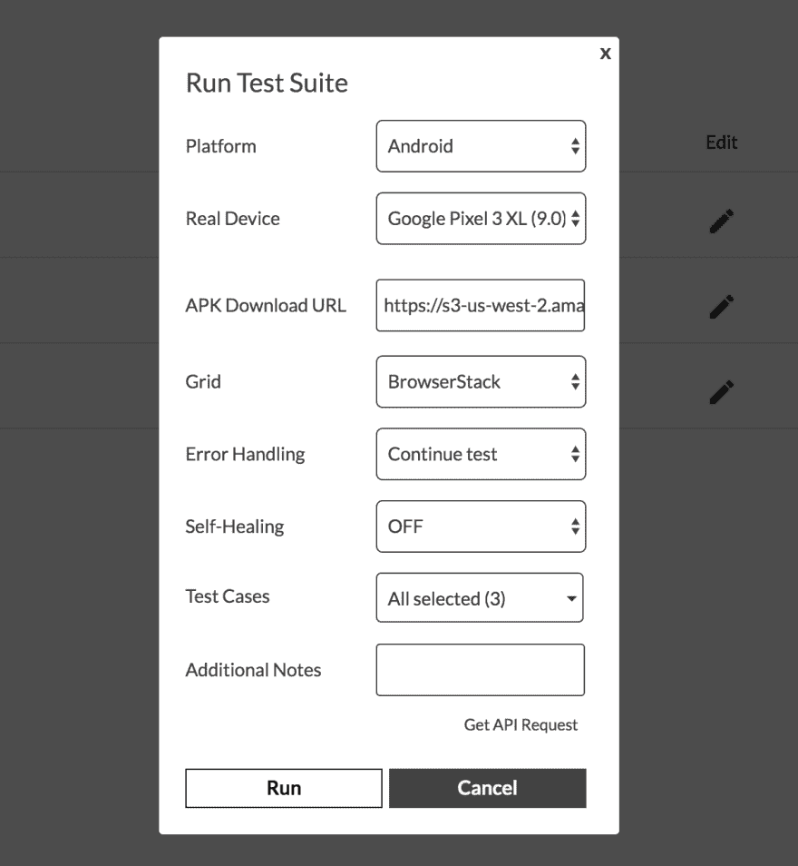

# 如何集成 Endtest 和 BrowserStack

> 原文：<https://dev.to/endtest/how-to-integrate-endtest-with-browserstack-2gkj>

### **简介**

Endtest 允许您创建、管理和执行自动化测试，而无需编写任何代码。

通过与 [BrowserStack](https://www.browserstack.com/) 集成，您可以在 BrowserStack 提供的一系列真实的 Android 和 iOS 移动设备上执行使用 Endtest 创建的移动测试。

### **入门**

1)转到您的 **BrowserStack** 帐户。
2)从**产品**部分点击**应用程序自动化**:

3)点击页面左侧**用户名和访问密钥**部分的**显示**按钮:

4)从[结束测试](https://endtest.io)进入**设置**页面。
5)添加**用户名**和**访问密钥**来自浏览器堆栈应用 Automate 在浏览器堆栈用户和浏览器堆栈密钥输入 Endtest 设置页面。

6)点击**保存**按钮。

干得好！您的 Endtest 帐户现在已与您的 BrowserStack 帐户连接。

### **运行您的第一个测试**

1)从 Endtest 的**驱动器**部分上传您的 APK 或 IPA 文件。

2)之后，转到**移动测试**部分，点击运行按钮。

3)从**网格**下拉菜单中选择**浏览器堆栈**。

4)选择您想要执行测试的**平台**和**真实设备**。

5)在**中选择您的 APK 文件，在**中输入 APK 下载网址。
如果你选择一个 iOS 设备，输入的 **APK 下载网址**将被替换为 **IPA 下载网址**输入。

开始执行测试后，您将被重定向到结果部分，在那里您将获得实时视频以及所有结果、日志和详细信息。