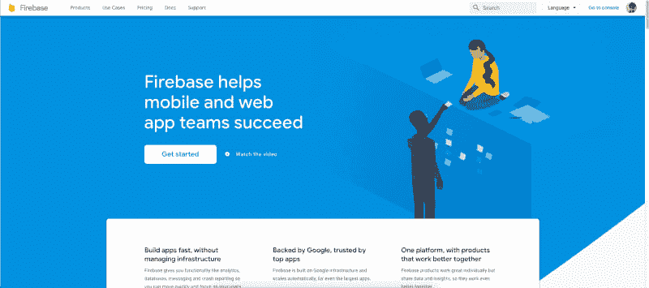
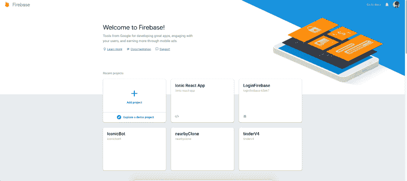
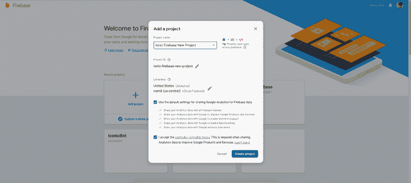
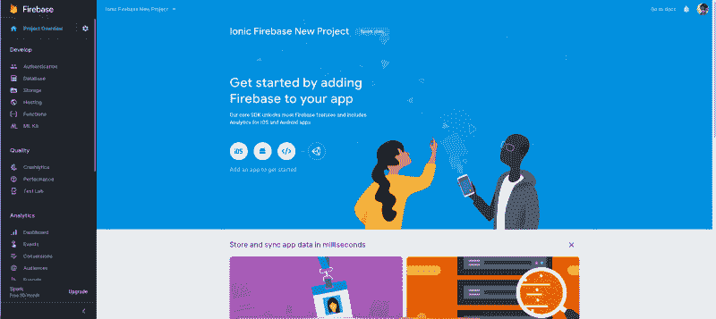
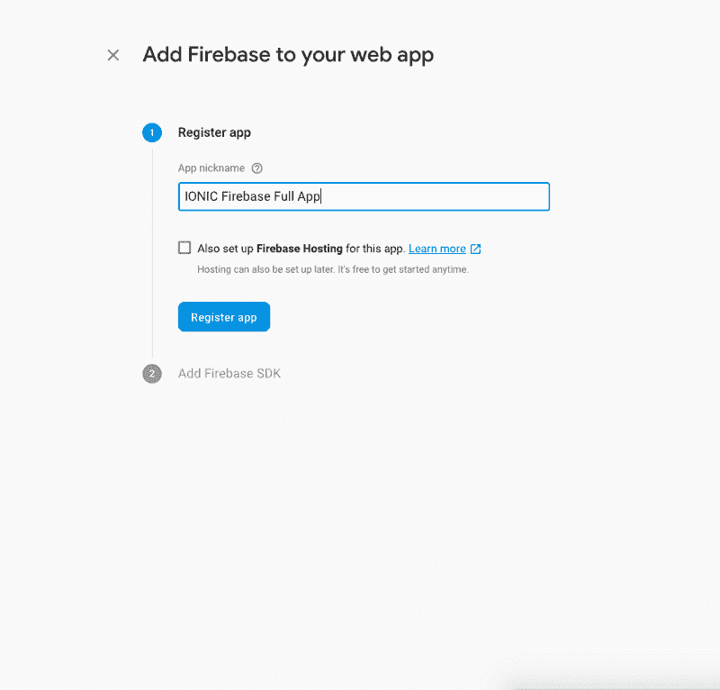
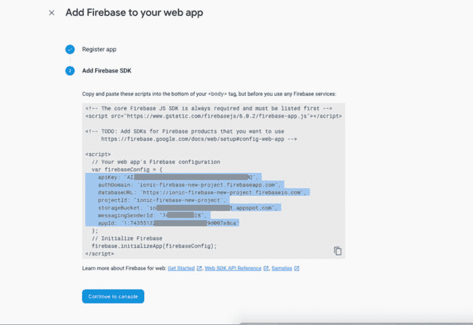
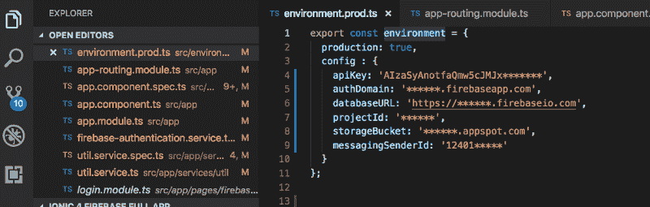
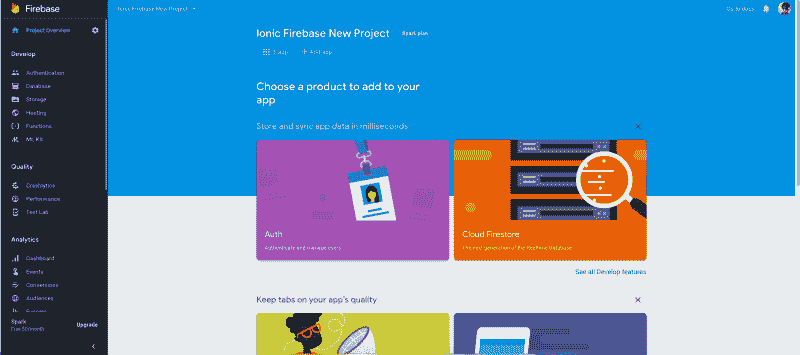

# 如何在 Ionic 4 应用程序中集成 Firebase

> 原文：<https://dev.to/enappd/how-to-integrate-firebase-in-ionic-4-apps-18d0>

* * *

> 查看我们的 [**Firebase 入门套件**](https://store.enappd.com/product/ionic4-firebase-starter/) 从 Ionic 4 应用中 Firebase 的基本功能开始，如数据库、认证和存储

**Firebase** 是当今最强大、最受欢迎的数据库即服务(DBaaS)解决方案之一。它提供了一个可扩展的云数据库来存储和同步客户端和服务器端开发的数据。

在过去的几年里，爱奥尼亚越来越受欢迎，这是理所当然的。与本地语言(Java / Swift)相比，用 Ionic 制作应用程序简直易如反掌。Ionic framework 的领域包含了各种各样的移动应用程序功能，可以创建当今几乎 90%的应用程序。

Firebase 的特点:-

1.  云数据库存储
2.  证明
3.  主办；主持
4.  储存；储备
5.  机器学习工具包
6.  Crashlytics
7.  表演
8.  测试实验室
9.  动态链接
10.  云消息传递
11.  应用内消息和许多其他功能…

> ***要了解更多关于 Firebase* 的特性*，请阅读***[***Firebase With Ionic 4 概述***](https://enappd.com/blog/firebase-with-ionic-4-overview/8/)

这篇文章简单介绍了如何将 Firebase 连接到 Ionic 4 应用程序。其他细节如 [Twitter](https://enappd.com/blog/twitter-login-in-ionic-4-apps-using-firebase/24) 登录、[脸书登录](https://enappd.com/blog/facebook-login-in-ionic-4-apps-using-firebase/25)和[其他插件](https://enappd.com/blog/firebase-with-ionic-4-overview/8)，你可以我们的[其他博客](https://enappd.com/blog/)。

### 用 Firebase 连接你的 Ionic 应用

首先，让我们创建一个 Ionic 应用程序。你既可以使用我们的 [Ionic 4 完全授权](https://store.enappd.com/product/firebase-starter-full-auth/)启动器，也可以从头开始创建自己的 Ionic 4 应用程序。这个应用程序包含所有类型的认证使用 Firebase


<figure>

<figcaption class="imageCaption">Ionic 4 Full Auth app starter</figcaption>

</figure>

> ***要了解如何从*开始创建 Ionic app*，请阅读*** [***如何为初学者从头创建 Ionic 4 app***](https://enappd.com/blog/how-to-create-an-ionic-4-app-for-beginners/13/)

为了将 Firebase 连接到我们的 Ionic 应用程序，我们将使用 [Angularfire2](https://github.com/angular/angularfire2/) 插件。AngularFire 是 Firebase 和 Angular 的官方库。

要安装 AngularFire 插件，请从终端运行以下命令

```
npm install firebase angularfire2 — save
```

### 火基配置

一旦你安装了插件，我们将在 Ionic 应用和 Firebase 之间建立通信

### 第一步:-

在这一步中，我们将在 Firebase 控制台中创建一个项目。为此，我们将前往[火力基地](https://firebase.google.com/)



<figure>

<figcaption class="imageCaption">Firebase website</figcaption>

</figure>

### 第二步:-

我们将在 Firebase 控制台中创建新项目。所以点击控制台按钮来检查你所有的项目


<figure>

<figcaption class="imageCaption">Go to Firebase console</figcaption>

</figure>

### 第三步:-

如果您还没有创建新项目，请单击您想要使用的任何现有项目



<figure>

<figcaption class="imageCaption">Firebase console</figcaption>

</figure>

### 第四步:-

当您点击*添加项目*按钮时，它会询问您的项目名称，在项目名称输入框中填写您的项目名称，接受他们的条款和条件，并点击*创建项目*按钮



<figure>

<figcaption class="imageCaption">Add a project in Firebase</figcaption>

</figure>

### 第五步:-

所以现在我们的 Firebase 项目创建了。在这一步中，我们将把 Firebase 添加到我们的 Ionic 应用程序中。为此，选择**将 Firebase 添加到您的 Web 应用程序**



<figure>

<figcaption class="imageCaption">Firebase project dashboard</figcaption>

</figure>

### 第六步:-

在这一步中，我们将把我们的 webapp 注册到 firebase，因此我们将输入我们的 app 昵称，并单击 Register 按钮



<figure>

<figcaption class="imageCaption">Create a Firebase Web App</figcaption>

</figure>

### 第七步:-

从 Firebase dashboard 复制您的 Firebase 配置，并粘贴到我们的应用程序代码中。



<figure>

<figcaption class="imageCaption">Pick Firebase credentials from the code snippet</figcaption>

</figure>

### 第九步:-

将 Firebase 配置复制到 Ionic app 项目的环境文件中。环境文件应该在项目根目录中。



<figure>

<figcaption class="imageCaption">Create environment file in Ionic project base</figcaption>

</figure>

### 第八步:-

我们已经成功地创建了我们的 Firebase 应用程序。在左侧选项卡中，我们可以根据需要使用 Firebase 工具。



<figure>

<figcaption class="imageCaption">Use more Firebase services from left panel</figcaption>

</figure>

现在，您可以将 firebase 项目集成到 Ionic 4 应用程序和 PWA 中了。去享受吧，兄弟！


<figure>

<figcaption class="imageCaption">and Chill</figcaption>

</figure>

### 结论

在这篇文章中，我们学习了如何获得 Firebase 配置参数，以将 Firebase 集成到 Ionic 4 应用程序或渐进式 web 应用程序中。在 build 中使用开发环境可以很容易地执行测试，我们只需将环境文件中的 production 更改为`true`就可以投入使用。

敬请关注更多 Ionic 4 博客！

### 后续步骤

既然你已经学会了如何在 Ionic 4 应用中实现 Twitter 登录，接下来你可以做几件事

*   如何在 Ionic 4 中实现 [Twitter 登录](http://Facebook%20login%20in%20Ionic%204)
*   如何在 Ionic 4 中实现[脸书登录](https://enappd.com/blog/facebook-login-in-ionic-4-apps-using-firebase/25)
*   如何在 Ionic 4 中实现 [Phaser 游戏框架](https://enappd.com/blog/how-to-create-mobile-games-pwa-with-ionic-4-and-phaser/19)
*   如何在 Ionic 4 中实现多语言文本
*   如何在 Ionic 4 中实现条纹支付
*   如何在 Ionic 4 中实现 PayPal 支付
*   如何[在 Ionic 4 中实现计步器](https://enappd.com/blog/best-fitness-plugins-for-ionic-4-how-to-use-pedometer/15)
*   在 Ionic 4 中集成[Apple Pay](https://enappd.com/blog/how-to-integrate-apple-pay-in-ionic-4-apps/21)
*   在 Ionic 4 中集成[razor pay](https://enappd.com/blog/how-to-integrate-razorpay-in-ionic-4-apps-and-pwa/20)