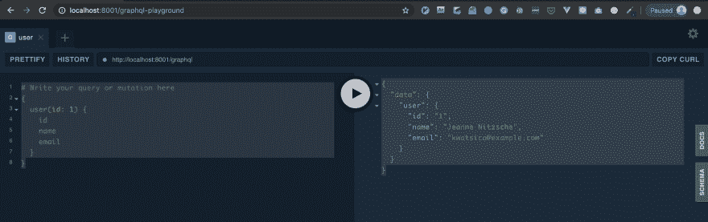

# 如何用 Lighthouse 将 GraphQL 集成到 Laravel 中

> 原文：<https://dev.to/pimpledeveloper/how-to-integrate-graphql-into-laravel-with-lighthouse-3f03>

GraphQL 很受开发人员的欢迎。我爱上了它，因为它让我只接收我真正需要的数据。
使用 GraphQL，您不再被无关紧要的信息分散注意力，因为客户端会主动决定前端接收哪些数据。

我想和你分享我第一次接触它的经历。如果你已经在你的项目中使用了它，请在下面的评论区告诉我你的体验。

我们开始吧！

我安装了 Lighthouse，这是一个 PHP 包，使用这个命令从一个 Laravel 应用程序为 GraphQL 端点提供服务。

```
composer require nuwave/lighthouse 
```

我发布了一个配置文件。

```
php artisan vendor:publish --provider="Nuwave\Lighthouse\LighthouseServiceProvider" --tag=schema 
```

这是可选的，但是我强烈建议您安装 laravel-graphql-playgroung 软件包。

```
composer require mll-lab/laravel-graphql-playground 
```

现在您可以在 graphql/schema.graphql 中找到默认模式。

如果您的应用程序中没有创建任何表，请运行迁移并将记录插入到数据库中。

单击下面的按钮测试您的 GraphQL API。

```
http://localhost:8000/graphql-playground 
```

是时候编写一个简单的查询来获取用户数据了。

```
{
  user(id: 1) {
    id
    name
    email
  }
} 
```

结果是这样的。
[T3】](https://res.cloudinary.com/practicaldev/image/fetch/s--MdHdS99M--/c_limit%2Cf_auto%2Cfl_progressive%2Cq_auto%2Cw_880/https://thepracticaldev.s3.amazonaws.com/i/xaaenbzoycpoyi5jbgyy.png)

正如您可以看到的结果，您对从 API 接收到的内容有决定权。

现在您已经准备好深入研究 GraphQL 和 Lighthouse 了。

我对我将使用 GraphQL 创建的东西感到非常兴奋。