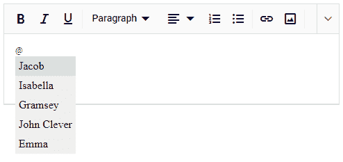
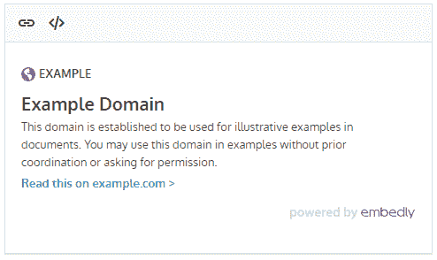
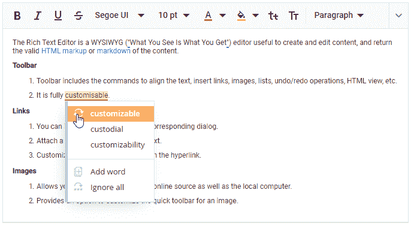
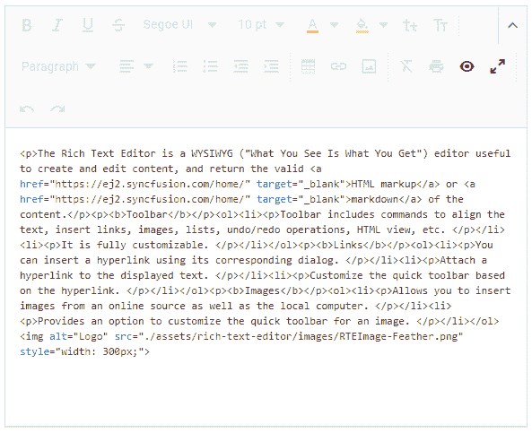

# 如何将第三方库集成到 Angular 富文本编辑器中

> 原文：<https://dev.to/syncfusion/how-to-integrate-third-party-libraries-into-angular-rich-text-editor-o2m>

人们总是喜欢使用令人印象深刻的格式选项和布局来起草或编辑电子邮件、博客、网页或提案。比如你想给你的老板写一封格式良好的电子邮件，或者在博客或论坛上用有趣的笑脸发表评论。你显然需要一个丰富的 WYSIWYG ( **所见即所得**)编辑界面，在一个地方支持各种编辑和格式化选项。

Syncfusion 提供的[富文本编辑器](https://www.syncfusion.com/angular-ui-components/angular-wysiwyg-rich-text-editor) (RTE)就是为这个目的服务的，它既是一个功能丰富的所见即所得文本编辑器，又是一个降价编辑器。使用这种 WYSIWYG 用户界面，您可以以与最终结果非常相似的方式编辑和查看内容格式。RTE 在 web 平台 [Angular](https://www.syncfusion.com/angular-ui-components/angular-wysiwyg-rich-text-editor) 、 [React](https://www.syncfusion.com/react-ui-components/react-wysiwyg-rich-text-editor) 、 [Vue](https://www.syncfusion.com/vue-ui-components/vue-wysiwyg-rich-text-editor) 、 [JavaScript](https://www.syncfusion.com/javascript-ui-controls/js-wysiwyg-rich-text-editor) 、[ASP.NET MVC](https://www.syncfusion.com/aspnet-mvc-ui-controls/wysiwyg-rich-text-editor)、[ASP.NET 核心](https://www.syncfusion.com/aspnet-core-ui-controls/wysiwyg-rich-text-editor)和 [Blazor](https://www.syncfusion.com/blazor-components/blazor-wysiwyg-rich-text-editor) 上可用。

## 何时应该将第三方库集成到 RTE 中

有时候你可能想在博客或论坛的评论区输入 HTML 内容，或者你需要称呼几个人的名字。如果需要技术支持，您可能需要使用编辑器发布一些代码片段。此外，有时您可能会发现在编辑界面中启用拼写检查器或在其中嵌入一些丰富的社交媒体非常重要。

通过将额外的第三方库集成到我们基本的 JS 2 富文本编辑器中，所有这些操作都是可能的。

在这篇博客中，我将简要解释将第三方库如 [Tribute.js](https://github.com/zurb/tribute) 、 [Embed.ly](https://embed.ly/) 、 [CodeMirror](https://github.com/codemirror/codemirror) 和 [WebSpellChecker](https://webspellchecker.com/) 集成到 Angular 富文本编辑器中是多么容易。

**注意:**要开始向您的应用程序添加一个基本的 Angular 富文本编辑器，请参考入门文档。

您还可以使用命令**ng add @ sync fusion/ej2-angular-rich text editor**来安装和自动配置带有所需模块和 CSS 引用的应用程序。

## 整合贡品. js

当你想在对话中直接标记或称呼某人时，你可以使用@提提，这是由 Twitter 普及的。它将根据提供的键-值对显示匹配名称的列表。

比方说，我开始在 Twitter 或微软团队中输入某人的名字，以@ reference 开头。它会自动建议与输入的字母相匹配的名字。

现在，您还可以在我们的 Angular 富文本编辑器内容区域中使用这种@提提机制，方法是在您的应用程序中引用适当的脚本和属性的 CSS。

1.  使用以下命令在应用程序中本地安装属性。

```
npm install tributejs 
```

1.  现在在你的 index.html 文件中引用贡品 CSS 的 cdn 链接。

```
<link rel="stylesheet" href="https://cdn.jsdelivr.net/npm/tributejs@3.5.3/dist/tribute.css"> 
```

1.  开始导入 app.component.ts 文件中的属性。

```
import Tribute from "tributejs"; 
```

1.  在富文本编辑器的“created”事件中使用下面的 TributeJS 初始化代码，并将其实例附加到 RTE 的 input 元素。参考 [GitHub](https://github.com/zurb/tribute) 以了解 TributeJS 上可用的其他选项。

```
let tribute = new Tribute({
values: [
{ key: 'Jacob', value: 'jacob@mail.com' },
{ key: 'Isabella', value: 'isabella@mail.com' }
]
});

tribute.attach(this.defaultRTEObj.inputElement); 
```

<figure>

[](https://res.cloudinary.com/practicaldev/image/fetch/s--6U_9lMzl--/c_limit%2Cf_auto%2Cfl_progressive%2Cq_auto%2Cw_880/https://www.syncfusion.com/blogs/wp-content/uploads/2019/08/Including-%40-mentions-with-the-help-of-Tribute.js.png)

<figcaption>Including @ mentions in Angular RTE</figcaption>

</figure>

**注意:**你也可以使用 At.js 库在 Angular 富文本编辑器中包含这样的@提提功能，可以从[文档](https://ej2.syncfusion.com/angular/documentation/rich-text-editor/third-party-integration/#code-classlanguage-textatjscode-integration)页面引用。

## 整合嵌入

使用 Embed.ly，您只需几行代码就可以轻松地将富媒体添加到您的站点中。您只需要在应用程序中添加嵌入脚本引用，然后在 Angular Rich Text Editor 的 actionComplete 事件中使用适当的类生成嵌入代码。

1.  在 index.html 页面中添加嵌入式脚本引用。

```
<script src="https://cdn.embedly.com/widgets/platform.js" charset="UTF-8"></script> 
```

1.  定义 Angular 富文本编辑器的 actionComplete 事件处理程序。检查超链接是否是新插入的(requestType==='Links ')，如果是，生成如下嵌入代码。

```
public actionComplete(args: any): void {

if (args.requestType === 'Links') {
const embedEle: HTMLElement = document.createElement('blockquote');
embedEle.setAttribute('class', 'embedly-card');
embedEle.appendChild(args.elements[0].parentElement);
embedEle.appendChild(document.createElement('p'));
args.range.insertNode(embedEle);
}
} 
```

<figure>

[](https://res.cloudinary.com/practicaldev/image/fetch/s--nFU63POp--/c_limit%2Cf_auto%2Cfl_progressive%2Cq_auto%2Cw_880/https://www.syncfusion.com/blogs/wp-content/uploads/2019/08/Rich-media-content-in-Angular-RTE.png)

<figcaption>Rich media content in Angular RTE</figcaption>

</figure>

**注意:**确保在 RTE 工具栏列表中添加 [CreateLink](https://ej2.syncfusion.com/angular/documentation/rich-text-editor/link/) 选项，以输入媒体链接。

## 集成拼写检查器

如果您想在我们的 Angular 富文本编辑器组件的内容区域中输入时检查拼写和语法问题，您可以通过集成第三方库 WebSpellChecker 来实现，它提供了云拼写检查服务。

下载 [WebSpellChecker](https://www.webspellchecker.net/signup/hosted-signup.html#webspellchecker-proofreader-trial) 的试用版或付费版，您将在注册的电子邮件中收到一个激活密钥。这是在应用程序中初始化和配置拼写检查所必需的。

1.  在您的 index.html 页面中添加[web spell checker wproofriender](https://docs.webspellchecker.net/pages/viewpage.action?pageId=442663877)脚本引用。

```
<script src="https://svc.webspellchecker.net/spellcheck31/wscbundle/wscbundle.js"></script> 
```

1.  现在，使用 Windows 配置变量以及其他必需的选项(如 autoSearch、enableGrammar 和 serviceId)在 index.html 页面中初始化 WebSpellChecker。

```
<script> 
    window.WEBSPELLCHECKER_CONFIG = { 
        autoSearch: true, 
        enableGrammar: true, 
        // Get the activation key from your registered account 
        serviceId: '1:kir4Z3-3VEfP-o8bLS2-iIYiz2-2xQou3-vM58l3-D9AUu3-7cBdu2-2GuIt2-tehUv-OOBiI-qc' 
    }; 
</script> 
```

<figure>

[](https://res.cloudinary.com/practicaldev/image/fetch/s--Gygn5Sdo--/c_limit%2Cf_auto%2Cfl_progressive%2Cq_auto%2Cw_880/https://www.syncfusion.com/blogs/wp-content/uploads/2019/08/Spell-check-implemented-in-Angular-RTE.png)

<figcaption>Spell check implemented in Angular RTE</figcaption>

</figure>

**注意:**只有当 serviceId 选项被分配了有效的激活密钥时，拼写检查功能才能在富文本编辑器中工作。

## 整合 CodeMirror

Angular 富文本编辑器附带了默认的源代码视图选项，该选项以明文代码格式显示源代码。如果你想以一种更令人愉快和可读的格式突出显示 HTML 源代码，那么你应该在你的应用程序中使用额外的第三方语法或代码突出显示库，如 CodeMirror 或 PrismJS。现在，让我们看看如何将 CodeMirror 插件集成到 Syncfusion Angular 富文本编辑器中。

**注意:**确保启用 RTE 工具栏列表上的源代码选项，在源代码和预览模式之间切换。

1.  通过应用程序中的 npm install 命令安装 CodeMirror 包。

```
npm install codemirror 
```

1.  现在，将必要的 CodeMirror 文件导入 app.component.ts 文件。

```
import * as CodeMirror from 'codemirror';
import 'codemirror/mode/javascript/javascript';
import 'codemirror/mode/css/css.js';
import 'codemirror/mode/htmlmixed/htmlmixed.js'; 
```

1.  在 index.html 文件中添加 CodeMirror 脚本和 CSS 的必要 CDN 链接引用。

```
<link rel="stylesheet" href="https://cdnjs.cloudflare.com/ajax/libs/codemirror/5.3.0/codemirror.min.css">

<script type="text/javascript" src="https://cdnjs.cloudflare.com/ajax/libs/codemirror/5.3.0/codemirror.min.js"></script>
<script type="text/javascript" src="https://cdnjs.cloudflare.com/ajax/libs/codemirror/5.3.0/mode/xml/xml.min.js"></script> 
```

1.  最后，为 Angular 富文本编辑器定义 actionComplete 事件，并添加其处理程序代码，如下所示。这里，富文本编辑器的内容应该作为值传递给 CodeMirror。

```
public actionCompleteHandler(e: any): void {
    if (e.targetItem === 'SourceCode') {
        (this.rteObj.sourceCodeModule.getPanel() as HTMLTextAreaElement).style.display = 'none';
        this.mirrorView = createElement('div', { className: 'e-content' }); 
        this.rteObj.contentModule.getEditPanel().parentNode.appendChild(this.mirrorView);
        this.myCodeMirror = CodeMirror(this.mirrorView, { value: this.rteObj.value, mode: 'text/html', lineWrapping: true });
    }
    else if (e.targetItem === 'Preview') {
        this.rteObj.value = this.myCodeMirror.getValue();
        this.mirrorView.style.display='none';
    }
} 
```

<figure>

[](https://res.cloudinary.com/practicaldev/image/fetch/s--m_fNZh6k--/c_limit%2Cf_auto%2Cfl_progressive%2Cq_auto%2Cw_880/https://www.syncfusion.com/blogs/wp-content/uploads/2019/08/HTML-tags-displayed-in-the-correct-format.png)

<figcaption>HTML tags displayed in Angular RTE</figcaption>

</figure>

## 总结

精心设计和高度格式化的内容通常比简单的纯文本更能吸引用户。此外，我们更喜欢以与阅读时相同的 HTML 格式编辑内容。Syncfusion Angular 富文本编辑器在实现这些目的方面发挥了重要作用。它还支持集成第三方库，如 TributeJS、Embed.ly、WebSpellChecker、CodeMirror 等，以增强其实时可用性。

通过下载[免费 30 天试用版](https://www.syncfusion.com/account/manage-trials/downloads)或从 [GitHub](https://github.com/syncfusion/ej2-angular-ui-components/tree/master/components/richtexteditor) 克隆它，查看 Angular 富文本编辑器的其他功能。此外，请随意查看我们的[在线样品](https://ej2.syncfusion.com/angular/demos/#/material/rich-text-editor/tools)和[文档](https://ej2.syncfusion.com/angular/documentation/rich-text-editor/getting-started/)以探索其他可用选项。如果您希望向我们发送[反馈](https://www.syncfusion.com/feedback)或想问任何问题，请在下面的评论区随意发帖，或通过我们的[支持论坛](https://www.syncfusion.com/forums)、 [Direct-Trac](https://www.syncfusion.com/support/directtrac/incidents) 或[反馈门户](https://www.syncfusion.com/feedback/angular)联系我们。

帖子[如何将第三方库集成到 Angular 富文本编辑器](https://www.syncfusion.com/blogs/post/how-to-integrate-third-party-libraries-into-angular-rich-text-editor.aspx)首先出现在 [Syncfusion 博客](https://www.syncfusion.com/blogs)上。