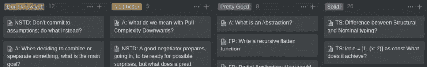
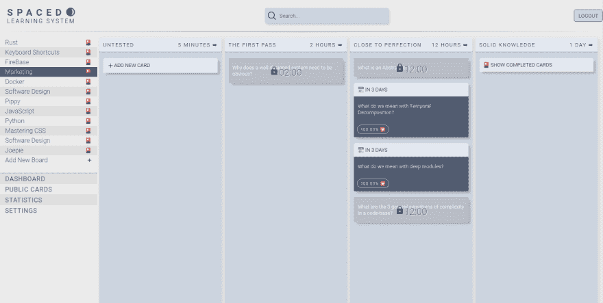
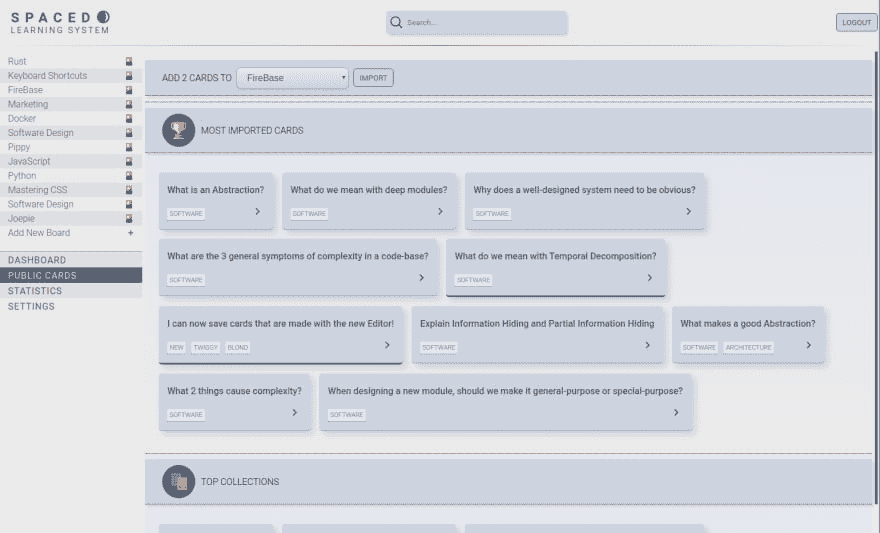
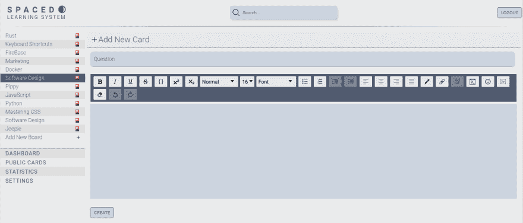
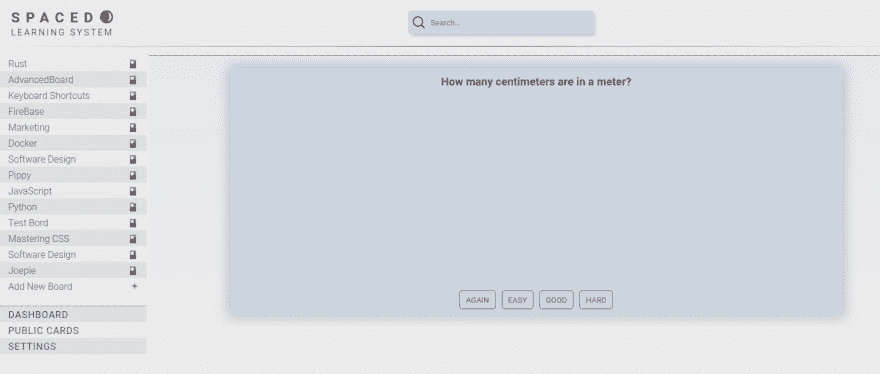

# 如何快速学习

> 原文：<https://dev.to/michielnuyts/how-to-learn-fast-18af>

# [T1】学习是我们的超能力](#learning-is-our-superpower)

如果你想增加你对雇主或自己的价值，你需要具备的一个超能力就是如何有效地学习。想想看，做研究，找到合适的材料，并真正研究到可以教给别人的水平，这真的是一种可以实现的超能力。这是增加你对他人和自己价值的最快方法之一。最棒的是任何人都可以做到！我们生来都有和人类一样的潜力。无论我们出生在哪里，在什么样的环境下，我们的潜力都是平等的。这就是我们区别于所有其他物种的地方，这是一种想象我们想要实现的东西的能力，也是一种推动车轮带我们到达目的地的能力。

在我们的工作中，学习和阅读是你需要提高的最好技能，这是获得最大收益的原因。我已经花了很多时间尝试提高学习成绩的方法。最大的突破之一是阅读彼得·布朗和马克·麦克丹尼尔的《坚持到底》。他们认为间隔重复是快速学习和记住你想学的信息的最好方法。我用自己的方法尝试了一下，我在一个看板中有 4 列。

我在专栏之间花时间来忘记我学过的卡片，因为根据经验研究，我们知道回忆信息越困难，如果我们最终回忆起它，我们将会更好地保留那条信息，忘记它将会困难得多。当卡片被训练到最后一栏时，我可以毫不费力地记住它。

当我用我的新系统研究了约翰·奥斯特的书《软件设计哲学》时，我被深深地吸引住了。我写完的时候可以讲几个小时！它让我大开眼界，让我看到了我们代码库中的问题，这些问题阻碍了我们将其扩展到更多的代码行和更大的开发团队。

我明白了，只是读一本书是一种浪费时间，大多数信息会在短短几周内被遗忘。我经常看着家里的书，问自己:你知道吗，我实际上不太记得我在那本书里读过的东西...这难道不是一种耻辱吗？我们生活在这样一个时代，所有的事情都已经写在书上，由完成了我们想要完成的事情的人来写。以正确的方式研究它将比仅仅阅读它更快地让我们到达那里。

# 自动化我的系统

这种认识改变了我的生活。以至于我想要一个比我的 4 篇专栏文章更好的系统。我想知道在学习一张卡片和被一个算法支持之间需要多长时间，这个算法计算出学习卡片之间的最佳时间。当然，我们很多人都听说过 Anki，我认为这是一个非常好的选择，但 UX 有点缺乏，我想在 Anki 选项之外更加个性化我的工作流程。此外，创建卡片可能会有点耗时。

所以作为一名开发人员，当然，我开始开发我自己版本的 Anki，在那里我可以根据我正在学习的当前信息在简单和高级板之间做出决定。还会有一个自动创建屏幕，你可以将文本、pdf 和其他文本信息快速转换成抽认卡。你可以选择使用默认的 Anki/SuperMemo 算法抽认卡或者一个更简单的卡，卡会自动锁定你可以配置的时间间隔。

我进步很大，每周花大约 20 个小时在这上面。我希望在今年 11 月发布第一个测试版。我对此感到非常兴奋，并希望为更多的人解决学习问题！下面是几张截图！

## 简易木板的视图

## 人人都爱统计！

## 从其他用户导入卡片

## 初看创作画面

## 早看 Anki/SuperMemo 风格卡

我真的很好奇听到关于这个的反馈。学习新信息时，你在纠结什么？让我知道你是否有兴趣参与第一次测试！我打算今年 11 月左右做！

想加入内测就看看[https://www . spaced-learning . app](https://www.spaced-learning.app)！

应用程序的堆栈是 React、NextJS、TypeScript、FireBase 和 Algolia。如果人们对它感兴趣，我可能会在以后的博客中更多地谈论它，请在评论中告诉我！