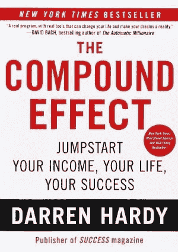
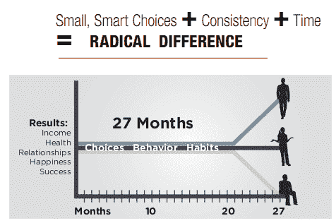

# 如何看起来像一夜成名

> 原文：<https://dev.to/x-team/how-to-look-like-an-overnight-success-3ahn>

这是生活中最大的讽刺之一:一夜成功不会在一夜之间发生。这可能是大多数人内心深处都知道的事情，但仍然值得重复。

一夜成功的发生是因为你在很长一段时间内一小步一小步的前进。最重要的是，你将会成功，因为你有积极的习惯，因为你坚持应用这些习惯。

这是达伦·哈代的优秀著作《复合效应》的主要内容。

### 我们是习惯性生物

在谈论习惯之前，我们先把意志力从它的宝座上敲下来。只要你有决心，你可以做任何你想做的事？有志者事竟成。啊-啊。

意志力是一种有限的资源。如果你太依赖它，任何一天你没有做你想做的事都会让你感到内疚，因为显然你不够想要它，尽管你认为你足够想要。

虽然意志力可以给你最初的动力，让你前进，但它不是可持续和成功生活的灵丹妙药。

事实上，你的神奇药丸💊是你长期以来养成的积极习惯。它们是自动的，几乎不需要任何意志力。我们是习惯性的生物，成功来自于去除消极的习惯，用积极的习惯取而代之。

### 流程如下

我给你举个例子。你是约翰，你每个工作日晚上 8 - 10 点在网飞狂欢。你已经阅读了这篇博文的第一部分，并意识到你的网飞狂欢并不像它应该的那样有益健康。所以你决定把它限制在一个小时内，从晚上 8 点到 9 点。你将把一天的最后一个小时用来写作。

你相信限制你的屏幕时间会帮助你睡得更好，睡前一小时写作可能会让你更接近你的终身梦想，即写下一部轰动一时的科幻小说👽。

这里发生了一些事情。首先，你*意识到*你可以用更有成就感的活动来代替你的网飞狂欢。这很好，因为改变的第一步是意识。

其次，你把你的新习惯和一个根深蒂固的*为什么*联系起来:写科幻小说。理解你的原因会让你更容易建立动力，让你的新行为成为习惯。

接下来会发生什么。当你实施这个新习惯时，最初的几天甚至几周会觉得平淡、无趣、无趣和困难。我很抱歉地说，约翰，但是你很可能会在很长一段时间内看不到你的写作有什么进步。有时候，你可能会觉得自己越来越糟糕。

但是总有一天，有人会看着你写的东西问“我不知道你是这么有才华的作家”。这就是复合效应。随着时间的推移，积极的习惯会持续应用。

这适用于生活中的所有事情。想更好地调试错误吗🐛？成为专业的 React 程序员？更好的厨师？留出时间练习特定的技能，并坚持不懈地去做，没有例外。让它成为一种习惯。

不要不耐烦，因为你需要时间才能看到任何改善。但是你的劳动成果会突然成倍地得到回报。在外界看来，你会像一夜成名。但是现在，我们知道一夜成功不会在一夜之间发生。

即使你是持续努力工作的结果，人们会说你是天生的吗？