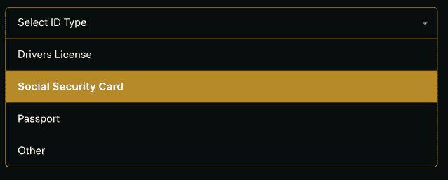

# 如何在 Vue.js 中定制 Select 组件

> 原文：<https://dev.to/wagslane/how-to-make-a-custom-select-component-in-vue-js-pkn>

定制一个**选择**标签的设计是众所周知的困难。有时候，如果不结合使用样式化的**div**和定制的 JavaScript，从零开始构建自己的脚本是不可能的。在本文中，您将学习如何构建一个 Vue.js 组件，该组件可以使用完全自定义的 CSS 进行样式设置。

[](https://res.cloudinary.com/practicaldev/image/fetch/s--UaP55oWb--/c_limit%2Cf_auto%2Cfl_progressive%2Cq_auto%2Cw_880/https://qvault.io/wp-content/uploads/2019/09/Capture.png)

演示:[https://code sandbox . io/s/custom-vue js-select-component-8nqgd](https://codesandbox.io/s/custom-vuejs-select-component-8nqgd)

## HTML

```
<template>
  <div
    class="custom-select"
    :tabindex="tabindex"
    @blur="open = false"
  >
    <div
      class="selected"
      :class="{open: open}"
      @click="open = !open"
    >
      {{ selected }}
    </div>
    <div
      class="items"
      :class="{selectHide: !open}"
    >
      <div
        class="item"
        v-for="(option, i) of options"
        :key="i"
        @click="selected=option; open=false; $emit('input', option)"
      >
        {{ option }}
      </div>
    </div>
  </div>
</template> 
```

Enter fullscreen mode Exit fullscreen mode

这里需要注意的重要事项:

*   “tabindex”属性允许我们的组件被聚焦，这反过来又允许它被模糊。当用户在组件外部单击时，模糊事件关闭我们的组件。
*   通过使用“input”参数发出选定的选项，父组件可以很容易地对更改做出反应。

## JavaScript

```
<script>
export default {
  props:{
    options:{
      type: Array,
      required: true
    },
    tabindex:{
      type: Number,
      required: false,
      default: 0
    }
  },
  data() {
    return {
      selected: this.options.length > 0 ? this.options[0] : null,
      open: false
    };
  },
  mounted(){
    this.$emit('input', this.selected);
  }
};
</script> 
```

Enter fullscreen mode Exit fullscreen mode

这里需要注意的重要事项:

*   我们还在挂载时发出所选的值，这样父节点就不需要显式地设置默认值。
*   如果我们的 select 组件是一个大表单的一小部分，我们希望能够设置正确的 [tabindex](https://developer.mozilla.org/en-US/docs/Web/HTML/Global_attributes/tabindex) 。

## CSS

```
<style scoped>

.custom-select {
  position: relative;
  width: 100%;
  text-align: left;
  outline: none;
  height: 47px;
  line-height: 47px;
}

.selected {
  background-color: #080D0E;
  border-radius: 6px;
  border: 1px solid #858586;
  color: #ffffff;
  padding-left: 8px;
  cursor: pointer;
  user-select: none;
}

.selected.open{
  border: 1px solid #CE9B2C;
  border-radius: 6px 6px 0px 0px;
}

.selected:after {
  position: absolute;
  content: "";
  top: 22px;
  right: 10px;
  width: 0;
  height: 0;
  border: 4px solid transparent;
  border-color: #fff transparent transparent transparent;
}

.items {
  color: #ffffff;
  border-radius: 0px 0px 6px 6px;
  overflow: hidden;
  border-right: 1px solid #CE9B2C;
  border-left: 1px solid #CE9B2C;
  border-bottom: 1px solid #CE9B2C;
  position: absolute;
  background-color: #080D0E;
  left: 0;
  right: 0;
}

.item{
  color: #ffffff;
  padding-left: 8px;
  cursor: pointer;
  user-select: none;
}

.item:hover{
  background-color: #B68A28;
}

.selectHide {
  display: none;
}
</style> 
```

Enter fullscreen mode Exit fullscreen mode

这个 CSS 只是一个例子，它是我们用于 Qvault 应用程序的。你可以根据自己的需要随意改变造型。

我希望这有助于您创建自己的定制选择组件，以下是完整组件要点的链接:

再一次，看看这个演示的真实例子:[https://code sandbox . io/s/custom-vuejs-select-component-8nqgd](https://codesandbox.io/s/custom-vuejs-select-component-8nqgd)

由莱恩·瓦格纳 [@wagslane](https://twitter.com/wagslane)

下载 q vault:[https://q vault . io](https://qvault.io/)

星我们的 Github:[https://github.com/q-vault/qvault](https://github.com/q-vault/qvault)

如何在 Vue.js 中制作自定义选择组件的帖子[最早出现在](https://qvault.io/2019/09/09/how-to-make-a-custom-select-component-in-vue-js/) [Qvault](https://qvault.io) 上。