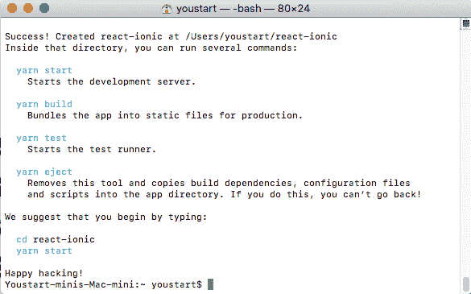
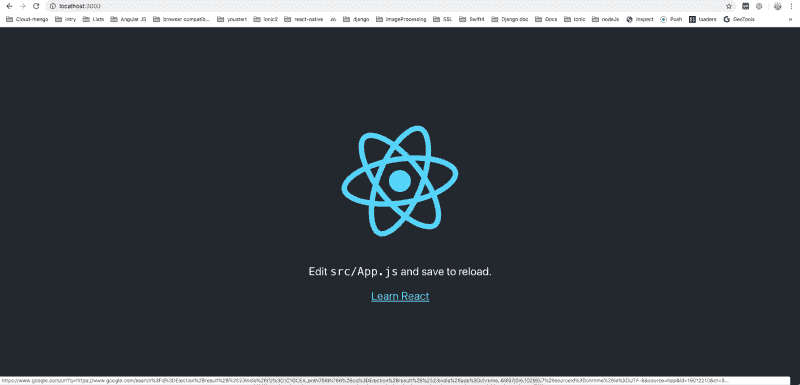

# 如何用电容器制作离子型 app

> 原文：<https://dev.to/enappd/how-to-make-ionic-apps-in-react-using-capacitor-2l9i>

* * *

如果你在这里，这意味着你正在寻找如何创建使用电容器反应离子应用程序。如果这是真的，那么你来对地方了。在这里，我将创建一个使用电容器反应离子应用程序。不用担心，我会一步一步地教你如何使用电容器制作离子型应用程序。我将编写一个简单的应用程序。🥘

> 也可以查看我的[**Ionic 4 React 全 App**](https://store.enappd.com/product/ionic-react-full-app-capacitor/) **。它装载了大量的选项、布局和功能。这是一个完整的入门应用程序，可以开始使用 Ionic 4 和 React JS with capacitor。**

离子型 在过去几年里越来越受欢迎，这是理所当然的。与本地语言(Java / Swift)相比，用 Ionic 制作应用程序简直易如反掌。Ionic framework 的领域包含了各种各样的移动应用程序功能，可以创建当今几乎 90%的应用程序。

JS 它允许你分解组件，用更少的代码创建一个单页应用程序。它最受欢迎的是它的影子 DOM，它用于有限范围的 DOM 操作，这使得 React 应用程序更快。正是由于这些主要的**优势**，使得 **React JS** 备受瞩目。

多年来，Ionic 一直坚持角框架。但是有了 Ionic 4，它就打破了框架的限制。现在 Ionic 4 支持 Angular，React 和 Vue JS 框架。

2018 年 2 月，Ionic 团队宣布推出[电容器](https://capacitor.ionicframework.com/)。Capacitor 允许你在任何地方运行你的前端构建，例如，iOS，Android，Electron，以及在浏览器中作为一个使用任何底层框架的渐进式 web 应用程序(PWA)。


<figure>

<figcaption class="imageCaption">Ionic introduced Capacitor for cross platform and cross framework development</figcaption>

</figure>

[**离子电容**](https://capacitor.ionicframework.com/) 是一个开源的**框架**创新，帮助你构建进步的原生 Web、移动和桌面**应用**。或者，Apache **Cordova** (也称为 PhoneGap)也可以从移动 WebView 访问设备的原生功能。

### 在 IONIC App 中使用电容的优势

1.  如你所知，从 [***Ionic 框架***](https://ionicframework.com) v4 开始，你可以使用你选择的任何 UI 框架——截至目前的[***Angular***](https://angular.io)***【默认】***[***react js***](https://reactjs.org)和[***Vue***](https://vuejs.org)。这将极大地帮助软件开发行业，使他们更容易找到任何 web 开发人员，以最少或零学习曲线开始编码，构建混合本地应用。
2.  **易于集成本地控件**。Capacitor 的目标是使包含本地用户界面控件变得更加容易。例如，如果您想使用本地菜单而不是使用浏览器来创建该界面。
3.  **本地功能立即可用**。使用 Cordova 时，您需要等到设备准备就绪后才能调用本机功能(例如，通过使用`platform.ready()`)。Capacitor 会在应用程序启动时导出 JavaScript，这样就不再需要了。
4.  **PWA 兼容性**。最近有一场巨大的进步网络应用运动。它们开始从浏览器获得更多的支持，更多的工具开始出现来帮助人们构建 pwa。关于 PWA 的一个很酷的事情是，它也可以很容易地捆绑为本机应用程序并访问本机功能(使用 Cordova/Capacitor)。但是，当通过浏览器作为 PWA 运行时，本机代码将不起作用。这使得维护一个项目的单一代码库变得困难，这个项目将作为一个本地应用程序和一个 PWA(甚至可能作为一个桌面应用程序)来分发。使用 Capacitor 作为运行时层，它将能够优雅地处理在没有本机功能的环境中尝试访问本机功能时出现的任何错误。

### 电容器需要依赖性

#### 基本要求

是否为 [Node v8.6.0](https://nodejs.org/) 或更高版本，以及 NPM 版本 5.6.0 或更高版本(通常会自动安装所需版本的 Node)。

电容器依赖于使用`npx`命令，该命令仅在 Node 的版本`8.3.0`或更高版本中可用。您可能已经安装了 Node，所以在 Node 版本之间切换的最简单方法是安装`n`:

```
npm install -g n
```

#### iOS 开发

要构建 iOS 应用程序，Capacitor 需要安装 Xcode 10 或更高版本的 Mac。*很快，你将能够使用*[*Ionic app flow*](http://ionicframework.com/appflow)*来构建 iOS，即使你在 Windows 上。*

此外，您需要安装 [CocoaPods](https://cocoapods.org/) ( `sudo gem install cocoapods`)，并安装 Xcode 命令行工具(要么从 Xcode，要么运行`xcode-select --install`)。

一旦安装了 CocoaPods，就可以通过运行`pod repo update`来更新本地 repo。您应该定期运行这个命令，以确保您拥有最新版本的 CocoaPods 依赖项。

作为一个规则，最新版本的电容器总是支持最后两个 iOS 版本。比如 iOS 12 和 iOS 11。要支持旧版本的 iOS，请使用旧版本的 Capacitor(如果有)。

#### Android 开发

首先，必须安装 Java 8 JDK，如果您安装了其他版本的 JDK，则将[设置为缺省值](https://stackoverflow.com/a/24657630/32140)。Java 9 目前不能用*也不能用*。

Android 开发需要安装有 [Android Studio](https://developer.android.com/studio/index.html) 的 Android SDK。从技术上来说，Android Studio 不是必需的，因为你可以只使用 Android CLI 工具来构建和运行应用程序，但它会使构建和运行你的应用程序更加容易，所以我强烈建议使用它。

Android 版本对电容的支持比 iOS 更复杂。目前针对的是 API 级别 21 以上，也就是 Android 5.0(棒棒糖)以上。
截至 2018 年 1 月，5.0 或更高版本占据了超过 75%的 Android 市场，并且这一比例还在快速增长。到电容器生产就绪时，这个百分比应该会高得多。

此外，Capacitor 需要安装 Chrome 版本 50 或更高版本的 Android WebView。

### 用离子和反应构建 App 的简单方法

#### 1.创建新的 react 项目

要用`create-react-app`创建一个新的 React 项目，您可以使用 [npx](https://alligator.io/workflow/npx/) 或者全局安装`create-react-app`:

```
npx create-react-app react-ionic --typescript
```

**或**

```
$ npm install create-react-app -g
$ create-react-app react-ionic --typescript
```



<figure>

<figcaption class="imageCaption">Successfully created Ionic React app</figcaption>

</figure>

#### 2.在您选择的代码编辑器中打开项目

```
$ cd react-ionic
$ code .
```

#### 3.在浏览器中运行项目

```
npm run start
```

该命令将在您的`package.json`文件中搜索启动脚本，并运行您在启动脚本中提到的命令。例如

```
“start”: “react-scripts start”
```

***react-脚本启动*** 将在开发模式下构建您的代码并在您的浏览器上运行



<figure>

<figcaption class="imageCaption">Default React App opened in browser</figcaption>

</figure>

现在你可以在你的浏览器上看到这个屏幕

#### 4.在我们的 React 应用中安装 Ionic

到目前为止，我们还没有在任何地方包括离子。这一步包括离子在项目中。

```
npm install @ionic/core @ionic/react
```

#### 5.使用类型安装 React 路由器的 React 依赖项

导航需要 React 路由器

```
npm install react-router react-router-dom @types/react-router @types/react-router-dom
```

#### 6.将离子与反应结合使用

在这一步，我们将开始编码，在这篇博客之后，我们将能够用基本的反应库(反应路由器)制作 Ionic-React 应用程序

> 在这个阶段，我们可以像项目中的其他依赖项一样使用 Ionic。每个[组件](https://ionicframework.com/docs/components/)已经被单独导出，并且可以被导入。

1.  首先，转到`index.tsx`，在`@ionic/core`中添加适当的样式: