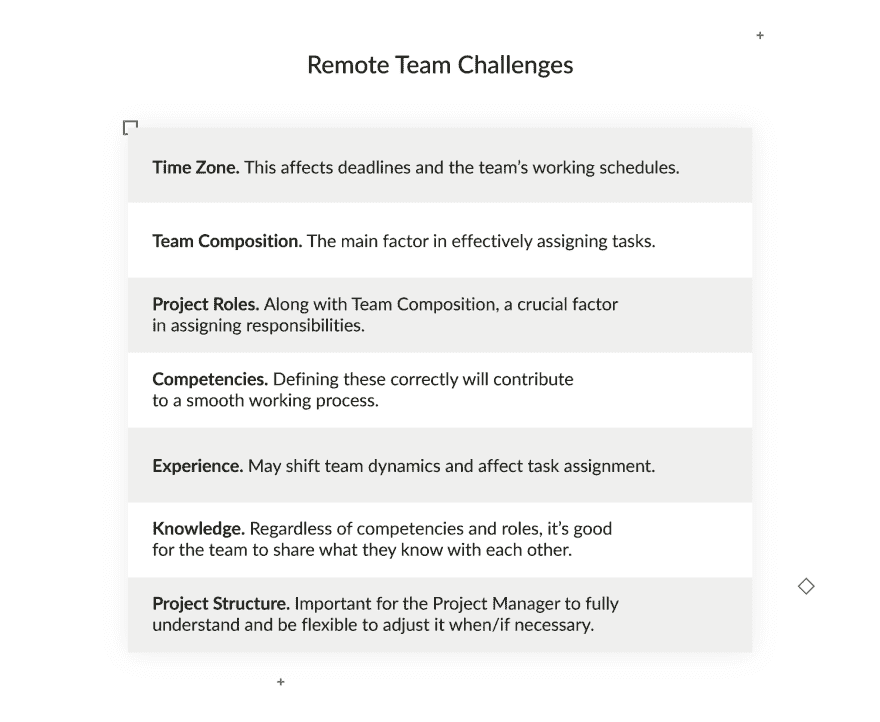
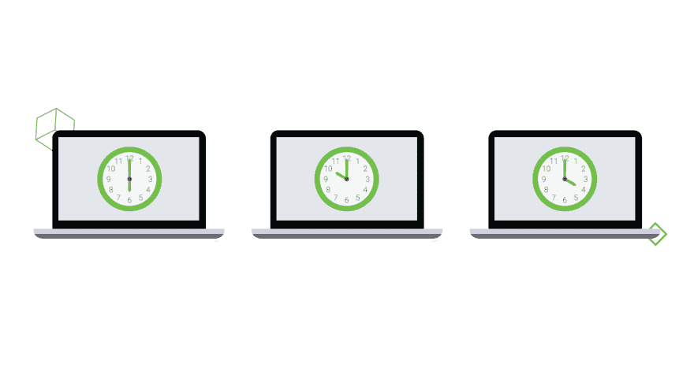

# 跨时区管理软件开发团队的实践

> 原文：<https://dev.to/django_stars/how-to-manage-a-software-development-team-across-time-zones-56ae>

随着全球化的发展，工作实践也发生了变化和发展。为团队寻找最佳人才已经不再是一个挑战，因为整个世界已经变成了一个巨大的招聘池。在过去的几年中，企业已经收集了一些想法和工作实践，可以帮助他们充分利用远程工作，让每个人都尽可能地高效工作，不管他们的邮政编码是什么。许多成功的公司和创业公司从第一天起就没有中心办公室，这一直是他们的优势。它也可以是你的。

我和 Django Stars 合作过六个项目，管理过一些令人惊叹的开发团队。和他们在一起，我获得了经验，学会了管理外包员工的最佳方法，下面我将和你分享。

当与外包团队一起工作时，给软件开发团队一份清单并让他们完成每一部分是不够的。如果是这样的话，生活会变得容易得多！每个项目在每个阶段都可以而且应该根据具体情况、团队成员的能力、他们的角色和背景以及每个市场的典型障碍进行优化。

作为一个项目经理，我的任务不仅仅是给出团队需要遵循的方法或清单，而是提供如何创建一个真正高效的团队、理解任务以及处理团队成员可能会遇到的问题的指导方针。

但最重要的是，每个项目经理都必须看到全局。他们需要了解整个项目，并立即意识到是否有问题以及如何解决。在与客户沟通时，他们必须坚持不懈。不应该有信息空白。最后，他们必须确保每个团队成员都知道并理解他们的任务，这是任何项目经理的首要任务。

当然，团队和管理并不完全是新的科学，如果你和团队一起开始一个项目，有大量的[列表和指令](https://www.projectmanager.com/blog/project-kickoff-checklist)是很重要的。然而，他们并没有真正解释如何管理一个位于遥远星系的团队。

## 我们如何跨越时区远程工作

作为一名拥有坚实投资组合的项目经理，我能够比较与技术合作伙伴以及远程团队相关的各种方法和实践。做出自己的结论让我能够继续改进我的流程。

同样，与远程员工打交道不同于拥有自己的内部团队。以下是为远程团队建立沟通方法时需要考虑的一些关键因素:

当与分布在世界各地的团队合作时，项目经理实际上无法控制开发过程中的每一个因素。但是，他们可以影响团队的动态和上面提到的因素。他们的任务是为了团队的利益使用它们，并知道如何使用它们来识别和解决问题，监控有效性，并在团队成员之间进行这些工作。

## 用于远程协作的通信工具

沟通在每个团队中都是一个重要的问题。成功沟通有几个基本规则。首先，**为每个人选择一个沟通渠道**。这样，你将丢失任何信息的可能性降至最低，这在[为开发团队](https://djangostars.com/blog/successfully-set-tasks-development-team/)设置任务时至关重要。不同的团队成员可能更喜欢不同的沟通工具 — ，但是为了项目的利益，你和你的团队应该选择一个，另外一两个作为备用或特殊功能。

一旦你选择了适合每个人的交流工具，你就可以开始了。

这些年来，我尝试了很多日常交流的沟通工具。这里有一个简短的概述，可能会帮助你选择你的。

Google Hangouts 。在我看来，这是最稳定的 messenger 平台，可以与你的谷歌账户、邮箱、日历等同步。您可以使用音频和视频通话，通过共享屏幕查看所有参与者，以及静音和 ping 单个用户。在电话或视频中格外关注同事是很重要的，因为总有一种风险，你可能会忘记扬声器里的某个人。

除了基本功能之外，Google Hangouts 还允许你在 YouTube 上流式传输你的会议和/或录制它们以供编辑。这个工具的移动性允许你在不同的 iOS 和 Android 设备上同步它。

相比之下，Skype(举例来说)就不适合 8 人以上的团队，它更像是一个私人谈话的工具，而不是商业工具。

一般来说，不同的国家偏好不同的[视频会议软件](https://communications-software.financesonline.com/c/video-conferencing-software)。您可以研究在团队工作的地区什么是最广泛使用的。

**松弛**。远程团队沟通可以通过更常见的渠道完成，比如 Slack，它甚至被共同分配的团队使用。但由于大家更习惯于 Slack 上的日常交流，项目经理需要注意谈话流程——他们需要调解，建立官方渠道，劝阻私聊。

**变焦**。如果你需要记录你的谈话，这个工具可能是有用的，但是这个应用程序只在前 40 分钟是免费的。相比其他提供类似服务的免费平台，这是一个很大的劣势。

当然，还有更多音频和视频聊天和电话会议的平台，所以你可以自由选择适合你和你的项目的平台。然而，我们的目标是选择一个团队成员会一致使用的，并且在每个人的基础设施上可靠工作的。

### 良好的沟通渠道设置标准

碰巧的是，许多远程团队以前从未一起工作过，也从未见过其他成员。为了建立有效和成功的沟通，团队成员了解彼此的角色和职责以及他们的个人特征是很重要的。项目经理的工作是确保每个人都感到舒适。

让每个人都了解团队及其成员的第一步是建立易于理解和信息丰富的档案。这样，每个人都有了理解每一次沟通的背景知识。

这一背景必须至少包括:

*   他们的完整个人资料，填写了个人简历和联系方式；
*   个人资料图片(不是动漫人物的)；
*   他们的头衔和角色，清楚地说明；

和

*   电话号码或其他快速联系方式，保证 100%回复。

不管你选择什么沟通渠道，只要大家适当的介绍自己，沟通起来会更舒服更有效率。

下一步是建立一定的沟通实践。

## 跨时区工作的良好实践

远程开发团队对于 IT 行业来说并不陌生，但是跨时区工作给组织日常运营带来了新的挑战。由于时差会限制交互式反馈和人际交流的时间，因此应该尽可能有效地利用时间重叠。

选择一个沟通渠道是避免分心和信息丢失的第一步。但接下来你会去哪里？

### 组织结构化重叠的时间表

如果没有为了更大的利益而正确使用，团队成员的不同位置可能看起来是一个缺点。为了更好地沟通，使用电话会议和/或联合团队任务的时间重叠。提前详细地计划它们，分清轻重缓急，让每一分钟都有价值。一点时间压力会让每个人保持良好状态，专注于最重要的事情。但是时间表最关键的部分是你要坚持，并且始终如一。此外，不要试图全天候工作。这对任何人都没有好处。

### 以清单的形式交流问题

在这种情况下，重要的是密切关注事情，确保每项任务都得到必要的关注，所有的问题都得到及时的回答，这样才不会拖延进程。一个很好的建议是为每个工作日编制清单，按项目分类。为了提高效率，将这些清单链接到您选择的项目存储库。

为了跟踪远程团队正在完成的工作，许多团队求助于各种 SaaS 工具来进行沟通、项目管理和召开有效的会议。大多数面向远程员工的工具都有一个共同的关键特性，那就是实时协作。例如，像 Coda 这样的工具是一个实时协作文档，但也具有电子表格和数据库功能，允许更高级的任务跟踪和资源利用。他们开发了各种[会议笔记和议程模板](https://coda.io/for/meetings)，远程员工大量使用它们来与同处一地的团队成员保持同步。

### 拥有单一的“真理来源”

任何项目都依赖于某些正式和非正式的协议，为了避免进一步的混淆，这些协议应该易于跟踪。为了确保不遗漏任何关键信息，您应该建立一个“事实的来源”，一种保存所有重要文档和项目决策的保险箱。

我的团队使用 Confluence，但是你可以使用最适合你的。这个工具使我们能够有序地维护我们的文档，并保持其适当的结构。不要让结构过于复杂——不要超过三个层次。如果您有任何要求或意见，只需将它们添加到相关主题的页面中。

## 为远程团队建立流程

对于跨时区工作的远程团队来说，结构和顺序就是一切。在你的团队中工作的人越多，建立每个人都要遵循的过程和程序就越重要。

例如，我曾经发现团队的三个不同的成员保存了单独的 Excel 文件，便于他们跟踪项目的进展。当然，这在团队环境中并不奏效，但是让所有团队成员保持一致是非常重要的。有时这意味着改变你自己的习惯，采用一个与你已经习惯的相比功能不太丰富的工具，只是为了让每个人都能参与进来。理想情况下，您会提前就正式的项目跟踪工具达成一致，但是有时您会发现贡献者的各种文件和文档需要合并到一个为大多数团队成员工作的系统中，而不仅仅是一个。

### 创建具有升级路径的沟通渠道

不是每个团队成员都有权力或知识来做出某些决定或解决问题。显然，不解决某个问题可能会拖延项目或导致最后期限的延迟。最坏的情况是，这可能会导致违约和重大金钱损失。作为项目经理，你应该**为所有团队成员建立一条沟通渠道**，让所有团队成员都可以遵循，如果出现问题，有一个清晰的**升级路径**。

沟通线可以是一个包含图表的文档，图表上有姓名、头衔和职责范围。升级路径本质上是一个清晰的管理链。如果团队成员没有能力或资源自己解决问题，他们应该认识所有能够解决问题的更高级别的人。如果客户代表不能与远程软件开发团队的成员达成共识，他们应该知道应该向更高层的人求助来解决问题。

### 就请求沟通达成一致

当很多人在一个项目上工作时，在交流中丢失一些东西，或者职责从一个团队成员转移到另一个团队成员，这并不罕见。像产品负责人的要求或评论这样重要的东西不能丢失或忽略。为重要的功能请求建立**流程，该流程清晰透明，并事先达成一致。指派一个人负责随时接受产品负责人的要求和意见。或者确定一个时间——比如定期的团队会议或电话——他们可以马上被介绍给团队。**

### 获得对每项变更的批准

在处理代码时，看似**小的决定可能会导致大的后果**。有时，技术团队会看到一种不同的(在他们看来更好的)方式来达到客户的目标，或者甚至可能将一些全新的东西引入到项目中。但是对开发团队来说合乎逻辑和清晰的东西对客户来说可能看起来不一样。对于这种情况，只有一条规则:每一项变更都应该得到业务方的批准。这样，每一个决定都可以追溯和澄清。

## 技术团队远程协作必备

显然，远程团队在进行项目时需要一个透明清晰的结构来遵循。但是技术团队也需要一些特殊的流程和算法才能有效工作。虽然管理问题可以公开讨论，但技术工作流程要复杂得多。你是如何进行的？

*   协作流程
*   拉取请求和提交的清单
*   代码风格指南
*   快速问答聊天的渠道

### 建立标准、直观的协作流程

从一开始，就确定谁与谁沟通，谁设定时间表和截止日期，谁决定要批准的任务或要返工的任务。每个人都应该清楚谁负责项目的哪些方面，谁是负责人。

### 定义一致同意的拉请求和提交流

当涉及到项目的技术方面时，你必须真正彻底地了解你的过程。否则，一个小小的缺陷就可能危及整个项目。拉请求和提交的清单将确保部署顺利、可预测，并包括及时的反馈。

### 引入或开发代码风格指南

为了使整个项目运行良好，代码必须遵循一定的标准并且是高质量的。当多只手都在触摸代码时，就有每一双都想带进自己的东西的危险。这就是为什么提前确定一些指导方针很重要。这将使代码对每个可能加入团队和/或参与维护的人来说变得清晰，并确保没有重要的逻辑隐藏在注释中。

任何项目经理都应该能够在项目开始之前评估团队成员的知识水平。为此，他们应该:

*   了解团队成员对将要使用的工具知道什么和不知道什么；
*   采取措施填补知识空白——例如，举办研讨会；和
*   创建仪器和过程指南，团队成员可以在需要时随时查阅。

## 管理外包团队外卖

我们刚刚介绍了大量关于管理远程软件开发团队的信息。当然，这需要时间来处理。总之，这里有一个最有效方法的简短概述:

*   单一通信渠道
*   需求的一个“真实来源”
*   达成一致的请求沟通，因此不会遗漏任何重要的请求
*   任何重要的政策决策都应该得到批准(对关键的逻辑添加，请说“请批准”)
*   结构合理的工作时间表，在时间重叠时提高效率
*   使用链接问题清单

作为一名项目经理，我的额外建议是，尽一切可能(和不可能)为个人会议腾出时间。这将有助于建立团队成员之间的相互尊重，并让他们更好地相互理解。为了获得对时间更“真实”的感觉，放置物理时钟来可视化每个团队成员所在时区的时间。当你真正开始和一个来访的团队成员一起工作时，写一份简短的简历，介绍你的工作成果，让每个人都跟上进度。

根据我的经验，所有这些应该可以帮助你成功地管理一个很好的外包供应商团队，这个团队很容易合作，也很容易管理。但最重要的是，使用我提出的方法，远程团队提供了以下优势:

*   **效率提高**。即使团队成员以前没有一起工作过，他们也能够更好地了解彼此和整个过程。
*   **清除状态**。问题得不到解答的风险接近于零。
*   **客户导向**。该团队表明，他们实际上关心产品是否符合客户的需求。
*   **伟大的时间管理**。团队将节省他们的时间，但更重要的是，他们客户的时间，这再次证明了客户导向。

祝你好运！

这篇关于跨时区管理软件开发团队的文章是 Nataliia Peterheria 写的。最初发布在 Django Stars 博客上。