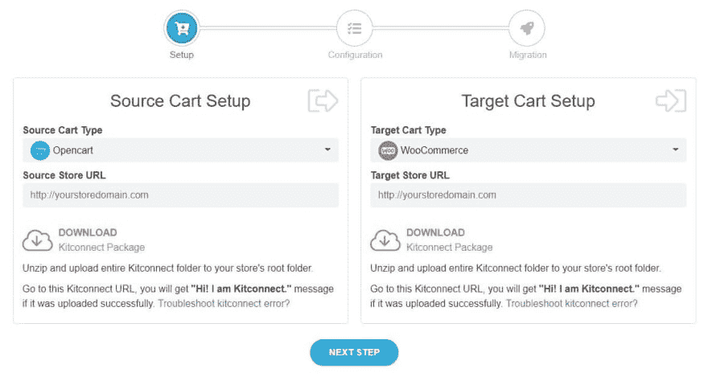
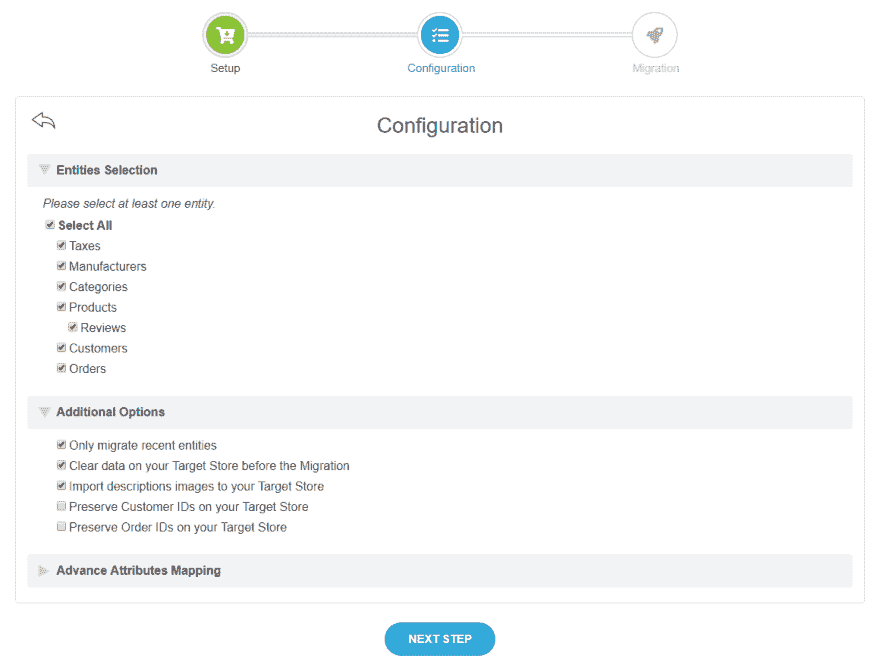
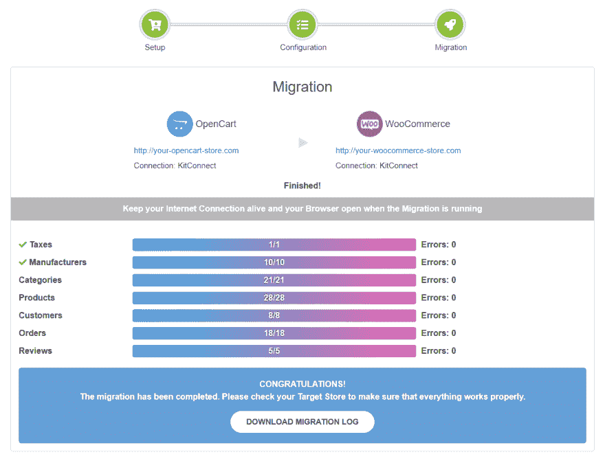

# 如何将你的商店迁移到 WooCommerce

> 原文：<https://dev.to/next_cart/how-to-migrate-your-store-to-woocommerce-43j3>

# 什么是 WooCommerce 平台？

WooCommerce 是一个专门为 WordPress 设计的开源电子商务插件，是一个快速和适合在线小额和大额交易的平台。

它有许多不同的功能，如交付、支付方式、多样化的产品等等。在这个 WooCommerce 迁移指导中，你会知道如何将你的网站迁移到 WooCommerce，并开始销售。

# Next-Cart 购物车迁移服务

[Next-Cart 是一项购物车迁移服务](https://next-cart.com)允许您将数据从当前商店迁移到另一个电子商务平台。它可以将您的商店迁移到行业内所有运营的电子商务平台，如 WooCommerce、Shopify、Magento、BigCommerce 或 OpenCart 等。

这不仅是一个自动化的迁移工具，也是一项服务，在这项服务中，您的迁移过程将由专家一步一步地进行。迁移的次数没有限制。这意味着您可以在任何时候执行任意数量的迁移。

# 如何使用 Next-Cart 将您的商店迁移到 WooCommerce

首先，您需要在 [Next-Cart](https://next-cart.com) 上登录您的帐户。如果你没有，通过谷歌或脸书注册。选择购买您的迁移计划或尝试免费演示迁移。

### 第一步:设置

第一步是为下一个购物车迁移程序提供所有必需的信息。

它们包括源购物车类型(您的在线商店的当前电子商务平台)、目标购物车类型(WooCommerce)、源商店 URL、目标商店 URL (WooCommerce 商店 URL)。

然后单击下一步。

### 第二步:配置

在第二步中，您将在实体选择中选择您想要迁移到 WooCommerce 的数据，如税收、制造商、产品和类别等。

此外，您可以考虑其他附加选项和高级属性映射。

不像有些插件会阻止你选择必要的数据，Next-Cart 是由你决定的。

然后按“下一步”,当他们询问您是否准备好时，单击“是”。

### 第三步:迁移

最后一步展示了迁移到 WooCommerce 的过程。你所有的工作都完成了。

# (视频)从 OpenCart 迁移到 WooCommerce 的指南

[https://www.youtube.com/embed/ZsrUhz_sXKs](https://www.youtube.com/embed/ZsrUhz_sXKs)

# 结论

如果您在 **Next-Cart** 上有任何问题，或者想考虑其他选择，请随时通过 https://next-cart.com/contact/[联系我们，我们的网络商务专家随时准备为您提供全天候帮助。如果指南对你有用，不要忘记喜欢并与他人分享。谢谢大家！](https://next-cart.com/contact/)