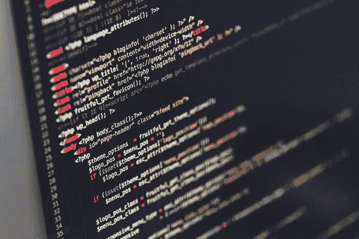
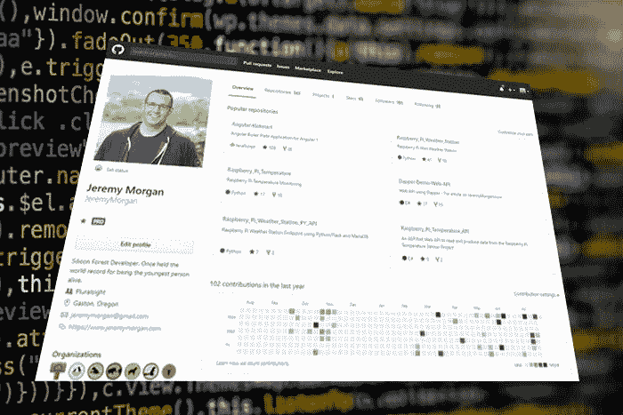

# 如何搞定你的下一次编码面试

> 原文：<https://dev.to/pluralsight/how-to-nail-your-next-coding-interview-2152>

*[在推特上关注我](http://bit.ly/JeremyCMorgan)！很高兴听到大家对此的看法，以及对新文章的建议。*

除了荧光灯的嗡嗡声，房间里静悄悄的。桌子对面的评委都盯着你，面无表情。有的有纸笔，有的没有。他们都盯着你。你的嘴太干了，感觉像吃了一整天的木屑。你拿起马克笔，走向白板。一名法官正盯着一台笔记本电脑。是时候向他们展示快速排序了。

编码面试我两边都有。我参加过求职面试，有时我得到了工作机会，有时没有。有时我完成了白板测试，却没有接到电话，反之亦然。在我的职业生涯中，我已经面试了数百人，我尽了最大努力让候选人感到舒服，但许多经理不会。他们会试图绊倒你，让你窒息。我们可以稍后再讨论白板面试的有效性，但这种情况会发生。

让我们来看看一些技巧，让你在下一次编码面试中表现出色。你可以为自己的成功做好准备并抓住它。不要搞错了，这不是一套“黑客”、“把戏”，或某种大脑转储。不要使用卑鄙的策略或诡计来获得你不胜任的职位。他们以后会解雇你的。沿着这条路走下去，你会通过面试，因为你会成为一名更好的开发人员。

### **他们在找什么**

以下是大多数面试官会寻找的东西，排名不分先后:

**解决问题**——你能多好地解决问题，更重要的是:你的流程是什么。许多测试会寻找这一点。

编码技能 -你需要在这里表现得非常出色。我给人们发了笔记本电脑，让他们给我写点东西。你可以通过观察人们做的事情来判断他们实际做了多少编码。

技术知识 -这是一些琐碎问题出现的地方，但是你的面试官想知道你的技术水平如何。

体验:这是你谈论你过去项目的地方。面试官想听你的战争故事，以及你从中学到了什么。

文化契合度(Culture Fit)——这个我帮不了你多少。这是他们了解你如何融入团队的地方。在这方面你有很多方法可以改进..

那么你需要做些什么准备呢？让我们开始吧。

### **第一阶段:打基础**

所以这是你在面试前需要做的事情。几天、几个月或几周之后，你才需要建立一些核心技能。

#### 学习计算机科学基础知识

你需要掌握计算机科学的基础知识。在这里，你不必像唐纳德·克努特那样，但你需要了解理论、语言和习语。这是面试的最低要求。如果面试官开始在面试中随意提到二叉树，你最好知道他们在说什么。

1.  复习 **[计算机科学基础教程](http://bit.ly/2Y6aRiV)**——其中一些对你来说可能很基础，但它给了你一个需要注意的框架。你的优势在哪里？如果你发现任何你不擅长的领域，努力积累你在该领域的知识和技能。

2.  复习 **[自学计算机科学](http://bit.ly/2SLt7bo)**——我们再次讨论你可能缺乏的基础知识。你需要知道基础知识并会说这门语言。

3.  你甚至可以免费参加斯坦福大学的计算机科学 101 课程。

#### 学习不同的算法

算法主宰着世界，如果你是一名开发人员，你需要了解它们。那么如何变得擅长算法呢？这不是黑魔法或秘密艺术。

据 **[极客为极客](http://bit.ly/2GygrzB)** 以下是面试问题中排名前 10 的算法:

*   图表
*   链接列表
*   动态规划
*   排序和搜索
*   树/二叉查找树
*   数论
*   位操作
*   字符串/数组

对我来说似乎很准确。知道这个超级有帮助。在这个列表中，你最擅长什么？你最擅长什么？ **[这个链接](http://bit.ly/2GygrzB)** 对于获得每个例子和一些例子的高层次视图是极好的。

这些课程将帮助你在这一领域占据绝对优势:

*   **[算法和数据结构-第一部分](http://bit.ly/2Ops9TE)**
*   **[算法和数据结构-第二部分](http://bit.ly/2SIBCnD)**

在大约 6 个小时内，你将能够理解并真正谈论算法。

**动作:*研究这个东西。学会它。知道吗*。**

### **第二阶段:练习练习练习**

还有一件事你需要成为你日常生活的一部分:练习。你需要每周练习几次或更多次，才能真正变好。

你练习得越多，你在任何白板上的表现就越好。大多数时候，他们会要求提供伪代码，但是如果你真的付诸实践，你可以毫不犹豫地在白板上写出真正可编译的代码。

1.  查看一下 **[HackerRank 面试准备工具包](http://bit.ly/2YqGZsT)**——这是你现在拥有的所有算法知识的关键时刻。用真实的例子来应用它。

2.  开始参加 **[HackerRank 挑战赛](http://bit.ly/30Y9U9h)**——这是你如何在不同领域真正应用你的知识。这是**终极白板练习区**。

    分解成这样:

    -**-[算法](http://bit.ly/2Yadhgo)**-
    -**-[数据结构](http://bit.ly/2GL3zGL)**
    - **[数学](http://bit.ly/2SHCHMo)**

如果可以的话，每天做一次运动。努力克服许多挑战。如果你在 30 天内每天都做一个挑战，你就能搞定白板面试，成为更好的程序员。我向你保证。

1.  **[报名参加 LeetCode](http://bit.ly/2GxMO1v) 并开始参与挑战**——没有什么比与他人竞争更能提高你的技能了。这里有很多挑战和有趣的东西。

2.  **[签出项目欧拉](http://bit.ly/ProjectEuler)** 并开始编写代码解决那里的问题。欧拉项目是一组真正挑战你解决问题能力的数学和编程问题。在这里用代码解决你的问题，你的技能就会增长。

**动作:*写点代码。很多。变得冷酷而擅长于此*。**

### **第三阶段:建立你的公众形象**

你需要把你已经完成的工作放在网上，并且可以访问。每个招聘人员、经理或对你感兴趣的人都会谷歌你。确保他们找到你的作品。

1.  **把你的资料放到网上，如果你还没有一个 GitHub** 账户的话，就[开一个。把你所有的代码放在那里。你的个人项目，你为教程写的东西，所有的一切。](http://bit.ly/2YeqNzO)

2.  在像 [JSFiddle](http://bit.ly/2JX1OI9) 和 [CodePen](http://bit.ly/2ZpyrE1) 这样的网站上创建账户——这主要是针对网络开发者的，但它也为人们找到你的作品创造了一个好地方。

3.  **创建一个博客**——不管是 WordPress、GitHub pages，还是像 **[我的博客](http://bit.ly/2GyqODF)** 这样的定制托管服务器设置，你都应该创建一个博客，谈论你正在从事的工作、你正在学习的内容以及你可以教授的内容。

> 注意:当我找不到他们的 GitHub 或任何公共工作时，我会扔掉他们的简历。这表明他们并不热情，寻找热情员工的经理会寻找你公开发布的内容。不管你的工作有多好，都要拿出来。

**行动:*注册并开始公开你的代码和项目*。**

### **第四阶段:准备面试**

准备最终决定你的成功。没有准备就没有人会成功。以下是你如何准备你的面试，并把球踢过立柱。

1.  **[拾一本破解代码面试](http://bit.ly/2YahDUV)**——这本书是编码面试的圣经。就像这篇文章一样，它并没有告诉你如何作弊或者走捷径获得工作——它给了你一个提升技能的好框架。包括练习题，它给你所有你需要的工具来提高你的技能。

2.  参加这个关于准备工作面试的课程——这给了你真正准备工作所需的信息。

    本课程涵盖:

    *   工作面试基础
    *   基于算法的问题
    *   典型问题
    *   计算机科学问题
    *   获取经验它真的涵盖了你需要知道的在两个半小时内取得成功的知识。非常值得。
3.  好吧，我知道这听起来很傻，但这里有些东西会给你额外的优势。不管你的面试是在一天中的什么时候，**在面试前一两个小时去健身房或者做一些有氧运动。
    这将确保:**

    *   你精神焕发，精力充沛
    *   你的血液中有氧气流动
    *   你的肌肉会放松

    一次好的艰苦锻炼会让你充满活力，准备好去面试。你不想在面试中显得疲惫或无精打采。你希望你的身体和精神都处于最佳状态。

准备就是一切。你准备得越多，你在面试那天就会感觉越好。

**动作:*像拳击手一样开始训练。准备战斗*。**

### **结论**

编码面试可能很残酷。你可以通过做以下事情来减轻他们的痛苦:

*   学问
*   磨砺你的技能
*   练习

这些事情将确保你的成功。相信我，在 LeetCode 和 HackerRank 中解决了疯狂的问题后，白板测试变得简单多了。如果你独自做这件事，你会成功的。

如果你有意见，欢迎分享或者在推特上对我大喊，我们可以一起讨论。