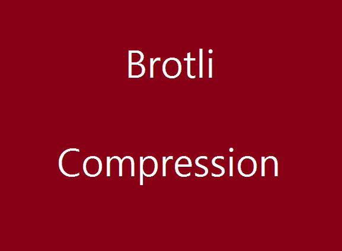
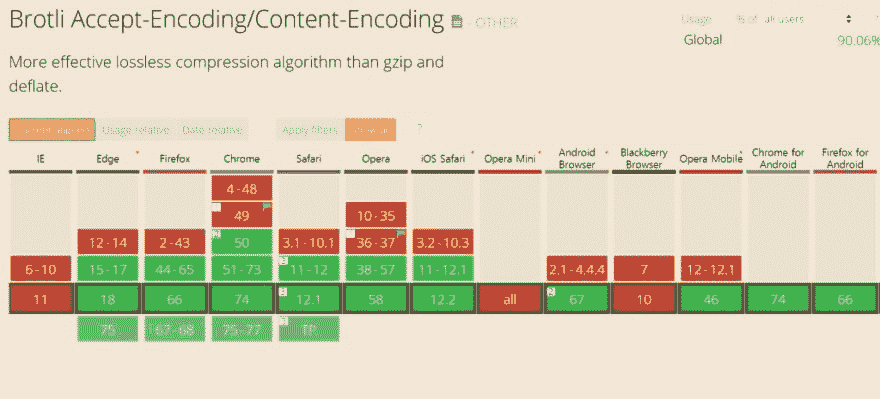
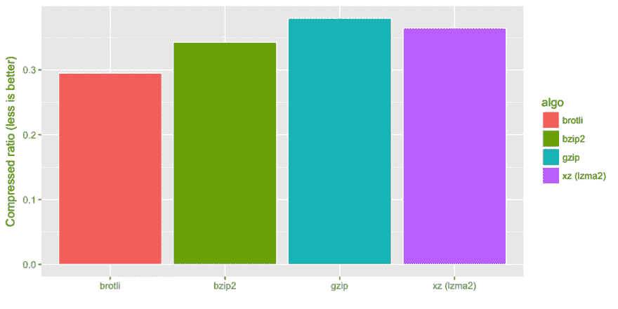
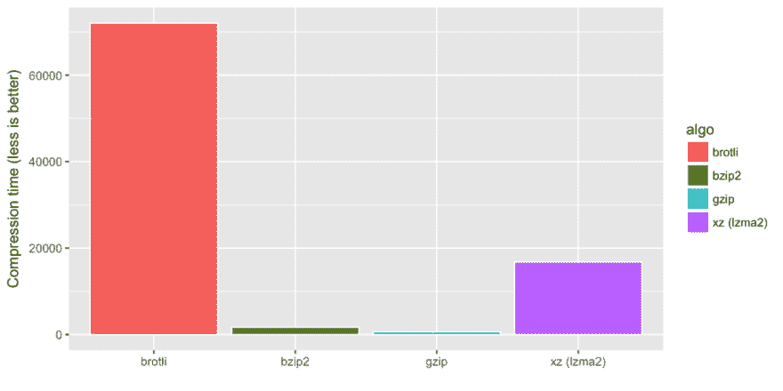

# 如何优化你的网站(feat.brotli 压缩)

> 原文：<https://dev.to/ham8821/how-to-optimize-your-website-feat-brotli-compression-4fea>

大家好！上一次，我谈到了 Gzip 压缩，这是最常见的内容编码方式之一，有人提到了 Google 的 brotli。
基于这个原因，今天我想谈谈 brotli。
如果你没有看过我上一篇关于 Gzip 压缩的帖子，请[跳到这里！](https://dev.to/ham8821/how-to-optimize-your-php-website-feat-gzip-compression-285j)

好的，就像上面提到的，Gzip 是内容编码的一种流行和常见的方式，但它非常有用，因为它很容易使用，只需调整 web 服务器提供的设置就可以执行。然而，与此同时，它也受到了批评，因为它在安全问题上并不完美。

### 第一:布罗特利 **的出生**

 **2015 年 9 月，谷歌将 Brotli 作为开源软件发布，然后随着 chrome 开始支持 brotli 压缩，它开始变得流行起来。

### 第二:**Gzip VS brot Li**T2】****

 **我知道，你一定很好奇哪一个是最好的，我知道总是会有一些讨论和不同的意见。
但是，根据这篇[文章中的](https://cran.r-project.org/web/packages/brotli/vignettes/benchmarks.html)也就是比较的一些压缩技术包括 gzip 和 brotli，
**越少意味着越好 ****** 

结论是，在压缩比方面，brotli 表现出最好的结果，而在压缩速度方面，gzip 表现出更好的结果。

如果你想看更多这方面的文章，下面的链接可能会帮助你了解更多。

[1)](https://hacks.mozilla.org/2015/11/better-than-gzip-compression-with-brotli/)[https://hacks . Mozilla . org/2015/11/better-than-gzip-compression-with-brot Li/](https://hacks.mozilla.org/2015/11/better-than-gzip-compression-with-brotli/)
[2)](https://medium.com/oyotech/how-brotli-compression-gave-us-37-latency-improvement-14d41e50fee4)[https://medium . com/oyo tech/how-brot Li-compression-gave-us-37-latency-improvement-14d 41 e50 fee 4](https://medium.com/oyotech/how-brotli-compression-gave-us-37-latency-improvement-14d41e50fee4)

### 第三:在**Nginx**T5 上使用 **Brotli**

 **显然，nginx 是具有如此多好处的 web 服务器之一。然而，当我们使用 brotli 时，可能需要一些额外的工作。如果 nginx 版本已经更改，我们需要相应地编译和重置设置，这听起来很烦人。为了减少额外的工作，互联网上有一些自动化这些步骤的方法，但这些方法并不完美。

下面是一些关于 Brotli 支持
[1)](https://github.com/pothi/nginx-brotli)[https://github.com/pothi/nginx-brotli](https://github.com/pothi/nginx-brotli)的链接

[2) Brotli 与 Engintron Nginx](https://github.com/engintron/engintron/issues/712)

### 最后:**结论**

 **

综上所述，与之前的 deflate 或 gzip 相比，Brotil 可能是执行内容编码的最佳方式，因为它确实提高了压缩比，并明显减少了最多 20%的加载时间。然而，仍然有一些关于动态内容网站是否比静态网站更好的讨论。此外，我们需要注意这样一个事实，即它在某些方面可能是高维护的。********