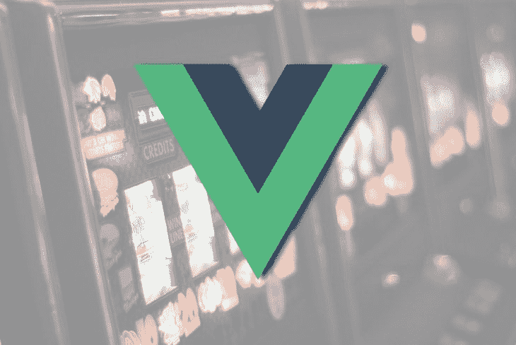

# 如何通过带有 Vue 插槽的组件传递 HTML 内容

> 原文：<https://dev.to/bnevilleoneill/how-to-pass-html-content-through-components-with-vue-slots-5cn2>

[](https://res.cloudinary.com/practicaldev/image/fetch/s--syzOjWyo--/c_limit%2Cf_auto%2Cfl_progressive%2Cq_auto%2Cw_880/https://thepracticaldev.s3.amazonaws.com/i/qkg40u6cskyym98u9jif.jpeg)

这篇文章将向您介绍在 Vue.js 中，如何使用 Vue 插槽将数据从父组件传递到子组件。

## 开始前…

这篇文章适合所有阶段的开发者——包括初学者——尽管在阅读本教程之前有一些先决条件。

您需要在机器上安装以下设备:

*   已安装 node . js 10 . x 及以上版本。您可以通过在终端/命令提示符下运行以下命令来验证您的版本:`node -v`
*   代码编辑器；我强烈推荐 Visual Studio 代码
*   Vue 的最新版本，全球安装在您的机器上
*   安装在您机器上的 Vue CLI 3.0。为此，首先卸载旧的 CLI 版本:`npm uninstall -g vue-cli`
*   然后，安装新的:`npm install -g @vue/cli`
*   在此下载一个 [Vue starter 项目](https://github.com/viclotana/vue-canvas)
*   解压缩下载的项目
*   导航到解压缩后的文件并运行命令以保持所有依赖项最新:`npm install`

[](https://logrocket.com/signup/)

## 什么是 Vue 槽？

Vue slots 是 Vue 团队创建的 Vue 模板元素，为模板内容分发提供平台。它是一个内容分发 API 的实现，其灵感来自于 [Web 组件规范草案](https://github.com/w3c/webcomponents/blob/gh-pages/proposals/Slots-Proposal.md)。使用 Vue 插槽，您可以在项目的各个组件之间传递或分发 HTML 代码。

## 为什么 Vue 槽很重要？

内容分发很重要，原因有很多，其中一些与结构有关。使用 Vue slots，您可以构造一个 HTML 界面(就像使用 TypeScript 一样)，然后您可以使用它作为指南，通过模板注入来构建您的组件。对于将模板代码从一个组件传递到另一个组件，这是一个非常可伸缩和高效的解决方案。

内容的定位是 Vue 插槽的另一个很好的用例。您可以只创建一个模板，然后使用另一个组件或父组件来排列该模板，就像您希望它出现在用户界面中一样。

## 老虎机对战道具

如果你知道 Vue 老虎机，你可能想知道道具和老虎机是否做同样的事情。这些工具或平台的中心思想是鼓励资源的可重用性和效率。考虑到这一点，老虎机和道具是相似的。

Props 处理在组件之间传递数据对象，而 slots 处理在组件之间传递模板(HTML)内容。然而，作用域插槽的行为就像道具一样；这将在本教程中清楚地说明。

## 视图槽语法

对于 slots，您的子组件充当您希望内容如何排列的接口或结构。它可以是这样的:

```
<template>
  <div>
    <slot></slot>
  </div>
</template> 
```

Enter fullscreen mode Exit fullscreen mode

父组件(要注入到子组件中的 HTML 内容所在的位置)可以是这样的:

```
<Test>
   <h2>Hello World!</h2>
 </Test> 
```

Enter fullscreen mode Exit fullscreen mode

这种组合将返回如下所示的用户界面:

```
<template>
  <div>
    <h2>Hello World!</h2>
  </div>
</template> 
```

Enter fullscreen mode Exit fullscreen mode

请注意，插槽本身如何作为内容注入位置和方式的指南——这是中心思想。

## 演示

如果您从一开始就关注了这篇文章，您将会在 VS 代码中打开 Vue starter 项目。为了说明语法部分中的简单示例，我们的父组件将是`app.vue`文件。打开你的`app.vue`文件，复制这个代码块:

```
<template>
  <div id="app">
    
    <Test>
      <h2>Hello World!</h2>
    </Test>
  </div>
</template>
<script>
import Test from './components/Test.vue'
export default {
  name: 'app',
  components: {
    Test
  }
}
</script> 
```

Enter fullscreen mode Exit fullscreen mode

子组件将成为测试组件，所以将下面的代码块复制到`test.vue`文件中:

```
<template>
  <div>
    <slot></slot>
  </div>
</template>
<script>
export default {
  name: 'Test'
}
</script> 
```

Enter fullscreen mode Exit fullscreen mode

使用以下命令在开发环境中运行应用程序:

```
npm run serve 
```

Enter fullscreen mode Exit fullscreen mode

[图片]

## 命名插槽

Vue 允许一个组件有多个插槽，这意味着您可以拥有任意数量的插槽。为了测试这一点，将这个新代码块复制到您的`test.vue`文件:

```
<template>
  <div>
    <slot></slot>
    <slot></slot>
    <slot></slot>
  </div>
</template>
<script>
export default {
  name: 'Test'
}
</script> 
```

Enter fullscreen mode Exit fullscreen mode

如果运行该应用程序，可以看到 hello world 打印了三次。所以如果你想添加更多的内容——比如一个标题、一段文字，然后是一个无序列表——Vue 让我们命名范围，这样它就可以识别要显示的特定范围。在`test.vue`文件中命名插槽将如下所示:

```
<template>
  <div>
    <slot name="header"></slot>
    <slot name="paragraph"></slot>
    <slot name="links"></slot>
  </div>
</template>
<script>
export default {
  name: 'Test'
}
</script> 
```

Enter fullscreen mode Exit fullscreen mode

现在，您还必须根据您想要在其中显示 HTML 元素的槽名来标记 HTML 元素。将它复制到您的`app.vue`文件的模板部分:

```
<template>
  <div id="app">
    
    <Test>
      <h2 slot="header">Hello world!</h2>
      <p slot="paragraph">Hello, I am a paragraph text</p>
      <ul slot="links">
        <li>Hello, I am a list item</li>
        <li>Hello, I am a list item</li>
      </ul>
    </Test>
  </div>
</template> 
```

Enter fullscreen mode Exit fullscreen mode

[图片]

## V 型槽语法

当 Vue 版本 2.6 发布时，它提供了一个更好的语法来引用子组件 v-slot 中的插槽名称，这意味着要取代最初的插槽语法。因此，不要像这样使用插槽的父组件模板:

```
<Test>
   <h1 slot="header">Hello world!</h1>
</Test> 
```

Enter fullscreen mode Exit fullscreen mode

从 3.0 版本(应该会在年底前发布)开始，现在看起来会是这样:

```
<Test v-slot:header>
   <h1>Hello world!</h1>
</Test> 
```

Enter fullscreen mode Exit fullscreen mode

注意，除了字符串从`slot`到`v-slot`的微小变化之外，还有一个重大变化:v-slot 只能在模板上定义，而不能在任何 HTML 元素上定义。这是一个很大的变化，因为它质疑了命名插槽的可用性，但是在撰写本文时，插槽仍然是文档的一部分。

## 作用域插槽

想象一个场景，Vue 插槽也可以从父组件访问子组件中的数据对象——一种具有 props 能力的插槽。为了说明这一点，继续在子组件中创建一个数据对象，方法是将下面的代码块复制到`test.vue`文件:

```
<template>
  <div>
    <slot v-bind:team="team"></slot>
    <slot name="paragraph"></slot>
    <slot name="links"></slot>
  </div>
</template>
<script>
export default {
  name: 'Test',
  data(){
    return{
      team:"FC Barcelona"
    }
  }
}
</script> 
```

Enter fullscreen mode Exit fullscreen mode

就像普通的道具一样，v-bind 指令用于将数据中的团队与父组件中的道具引用绑定在一起。打开您的`app.vue`文件，将下面的代码块复制到模板部分:

```
<template>
  <div id="app">
    
    <Test v-slot="{team}">
      <h2>Hello world! my team is {{team}}</h2>
    </Test>
  </div>
</template> 
```

Enter fullscreen mode Exit fullscreen mode

如果您运行您的应用程序，您将看到数据对象被成功地传递到父组件。你可以在这里找到本教程的完整代码。

## 结论

这篇文章向您介绍了 Vue.js 中的 slots，以及它们对内容注入的重要性。您看到了如何设置它，甚至如何为一个组件设置多个插槽。您还看到了插槽如何通过作用域充当道具。继续并享受在您的工作流中实现插槽。

* * *

## Plug: [LogRocket](https://logrocket.com/signup/) ，一款适用于网络应用的 DVR

[](https://res.cloudinary.com/practicaldev/image/fetch/s--6FG5kvEL--/c_limit%2Cf_auto%2Cfl_progressive%2Cq_auto%2Cw_880/https://i2.wp.com/blog.logrocket.com/wp-content/uploads/2017/03/1d0cd-1s_rmyo6nbrasp-xtvbaxfg.png%3Fresize%3D1200%252C677%26ssl%3D1)

[log rocket](https://logrocket.com/signup/)是一个前端日志工具，让你重放问题，就像它们发生在你自己的浏览器中一样。LogRocket 不需要猜测错误发生的原因，也不需要向用户询问截图和日志转储，而是让您重放会话以快速了解哪里出错了。它可以与任何应用程序完美配合，不管是什么框架，并且有插件可以记录来自 Redux、Vuex 和@ngrx/store 的额外上下文。

除了记录 Redux 动作和状态，LogRocket 还记录控制台日志、JavaScript 错误、stacktraces、带有头+体的网络请求/响应、浏览器元数据、自定义日志。它还使用 DOM 来记录页面上的 HTML 和 CSS，甚至为最复杂的单页面应用程序重新创建像素级完美视频。

[免费试用](https://logrocket.com/signup/)。

* * *

帖子[如何通过带有 Vue 插槽的组件传递 HTML 内容](https://blog.logrocket.com/how-to-pass-html-content-through-components-with-vue-slots/)最先出现在[日志博客](https://blog.logrocket.com)上。