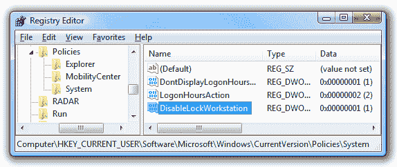

# 如何使用注册表防止系统锁定工作站

> 原文：<https://dev.to/skptricks/how-to-prevent-system-from-locking-of-the-workstation-using-registry-314l>

来源:[如何使用注册表](https://www.skptricks.com/2019/07/how-to-prevent-system-from-locking-of-the-workstation-using-registry.html)防止系统锁定工作站

本教程解释了如何使用注册表来防止系统锁定工作站。此示例为您提供了一种非常有效的禁用工作站锁定的方法，让我们看看以下步骤:

通过“开始”菜单搜索框打开 regedit.exe，然后向下浏览到以下注册表项，如果它不存在，则创建它:

 
[点击此处阅读更多...](https://www.skptricks.com/2019/07/how-to-prevent-system-from-locking-of-the-workstation-using-registry.html)