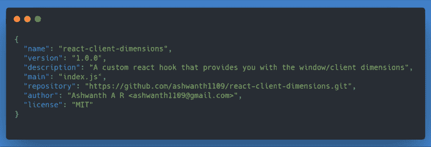
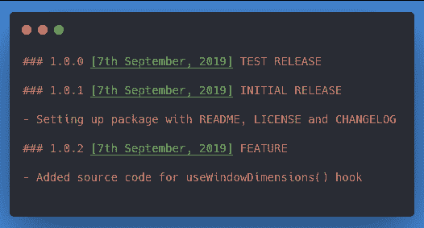
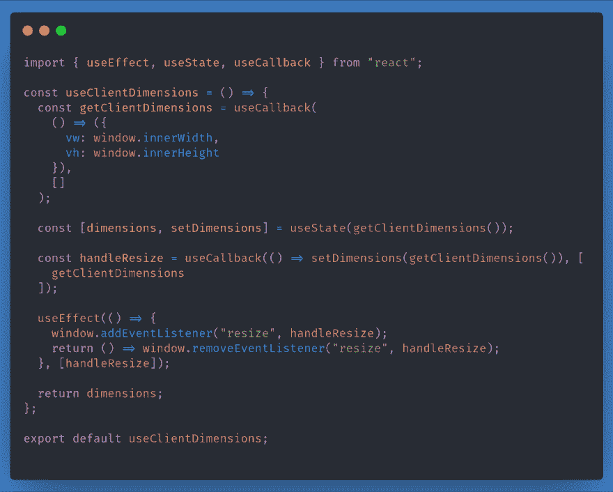
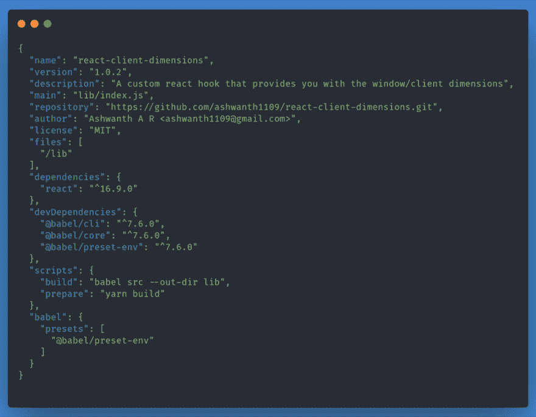

# 如何发布 npm 包？

> 原文：<https://dev.to/ashwanth1109/how-to-publish-npm-packages-2pge>

事实证明，发布一个 npm 包并不像人们想象的那么困难。本文将带您浏览我最近发布一个名为`react-client-dimensions`的包时遵循的过程。我选择用一个非常具体的例子而不是一般的模拟例子来写这篇文章，因为我发现这样的文章更有价值，尽管它涵盖的范围有限。

# 什么是套餐？

在我介绍发布 npm 包的步骤之前，让我先告诉你这个包。在我的几个业余爱好项目(主要是 react)中，我需要根据窗口(或客户端或视口，无论你怎么称呼它)的大小来渲染不同的组件。这使得在媒体查询不那么直接的情况下，更容易处理响应性布局的特定需求。所以我写了一个自定义钩子来告诉我客户端的尺寸是多少，比如宽度和高度。我在几个项目中使用这个钩子，所以我决定把它作为 npm 包发布。现在我可以通过安装一个依赖项来使用它，而不是每次都复制粘贴我的代码。

# 初始设置:得到节点？好，创建目录。

确保您计算机上安装了节点。一个节点安装也将为您提供现成的 npm，这已经足够了，但是我更喜欢使用 yarn(这也是本文将要使用的)。随便挑吧，它们是可以互相替代的。你可以从[这里](https://nodejs.org/en/download/)安装节点，从[这里](https://yarnpkg.com/en/docs/install)安装纱线。

第一步是创建您想要发布的项目目录。在我的例子中，我创建了一个名为“反应-客户-尺寸”的文件夹。

```
mkdir react-client-dimensions
cd react-client-dimensions 
```

# 至关重要的包. json

要生成 package.json 文件，请在项目目录中运行 yarn init 命令。CLI 向导将引导您完成一系列步骤来生成 package.json 配置。或者，您可以使用 yarn init -y，它有一个标志来快速设置您的默认配置。

[](https://res.cloudinary.com/practicaldev/image/fetch/s--je_BuuKa--/c_limit%2Cf_auto%2Cfl_progressive%2Cq_auto%2Cw_880/https://cdn-images-1.medium.com/max/1000/1%2APwMz50068y-1iSigFLv7-g.png)

这就是我们发布软件包所需的全部内容。我更喜欢在此时发布这个包，这样如果它不可用，我就可以更改它的名称。我最初尝试过 react-window-size 这个名字，但它已经被占用了，所以我就选择了`react-client-dimensions`。若要发布，您需要一个 npm 帐户。在命令行中，使用命令
授权您的登录凭证

```
npm login 
```

在发布之前，最好添加许可证、变更日志和自述文件。无论如何，NPM 都会自动包含您的`package.json`、自述文件、变更日志和许可证。

```
touch README.md CHANGELOG.md LICENSE 
```

我通常使用麻省理工学院的许可证，可以在这里找到。我的 changelog 文件通常采用以下模式。

[](https://res.cloudinary.com/practicaldev/image/fetch/s--7DLTcp4x--/c_limit%2Cf_auto%2Cfl_progressive%2Cq_auto%2Cw_880/https://cdn-images-1.medium.com/max/1000/1%2AL4AYZn2Z8ytLGJHu9rdSCQ.png)

要将我们的包发布到注册表运行，

```
npm publish 
```

# 编写源代码

现在我们编写实际的包。我们想通过这个方案实现的目标。通常，源代码被写在一个名为`src`的目录中，这个目录将它与我们代码库的其余部分分开。这也使得在使用 Babel 或 Webpack 等工具对生产使用的代码进行预处理后，将所有代码捆绑到 lib 或 dist 文件夹中变得更加容易。

[](https://res.cloudinary.com/practicaldev/image/fetch/s--SXLPtdgj--/c_limit%2Cf_auto%2Cfl_progressive%2Cq_auto%2Cw_880/https://cdn-images-1.medium.com/max/1000/1%2AlN32-bVpRv9ofKN0sGHnlA.png)

我们找到了。我们的包的源代码。我们几乎准备好出版它了，但还不是时候。

# 用巴别塔传送我们的代码

我们编写的代码使用了旧版浏览器不支持的 ES6+语法。例如，arrow functions 是 ES6 的一项功能，您可以在这里看到支持状态。为了让我们的代码在所有环境下都能工作，我们使用一个编译器(称为 Babel)来编译我们的代码并打包。

我们使用下面的命令安装 Babel 的依赖项(作为开发依赖项)。这些是开发依赖，因为我们的打包代码不依赖于。

```
yarn add -D @babel/cli @babel/core @babel/preset-env 
```

Babel 是一个 JavaScript 编译器，它将 ES6+代码转换成旧浏览器或环境中的 JavaScript 向后兼容版本。Babel CLI (@babel/cli)是一个命令行工具，它为您的命令行提供了在源代码上运行 babel-core API (@babel/core)的能力。

有了这些工具，您会发现为了对目标环境所需的语法转换进行微观管理，您还需要做更多的工作。为了简化这一点，我们添加了一个预置(@babel/preset-env)，它以简洁的方式为您完成这项工作。

现在我们需要告诉我们的 babel 配置使用我们安装的 preset-env。我们可以通过将 babel 配置添加到 package.json 文件中来实现这一点。我们编辑我们的`package.json`文件，如下所示。

[](https://res.cloudinary.com/practicaldev/image/fetch/s--U8u9QMrC--/c_limit%2Cf_auto%2Cfl_progressive%2Cq_auto%2Cw_880/https://cdn-images-1.medium.com/max/1000/1%2AQFT4c4lWubFi83yeldJObw.png)

这里需要注意的重要变化是:

1.  将主入口点更新为“lib/index.js ”,因为我们要求 babel 在那里存储我们的生产就绪源代码。

2.  我们将@babel/preset-env 预置添加到我们的 babel 配置中。

3.  我们添加了一个“构建”脚本，它使用 Babel CLI 来传输我们的代码，并将其放入 lib 文件夹中。您可以使用命令运行它:yarn build。

4.  每次发布时，我们都需要先运行 build 命令。我们可以通过添加一个“准备”脚本来自动化这个步骤，当您运行:`npm publish`时，npm 会自动运行这个脚本

5.  我们希望 npm 只发布我们的 lib 文件夹。所以我们将它包含在 files 属性中。

在这种情况下，我们告诉 npm 只发布包含特定文件和文件夹(白名单)的包。或者，您可以选择使用`.npmignore file`告诉 npm 避开某些文件和文件夹(黑名单)。然而，我发现黑名单比白名单更麻烦。你可以在这里和这里阅读更多关于这些选项的信息。

# 语义版本化

我们添加的源代码是我们包的新版本。如果不更新 1package.json `文件的版本属性，NPM 不会允许您发布此版本。为此，我们遵循一个称为语义版本化的版本化系统。你可以在这里阅读更多关于这个[的内容。](https://medium.com/@jameshamann/a-brief-guide-to-semantic-versioning-c6055d87c90e)

我们想更新我们的版本。所以我们运行`npm version patch`来更新我们的版本。

 ``npm version patch -m "Added source code for useClientDimensions() hook"`` 

 ``一旦我们的版本控制完成，我们就可以发布我们的包了。只需运行`npm publish`即可完成。你的包裹现在就在外面。:)

点击这里查看我的包裹。觉得有用就告诉人家。

感谢阅读。如果您有反馈/建议，请给我留言。我非常感激。

祝你愉快。``