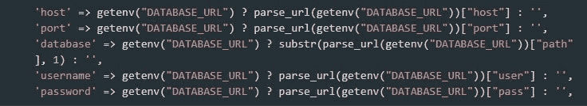

# 如何在 Heroku 上快速部署您的 Laravel 网站或应用程序

> 原文：<https://dev.to/updivision/how-to-quickly-deploy-your-laravel-website-or-app-on-heroku-3i08>

我们的开发人员经历了很多。这些是他们的故事。这是我们的高级应用程序设计师之一阿林讲的。

几周前，我不得不在 Heroku 上部署一个网站。我们在 Laravel 的开源管理面板[背包的帮助下在 Laravel 上构建了它。听起来是个简单的工作，对吧？不对。我下午 5 点开始工作，一直工作到午夜过后。当然，客户第二天早上有一个发布活动。](https://backpackforlaravel.com?ref=updivision)

因为我不想在未来的应用程序发布中重复这种可怕的经历，所以我写了这篇关于如何在 Heroku 上部署 Laravel 应用程序的实用指南。也许它还会帮你省下几个小时的挫败感。

**注意！这主要适用于 Laravel 5.4**

**还要注意！本指南假设您将使用管道进行部署，该管道自动构建并部署 repo 主分支中的每个推送。**

## 在 Heroku 上快速部署 Laravel 应用的基本步骤

1.)创建 Procfile 并将其添加到您的 repo 中。内容应该是这样的:**web:vendor/bin/heroku-PHP-Apache 2 public/**

2.)设置 ENV 变量。您可以使用 Heroku cli 并输入以下命令行来完成此操作:
**Heroku Config:add APP _ KEY = " base64:enter _ your _ KEY "-APP**
或从 Heroku 界面选择应用程序并进入设置- >配置变量- >显示。

3.)将日志设置更新为 errorlog。将此放入 app 配置文件:
**' log ' =>' error log '**
Pro 提示:在你的 app 中添加 [Papertrail 插件](https://elements.heroku.com/addons/papertrail)即可实时查看日志。

4.)信任负载平衡器。添加并配置 [fideloper/proxypackage](https://github.com/fideloper/TrustedProxy) (这是 Laravel 5.5 中内置的

关于如何在 Heroku 上开始使用 Laravel 的更多详细信息，你可以浏览这个官方指南。

## 现在，对于真正的金块，我学到了艰难的方法

1.)Heroku 数据库通常在 Postgres 中。和 MySql 有一些不同:字符域，枚举域等等。所以你最好直接在 Postgres 上建项目。

2.)Larvel 上的数据库配置文件应该如下所示:

3.)Heroku 依靠 composer.lock 构建环境，拉取所需的包。因此，如果您需要一些非内置的库或扩展(例如，用于图像的 gd 库),并且无法将它们添加到 composer.json 中，您可以手动将它们添加到 composer.lock 文件中。这里有一个[一步一步的指导](https://getcomposer.org/doc/01-basic-usage.md#platform-packages)。另外，在这里你可以找到 Heroku 可用的[扩展列表。](https://devcenter.heroku.com/articles/php-support#extensions)

4.)符号链接不起作用。所以不要用存储文件夹节省资源，最好用 CDN。

5.)你可以在 Heroku 中添加一个免费的应用程序来测试你的项目。

6.)您可以使用 iseed 包来创建种子文件，以便填充您的数据库。

7.)你可以用 [Heroku CLI](https://devcenter.heroku.com/articles/heroku-cli) 运行命令。比如 Artisan 命令可以这样调用:
**heroku 运行“PHP Artisan migrate”-app heroku-app-name**

那都是乡亲们！祝你部署顺利。

我们非常感谢反馈和任何代码贡献。如果您有任何问题，请随时联系我们。