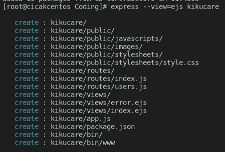
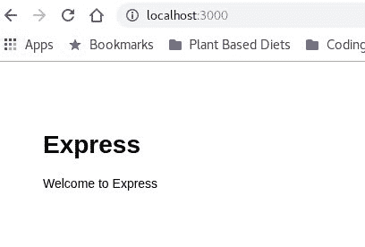
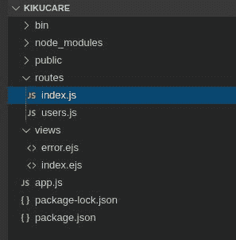
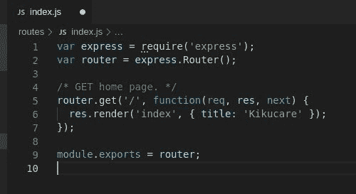
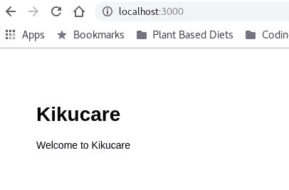

# 如何快速生成快递 App 骨架然后编辑

> 原文：<https://dev.to/yogesnsamy/how-to-quickly-generate-an-express-app-skeleton-and-then-edit-it-5b00>

*   首先，您必须安装快速生成器，键入:
    **NPM install-g express-generator**

*   接下来运行下面的命令，用 *ejs* 引擎创建一个 express 应用程序:
    **express-view = ejs kiku care**
    *kiku care*是我们正在创建的应用程序的名称。

*   进入新创建的应用文件夹，输入:
    **cd kikucare/**

*   键入以下命令安装所有依赖项:
    **npm 安装**

*   接下来通过输入命令启动应用程序:
    **DEBUG = kiku care:* NPM start**

*   你现在可以通过进入地址**[http://localhost:3000/](http://localhost:3000/)**在浏览器上查看应用。

*   你会看到如下:
    

#### 让我们对浏览器上显示的内容做一个简单的更改！

*   我们将从文件夹 **routes** 中编辑文件 **index.js** 。
    

*   修改第 6 行，将*标题*从‘Express’替换为‘kiku care’
    

*   输出:
    