# 如何使用 CSS 网格和 CSS 变量快速构建应用原型

> 原文：<https://dev.to/scrimba/how-to-quickly-prototype-apps-with-css-grid-and-css-variables-3p7e>

[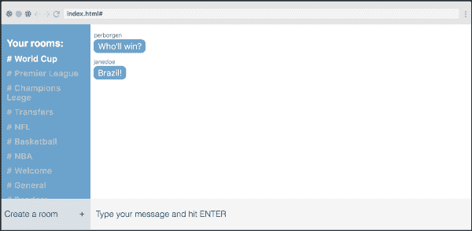](https://res.cloudinary.com/practicaldev/image/fetch/s--Lsm5eRo6--/c_limit%2Cf_auto%2Cfl_progressive%2Cq_auto%2Cw_880/https://cdn-images-1.medium.com/max/600/1%2AmrEbsfQRmq0l32skF3kPOw.png)
[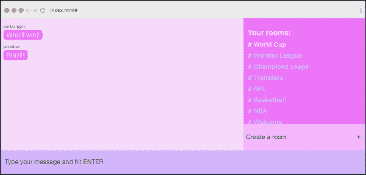T6】](https://res.cloudinary.com/practicaldev/image/fetch/s--JR63Rc3G--/c_limit%2Cf_auto%2Cfl_progressive%2Cq_auto%2Cw_880/https://cdn-images-1.medium.com/max/600/1%2Ar7YvAzkhlZ2E8Yjfdh-SBw.png)

CSS 网格和 CSS 变量都是前端开发者的巨大胜利。前者使创建网站布局变得非常简单，而后者为样式表带来了变量的力量。

在本教程中，我将向你展示如何将它们结合起来，以快速实现应用设计的原型。

我们将使用的例子直接来自我的免费课程，讲述如何使用 React.js 和 [Chatkit API](http://pusher.com/chatkit?utm_source=scrimba&utm_medium=medium&utm_campaign=css-grid-tut) 构建聊天应用:

[ ](https://scrimba.com/g/greactchatkit?utm_source=dev.to&utm_medium=referral&utm_campaign=greactchatkit_css_var_grid_prototype) *点击图片进入课程。*

所以，如果你喜欢看互动视频而不是阅读，请点击这里查看我课程的第 15 和 16 课。在这里，你还可以访问代码，这样你也可以自己进行实验。在你学习本教程的时候，你可以自由地这样做。

### 设置网格容器

我们的应用程序已经使用 CSS Grid 进行了布局，CSS Grid 是一个模块，可以轻松地构建布局并在其上随意移动。如果您正在利用`grid-template-areas`属性，这尤其有用，我将向您展示我们如何进一步使用它。

让我们先来看看我们最初的聊天应用程序是什么样子的:

[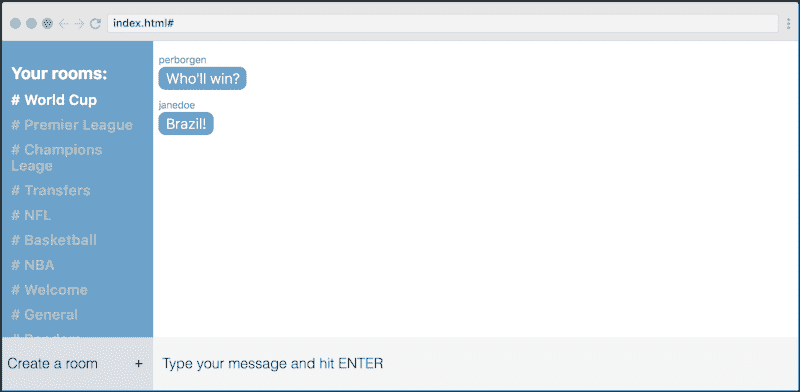](https://res.cloudinary.com/practicaldev/image/fetch/s--a5QEcixg--/c_limit%2Cf_auto%2Cfl_progressive%2Cq_auto%2Cw_880/https://cdn-images-1.medium.com/max/800/1%2AmrEbsfQRmq0l32skF3kPOw.png)

如果我们打开 Chrome 中的开发工具，我们将能够检查底层网格是如何构建的。如您所见，它有六行六列:

[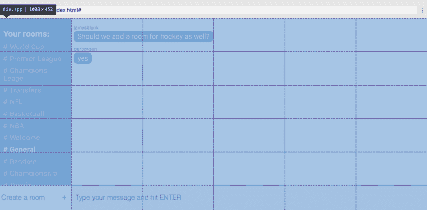](https://res.cloudinary.com/practicaldev/image/fetch/s--ZgkwxL4c--/c_limit%2Cf_auto%2Cfl_progressive%2Cq_auto%2Cw_880/https://cdn-images-1.medium.com/max/1200/1%2A_eNLVoRwxgaOftKEfv5i_w.png)

创建这样一个网格的代码如下:

```
.app {  
  display:                grid;  
  grid-template-columns:  1fr 1fr 1fr 1fr 1fr 1fr;  
  grid-template-rows:     1fr 1fr 1fr 1fr 1fr 60px;  
} 
```

首先，我们将容器设置为一个网格。然后我们说我们想要六列，每一列都应该是一个分数单位(`1fr`)宽。一个分数单位意味着*可用空间的一部分。*所以这里我们把宽度分成六个等宽的分数，给每一列一个分数。

至于各行，我们没有把它们分成相同的高度，因为最后一行没有其余的行高。我们已经明确地告诉它是`60px`高，而不是`1fr`高:

```
grid-template-rows: 1fr 1fr 1fr 1fr 1fr 60px; 
```

现在我们已经设计好了网格的结构，我们可以进入下一部分:定位。

### 定位网格项

网格*容器*的每个直接子节点是一个网格*项目*。我们有四个项目，每个项目都在下图中被框成一个矩形:

[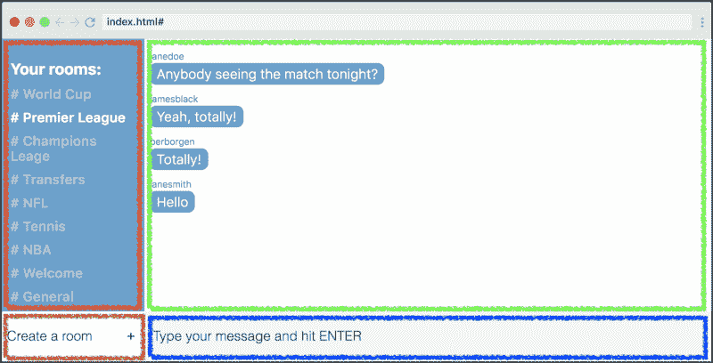](https://res.cloudinary.com/practicaldev/image/fetch/s--mdyYWbG4--/c_limit%2Cf_auto%2Cfl_progressive%2Cq_auto%2Cw_880/https://cdn-images-1.medium.com/max/800/1%2Ap_s6nyIhS8XqWoSaLEkBow.png)

为了将项目放置在它们上面的位置，我们需要使用`grid-template-areas`属性并在 style heat:
中构造网格的可视化表示

```
.app {  
  display:                grid;  
  grid-template-columns:  1fr 1fr 1fr 1fr 1fr 1fr;  
  grid-template-rows:     1fr 1fr 1fr 1fr 1fr 60px;  
  grid-template-areas:  
    "r m m m m m"  
    "r m m m m m"  
    "r m m m m m"  
    "r m m m m m"  
    "r m m m m m"  
    "n s s s s s";
} 
```

每个字符串代表一行，每个字符代表网格中的一个单元格。字符与它们所代表的网格项目有语义关系(*房间列表*、*消息列表*、*新房间表单*和*发送消息表单*)。

现在为了根据我们的`grid-template-areas`定位我们的项目，我们需要使用字符作为它们的`grid-area`值。像这样:

```
.new-room-form {  
  grid-area: n;  
}

.rooms-list {  
  grid-area: r;  
}

.message-list {  
  grid-area: m;  
}

.send-message-form {  
  grid-area: s;  
} 
```

> 这些类当然也应用到了 HTML 中的网格项目中。但是，我不会详细讨论这个问题，因为我假设您知道如何向 HTML 标签添加类。

有了这些，我们就可以开始试验布局了。通过交换`grid-template-areas`值中的几个字符，我们能够在布局上完全翻转。

[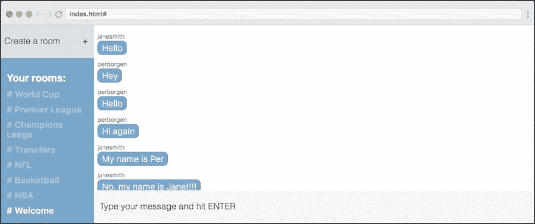](https://res.cloudinary.com/practicaldev/image/fetch/s--YBQcQrVi--/c_limit%2Cf_auto%2Cfl_progressive%2Cq_66%2Cw_880/https://cdn-images-1.medium.com/max/800/1%2AufM_xVxd2GJ79JeOGd2v1w.gif)

在上面的 gif 中，我通过改变*房间列表*项目和*新房间表单*项目的位置来尝试四种不同的布局。我唯一要改变的是`grid-template-areas`属性。

下面是四种变化。试着看看你是否能把它们映射到相应的布局:

```
grid-template-areas:  
    "n m m m m m"  
    "r m m m m m"  
    "r m m m m m"  
    "r m m m m m"  
    "r m m m m m"  
    "r s s s s s";

grid-template-areas:  
    "r m m m m m"  
    "r m m m m m"  
    "r m m m m m"  
    "r m m m m m"  
    "r m m m m m"  
    "n s s s s s";

grid-template-areas:  
    "m m m m m r"  
    "m m m m m r"  
    "m m m m m r"  
    "m m m m m r"  
    "m m m m m r"  
    "s s s s s n";

grid-template-areas:  
    "m m m m m n"  
    "m m m m m r"  
    "m m m m m r"  
    "m m m m m r"  
    "m m m m m r"  
    "s s s s s r"; 
```

如果你[参加我的 React.js 聊天应用课程](https://scrimba.com/g/greactchatkit?utm_source=dev.to&utm_medium=referral&utm_campaign=greactchatkit_css_var_grid_prototype)，你将得到你自己的代码副本，这样你就可以完全按照你喜欢的方式改变布局。

### 用 CSS 变量改变颜色

现在我们将使用 CSS 变量来改变应用程序的颜色。如果你以前没有接触过 CSS 变量，请快速浏览下面的图片，因为它们总结了它的核心:

[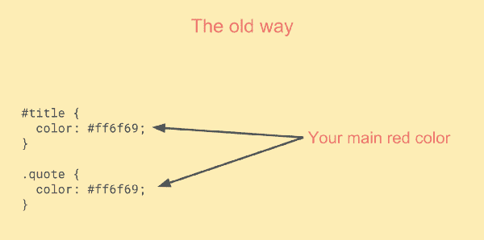](https://res.cloudinary.com/practicaldev/image/fetch/s--G2DRY0zT--/c_limit%2Cf_auto%2Cfl_progressive%2Cq_auto%2Cw_880/https://cdn-images-1.medium.com/max/600/1%2A03NPOHNBLqOn5r22HrvlyQ.png)
[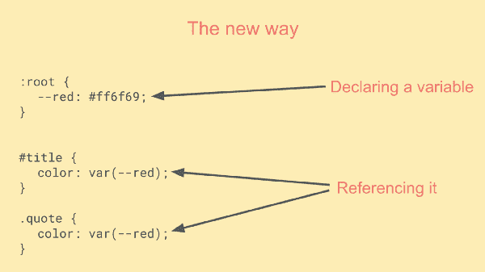T6】](https://res.cloudinary.com/practicaldev/image/fetch/s--oNPWXbfi--/c_limit%2Cf_auto%2Cfl_progressive%2Cq_auto%2Cw_880/https://cdn-images-1.medium.com/max/600/1%2Ade4-CIacmaMo9PO6PlTkyQ.png)

从上图可以看出，这使得你的代码更容易阅读，因为变量名比十六进制值更有意义。其次，如果你想改变颜色，它也给你更多的灵活性。

让我们看看如何使用 CSS 变量来设计我们的应用程序，从我们的变量声明开始:

```
:root {  
  --main-color:            #5ea3d0;  
  --secondary-color:       white;  
  --main-text-color:       #3e5869;  
  --secondary-text-color:  #b0c7d6;  
  --new-room-form:         #d9e1e8;  
  --send-message-form:     #F5F5F5;  
} 
```

这些变量在整个样式表中重复使用了 17 次。但是，我们不要浏览所有这些地方，让我们看看`--main-color`是如何在消息和左侧栏中用作背景色的。_

[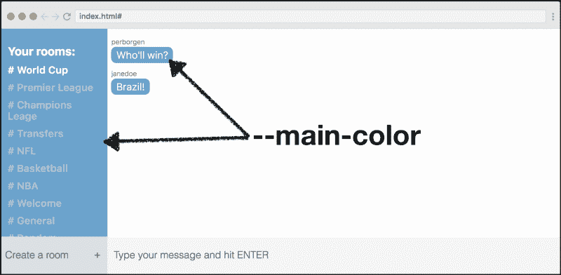](https://res.cloudinary.com/practicaldev/image/fetch/s--2CiY6a0P--/c_limit%2Cf_auto%2Cfl_progressive%2Cq_auto%2Cw_880/https://cdn-images-1.medium.com/max/800/1%2A1W0jteJO2F9bdBqw_IC1aQ.png)

这在代码中是如何实现的:

```
.rooms-list {  
  background: var(--main-color);}

.message-text {  
  background: var(--main-color);  
} 
```

变量的美妙之处在于，我们现在可以更改声明，然后这种更改将影响整个应用程序。让我们举例做:

```
:root {  
  --main-color: red;  
} 
```

…这会导致以下结果:

[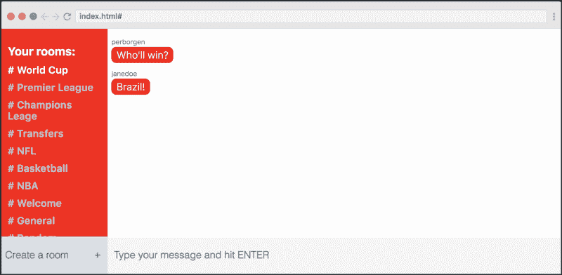](https://res.cloudinary.com/practicaldev/image/fetch/s--rw1s5fAF--/c_limit%2Cf_auto%2Cfl_progressive%2Cq_auto%2Cw_880/https://cdn-images-1.medium.com/max/800/1%2AzsR6ihPeq1AcaOWdglTL-Q.png)

我们现在能做的就是简单地改变`:root`中所有的变量声明，从而改变我们应用程序的整体外观。

例如，让我们在网上找到一个漂亮的调色板，然后在我们的应用程序中使用它:

[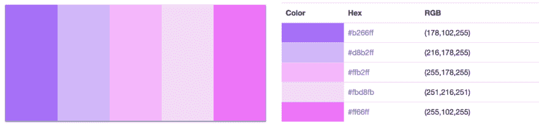](https://res.cloudinary.com/practicaldev/image/fetch/s--JavxNtRq--/c_limit%2Cf_auto%2Cfl_progressive%2Cq_auto%2Cw_880/https://cdn-images-1.medium.com/max/1200/1%2A0qHtPYV_gzrQr-5F7-lJqA.png)

我们将用上面调色板中的颜色替换`:root`中的一些颜色:

```
:root {  
  --main-color: #5ea3d0;  
  --secondary-color: white;  
  --main-text-color: #3e5869;  
  --secondary-text-color: #b0c7d6;  
  --new-room-form: #d9e1e8;  
  --send-message-form: #F5F5F5;  
} 
```

这导致了完全不同类型的聊天:

[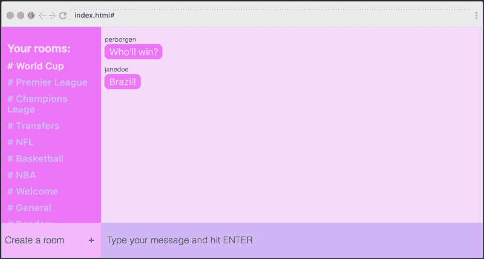](https://res.cloudinary.com/practicaldev/image/fetch/s--CdV-mys6--/c_limit%2Cf_auto%2Cfl_progressive%2Cq_auto%2Cw_880/https://cdn-images-1.medium.com/max/800/1%2ANB4_DfXxI_ZnqDSPI4QEiA.png)

### 结合网格和变量

如果我们将这与使用 CSS Grid 改变布局结合起来，我们会得到两个独特的聊天应用程序，它们彼此几乎不相似。让我们这样做:

[](https://res.cloudinary.com/practicaldev/image/fetch/s--SLHN9LIp--/c_limit%2Cf_auto%2Cfl_progressive%2Cq_auto%2Cw_880/https://cdn-images-1.medium.com/max/600/1%2APrcUX5S8Eip5NmZ72L62eQ.png)
[T6】](https://res.cloudinary.com/practicaldev/image/fetch/s--JR63Rc3G--/c_limit%2Cf_auto%2Cfl_progressive%2Cq_auto%2Cw_880/https://cdn-images-1.medium.com/max/600/1%2Ar7YvAzkhlZ2E8Yjfdh-SBw.png)

这是我们的起点与最后一个例子相比的样子。

```
:root {  
  --main-color:           #ff66ff;  
  --secondary-color:      #fbd8fb; 
  --main-text-color:      #3e5869;  
  --secondary-text-color: #d8b2ff;  
  --new-room-form:        #ffb2ff;  
  --send-message-form:    #d8b2ff; 
}

.app {  
  display: grid;  
  grid-template-columns: repeat(6, 1fr);  
  grid-template-rows: 1fr 1fr 1fr 1fr 1fr 60px;  
  grid-template-areas:  
    "m m m m r r"  
    "m m m m r r"  
    "m m m m r r"  
    "m m m m r r"  
    "m m m m n n"  
    "f f f f f f"; 
} 
```

很酷吧。

现在我建议你选修我的全部课程。在这里，我将指导你使用 React.js 和[聊天工具 API](http://pusher.com/chatkit?utm_source=scrimba&utm_medium=medium&utm_campaign=css-grid-tut) 创建这个应用程序。当然，我会与您共享完整的代码，这样您就可以自己尝试这种设计。

[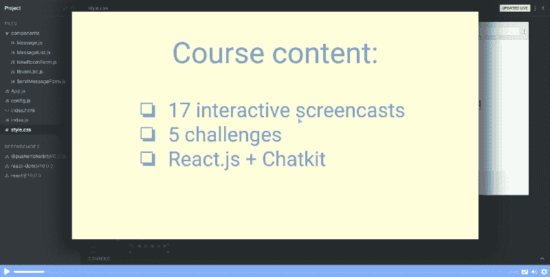](https://scrimba.com/g/greactchatkit?utm_source=dev.to&utm_medium=referral&utm_campaign=greactchatkit_css_var_grid_prototype)

感谢阅读！我叫 Per，我是 Scrimba 的联合创始人，我喜欢帮助人们学习新技能。如果你想获得关于新文章和资源的通知，请在 [Twitter](https://twitter.com/perborgen) 上关注我。