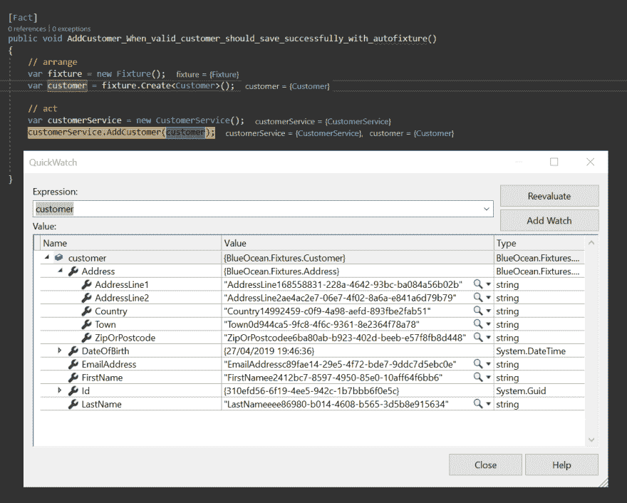

# 如何用 AutoFixture 节省编写单元和集成测试的时间

> 原文：<https://dev.to/ch_lee/how-to-save-time-writing-unit-and-integration-tests-with-autofixture-ih1>

编写单元和集成测试一般由设置相关的测试数据、执行测试的实际执行以及最后做出断言组成。所有这些都可以概括为 AAA 语法。也就是安排、行动、断言。

有了 [AutoFixture](https://github.com/AutoFixture/AutoFixture) ，它可以去掉存根和整理测试数据的繁琐部分，大大节省您的时间。

描述这一点的最佳方式是展示一个传统的测试示例，然后展示如何用 AutoFixture 替换它。

## 定期测试

让我们从一个传统的测试开始。在下面的例子中，它演示了如何设置一个带有虚假数据的客户。然后使用`CustomerService`将该客户保存到某个数据存储中。这可能是一个人为的例子，但是它演示了要清除这样的虚假数据需要多少时间。

还要注意，本例中的`Customer`有一个`Address`，这是另一个需要被存根化的实体。

库的存在确实有助于生成假数据，如[假](https://github.com/bchavez/Bogus)。但是仍然需要写几行代码。

```
public class CustomerTests
{
    [Fact]
    public void AddCustomer_When_valid_customer_should_save_successfully()
    {
        // arrange
        var customer = new Customer
        {
            FirstName = "Paula",
            LastName = "McKinney",
            EmailAddress = "paula_mckinney@fakeemail.org",
            DateOfBirth = DateTime.UtcNow.AddYears(-30),
            Address =
                new Address {
                    AddressLine1 = "4989 Wayside Lane",
                    AddressLine2 = "Hayward",
                    ZipOrPostcode = "94541",
                    Country = "United States"
                }
        };

        // act
        var customerService = new CustomerService();
        customerService.AddCustomer(customer);

        // assert
        // make assertions here.

    }
} 
```

Enter fullscreen mode Exit fullscreen mode

### 使用自动固定

让我们以上面的例子为例，用 AutoFixture 代替它。要开始使用 AutoFixture，只需添加 nuget 包

通过 Visual Studio 中的包管理器

```
Install-Package AutoFixture 
```

Enter fullscreen mode Exit fullscreen mode

通过点网命令行界面

```
dotnet add package AutoFixture 
```

Enter fullscreen mode Exit fullscreen mode

```
 [Fact]
public void AddCustomer_When_valid_customer_should_save_successfully_with_autofixture()
{
    // arrange
    var fixture = new Fixture();
    var customer = fixture.Create<Customer>();

    // act
    var customerService = new CustomerService();
    customerService.AddCustomer(customer);

    // assert
    // make assertions here.
} 
```

Enter fullscreen mode Exit fullscreen mode

希望你能看到它只需要 AutoFixture 的两行代码。等等。什么！？真的吗？是的，真的。只有两行代码。这里又是两行:

```
var fixture = new Fixture();
var customer = fixture.Create<Customer>(); 
```

Enter fullscreen mode Exit fullscreen mode

AutoFixture 完成了所有的工作，为了证明这一点，这里有一个调试测试和检查`customer`对象的截图。

[](https://res.cloudinary.com/practicaldev/image/fetch/s--ozWzqtw8--/c_limit%2Cf_auto%2Cfl_progressive%2Cq_auto%2Cw_880/https://thepracticaldev.s3.amazonaws.com/i/e1wshcapstva2um4fx70.png)

您将看到 AutoFixture 已经用虚拟数据预填充了所有字段。它还主动铲除了`Address`实体。

### 自动修复定制

如果我们想控制一些自动修复的行为呢？以客户的出生日期为例。如果我们想为客户设置一个具体的出生日期，我可能想围绕出生日期测试一些业务逻辑，那该怎么办？

为了实现这一点，您可以使用`With`方法来覆盖一个特定的属性。

```
var fixture = new Fixture();
var customer = fixture.Build<Customer>()
    .With(c => c.DateOfBirth, DateTime.UtcNow.AddYears(-30))
    .Create(); 
```

Enter fullscreen mode Exit fullscreen mode

这将把`DateOfBirth`设定为过去 10 年。

您也可以忽略或禁用一些不希望 AutoFixture 填充的属性。例如，下面的例子将忽略`Address`属性。

```
var customer = fixture.Build<Customer>()
                .Without(c => c.Address)
                .Create(); 
```

Enter fullscreen mode Exit fullscreen mode

### 使用 AutoData

您可以更进一步，使用`AutoData`属性。

一定要添加 nuget 包。

通过 Visual Studio 中的包管理器

```
Install-Package AutoFixture.Xunit2 
```

Enter fullscreen mode Exit fullscreen mode

通过点网命令行界面

```
dotnet add package AutoFixture.Xunit2 
```

Enter fullscreen mode Exit fullscreen mode

**XUnit 举例**

```
 [Theory, AutoData]
public void AddCustomer_When_valid_customer_should_save_successfully_with_autofixture(Customer customer)
{
    // act
    var customerService = new CustomerService();
    customerService.AddCustomer(customer);

    // assert
    // make assertions here.
} 
```

Enter fullscreen mode Exit fullscreen mode

**努尼特举例**T2】

```
 [Test, AutoData]
public void AddCustomer_When_valid_customer_should_save_successfully_with_autofixture(Customer customer)
{
    // act
    var customerService = new CustomerService();
    customerService.AddCustomer(customer);

    // assert
    // make assertions here.

} 
```

Enter fullscreen mode Exit fullscreen mode

从上面的 XUnit 和 NUnit 示例中可以看出，`Customer`是作为方法中的参数传递的。正如您在前面的例子中看到的，没有必要使用`var fixture = new Fixture();`。

这种测试方式非常有用，可以节省大量编写存根和伪造数据的时间。

## 总结

正如您所看到的，随着 AutoFixture 的引入，它可以显著地减少为测试的安排部分编写测试数据，同时也减少了代码量。代码更少，维护更少。

更多的例子，请查看 [AutoFixture 的备忘单](https://github.com/AutoFixture/AutoFixture/wiki/Cheat-Sheet)和 [AutoFixture](https://github.com/AutoFixture/AutoFixture) GitHub 页面。