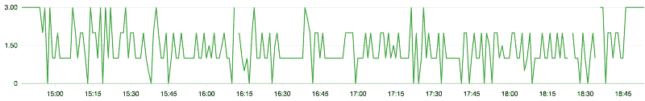

# 如何扩展 ECS 主机

> 原文：<https://dev.to/omerxx/how-to-scale-in-ecs-hosts-3gpf>

DIY 或者通读；AWS 到目前为止还没有解决这个问题，当客户询问时，实际上是参考下面分享的代码。

ECS 提供了通过添加“任务”来扩展不同服务的自由。它们独立运行和通信，并被托管在一系列 EC2 实例上。在 CloudWatch 指标和警报的帮助下，扩展系统服务和扩展 EC2 主机是一项方便的任务。然而，扩展 EC2 主机需要一定的决策复杂性。

### ECS 是三层架构:

集群:在一组共享的资源上运行的一组应用
服务:逻辑实例(例如“应用”)
任务:服务的物理实例
伸缩任务相对简单；基于几个度量阈值，如 cpu 负载百分比，它决定是否应该加载新任务或删除当前任务。
扩展 ECS 主机出来，就差不多了；例如，当超过某个级别的 CPU 时，或者当物理集群没有容纳当前负载所需的内存量时，就会触发新的 EC2 实例。

移除资源是为了降低成本；这些是需要付费的资源，当不再需要它们时删除它们是关于转换成成本的利用率。
然而，扩展任务有些具有挑战性:应用跨越指标阈值的一般方法可能会导致削减其他参数中所需的资源，例如:由于 CPU 级别较低而删除资源，而内存预留级别无法“承受”失去主机。
由于 AWS 不提供多度量尺度的功能，并且由于这种尺度需要更多的计算来做出资源移除的决定，因此需要外部工具来完成该任务。

### 问题

如上所述，扩展并不是一项简单的任务:假设一个主机集群在可用内存不足的情况下进行了扩展，然后缩减到较低的 CPU 级别，删除实例可能会再次导致可用内存不足，从而再次触发新的主机。这可能是一个永无止境的缩放循环。

> 永无止境的循环——容器实例的数量会随着每次缩放触发相反的动作而反复放大和缩小

需要多公制刻度触发器。
暂且忽略 AWS 不提供此类功能的事实，如果使用了多指标触发器，但未来指标级别的触发器再次扩大，这又是一个循环。因此，还需要预测指标计算。还需要确定哪个实例的利用率最低，然后在终止之前优雅地删除耗尽的客户端连接，并清理利用率为 0%的资源。

[e scale](https://github.com/omerxx/ecscale)回答以上所有问题。它可以在 AWS Lambda 上运行，这通常意味着这是一个完全免费的资源，提供了一个虚拟管家来清理未使用实例的混乱。

该工具可以作为运行在 AWS Lambda 上的无服务器功能进行部署。因此，它每个月只需要大约 3000λ秒。由于每个 AWS 帐户每月都有资格获得 100 万秒的免费时间，除非你在 Lambda 上运行其他无服务器应用程序，否则该资源实际上是完全免费的。缩放过程每 60 分钟运行一次(可配置，默认为一个小时，因为 EC2 实例已经支付了整整一个小时的费用，即使之前已终止)，遍历一个帐户的 ECS 资源并清理它们。

编辑:AWS 最近宣布了一个新的 EC2 计费模型，按秒计费。这意味着当一个实例被终止时，它将按运行的那部分时间计费，而不是整个小时。因此，建议更频繁地运行缩放工具；由于进行了 API 调用，并且应该给系统时间来进行不相关的更改，如部署、扩展服务和其他更改，因此 1 秒甚至 1 分钟都不理想。在进行了一些测试后，似乎最佳时机在 20 分钟触发点附近。
但是，您应该在自己的集群中测试这一点，并确保当前程序不会受到新的频繁变化的影响。
祝你好运！

### 它是如何工作的？

该服务迭代现有 ECS 群集
根据预测的内存预留容量检查群集的扩展能力
查找未运行可扩展任务的空主机
查找利用率最低的扩展候选对象
将候选对象移至耗尽状态；优雅地排出服务连接
终止没有运行任务的排出主机，并减少启动它所需的实例数量

使用提供的角色策略创建一个运行时间最长为 5 秒的 Lambda 函数
将 ecscale.py 代码复制到 Lambda 中
创建一个每小时运行一次的触发器
所有设置完成后，您的资源将被自动管理。
投稿、问题、建议:

github.com/omerxx
[omer @ prodops . io](mailto:omer@prodops.io)