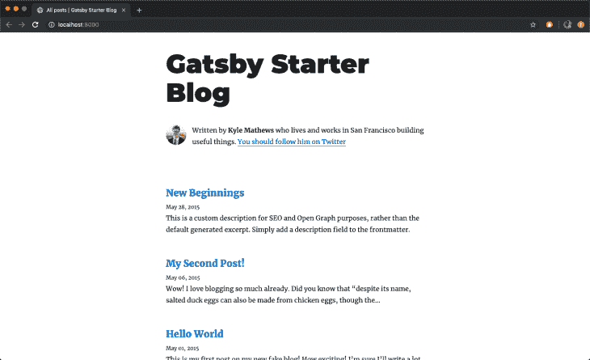

# 如何设置一个 TypeScript + Gatsby 应用程序

> 原文：<https://dev.to/bnevilleoneill/how-to-set-up-a-typescript-gatsby-app-2pf8>

**作者:[yomi elu wande](https://blog.logrocket.com/author/yeluwande/)T3】✏️**

Gatsby 是一个基于 React 的免费开源框架，可以帮助开发者构建高速网站和应用。它允许你使用现代网络技术毫无困难地构建应用程序。

Gatsby 还附带了诸如服务器端渲染和生成静态渐进式 web 应用程序(pwa)的功能。您可以获得开箱即用的代码和数据分割。Gatsby 只加载关键的 HTML、CSS、数据和 JavaScript，所以你的站点加载得越快越好。

TypeScript 是 JavaScript 的超集，主要提供可选的静态类型、类和接口。TypeScript 可以让您及早发现错误，从而使您成为更高效的开发人员，同时利用现有的 JavaScript 社区。

在本文中，我们将从一个 Gatsby 项目开始，把它变成一个 TypeScript 应用程序。

## 如何设置盖茨比 app

要设置 Gatsby 应用程序，您首先需要安装 Gatsby CLI。

Gatsby CLI 工具允许您快速创建新的 Gatsby 支持的站点，并运行命令来开发 Gatsby 站点。可以通过运行下面的命令进行全局安装。

```
yarn global add gatsby-cli 
```

一旦完成，下一步就是创建一个 Gatsby 网站。如上所述，我们将使用 Gatsby CLI 工具来创建您的第一个 Gatsby 站点，并且我们将从一个启动项目开始 Gatsby blog starter。

starter 附带了您可能需要启动和运行的主要 Gatsby 配置文件，并使用 GraphQL 来获取博客数据。

```
gatsby new my-blog-starter https://github.com/gatsbyjs/gatsby-starter-blog 
```

上面的命令将博客所需的所有文件放入一个文件夹，然后安装应用程序运行所需的所有依赖项。您可以导航到新站点的目录并启动它，看看是否一切都如预期的那样工作。在您的终端中运行以下命令。

```
cd my-blog-starter
yarn develop 
```

一旦完成了`yarn develop`命令，你就可以在浏览器中打开一个新标签，并导航到 [http://localhost:8000](http://localhost:8000/) 来查看 Gatsby 应用程序的运行情况。

[](https://res.cloudinary.com/practicaldev/image/fetch/s--7YY_YIDr--/c_limit%2Cf_auto%2Cfl_progressive%2Cq_auto%2Cw_880/https://i1.wp.com/blog.logrocket.com/wp-content/uploads/2019/08/gatsbystarterblog.png%3Fresize%3D730%252C445%26ssl%3D1)

## 盖茨比和 GraphQL

如果你不知道 GraphQL 是什么，GraphQL 是一种*查询语言*，它允许你将数据拉进你的网站。这是 Gatsby 用来管理站点数据的接口。

你可以在这里找到更多关于 GraphQL [的信息。](https://www.howtographql.com/)

在我们看到 Gatsby 如何轻松地合并 GraphQL 之前，让我们先看看 Gatsby 附带的一些文件和文件夹以及它们的作用。

*   这个目录将包含所有与你在网站前端看到的内容(你在浏览器中看到的内容)相关的代码，比如你的网站标题或页面模板。
*   `.prettierrc`:这是[更漂亮的](https://prettier.io/)的配置文件。漂亮是一个工具，有助于保持你的代码格式一致。
*   `gatsby-browser.js`:这个文件是 Gatsby 期望找到 [Gatsby 浏览器 API](https://www.gatsbyjs.org/docs/browser-apis/)的任何用法的地方(如果有的话)。这些允许自定义/扩展影响浏览器的默认 Gatsby 设置。
*   这是一个 Gatsby 站点的主要配置文件。在这里你可以指定关于你的站点的信息(元数据),比如站点标题和描述，你想要包含哪些 Gatsby 插件等等。
*   `gatsby-node.js`:Gatsby 期望在这个文件中找到 [Gatsby 节点 API](https://www.gatsbyjs.org/docs/node-apis/)的任何用法(如果有的话)。这些允许定制/扩展影响站点构建过程的默认 Gatsby 设置。
*   `gatsby-ssr.js`:Gatsby 希望在这个文件中找到 [Gatsby 服务器端渲染 API](https://www.gatsbyjs.org/docs/ssr-apis/)的任何用法(如果有的话)。这些允许影响服务器端呈现的缺省 Gatsby 设置的定制。

尽管我应该提到 Gatsby 也支持其他获取数据的方法，也就是说你不必使用 GraphQL。您可以使用`createPages` API 将非结构化数据直接拉入 Gatsby 页面，而不是通过 GraphQL 数据层。

那么 Gatsby 是如何从 GraphQL 获取数据的呢？我们可以通过两种方法来实现:页面查询和静态查询。

### 页面查询

[使用 GraphQL 查询页面中的数据](https://www.gatsbyjs.org/docs/page-query/)可以通过使用 Gatsby 的`graphql`标签来完成。

在`gatsby-config`文件中，在文件的顶部(第 2-10 行)，有一个地方声明了关于站点的信息，特别是`siteMetadata`对象。

```
siteMetadata: {
  title: `Gatsby Starter Blog`,
  author: `Kyle Mathews`,
  description: `A starter blog demonstrating what Gatsby can do.`,
  siteUrl: `https://gatsby-starter-blog-demo.netlify.com/`,
  social: {
    twitter: `kylemathews`,
  },
}, 
```

我们将看到如何使用 GraphQL 在组件中获取上述数据。

`src/pages`文件夹中的`404.js`文件是一个使用 GraphQL 通过页面查询获取数据的例子。如果您向下滚动到文件的底部(第 24-32 行)，您应该会看到类似下面的代码片段。

```
export const pageQuery = graphql`
  query {
    site {
      siteMetadata {
        title
      }
    }
  }
` 
```

上面的代码片段是一个 GraphQL 查询，我们获取站点的`siteMetadata`信息，特别是文件的标题。

从上面的查询中检索到的数据可以在组件的呈现函数中使用，如下面同一个文件中所示。

```
const { data } = this.props
const siteTitle = data.site.siteMetadata.title 
```

### 静态查询

使用 StaticQuery 在 Gatsby 中查询数据可以通过使用 [StaticQuery](https://www.gatsbyjs.org/docs/static-query/) 来完成，这是一个新的 API，允许组件通过 GraphQL 查询来检索数据。除了使用`StaticQuery`，我们还将使用名为 [`useStaticQuery`](https://www.gatsbyjs.org/docs/use-static-query/) 的静态查询的钩子版本。

使用 StaticQuery 的组件的一个例子是位于`src/components`文件夹中的`seo.js`文件。

```
import { useStaticQuery, graphql } from "gatsby"

// ...

function SEO({ description, lang, meta, title }) {
  const { site } = useStaticQuery(
    graphql`
      query {
        site {
          siteMetadata {
            title
            description
            author
          }
        }
      }
    `
  )

  // ...
} 
```

正如你在上面的代码块中看到的，我们首先从`gatsby`导入`useStaticQuery`方法。`useStaticQuery`方法允许 React 组件通过 GraphQL 查询检索数据，该查询将被解析、评估并注入到组件中。

上面的 GraphQL 查询从`gatsby-config.js`文件中查询站点标题、描述和作者。

## 如何将 TypeScript 集成到一个 Gatsby app 中

为了将 TypeScript 集成到 Gatsby 应用程序中，我们需要安装一些依赖项。

```
yarn add gatsby-plugin-typescript
yarn add typescript --dev 
```

[`gatsby-plugin-typescript`](https://www.gatsbyjs.org/packages/gatsby-plugin-typescript/) 是要求能够将所有`.js`文件更改为`.tsx`文件的盖茨比插件。它负责类型检查和传输类型脚本代码。

一旦安装了依赖项，我们可以将`gatsby-plugin-typescript`添加到`gatsby-config.js`文件中(第 69–71 行)。

```
gatsby-plugin-offline,
gatsby-plugin-react-helmet,
gatsby-plugin-typescript, 
```

接下来，将`tslint.json`和`tsconfig.json`添加到代码库的根目录中。`tslint.json`包含有助于林挺打字稿文件的规则集，而`tsconfig.json`包含有助于确定项目中打字稿行为的规则集。

```
// tslint.json
{
  "extends": ["tslint-react"],
  "rules": {
    "prettier": true,
    "jsx-no-multiline-js": false,
    "jsx-no-lambda": false,
    "import-name": false,
    "no-boolean-literal-compare": false
  }
} 
```

```
// tsconfig.json
{
  "compilerOptions": {
    "module": "commonjs",
    "target": "esnext",
    "jsx": "preserve",
    "lib": ["dom", "esnext"],
    "strict": true,
    "noEmit": true,
    "isolatedModules": true,
    "esModuleInterop": true,
    "noUnusedLocals": false,
    "allowJs": true
  },
  "exclude": ["node_modules", "public", ".cache"]
} 
```

还有一件要做的事情是给`package.json`文件添加一个脚本，我们可以用它来对整个代码库进行类型检查。

```
"scripts": {
    // ...
    "type-check": "tsc --noEmit"
  } 
```

我们现在可以将必要的`.js`文件重命名为`.tsx`文件。除了重命名文件，我们还将 React 组件从类组件转换为功能组件。

### bio.js

让我们从`bio.js`文件开始。重命名该文件或简单地更改扩展名，使其现在是`src/components/bio.tsx`。

### layout.js

接下来是`layout.js`文件。将扩展名改为`.tsx`，然后打开文件，用下面的代码片段进行编辑。

```
import React from "react"
import { Link } from "gatsby"

import { rhythm, scale } from "../utils/typography"

interface Props {
  location: Location
  title: string
  children?: any
}

const Layout = ({ location, title, children }: Props) => {
  const rootPath = `${__PATH_PREFIX__}/`
  let header

  if (location.pathname === rootPath) {
    header = (
      <h1
        style={{
          ...scale(1.5),
          marginBottom: rhythm(1.5),
          marginTop: 0,
        }}
      >
        <Link
          style={{
            boxShadow: `none`,
            textDecoration: `none`,
            color: `inherit`,
          }}
          to={`/`}
        >
          {title}
        </Link>
      </h1>
    )
  } else {
    header = (
      <h3
        style={{
          fontFamily: `Montserrat, sans-serif`,
          marginTop: 0,
        }}
      >
        <Link
          style={{
            boxShadow: `none`,
            textDecoration: `none`,
            color: `inherit`,
          }}
          to={`/`}
        >
          {title}
        </Link>
      </h3>
    )
  }

  return (
    <div
      style={{
        marginLeft: `auto`,
        marginRight: `auto`,
        maxWidth: rhythm(24),
        padding: `${rhythm(1.5)} ${rhythm(3 / 4)}`,
      }}
    >
      <header>{header}</header>
      <main>{children}</main>
      <footer>
        © {new Date().getFullYear()}, Built with
        {` `}
        <a href="https://www.gatsbyjs.org">Gatsby</a>
      </footer>
    </div>
  )
}

export default Layout 
```

在上面的代码块中，类组件被转换为功能组件，并为组件的 props 创建了一个接口。

TypeScript 中的接口有助于形成实体的规范。它通常包含所有属性的名称及其类型。

### seo.js

接下来是`seo.js`文件。将扩展名改为`.tsx`，然后打开文件，用下面的代码片段进行编辑。

```
/**
 * SEO component that queries for data with
 *  Gatsby's useStaticQuery React hook
 *
 * See: https://www.gatsbyjs.org/docs/use-static-query/
 */

import React from "react"
import Helmet from "react-helmet"
import { useStaticQuery, graphql } from "gatsby"

interface Props {
  description?: string
  lang?: string
  meta?: []
  title: string
}

const SEO = ({ description, lang, meta, title }: Props) => {
  const { site } = useStaticQuery(
    graphql`
      query {
        site {
          siteMetadata {
            title
            description
            author
          }
        }
      }
    `
  )

  const metaDescription = description || site.siteMetadata.description

  return (
    <Helmet
      htmlAttributes={{
        lang,
      }}
      title={title}
      titleTemplate={`%s | ${site.siteMetadata.title}`}
      meta={[
        {
          name: `description`,
          content: metaDescription,
        },
        {
          property: `og:title`,
          content: title,
        },
        {
          property: `og:description`,
          content: metaDescription,
        },
        {
          property: `og:type`,
          content: `website`,
        },
        {
          name: `twitter:card`,
          content: `summary`,
        },
        {
          name: `twitter:creator`,
          content: site.siteMetadata.author,
        },
        {
          name: `twitter:title`,
          content: title,
        },
        {
          name: `twitter:description`,
          content: metaDescription,
        },
      ].concat(meta || [])}
    />
  )
}

export default SEO 
```

正如在`layout.tsx`文件中所做的，我们也为组件的道具定义了一个接口。

### 404.js

接下来是`404.js`文件。导航到 src/pages 文件夹，将扩展名更改为。tsx，然后打开文件，用下面的代码片段进行编辑。

```
import React from "react"
import { graphql } from "gatsby"

import Layout from "../components/layout"
import SEO from "../components/seo"

interface Props {
  data: {
    site: {
      siteMetadata: {
        title: string
      }
    }
  }
}

const NotFoundPage = ({ data }: Props) => {
  const siteTitle = data.site.siteMetadata.title

  return (
    <Layout location={window.location} title={siteTitle}>
      <SEO title="404: Not Found" />
      <h1>Not Found</h1>
      <p>You just hit a route that doesn't exist... the sadness.</p>
    </Layout>
  )
}

export default NotFoundPage

export const pageQuery = graphql`
  query {
    site {
      siteMetadata {
        title
      }
    }
  }
` 
```

在上面的代码块中，为组件的 prop 定义了一个接口，并将类组件转换为功能组件。

### index.js

接下来是`index.js`文件。将扩展名改为`.tsx`，然后打开文件，用下面的代码片段进行编辑。

```
import React from "react"
import { Link, graphql } from "gatsby"

import Bio from "../components/bio"
import Layout from "../components/layout"
import SEO from "../components/seo"
import { rhythm } from "../utils/typography"

interface Props {
  data: {
    allMarkdownRemark: any
    site: {
      siteMetadata: {
        title: string
      }
    }
  }
}

const BlogIndex = ({ data }: Props) => {
  const siteTitle = data.site.siteMetadata.title
  const posts = data.allMarkdownRemark.edges

  return (
    <Layout location={window.location} title={siteTitle}>
      <SEO title="All posts" />
      <Bio />
      {posts.map(({ node }) => {
        const title = node.frontmatter.title || node.fields.slug
        return (
          <div key={node.fields.slug}>
            <h3
              style={{
                marginBottom: rhythm(1 / 4),
              }}
            >
              <Link style={{ boxShadow: `none` }} to={node.fields.slug}>
                {title}
              </Link>
            </h3>
            <small>{node.frontmatter.date}</small>
            <p
              dangerouslySetInnerHTML={{
                __html: node.frontmatter.description || node.excerpt,
              }}
            />
          </div>
        )
      })}
    </Layout>
  )
}

export default BlogIndex

export const pageQuery = graphql`
  query {
    site {
      siteMetadata {
        title
      }
    }
    allMarkdownRemark(sort: { fields: [frontmatter___date], order: DESC }) {
      edges {
        node {
          excerpt
          fields {
            slug
          }
          frontmatter {
            date(formatString: "MMMM DD, YYYY")
            title
            description
          }
        }
      }
    }
  }
` 
```

如前面的代码块所示，为组件的属性定义了一个接口，现在类组件是一个功能组件。

### blog-post.js

对于`src/components`中的`blog-post.js`文件，我们必须转换成一个功能组件，并为道具定义一个接口。

将扩展名改为`.tsx`，然后打开文件，用下面的代码片段进行编辑。

```
import React from 'react'
import { Link, graphql } from 'gatsby'

import Bio from '../components/bio'
import Layout from '../components/layout'
import SEO from '../components/seo'
import { rhythm, scale } from '../utils/typography'

interface Props {
  data: {
    markdownRemark: any
    site: {
      siteMetadata: {
        title: string
      }
    }
  }
  pageContext: any
}

const BlogPostTemplate = ({ data, pageContext }: Props) => {
  const post = data.markdownRemark
  const siteTitle = data.site.siteMetadata.title
  const { previous, next } = pageContext

  return (
    <Layout location={window.location} title={siteTitle}>
      <SEO
        title={post.frontmatter.title}
        description={post.frontmatter.description || post.excerpt}
      />
      <h1
        style={{
          marginTop: rhythm(1),
          marginBottom: 0,
        }}
      >
        {post.frontmatter.title}
      </h1>
      <p
        style={{
          ...scale(-1 / 5),
          display: `block`,
          marginBottom: rhythm(1),
        }}
      >
        {post.frontmatter.date}
      </p>
      <div dangerouslySetInnerHTML={{ __html: post.html }} />
      <hr
        style={{
          marginBottom: rhythm(1),
        }}
      />
      <Bio />

      <ul
        style={{
          display: `flex`,
          flexWrap: `wrap`,
          justifyContent: `space-between`,
          listStyle: `none`,
          padding: 0,
        }}
      >
        <li>
          {previous && (
            <Link to={previous.fields.slug} rel="prev">
              ← {previous.frontmatter.title}
            </Link>
          )}
        </li>
        <li>
          {next && (
            <Link to={next.fields.slug} rel="next">
              {next.frontmatter.title} →
            </Link>
          )}
        </li>
      </ul>
    </Layout>
  )
}

export default BlogPostTemplate

export const pageQuery = graphql`
  query BlogPostBySlug($slug: String!) {
    site {
      siteMetadata {
        title
        author
      }
    }
    markdownRemark(fields: { slug: { eq: $slug } }) {
      id
      excerpt(pruneLength: 160)
      html
      frontmatter {
        title
        date(formatString: "MMMM DD, YYYY")
        description
      }
    }
  }
` 
```

### 印刷术. js

对于这个文件，我们将把扩展名改为`.ts`，因为我们根本不会返回任何标记。导航到`src/utils`文件夹，将扩展名改为`.ts`。

现在，如果您尝试在 localhost:8000 上运行应用程序，您应该会看到一些输入错误。这是因为我们使用的一些包可能没有类型定义。为此，我们必须在项目中自己声明这些类型。

要声明这些类型，在应用程序的根目录中创建一个`node_modules.d.ts`，然后用下面的代码片段编辑它。

```
// node_modules.d.ts

declare module "typography"
declare module "typography-theme-wordpress-2016"
declare module "react-helmet" 
```

该文件为还没有自己的类型脚本声明文件的节点模块声明类型脚本模块/类型。

再次运行应用程序之前，最后要做的一件事是编辑`gatsby-node.js`文件。该文件中声明了用于呈现博客文章页面的组件的路径。我们需要将该文件的扩展名从`.js`改为`.tsx`。

打开`gatsby-node.js`文件(第 7 行),用下面的代码编辑。

```
const blogPost = path.resolve(`./src/templates/blog-post.tsx`) 
```

如果这样做了，重启 Gatsby 应用程序并尝试查看 localhost:8000 上的博客，它现在应该工作正常了！

## 结论

在本文中，我们研究了 Gatsby 及其在 GraphQL 和 TypeScript 中的用法。

Gatsby 是一个静态站点生成器，附带了服务器端渲染等功能，能够生成静态渐进式 Web 应用程序。它允许你用 HTML，CSS 和 React 建立现代的和高性能的网站。

TypeScript 是 JavaScript 的超集，主要提供可选的静态类型、类和接口。在本文中，您看到了如何使用接口为组件构造数据(props)。

您还看到了如何使用 GraphQL 在 Gatsby 应用程序中获取数据，它可以是页面查询或 StaticQuery。

最后，在本文中，您看到了如何使用 [gatsby-typescript-plugin](https://www.gatsbyjs.org/packages/gatsby-plugin-typescript/) 将 typescript 集成到现有的代码库中。

你可以在这里找到盖茨比应用[的存储库。](https://github.com/yomete/gatsby-typescript-app)

* * *

**编者按:**看到这个帖子有问题？你可以在这里找到正确的版本。

## Plug: [LogRocket](https://logrocket.com/signup/) ，一款适用于网络应用的 DVR

[](https://res.cloudinary.com/practicaldev/image/fetch/s--6FG5kvEL--/c_limit%2Cf_auto%2Cfl_progressive%2Cq_auto%2Cw_880/https://i2.wp.com/blog.logrocket.com/wp-content/uploads/2017/03/1d0cd-1s_rmyo6nbrasp-xtvbaxfg.png%3Fresize%3D1200%252C677%26ssl%3D1)

[log rocket](https://logrocket.com/signup/)是一个前端日志工具，让你重放问题，就像它们发生在你自己的浏览器中一样。LogRocket 不需要猜测错误发生的原因，也不需要向用户询问截图和日志转储，而是让您重放会话以快速了解哪里出错了。它可以与任何应用程序完美配合，不管是什么框架，并且有插件可以记录来自 Redux、Vuex 和@ngrx/store 的额外上下文。

除了记录 Redux 动作和状态，LogRocket 还记录控制台日志、JavaScript 错误、stacktraces、带有头+体的网络请求/响应、浏览器元数据、自定义日志。它还使用 DOM 来记录页面上的 HTML 和 CSS，甚至为最复杂的单页面应用程序重新创建像素级完美视频。

[免费试用](https://logrocket.com/signup/)。

* * *

帖子[如何设置一个 TypeScript + Gatsby app](https://blog.logrocket.com/set-up-a-typescript-gatsby-app/) 最早出现在 [LogRocket 博客](https://blog.logrocket.com)上。