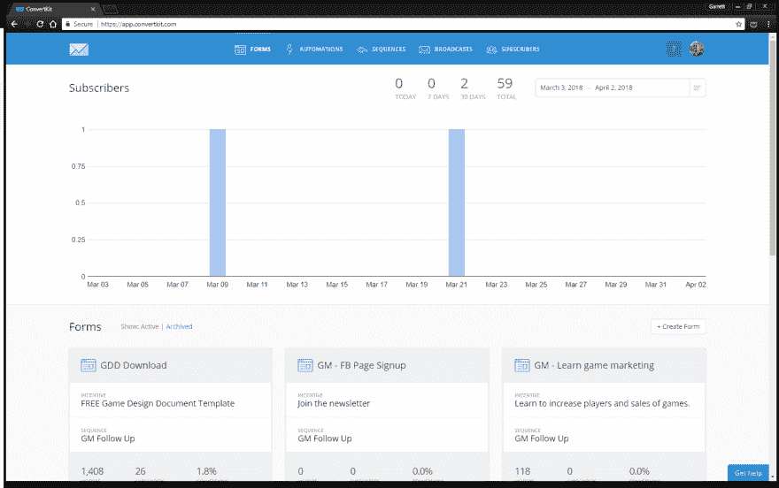
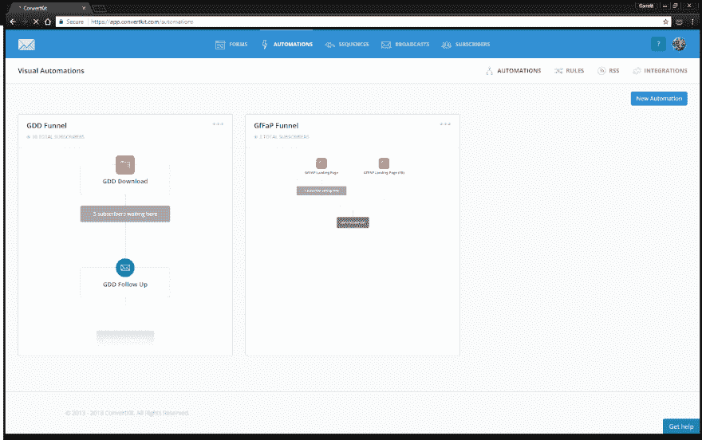
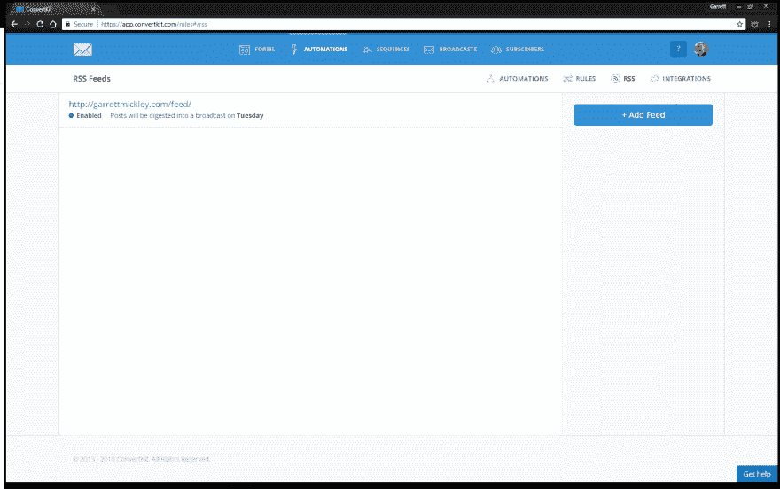
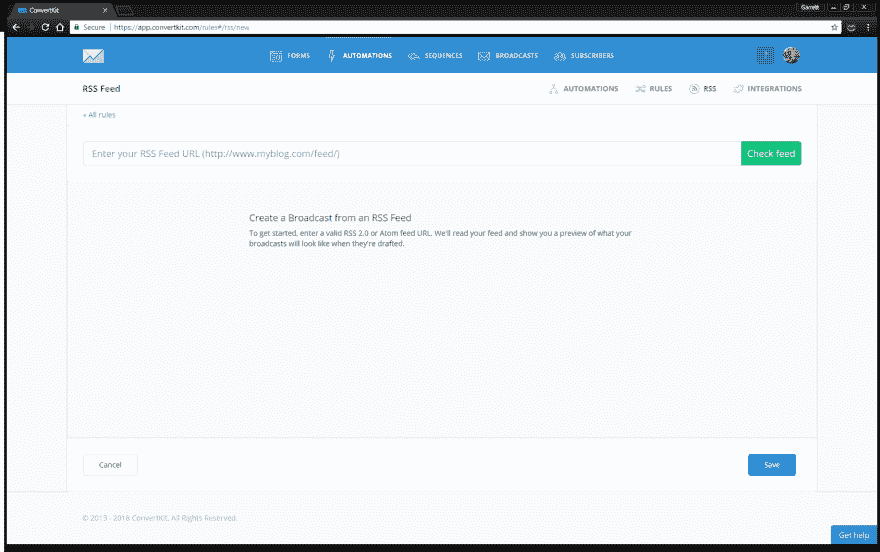
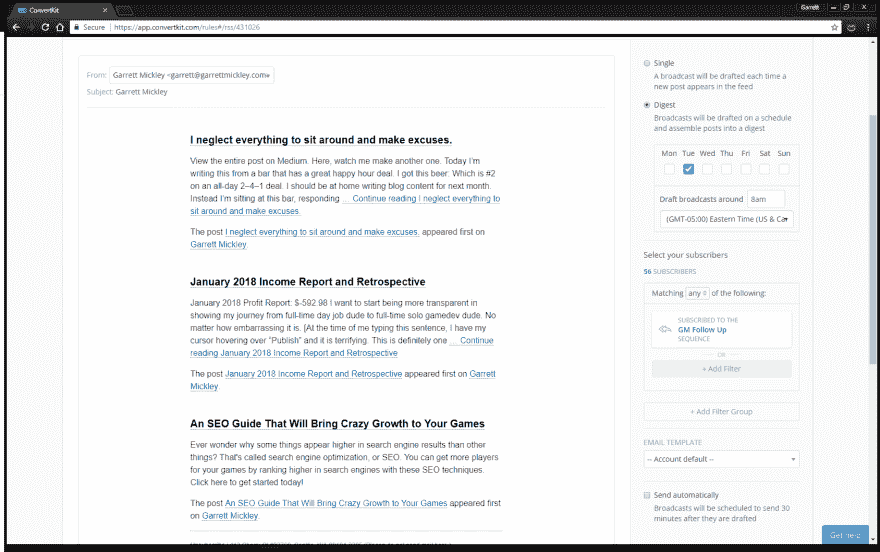

# 如何不浪费时间设置自动简讯？

> 原文：<https://dev.to/garrett/how-to-set-up-an-automatic-newsletter-without-wasting-time-4cn5>

*注:这是来自[GarrettMickley.com](https://garrettmickley.com)的旧内容。我不再追求数字营销职业，但[我不想浪费内容](https://dev.to/garrett/why-i-m-switching-careers-to-coding-19g8)，所以我把它搬到这里。希望 Dev.to 社区觉得有用。*

## 目录

0。目录
[1。登录 ConvertKit](#1-log-in-to-convertkit)
[2。在顶部导航中，点击“自动化”。](#2-in-the-top-navigation-click-on-automations)
[3。在顶部导航下方出现的新导航中，单击“RSS”。](#3-in-the-new-navigation-that-appears-below-the-top-navigation-click-on-rss)
[4。将您的 RSS 提要插入空白处，然后点击绿色的“检查提要”按钮。](#4-insert-your-rss-feed-into-the-space-and-then-click-on-the-green-check-feed-button)
[5。你会看到一个例子出现在左边，右边是你可以为你的自动简讯选择的设置。](#5-you-will-see-an-example-appear-on-the-left-and-on-the-right-will-be-settings-you-can-choose-for-your-automatic-newsletter)

我的朋友蒂芙尼是一名在线作家，在 Medium 上拥有数万名粉丝，但她上周关闭了自己的时事通讯。

她花了太多时间写作，以至于没有时间把她每周写的东西整理成一份摘要发给她的电子邮件订阅者。

她一天能写出几千个单词，还创建了一个虚拟博客。她没有时间把她每周创作的所有东西都收集到一封电子邮件里。

我的情况有所不同，但是有着相似的问题，并且顺手相同的解决方法。

我已经专业地做了 10 多年的数字营销，我不想再做了。我想帮助人们保护他们的在线隐私和安全。但是，我知道我需要营销来让人们找到并最终雇佣我。

问题是，我根本没有时间去同时营销*和*咨询！

蒂芙尼和我需要一个解决方案，所以我坐下来看了看 [ConvertKit 的功能](http://garrettmickley.com/convertkit)(附属链接)。

仅仅花了一点时间阅读文档，我就明白了如何建立一个自动简讯来保持我的电子邮件列表。

如果他们没有坚持足够长的时间，获得新用户是没有意义的，所以你必须让他们参与进来。

这份每周时事通讯可以做到这一点，而且只需要不到 5 分钟的时间。

我做了一个视频，但是对于那些和我一样喜欢文字和图片的人，我也有。

[https://www.youtube.com/embed/i6pWln1R2Ng](https://www.youtube.com/embed/i6pWln1R2Ng)

## 1。登录到 ConvertKit

## 2。在顶部导航中，点击“自动化”。

## 3。在顶部导航下方出现的新导航中，单击“RSS”。

## 4。将您的 RSS 提要插入空白处，然后点击绿色的“检查提要”按钮。

## 5。你会看到一个例子出现在左边，右边是你可以为你的自动简讯选择的设置。

我在视频中探讨了所有这些设置，但我相信你很可能自己就能搞清楚。如果没有，请参考视频。当然，如果你有任何问题，你可以联系我，我一定会帮你解决。

 [## 关于营销，开发人员需要知道什么？

### 加勒特 6 月 29 日 1 分钟阅读

#marketing #seo #searchengineoptimization #discuss](/garrett/what-do-devs-need-to-know-about-marketing-51go)