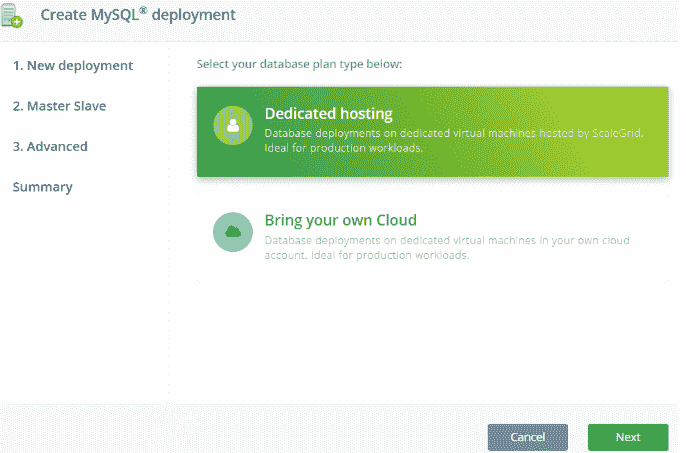
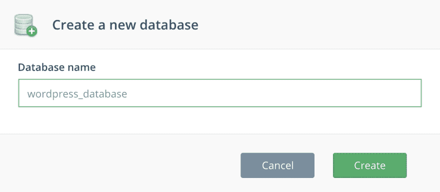
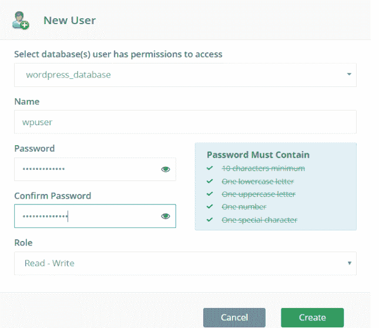
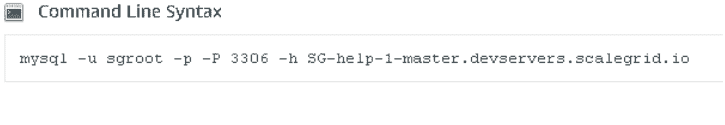
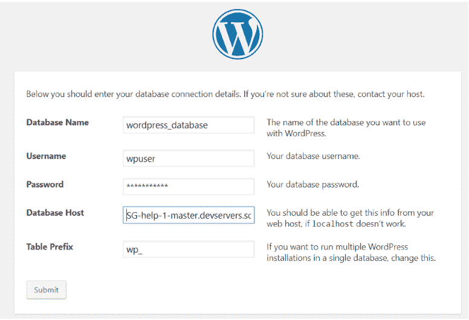
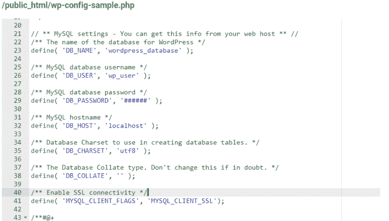

# 如何在云中设置 WordPress MySQL 数据库

> 原文：<https://dev.to/scalegrid/how-to-setup-a-wordpress-mysql-database-in-the-cloud-2mcc>

[](https://scalegrid.io/blog/how-to-setup-a-wordpress-mysql-database-in-the-cloud/)

WordPress 是世界上最大的网站建设平台，支持今天互联网上超过 34%的网站。MySQL 是一个免费的开源关系数据库管理系统，被大多数 WordPress 站点所利用，允许你查询你的数据，比如文章、页面、图片、用户资料等等。任何 WordPress 开发者都知道，每个安装都需要一个后台数据库，MySQL 是存储和检索 WordPress 数据的首选数据库。

为了让你的 WordPress 网站能够访问、存储和检索你的 MySQL 数据库中的数据，它需要通过云计算服务在线托管。ScaleGrid 为你的 [WordPress](https://wordpress.com/) 站点提供了一种设置和配置 [MySQL 托管](https://scalegrid.io/mysql.html "MySQL Hosting")的便捷方式。在这篇博文中，我们将向你展示[如何在 ScaleGrid 上创建 MySQL 部署](https://scalegrid.io/blog/how-to-setup-a-wordpress-mysql-database-in-the-cloud/)，同时设置你的新 WordPress 站点，以及如何为你现有的 WordPress 部署迁移到 ScaleGrid MySQL 部署。

## 为你的 WordPress 使用 ScaleGrid MySQL 托管的优势

管理一个数据库是很难的，因为它需要不断地更新、调整和监控，以确保网站的性能。幸运的是，有完全托管和托管的解决方案，如 ScaleGrid 的 MySQL 即服务计划，该计划负责所有 MySQL 维护，因此您可以专注于开发您的网站和应用程序。以下是 ScaleGrid 帮助你改善生产 WordPress 设置的一些方法:

1.  ### 平台和配置的选择

    在 AWS 上托管 [MySQL，或者在 Azure](https://scalegrid.io/mysql/aws.html) 上托管 [MySQL，通过世界上最大的两家云提供商提供可配置的实例大小。我们帮助您配置 MySQL 部署，根据数据库的大小优化性能。](https://scalegrid.io/mysql/azure.html)

2.  ### 高可用性

    通过配置高可用性的主从设置，确保您的网站不会因服务器或数据中心崩溃而关闭。将您的 MySQL 数据分布在不同的数据中心区域，这样，如果一个数据中心发生故障，您可以自动故障转移到副本，以保持在线。

3.  ### 自动备份

    备份是存档数据的副本，以便在发生数据丢失事件时可以访问和恢复它们。这是一个繁琐的过程，需要定期执行，但使用 ScaleGrid，您可以自动安排备份系统的频率，并定制您希望保留备份的时间。

4.  ### 监控和警报

    借助针对数据库工作负载的高级监控工具和查询分析，密切关注您的数据库性能。

5.  ### 按需扩展

    随着数据量的增长，您需要扩展 MySQL 部署，以确保性能不会因容量不足而下降。这又是一个繁琐的过程，通常会有一些停机时间，但是在 ScaleGrid 中，您可以一键扩展到更大的实例大小，并且主从部署不会停机。

6.  ### 无限数据库

    通过 ScaleGrid 上的一个集群创建和部署无限数量的 MySQL 数据库，只需点击几下鼠标，即可轻松创建具有自定义角色权限的新数据库用户。

## 如何在 ScaleGrid 上创建 MySQL 部署

1.  在 ScaleGrid 控制台上注册[30 天免费试用](https://console.scalegrid.io/users/register)。
2.  通过几个简单的步骤创建一个新的 MySQL 部署。确保在与你的 WordPress 部署区域相匹配的区域创建它。我们在 AWS 和 Azure 上支持两种不同的 MySQL DBaaS 计划。[](https://scalegrid.io/blog/wp-content/uploads/2019/07/create-2.png)

    *   [专用 MySQL 部署](https://help.scalegrid.io/docs/mysql-new-cluster-dedicated-hosting) -通过您的 ScaleGrid 帐户托管。
    *   [BYOC MySQL 部署](https://help.scalegrid.io/docs/mysql-new-cluster-bring-your-own-cloud) -通过自己的云账户托管。

3.  **Customize Your Plan**

    为您的新 MySQL 集群输入一个名称，并选择与您的 WordPress 托管站点相同的云区域(或最近的一个),以获得最佳部署性能。接下来，选择虚拟机大小，范围从 10GB 存储的 Micro 到 700GB 存储的 X4XLarge，然后是 MySQL 版本和存储引擎。

4.  **Replication**

    接下来，您可以启用主从配置来确保 MySQL 数据库的高可用性。这意味着，如果您的一台服务器出现故障，我们会自动将您的主服务器故障转移到一个健康可用的区域。默认情况下，您可以将 2+1 配置(主-从-仲裁)或 3 节点设置(主-从-从)用于半同步或异步复制，并自定义用于辅助节点的区域。

5.  **Advanced Security**

    在这一步，您可以选择为您的 MySQL 部署启用 SSL 来保护 WordPress 和 MySQL 之间的连接。我们建议为每个生产部署启用 SSL。您还可以启用磁盘加密来进一步保护您的部署免受未经授权的访问。

6.  **Firewall Rules**

    为了让你的 WordPress 服务器能够连接到你的 MySQL 服务器，你必须通过在你的集群防火墙规则下将这个 IP 列入白名单来开放访问。在我的站点标签>网络管理> WP 引擎>常规设置下，在你的 WordPress 帐户中找到你的 WordPress 服务器 IP 地址，然后把它添加到 IP 白名单中。您还可以在我们的 [MySQL 防火墙](https://help.scalegrid.io/docs/mysql-firewalls)文档中了解更多。

7.  **Summary & Create**

    在最后一个摘要页面上查看您的 MySQL 配置，然后单击 Create。

## 如何为 WordPress 设置你的 MySQL 数据库和管理员用户

在设置你的 WordPress 站点时，你会被要求提供你的 MySQL 数据库的主机名、数据库名和用户证书。你可以这样设置:

### 创建新的 MySQL 数据库

1.  转到您的 [MySQL 集群列表](https://console.scalegrid.io/application/mysqlclusters)页面，并选择您新创建的集群。
2.  选择“数据库”选项卡，然后单击绿色的“新建数据库”按钮。
3.  在弹出的“创建新数据库”窗口中，只需输入数据库的名称，例如“wordpress_database”，然后点击“创建”: [](https://scalegrid.io/blog/wp-content/uploads/2019/07/Create-a-New-MySQL-Database-ScaleGrid-DBaaS.png)

### 创建新的 MySQL 数据库用户

1.  在 MySQL cluster 详细信息页面上选择“用户”选项卡，然后单击“新建用户”按钮。
2.  从下拉字段中选择您刚刚创建的新“wordpress_database”作为该用户的数据库。
3.  在出现的“新用户”窗口中，输入新用户的名称和密码，例如，“wpuser”。
4.  最后，选择“读写”作为这个新用户的“角色”: [](https://scalegrid.io/blog/wp-content/uploads/2019/07/new-user-2.png)
5.  单击“创建”,您的新用户将被创建！记下安装 WordPress 时需要的数据库名称、用户名和密码。

### 找到你的 MySQL 主机名

1.  转到 MySQL Cluster 详细信息页面，选择“概述”选项卡。
2.  找到页面底部的[命令行语法](https://help.scalegrid.io/docs/mysql-command-line-syntax)部分，查看可用于通过 MySQL 客户端连接 MySQL 部署的命令: [](https://scalegrid.io/blog/wp-content/uploads/2019/07/cmd-line-mysql-2.png)
3.  '-h '选项后面的服务器名称是您的 MySQL 部署的主机名，在这种特殊情况下，它是' SG-help-1-master . dev servers . scale grid . io '。

## 测试你的 WordPress 站点和 MySQL 服务器之间的连接

在您开始配置您的 WordPress 安装之前，我们建议您检查您的 WordPress 服务器和 MySQL 部署之间的连接。为了检查这一点，您需要在您的服务器上安装一个 MySQL 客户端。如果您还没有安装 MySQL 客户端，请按照这里的说明[下载并安装。从你的 WordPress 服务器的命令行执行以下命令，并确保你能够连接:](https://help.scalegrid.io/docs/mysql-command-line-syntax)

```
mysql -u wpuser -h SG-help-1-master.devservers.scalegrid.io -p<Your Password>
```

如果您已经为 MySQL 服务器启用了 SSL，请确保您看到 SSL 字段的“密码正在使用”输出，如下所示:

```
mysql> status;

-------------------

mysql  Ver 14.14 Distrib 5.7.15, for Win64 (x86_64)

Connection id:          79854

Current database:

Current user:           wpuser@xxxx

SSL:                    Cipher in use is DHE-RSA-AES256-SHA

Using delimiter:        ;

Server version:         5.7.21-log MySQL Community Server (GPL)

Protocol version:       10

-------------------

```

## 配置你的 WordPress 安装在 ScaleGrid 上使用 MySQL

在你安装 WordPress 的过程中，你会被要求详细说明你的 MySQL 数据库。现在您已经创建了一个新的 MySQL 部署、数据库、用户，并找到了您的主机名，您可以在这里输入这些细节来进行连接:

[](https://scalegrid.io/blog/wp-content/uploads/2019/07/wp-install-2.png)

一旦你提交，你的 WordPress 安装应该通过，并且能够连接到你的 MySQL 部署。

## 启用 SSL 的 MySQL 部署的附加步骤

如果你已经为你的 MySQL 部署启用了 SSL，那么你的 WordPress 安装需要一个额外的设置，不能通过上面的 UI 指定。在这种情况下，在安装 WordPress 之前，你必须编辑一个名为 wp-config-sample.php 的文件，并将其保存为 wp-config.php。

你可以按照这里[的详细说明编辑你的 wp-config.php 文件](https://codex.wordpress.org/Editing_wp-config.php)。下面的示例显示了 wp-config.php 文件中的 MySQL 部分，该部分的最后一行表示 MySQL 已经配置了 SSL:

[](https://scalegrid.io/blog/wp-content/uploads/2019/07/wp-configure-2.png)

一旦你完成了安装，你将会看到你的 WordPress 站点已经启动并使用 ScaleGrid 的 MySQL 主机作为它的数据库。

在下一部分中，我将讨论从您现有的数据库迁移到 ScaleGrid 的 MySQL 托管，用于您现有的 WordPress 站点。敬请期待！