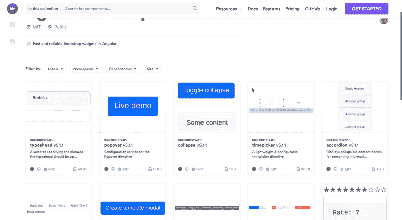
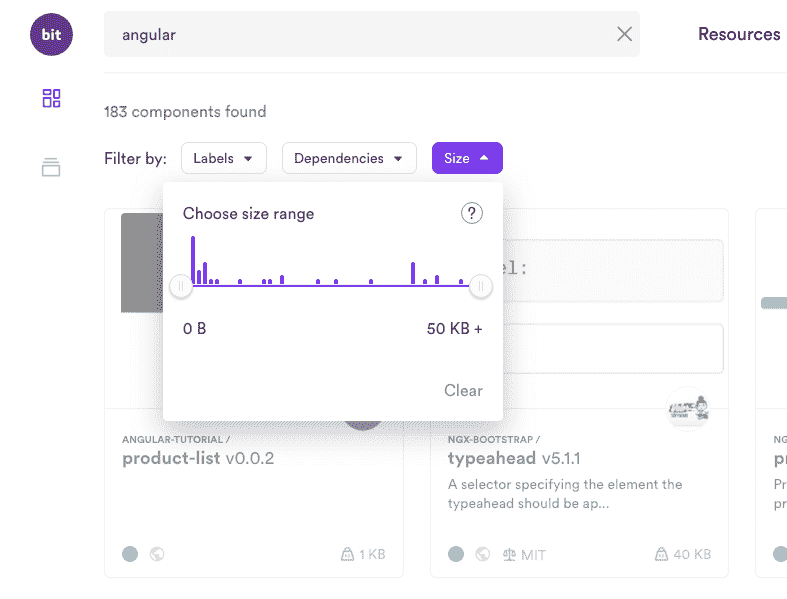
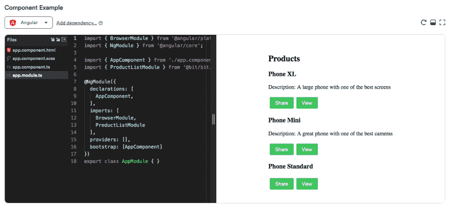

# 如何在项目和应用程序之间共享角度组件

> 原文：<https://dev.to/giteden/how-to-share-angular-components-between-projects-and-apps-10lk>

### 在 Angular 项目中，单独或以团队形式轻松共享和协作组件。

Angular 允许你通过模块化组件构建你的应用，模块化组件是 Angular 应用最基本的 UI 构建块。当构建多个 Angular 项目或应用程序时，组件可以在它们之间共享和重用，以加速开发和构建更好的模块化应用程序。

在这篇文章中，我们将看到如何在不同的项目中分享你的角度组件。我们将使用 [bit (GitHub)](https://github.com/teambit/bit) 从现有项目中无缝隔离和打包组件，并使用 [bit.dev](https://bit.dev) 在多个项目和应用程序之间共享它们。完成后，您的组件也将可供您的团队在任何地方发现、使用甚至开发。

你可以在这里了解更多关于共享 ng 组件的信息，或者亲自尝试一下[实践教程](https://docs.bit.dev/docs/bit-angular-tutorial.html)。请继续阅读下面的内容以开始学习，不要犹豫[问任何问题](https://gitter.im/bit-src/Bit):)

## 为什么要用[位](https://bit.dev)来共享角分量？

使用[位](https://bit.dev)你可以快速地从任何项目中分离出组件，包括它们的设置和依赖关系，并在不同的项目和应用中使用它们。这意味着更多的组件被共享，共享它们的开发人员的开销更少。

例如，这里是 GitHub 上流行的 [ngx-bootstrap 库。使用 Bit，几分钟后，它就被共享为 bit.dev](https://github.com/valor-software/ngx-bootstrap) 中的一个[组件集合。你可以对你团队的组件做同样的事情，来协作和构建应用。](https://bit.dev/valor-software/ngx-bootstrap)

[ ](https://res.cloudinary.com/practicaldev/image/fetch/s--SQs1kGuO--/c_limit%2Cf_auto%2Cfl_progressive%2Cq_66%2Cw_880/https://cdn-images-1.medium.com/max/2000/1%2APM2IyZdp4WRi_CE7r4Dz8A.gif) *棱角分明的组件:轻松跨项目共享*

您可以[搜索和发现您的组件](https://bit.dev/components)，查看可视化快照，并根据包大小和依赖关系过滤组件，以找到正确的代码。

[](https://res.cloudinary.com/practicaldev/image/fetch/s--TQ0jrItW--/c_limit%2Cf_auto%2Cfl_progressive%2Cq_auto%2Cw_880/https://cdn-images-1.medium.com/max/2000/1%2AvW_CGk4D2pPw5bGqEYTtJQ.png)

[ ](https://res.cloudinary.com/practicaldev/image/fetch/s--8h_-IBu7--/c_limit%2Cf_auto%2Cfl_progressive%2Cq_auto%2Cw_880/https://cdn-images-1.medium.com/max/2000/1%2AnahjhGkzZdnF1lfjXVfBKQ.png) *通过上下文、依赖项和捆绑包大小搜索组件*

在选择在项目中使用之前，您可以在现场游戏中尝试每个组件。这对于作为一个团队在许多组件上进行协作非常有用。

[](https://res.cloudinary.com/practicaldev/image/fetch/s---CoZyUqz--/c_limit%2Cf_auto%2Cfl_progressive%2Cq_auto%2Cw_880/https://cdn-images-1.medium.com/max/5200/1%2AD57Ehhc79RKWDOBLISuS6g.png)

然后，你可以用 NPM/Yarn 在你的项目中安装每个组件，甚至使用 Bit 从任何消费项目中开发和更新它(:0)。

[](https://res.cloudinary.com/practicaldev/image/fetch/s--1-UdZ4Ja--/c_limit%2Cf_auto%2Cfl_progressive%2Cq_auto%2Cw_880/https://cdn-images-1.medium.com/max/2000/1%2AU_QOwLlSeZzCV-C4tJLJnw.png)

继续[开始](https://bit.dev)，或者[探索 bit.dev 社区中的组件](https://bit.dev/angular)。

## 我们开始吧

让我们看一个在两个角度应用程序之间共享一个组件的实际例子。100 个组件也是一样，一样简单。

注意，建议**将每个组件包装在一个 ngModule** 中。你可以在这里找到更多的[推荐指南和最佳实践](https://docs.bit.dev/docs/angular-guidelines.html)，这里有一个[有用的教程](https://docs.bit.dev/docs/bit-angular-tutorial.html)来帮助你开始一个演示应用:
[* *带角度的 Bit 教程**
*角度支持正在公测中。一切都应该正常，但请分享任何问题和反馈…*docs.bit.dev](https://docs.bit.dev/docs/bit-angular-tutorial.html)

### 设置位

首先，安装 [bit-cli](https://github.com/teambit/bit) ，然后转到共享组件的项目，并初始化一个 bit 工作空间。

```
$ npm install bit-bin -g
$ cd project-directory
$ bit init 
```

然后，前往 [**bit.dev，创建一个免费账户](https://bit.dev) **。然后，[* *创建一个集合](https://bit.dev/~create-collection)** 来托管您的共享组件。对于本教程，您可以将新的共享集合命名为“angular-tutorial”。

完成后，向您的 bit.dev 帐户验证 bit-cli。

```
$ bit login 
```

## 共享一个角分量

好了，现在你已经准备好开始了。为了帮助你开始，这里有一个在两个应用程序之间共享角度分量的[实践教程](https://docs.bit.dev/docs/bit-angular-tutorial.html)。

### 克隆演示 app

本教程基于 Angular 8。要运行本教程，克隆并设置角度教程项目:[https://github.com/teambit/bit-angular-tutorial](https://github.com/teambit/bit-angular-tutorial)

```
$ git clone https://github.com/teambit/bit-angular-tutorial
$ cd bit-angular-tutorial
$ npm install 
```

我们将共享 Angular tutorial 项目中的[* *产品列表组件](https://github.com/teambit/bit-angular-tutorial/tree/master/src/app) **并在另一个应用程序中使用它。完成后，该组件将出现在 bit.dev 中，供您的团队在他们自己的项目中发现、使用和开发。

### 跟踪产品列表组件

为了易于使用，Bit 的命令非常类似于 Git。

让我们使用 bit add 命令来跟踪产品列表组件。我们需要让 Bit 知道组件在哪里，以及哪些文件与它相关。因为所有文件都位于 product-list 目录下，所以最简单的方法是将目录中的所有文件添加到组件中。Bit 会相应命名。

对于角度组件，我们还需要指定组件入口点，这在大多数情况下是包含 ngModule 的文件。在本例中，它是 product-list.module.tsfile。

运行以下命令:

```
$ bit add src/app/product-list  --main src/app/product-list/product-list.module.ts

tracking component product-list:
added src/app/product-list/product-list.component.css
added src/app/product-list/product-list.component.html
added src/app/product-list/product-list.component.ts
added src/app/product-list/product-list.module.ts
added src/app/product-list/products.ts 
```

就是这样。Bit 识别组件及其所有文件，将所有依赖项定义为组件的一部分，并开始跟踪它。

您可以使用 bit status 来确保组件所需的所有文件都已正确添加:

```
$ bit status
new components

     > product-list ... ok 
```

> *注意:在本例中，products.ts 文件被添加到组件中。如果其他组件也使用它，那么将其转换为一个组件，该组件将成为 product-list 和其他组件的依赖项。*

### 安装 Angular 编译器

到目前为止，我们已经为 Bit 提供了组件的源文件。但是为了使用其他项目中的文件，需要构建组件。

Bit 有一个很大的[编译器集合](https://bit.dev/bit/envs)可供选择(你可以添加自己的)。为了构建 Angular 组件，您将需要 [Angular 编译器](https://bit.dev/bit/envs/compilers/angular)。
[**编译器/angular-envs Bit**
*请注意，这个环境还是实验性的，慎用。适用于位版本> = 14.2.3 位…*bit.dev](https://bit.dev/bit/envs/compilers/angular)

通过在教程存储库中运行以下命令来安装编译器:

```
$ bit import bit.envs/compilers/angular --compiler

the following component environments were installed
- bit.envs/compilers/angular@0.1.2 
```

> 运行本教程时，版本可能会略有不同。

Angular 编译器现在被设置为位工作空间的默认编译器。您可以检查 package.json，并通过在 Bit 部分找到以下条目来验证是否安装了编译器:

```
"env": {
      "compiler": "bit.envs/compilers/angular@0.1.2"
    }, 
```

要构建组件，请在项目中运行以下命令:

```
$ bit build 
```

这导致组件名(产品列表)后跟一个文件名列表。这些是组件的构建文件👍

### 将组件导出到 bit.dev

现在组件已经正确构建，是时候与世界分享它了。组件根据 semver 标准进行版本控制。要用版本标记组件，请运行以下命令:

```
$ bit tag --all 0.0.1
1 component(s) tagged

new components
     > product-list@0.0.1 
```

该命令标记 Bit 工作空间中当前暂存的所有组件。在我们的例子中，它只是产品列表组件。

您可以运行 bit status 来验证版本化组件。

```
$ bit status
staged components

     > product-list. versions: 0.0.1 ... ok 
```

这里需要注意的重要一点是，组件被认为是分阶段的。这意味着它现在可以导出了。接下来，您可以将组件导出到您的 bit.dev 集合:

```
$ bit export <username>.angular-tutorial
exported 1 components to collection <username>.angular-tutorial 
```

该组件现在可以在 bit.dev 上的你的集合中看到。你可以在[https://bit.dev/](https://bit.dev/)/angular-tutorial 中访问它。您还可以访问为该演示创建的组件，网址:【https://bit.dev/bit/angular-tutorial

现在检查组件的状态将不再在本地工作区中显示该组件，因为它现在托管在远程 bit.dev 集合中:

```
$ bit status
nothing to tag or export 
```

如果您想查看所有组件及其版本，您可以运行:

```
$ bit list 
```

现在，组件代码仍然在您的本地项目中(并且应该提交到您的源代码控制中)，但是它也可用于其他项目。

### 预览 bit.dev 中的组件

[](https://res.cloudinary.com/practicaldev/image/fetch/s--1ijJgMPh--/c_limit%2Cf_auto%2Cfl_progressive%2Cq_auto%2Cw_880/https://cdn-images-1.medium.com/max/2620/1%2ARieUh1MO_R9XgdyMviZFpQ.png)

bit.dev cloud 上也提供了角度组件。转到 [https://bit.dev](https://bit.dev) 并登录您的帐户(如果您尚未登录):

1.  选择左侧面板中的“收集浏览器”，然后选择“收集”。

2.  点击您的集合 you׳ll 看到您的组件产品列表。

3.  单击产品列表组件，查看它的实时动态。

component playground 为您提供了一个基本的 Angular 应用程序(您可能会认为该示例是 Angular CLI 提供的应用程序)。我们将修改这个应用程序来显示产品列表组件。

### 编辑构件示例

该组件被自动识别为角度组件。我们将修改 app.module.ts 文件来导入我们的产品列表模块。

更改此行:

```
import ProductList from '@bit/.angular-tutorial.product-list'; 
```

进入这行:

```
import {ProductListModule} from '@bit/.angular-tutorial.product-list'; 
```

将模块添加到模块的导入部分:

```
imports: [
        BrowserModule,
        ProductListModule
    ], 
```

app.module.ts 应如下所示:

```
import { BrowserModule } from '@angular/platform-browser';
import { NgModule } from '@angular/core';
import { AppComponent } from './app.component';
import { ProductListModule } from '@bit/bit.angular-tutorial.product-list';

@NgModule({
    declarations: [
        AppComponent,
    ],
    imports: [
        BrowserModule,
        ProductListModule
    ],
    providers: [],
    bootstrap: [AppComponent]
})
export class AppModule { } 
```

修改 app.component.html 并将其内容替换为:

```
<app-product-list></app-product-list> 
```

保存示例。几秒钟后，您将在操场上看到渲染的组件。您可以在此处查看示例[。](https://bit.dev/bit/angular-tutorial/product-list)

## 在不同的项目中安装组件

[](https://res.cloudinary.com/practicaldev/image/fetch/s--1-UdZ4Ja--/c_limit%2Cf_auto%2Cfl_progressive%2Cq_auto%2Cw_880/https://cdn-images-1.medium.com/max/2000/1%2AU_QOwLlSeZzCV-C4tJLJnw.png)

现在，您将创建另一个 Angular 应用程序，并在这个新应用程序中使用 product-list 组件。

### 创建新的角度应用

最快的方法是使用 Angular CLI 生成一个新的应用程序。切换到新目录。

如果您已经在全球范围内安装了 Angular-cli，您只需运行:

```
$ ng new my-new-app 
```

如果您没有全局安装 angular-cli 并且不想安装它，您可以使用 [npx](https://medium.com/@maybekatz/introducing-npx-an-npm-package-runner-55f7d4bd282b) 临时安装它:

```
$ npx --package @angular/cli ng new my-new-app 
```

为了这个演示的目的，你可以跳过路由器，选择 css 样式。在您的终端中，切换到 my-new-app 目录。

## 使用 npm/yarn 安装组件

使用您喜欢的软件包安装程序(npm 或 yarn)来安装组件。该组件存储在 bit.dev 注册表中，因此该组件的完整路径将是:@bit/..

使用 npm 运行安装命令:

```
$ npm install @bit/<username>.angular-tutorial.product-list --save 
```

组件现在已经添加到您的包中了。

```
"@bit/<username>.angular-tutorial.product-list": "0.0.1" 
```

### 在新应用中使用组件

现在，您可以在代码中使用该组件，就像任何导入一样。将其作为模块添加到顶级应用程序模块中，并在应用程序页面上使用。我们将在代码中进行与我们在应用程序中所做的相同的更改:

```
// app.module.ts
import { ProductListModule } from '@bit/<username>.angular-tutorial.product-list'; 
```

在应用程序模块导入部分添加 ProductListModule:

```
imports: [
        BrowserModule,
        ProductListModule
    ], 
```

现在剩下的就是将产品列表组件添加到 app html 文件中。您可以用上面的行替换所有现有内容，或者将其添加到 html 页面上。

```
// src/app/app.component.html
<app-product-list></app-product-list> 
```

最后但同样重要的是，使用 Angular CLI 运行您的应用程序:

```
$ npm run start 
```

**牛逼！**您现在可以在新创建的应用程序中看到组件列表。您刚刚从一个项目向另一个项目共享了一个组件🎊

> 对许多组件进行同样的操作，并邀请您的团队进行协作…

## 修改消耗项目中的构件

[](https://res.cloudinary.com/practicaldev/image/fetch/s--5d9mh5M7--/c_limit%2Cf_auto%2Cfl_progressive%2Cq_auto%2Cw_880/https://cdn-images-1.medium.com/max/2000/1%2AMifVwCqC_2_Fvf23D6OLwA.png)

Bit 有一个独特的能力:它允许你从任何使用它们的项目中开发和更新组件。这对于加速开发非常有用，因为它使您和您的团队成员能够协作并根据需要提出更新建议。

我们将对组件进行更改，并将其导出回集合。我们将在产品列表中添加一个**视图**按钮。为简单起见，它将只显示一个警告说，该产品被查看。

### 导入组件

到目前为止，product-list 组件只安装在我们的项目中(以它的构建形式)。现在，我们希望将代码导入到我们的项目中并进行更改。

为了导入组件，在新的 my-new-app 项目中启动一个 Bit 工作空间:

```
$ bit init 
```

然后运行以下命令(也可以在组件页面上找到):

```
$ bit import <username>.angular-tutorial/product-list

bit import bit.angular-tutorial/product-list
successfully imported one component
- added bit.angular-tutorial/product-list new versions: 0.0.1, currently used version 0.0.1 
```

> *关于缺失核心依赖项的通知正常。您的项目中应该已经有这些包了。*

您将得到一条消息，表明@angular/core 和@angular/common 是对等依赖关系。这是可以的，因为您的 my-new-app 项目已经包含了它们。

事情是这样的:

*   将创建一个新的顶级组件文件夹，其中包含组件的代码及其编译的代码和 node *模块(在这种情况下，node *模块为空，因为所有 node_modules 都是对等依赖项，并且取自根项目。

*   的。位图文件已修改，以包含对组件的引用

*   package.json 文件被修改为指向文件而不是远程包。您的 package.json 现在显示:

    “@bit/。angular-tutorial.product-list ":"文件:。/组件/产品列表"

启动你的应用程序，确保它仍然工作(这是真的，不需要任何改变。Bit 打理一切)。

### 更新代码

让我们修改产品列表组件。更改 components/product-list/product-list . component . ts 以包括以下方法:

```
view() {
    window.alert('The product has been viewed!');
 } 
```

将 components/product-list/product-list . component . html 更改为在 share 按钮后包含以下部分:

```
<button (click)="view()">
        View
    </button> 
```

更改 css 以在按钮上包含边距:

```
margin: 4px; 
```

运行角度应用程序:

```
$ npm run start 
```

应用程序尚未更改。位组件由位编译器编译。在单独的终端中，运行 bit build 命令来编译更改。您应该看到编译器已经安装:

```
successfully installed the bit.envs/compilers/angular@0.1.2 compiler 
```

随后是所有文件的成功编译。

您的 angular 项目将会刷新，现在您可以通过“查看”按钮看到已更改的构件。

> 在一个真实的项目中，建议将这些更改提交到您的 GitHub 存储库中。

### 导出修改

接下来，将对组件所做的更改导出回 bit.dev。

```
$ bit status 
```

产品列表组件已修改:

```
modified components

     > product-list ... ok 
```

标记组件并将其导出为新版本。默认情况下，这是一个 semver 修补程序版本:

```
$ bit tag product-list
1 component(s) tagged

changed components
(components that got a version bump)
     > <username>.angular-tutorial/product-list@0.0.2 
```

将其导出回收藏:

```
$ bit export <username>.angular-tutorial
exported 1 components to scope <username>.angular-tutorial 
```

前往 bit.dev 上的组件页面，在这里您可以看到该组件有了一个新版本。在 component playground 上也可以看到这些变化。

## 更新原项目中的变更

在最后一个阶段，您将导入对原始项目的更改，切换回 Angular-tutorial。

### 导入修改

运行 bit import 来查看是否有组件被更改(类似于执行 git pull 来检查 git 更改)。

我们将看到 product-list 组件已经更改，并且存在一个新版本:

```
$ bit import
successfully imported one component
- updated <username>.angular-tutorial/product-list new versions: 0.0.2 
```

组件已下载，但尚未更改。检查工作区状态，您将获得以下信息:

```
$ bit status
pending updates

    > <username>.angular-tutorial/product-list current: 0.0.1 latest: 0.0.2 
```

### 结账

将对组件所做的更改合并到项目中。该命令的结构是位校验。所以你跑:

```
$ bit checkout 0.0.2 product-list
successfully switched <username>.angular-tutorial/product-list to version 0.0.2
updated src/app/product-list/product-list.component.css
updated src/app/product-list/product-list.component.html
updated src/app/product-list/product-list.component.ts
updated src/app/product-list/product-list.module.ts
updated src/app/product-list/products.ts 
```

Bit 正在执行 git 合并，因此来自更新组件的代码现在将被合并到您的代码中。再次运行该应用程序，查看它是否与更新的组件一起正常工作:

```
$ npm run start 
```

就是这样。在两个项目之间移动并同步了更改。您的应用程序现在使用更新的组件运行…

### 用钻头对棱角进行一些指导…

Bit 的团队和 Angular 的团队一起定义了一些共享可重用组件的最佳实践。您可以在此处的链接中找到这些[最佳实践。如果你有任何问题不要犹豫，](https://docs.bit.dev/docs/angular-guidelines.html)[只是寻求帮助](https://gitter.im/bit-src/Bit):)

## 结论

在您的 Angular 应用程序之间共享组件意味着您可以构建利用代码重用和组合的模块化应用程序，因此它们更容易、更快速地构建，同时维护也更简单。

Bit 让您的团队避免了以任何规模发布组件的开销，为您的团队提供了一个通用的发现中心，并允许您修改和更新任何项目中的组件以进行协作。

angular 组件的可重用性很好地发挥了 Bit 的优势，帮助您和您的团队成功地共享代码。它与组件库配合得很好[，或者直接在你的应用程序之间配合得很好](https://dev.to/jonisar/do-you-still-need-a-component-library-28kn)，所以这取决于你…

快乐分享！🍺